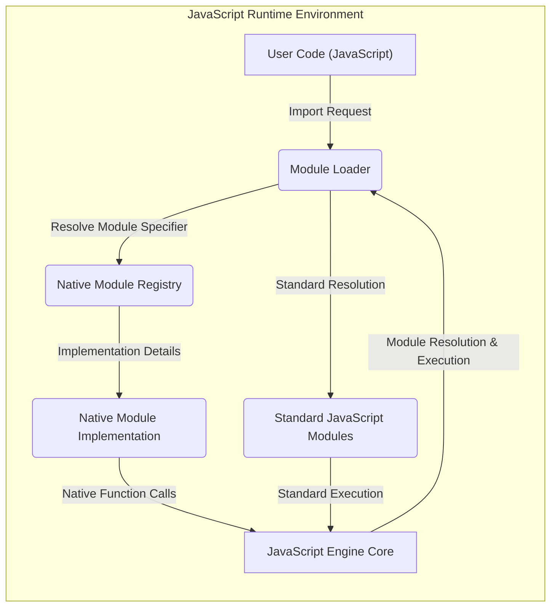
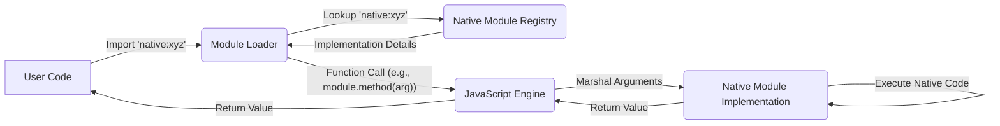

# Project Design Document: Natives Proposal

**Version:** 1.1
**Date:** October 26, 2023
**Author:** Gemini (AI Model)

## 1. Introduction

This document provides an enhanced design overview of the "Natives" proposal, as detailed in the GitHub repository [https://github.com/addaleax/natives](https://github.com/addaleax/natives). The primary objective is to offer a clear and comprehensive understanding of the proposed system's architecture, constituent components, and data flow. This detailed design will serve as the foundation for subsequent threat modeling exercises. It's crucial to remember that this document describes a *proposed* system and not a currently implemented one.

## 2. Goals

The central goal of the "Natives" proposal is to establish a standardized and controlled methodology for integrating built-in modules directly into the JavaScript language specification and runtime environments. This aims to achieve:

*   **Enhanced Functionality:**  Provide access to capabilities that are either impossible or inefficient to implement using standard JavaScript.
*   **Performance Optimization:** Improve the execution speed of specific operations by leveraging the performance characteristics of native code.
*   **Structured Extensibility:** Offer a more formalized and manageable approach to extending JavaScript's features compared to ad-hoc or platform-specific native bindings.
*   **Improved Developer Experience:** Streamline the process of utilizing performance-critical or platform-integrated functionalities within JavaScript applications.

## 3. Non-Goals

This design document specifically focuses on the conceptual architecture of the proposal. It explicitly excludes discussions on:

*   **Concrete Implementations:** Specific implementation details of any particular proposed native module (e.g., the exact C++ code for a `filesystem` module).
*   **Performance Benchmarking:** Quantitative performance analysis or detailed optimization strategies for native modules.
*   **Development and Distribution Processes:** The precise mechanisms for developing, packaging, and distributing these native modules to different JavaScript environments.
*   **Detailed API Specifications:** The complete API surface or method signatures of any potential native module. The focus is on the interaction model, not the specific functions.

## 4. System Architecture

The proposed system introduces a distinct layer within the JavaScript runtime environment dedicated to hosting and managing native modules. The key components and their interactions are illustrated below:

### 4.1. Components

*   **User Code (JavaScript):**  Represents the standard JavaScript code authored by developers intending to utilize the newly proposed native modules through standard import mechanisms.
*   **Module Loader:** This core component of the JavaScript runtime is responsible for resolving module import statements. The proposal envisions extending its capabilities to recognize and load native modules alongside traditional JavaScript modules.
*   **Native Module Registry:** A conceptual, internal registry (likely within the JavaScript engine) that maintains the mapping between module specifiers (e.g., `native:crypto`) and their corresponding native implementations. This registry would be populated during the runtime initialization or module discovery phase.
*   **Native Module Implementation:** This refers to the actual native code (e.g., written in C, C++, Rust, or other languages) that provides the concrete functionality of a built-in module. These implementations would be provided by the JavaScript engine vendor or potentially through a standardized extension mechanism.
*   **Standard JavaScript Modules:** Represents the existing infrastructure for importing and utilizing modules written in JavaScript. This system would coexist with the proposed native module system.
*   **JavaScript Engine Core:** The fundamental execution engine of the JavaScript runtime environment. It handles the parsing, compilation, and execution of JavaScript code and manages the overall execution context, including the interaction with native modules.

### 4.2. Interactions

1. When User Code encounters an `import` statement targeting a native module (e.g., `import 'native:os';`), the **Module Loader** intercepts this request.
2. The **Module Loader** examines the module specifier (`native:os`) and determines that it refers to a native module.
3. The **Module Loader** consults the **Native Module Registry** to locate the corresponding **Native Module Implementation**.
4. Upon finding the implementation, the **Module Loader** provides the **JavaScript Engine Core** with the necessary information to interact with the native module.
5. When the **User Code** calls a function or accesses a property exposed by the native module, the **JavaScript Engine Core** facilitates the communication with the **Native Module Implementation**.
6. If the module specifier does not match any registered native module, the **Module Loader** proceeds with the standard JavaScript module resolution process.

## 5. Data Flow

The data flow within the proposed system involves the exchange of data and control between user-level JavaScript code and the underlying native module implementations, orchestrated by the JavaScript engine.

### 5.1. Data Flow Description

1. **Module Import Initiation:** The **User Code** begins by attempting to import a native module using a designated specifier (e.g., starting with `native:`).
2. **Module Resolution:** The **Module Loader** intercepts the import request and queries the **Native Module Registry** using the module specifier.
3. **Implementation Retrieval:** The **Native Module Registry** returns the necessary details (e.g., a pointer or handle) to the corresponding **Native Module Implementation**.
4. **Function Invocation:** When the **User Code** calls a function exposed by the native module, the **JavaScript Engine** takes over.
5. **Argument Marshaling:** The **JavaScript Engine** marshals the arguments passed from JavaScript into a format suitable for the native function call.
6. **Native Execution:** The **JavaScript Engine** invokes the appropriate function within the **Native Module Implementation**, passing the marshaled arguments.
7. **Result Handling:** The **Native Module Implementation** executes its logic and returns a result to the **JavaScript Engine**.
8. **Return to User Code:** The **JavaScript Engine** marshals the return value (if any) back into a JavaScript-compatible format and returns it to the **User Code**.

## 6. Security Considerations (Pre-Threat Model)

Even at this conceptual stage, several critical security considerations are evident and warrant careful attention during future development and threat modeling:

*   **Granular Access Control:**  Mechanisms are needed to precisely control which native modules are accessible to user code. This prevents unauthorized access to potentially sensitive functionalities.
*   **Native Code Vulnerabilities:** Security flaws within the **Native Module Implementations** could have severe consequences, potentially allowing for arbitrary code execution or system compromise. Rigorous security audits and secure coding practices are paramount.
*   **Sandboxing and Isolation:**  The execution environment for native modules needs to be carefully sandboxed to prevent them from accessing arbitrary system resources or interfering with the JavaScript runtime's integrity.
*   **Module Integrity and Authenticity:**  Verification mechanisms are required to ensure the integrity and authenticity of loaded native modules, preventing the injection of malicious or tampered code. This could involve digital signatures or other cryptographic techniques.
*   **API Security Design:** The APIs exposed by native modules to JavaScript must be designed with security in mind, preventing common vulnerabilities such as buffer overflows, injection attacks, or resource exhaustion.
*   **Resource Management in Native Modules:** Native modules must manage resources (memory, file handles, network connections, etc.) responsibly to prevent leaks, deadlocks, or denial-of-service conditions.
*   **Communication Channel Security:** If native modules communicate with external systems, the security of these communication channels needs to be considered.
*   **Impact on JavaScript Security Model:** The introduction of native modules should not weaken the existing security model of JavaScript. Care must be taken to avoid introducing new attack vectors.

## 7. Dependencies

The realization of this proposal relies on several key dependencies:

*   **A Robust JavaScript Engine:** The core functionality hinges on the JavaScript engine's capability to load, execute, and securely interact with native code. This includes the ability to marshal data between JavaScript and native environments.
*   **Native Code Development Toolchains:** The development and compilation of native modules will necessitate the use of appropriate toolchains, including compilers, linkers, and debuggers for the target native languages.
*   **Operating System Integration (Potentially):**  Certain native modules might require direct interaction with operating system APIs, making the proposal potentially OS-dependent for those specific modules. A well-defined interface for OS interaction would be beneficial.
*   **Standardization Body Approval:**  For widespread adoption, the proposal needs to be reviewed and approved by relevant JavaScript standardization bodies (e.g., TC39).

## 8. Deployment Considerations

While the "Natives" project is currently a proposal, considering potential deployment scenarios is valuable:

*   **Standardization and Specification:** The initial "deployment" involves the acceptance and formal specification of the native module mechanism by JavaScript standards bodies.
*   **JavaScript Engine Implementations:**  Subsequent deployment requires individual JavaScript engine developers (e.g., for V8, SpiderMonkey, JavaScriptCore) to implement the specified native module loading and execution capabilities.
*   **Distribution and Packaging of Native Modules:** A strategy for distributing and packaging native modules needs to be established. This could involve bundling with the JavaScript engine, separate distribution channels, or package managers.
*   **Security Updates and Maintenance:**  A process for providing security updates and maintaining native modules is crucial for the long-term security and stability of the ecosystem.

## 9. Future Considerations

As the "Natives" proposal progresses, several areas will require further attention and design:

*   **Versioning and Compatibility Management:**  Strategies for managing different versions of native modules and ensuring compatibility with various JavaScript engine versions will be essential.
*   **Comprehensive Error Handling:** Robust error handling mechanisms are needed to gracefully manage errors occurring within native modules and provide informative feedback to JavaScript code.
*   **Debugging and Profiling Tools:**  Specialized tools and techniques for debugging and profiling the interaction between JavaScript code and native modules will be necessary for developers.
*   **Security Auditing Processes:**  Establishing clear processes for security audits of both the native module infrastructure and individual native module implementations is critical.
*   **Namespacing and Module Identification:** A clear and consistent system for namespacing and identifying native modules is needed to avoid naming conflicts.
*   **Interoperability with Existing Native Extensions:** Consideration should be given to how this proposal might interact with or replace existing mechanisms for native extensions in different JavaScript environments (e.g., Node.js addons).

This refined document provides a more detailed and structured understanding of the "Natives" proposal's architecture and data flow. This enhanced clarity will significantly aid in conducting a comprehensive threat model to identify potential security vulnerabilities and inform the design of appropriate mitigation strategies.
