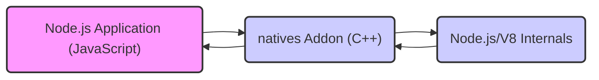
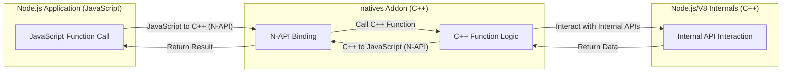

# Project Design Document: natives Node.js Addon

**Version:** 1.1
**Date:** October 26, 2023
**Author:** AI Software Architect

## 1. Introduction

This document provides a detailed design for the `natives` Node.js addon project (as found at [https://github.com/addaleax/natives](https://github.com/addaleax/natives)). This document aims to clearly outline the architecture, components, and interactions within the addon to facilitate future threat modeling activities. It describes the current understanding of the project based on its public repository.

### 1.1. Purpose

The purpose of this document is to serve as a comprehensive design reference for the `natives` addon. It will be used as the foundation for identifying potential security vulnerabilities and developing mitigation strategies during the threat modeling process.

### 1.2. Scope

This document covers the design of the `natives` Node.js addon, focusing on its core functionality, components, and interactions with the Node.js runtime environment. It includes:

*   High-level overview of the addon's purpose.
*   Detailed description of the addon's components and their responsibilities.
*   Data flow within the addon and between the addon and Node.js, including data type conversions.
*   Key interactions and interfaces, with examples of potential API usage.
*   Initial security considerations and potential impact.

This document does not cover:

*   The internal implementation details of the Node.js runtime or the V8 JavaScript engine beyond their interaction with the addon.
*   Specific details of the build process, testing methodologies, or deployment mechanisms.
*   Detailed code-level implementation within the C++ addon.
*   Performance benchmarking or optimization strategies.

### 1.3. Goals

The primary goals of this design document are to:

*   Provide a clear and concise description of the `natives` addon's architecture and functionality.
*   Identify the key components and clearly define their responsibilities within the system.
*   Illustrate the data flow and interactions within the system, highlighting the boundaries between JavaScript and C++.
*   Serve as a robust basis for effective threat modeling, enabling the identification of potential attack vectors.
*   Facilitate communication and understanding among developers, security analysts, and other stakeholders.

## 2. Overview

The `natives` addon is a Node.js native addon implemented in C++. Its core function is to expose select internal functionalities of the Node.js runtime and the underlying V8 JavaScript engine to JavaScript code. This enables JavaScript applications to access lower-level APIs and data structures that are not typically exposed through the standard Node.js module system. The addon likely utilizes the Node-API (N-API) to provide a stable ABI (Application Binary Interface) for interacting with Node.js. This allows the addon to be compatible with different Node.js versions without recompilation in many cases.

The primary benefit of such an addon is to provide access to performance-critical operations or internal state that might be necessary for specific use cases, albeit with increased complexity and potential security risks.

## 3. Detailed Design

### 3.1. Components

The `natives` addon can be conceptually broken down into the following key components, each with specific responsibilities:

*   **JavaScript API Layer:** This component consists of the JavaScript functions and objects that the addon exposes to Node.js applications. These functions serve as the entry points for utilizing the addon's capabilities.
    *   Examples of potential functions:
        *   `getInternalProperty(objectName, propertyName)`: Retrieves a property from an internal Node.js object.
        *   `callInternalMethod(objectName, methodName, ...args)`: Invokes a method on an internal Node.js object.
        *   `createInternalObject(className, ...args)`: Instantiates an internal Node.js object.
*   **C++ Addon Logic:** This is the core of the addon, implemented in C++. It contains the business logic for interacting with Node.js and V8 internals based on the calls received from the JavaScript API. This component utilizes the N-API to bridge the gap between JavaScript and C++.
    *   Responsibilities include:
        *   Receiving calls from JavaScript.
        *   Validating input parameters.
        *   Interacting with Node.js/V8 internal APIs.
        *   Handling errors and exceptions.
        *   Returning results to JavaScript.
*   **Node-API (N-API) Bindings:** This crucial layer provides the interface between the JavaScript and C++ code. It handles the marshaling and unmarshaling of data between the two environments, managing the conversion of JavaScript values to C++ types and vice versa.
    *   Key functionalities:
        *   Creating and manipulating JavaScript values (objects, strings, numbers, etc.) from C++.
        *   Calling JavaScript functions from C++.
        *   Registering C++ functions to be callable from JavaScript.
        *   Managing the lifecycle of JavaScript objects and preventing memory leaks.
*   **Targeted Node.js/V8 Internal Interfaces:** These are the specific, non-public C++ APIs within the Node.js runtime and the V8 JavaScript engine that the addon is designed to interact with. Access to these interfaces is the fundamental purpose of the addon.
    *   Examples of potential targets:
        *   Internal properties or methods of core Node.js modules (e.g., `process`, `Buffer`).
        *   Internal V8 functions for memory management or object manipulation.
        *   Data structures used within the Node.js event loop or other core subsystems.

### 3.2. Data Flow

The typical data flow within the `natives` addon follows these steps, highlighting the transitions between JavaScript and C++ environments:

1. A JavaScript function exposed by the addon's JavaScript API is invoked from a Node.js application, passing arguments as needed.
2. The N-API bindings intercept this function call and initiate the transition from the JavaScript environment to the C++ environment.
3. The corresponding C++ function within the `natives` addon's logic receives control. The arguments passed from JavaScript are converted into their equivalent C++ data types by the N-API.
4. The C++ code performs the requested operation, which involves interacting with specific Node.js or V8 internal APIs. This might entail reading internal data structures, calling internal functions, or manipulating the JavaScript heap directly.
5. The C++ code prepares the result of the operation. This result is typically in a C++ data type.
6. The N-API bindings handle the conversion of the C++ result back into a JavaScript-compatible data type.
7. Control is returned to the JavaScript environment, and the result is passed back to the calling JavaScript function in the Node.js application.

### 3.3. Interactions and Interfaces

The `natives` addon interacts with the Node.js environment through well-defined interfaces:

*   **JavaScript API:** This is the public-facing interface of the addon, defining how JavaScript code can utilize its functionality.
    *   Examples of interaction patterns:
        *   Synchronous function calls returning immediate values.
        *   Asynchronous operations (less likely for direct internal access but possible).
        *   Potentially exposing objects with methods for interacting with internal state.
*   **Node-API (N-API):** This is the core technology enabling the interaction between JavaScript and C++.
    *   Specific N-API functions likely used:
        *   `napi_create_function`: To register C++ functions as JavaScript callable functions.
        *   `napi_get_cb_info`: To retrieve arguments passed from JavaScript to C++.
        *   `napi_create_string_utf8`, `napi_create_number`, `napi_create_object`: To create JavaScript values from C++.
        *   `napi_get_property`, `napi_set_property`: To access and modify properties of JavaScript objects.
        *   `napi_call_function`: To call JavaScript functions from C++.
        *   `napi_get_value_string_utf8`, `napi_get_value_double`: To convert JavaScript values to C++ types.
*   **Node.js Internal C++ APIs:** These are the non-public interfaces within the Node.js and V8 codebase that the addon directly interacts with.
    *   Examples of potential interactions (highly dependent on the addon's specific purpose):
        *   Accessing internal properties of `process` object (e.g., internal state related to memory or event loop).
        *   Invoking internal methods of `Buffer` or other core modules.
        *   Interacting with V8's object model or garbage collection mechanisms (requires deep understanding of V8 internals).

## 4. Security Considerations (Initial)

The nature of the `natives` addon, directly interacting with internal APIs, introduces several significant security considerations:

*   **Insufficient Input Validation:** If the C++ addon does not rigorously validate input received from JavaScript, it could be vulnerable to various attacks.
    *   **Impact:**  Memory corruption (buffer overflows), unexpected program behavior, potential for arbitrary code execution.
    *   **Example:** Passing a string of unexpected length to a C++ function expecting a fixed-size buffer.
*   **Memory Safety Issues:** Native code is susceptible to memory management errors.
    *   **Impact:** Memory leaks leading to resource exhaustion, dangling pointers causing crashes or exploitable vulnerabilities, buffer overflows enabling code injection.
    *   **Example:** Failing to properly allocate or deallocate memory, writing beyond the bounds of allocated memory.
*   **Unintended Access to Internal APIs:** Bugs or vulnerabilities in the addon could allow malicious JavaScript code to access and manipulate internal Node.js/V8 state in ways not intended by the Node.js developers.
    *   **Impact:** Bypassing security features of Node.js, potentially gaining control over the Node.js process or the underlying system.
    *   **Example:**  Gaining access to internal objects containing sensitive information or functions that can alter system behavior.
*   **Type Confusion Vulnerabilities:** Incorrectly handling data types when crossing the JavaScript/C++ boundary can lead to type confusion.
    *   **Impact:**  Exploiting assumptions about object types to trigger unexpected behavior or gain unauthorized access.
    *   **Example:**  Treating a JavaScript object as a different C++ structure, leading to incorrect memory access.
*   **Exposure of Sensitive Information:** If the addon inadvertently exposes internal Node.js data structures containing sensitive information, it could be leaked to the JavaScript environment.
    *   **Impact:** Disclosure of configuration details, internal state, or other sensitive data.
    *   **Example:**  Exposing internal data structures related to cryptographic keys or authentication tokens.
*   **Reliance on Unstable Internal APIs:** The addon's functionality is tightly coupled to internal Node.js APIs, which are subject to change without notice.
    *   **Impact:**  The addon could break with Node.js updates, and security vulnerabilities in the internal APIs could directly impact the addon.
    *   **Example:**  A change in the structure of an internal object that the addon relies on could cause it to malfunction or crash.
*   **Error Handling and Exception Safety:**  Insufficient error handling in the C++ addon can lead to crashes or unpredictable behavior.
    *   **Impact:** Denial of service, potential for exploitable crashes if error conditions are not handled securely.
    *   **Example:**  An unhandled exception in the C++ code could terminate the Node.js process abruptly.

## 5. Future Considerations

Potential future developments or changes to the `natives` addon could include:

*   **Expanding the Scope of Exposed APIs:**  Adding new functions to expose a wider range of internal Node.js or V8 functionalities to JavaScript. This would increase the addon's capabilities but also potentially its attack surface.
*   **Performance Enhancements:**  Optimizing the C++ code for better performance, potentially through more direct memory manipulation or by leveraging specific V8 features. This could introduce new memory safety challenges.
*   **Abstraction and Refactoring:** Introducing abstraction layers within the C++ code to reduce direct dependencies on specific internal APIs. This would improve maintainability and reduce the impact of Node.js API changes but might add complexity.
*   **Support for More Complex Data Structures:** Enabling the transfer and manipulation of more complex data structures and object graphs between JavaScript and C++. This would require careful handling of object lifetimes and potential circular references.
*   **Integration with New Node.js Features:** Adapting the addon to leverage new internal APIs or features introduced in newer versions of Node.js. This would require ongoing maintenance and security reviews.

This design document provides a comprehensive overview of the `natives` Node.js addon's architecture and functionality. The detailed descriptions of components, data flow, and interactions, along with the initial security considerations, will serve as a valuable foundation for conducting a thorough threat modeling exercise to identify and mitigate potential security risks associated with this type of low-level system interaction.