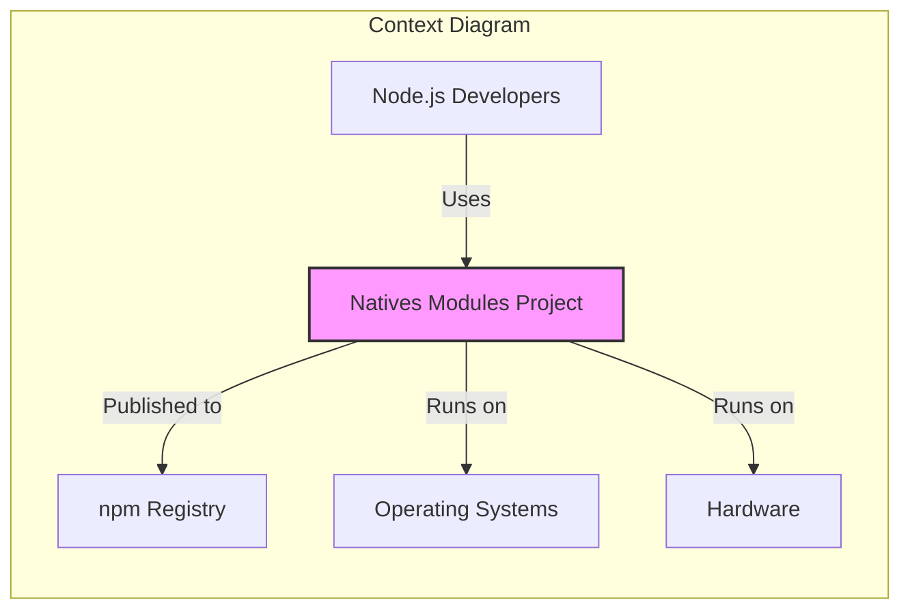
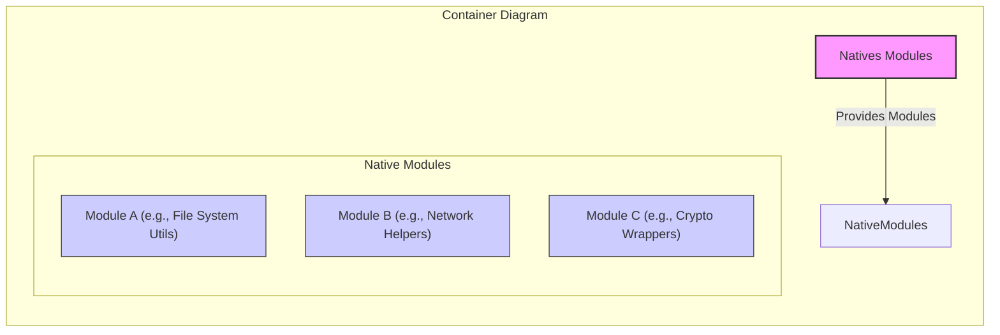
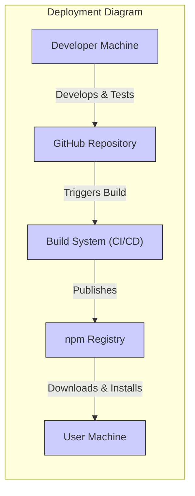
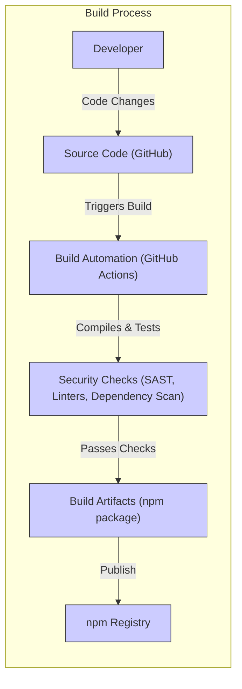

# BUSINESS POSTURE

This project, "natives", provides a collection of native JavaScript modules for Node.js. The primary business goal is to offer reusable, performant, and reliable native addons that extend the capabilities of standard JavaScript and Node.js environments. By providing these modules, the project aims to simplify development for Node.js developers who require native functionalities, potentially improving application performance and accessing system-level features.

The main business priorities are:
- Providing high-quality, stable native modules.
- Ensuring compatibility across different Node.js versions and operating systems.
- Maintaining the modules and addressing bug fixes and security vulnerabilities promptly.
- Growing a community around the project to foster contributions and wider adoption.

Key business risks associated with this project include:
- security risk: Vulnerabilities in native modules could lead to serious security breaches in applications using them.
- stability risk: Incompatibility issues or bugs in native modules can cause application crashes or unexpected behavior.
- maintenance risk: Lack of ongoing maintenance and updates can lead to modules becoming outdated, insecure, or incompatible with newer environments.
- adoption risk: Low adoption rates would limit the project's impact and potentially hinder its long-term sustainability.

# SECURITY POSTURE

Existing security controls:
- security control: Open Source Code - The project is open source, allowing for community review and scrutiny of the code. Implemented in: GitHub repository.
- security control: Dependency Management - Project uses `npm` for dependency management, which includes mechanisms for vulnerability scanning of JavaScript dependencies (though not directly for native dependencies). Implemented in: `package.json`, `package-lock.json`.
- accepted risk: Reliance on community for security audits and vulnerability discovery.
- accepted risk: Potential delay in vulnerability patching due to reliance on maintainers and contributors.

Recommended security controls:
- recommended security control: Automated Static Analysis Security Testing (SAST) - Implement SAST tools in the CI/CD pipeline to automatically scan the C/C++ code for potential vulnerabilities.
- recommended security control: Dependency Scanning for Native Libraries - Integrate tools to scan for known vulnerabilities in external native libraries used by the modules.
- recommended security control: Vulnerability Disclosure Policy - Establish a clear process for reporting and handling security vulnerabilities.
- recommended security control: Regular Security Audits - Conduct periodic security audits of the codebase, potentially by external security experts.

Security requirements:
- authentication: Not directly applicable to a library project. However, ensure the integrity and authenticity of the published npm package to prevent supply chain attacks.
- authorization: Not directly applicable to a library project.
- input validation: Critical for native modules that handle external input. All modules should rigorously validate inputs to prevent vulnerabilities like buffer overflows, injection attacks, etc.
- cryptography: If any modules handle sensitive data or cryptographic operations, ensure proper and secure implementation of cryptographic algorithms and key management practices.

# DESIGN

## C4 CONTEXT

### Context Diagram Elements

- Name: Node.js Developers
  - Type: User
  - Description: Developers who use Node.js and want to extend its functionality with native modules.
  - Responsibilities: Integrate and use the "natives" modules in their Node.js applications.
  - Security controls: Responsible for securely using the modules in their applications, including proper input validation and handling of any security-sensitive operations exposed by the modules.

- Name: Natives Modules Project
  - Type: Software System
  - Description: A collection of native JavaScript modules for Node.js, providing functionalities beyond standard JavaScript.
  - Responsibilities: Provide reusable, performant, and secure native modules for Node.js developers.
  - Security controls: Implement secure coding practices, input validation within modules, and ensure no vulnerabilities are introduced in the native code.

- Name: npm Registry
  - Type: External System
  - Description: Public registry for Node.js packages, used to distribute and install the "natives" modules.
  - Responsibilities: Host and distribute the "natives" modules package.
  - Security controls: npm registry has its own security controls to ensure package integrity and prevent malware distribution. The project needs to ensure secure publishing practices to npm.

- Name: Operating Systems
  - Type: External System
  - Description: Various operating systems (e.g., Windows, macOS, Linux) on which Node.js applications using "natives" modules will run.
  - Responsibilities: Provide the runtime environment for Node.js and the native modules.
  - Security controls: Operating system security features (e.g., process isolation, memory protection) contribute to the overall security of applications using "natives" modules.

- Name: Hardware
  - Type: External System
  - Description: Physical hardware on which the operating systems and Node.js applications are running.
  - Responsibilities: Provide the physical infrastructure for running the software.
  - Security controls: Hardware security features (e.g., secure boot, TPM) can contribute to the overall security posture.

## C4 CONTAINER

### Container Diagram Elements

- Name: Natives Modules
  - Type: Container
  - Description: Represents the entire collection of native modules as a single deployable unit (npm package).
  - Responsibilities: Encapsulate and distribute all native modules provided by the project.
  - Security controls: Package integrity checks during installation from npm.

- Name: Module A (e.g., File System Utils)
  - Type: Component (within Container - Native Modules)
  - Description: Example of a specific native module providing file system utility functions.
  - Responsibilities: Implement specific native functionalities related to file system operations.
  - Security controls: Input validation for file paths and operations, secure file handling practices within the module.

- Name: Module B (e.g., Network Helpers)
  - Type: Component (within Container - Native Modules)
  - Description: Example of a specific native module providing network-related helper functions.
  - Responsibilities: Implement specific native functionalities related to network operations.
  - Security controls: Secure network communication practices, input validation for network data, protection against network-based attacks.

- Name: Module C (e.g., Crypto Wrappers)
  - Type: Component (within Container - Native Modules)
  - Description: Example of a specific native module providing wrappers around cryptographic functionalities.
  - Responsibilities: Implement secure cryptographic operations, proper key management (if applicable, though likely delegating to OS or Node.js crypto APIs).
  - Security controls: Secure implementation of cryptographic algorithms, adherence to best practices for cryptography, secure handling of cryptographic keys (if managed within the module).

## DEPLOYMENT

Deployment Architecture: Developer Environment and npm Registry Distribution

### Deployment Diagram Elements

- Name: Developer Machine
  - Type: Environment
  - Description: Developer's local machine used for coding, testing, and potentially local builds.
  - Responsibilities: Development, local testing, and committing code changes.
  - Security controls: Developer machine security practices (OS hardening, antivirus, etc.). Code signing for local development (if applicable).

- Name: GitHub Repository
  - Type: Environment
  - Description: Source code repository hosted on GitHub, used for version control and collaboration.
  - Responsibilities: Store and manage the source code of the "natives" modules.
  - Security controls: GitHub's security features (access control, audit logs, vulnerability scanning for dependencies).

- Name: Build System (CI/CD)
  - Type: Environment
  - Description: Automated build system (e.g., GitHub Actions) used to compile, test, and package the native modules.
  - Responsibilities: Automate the build process, run tests, perform security checks, and publish the package to npm.
  - Security controls: Secure build environment, access control to build system, secrets management for publishing credentials, automated security scans during build.

- Name: npm Registry
  - Type: Environment
  - Description: Public npm registry used to host and distribute the "natives" package.
  - Responsibilities: Host and distribute the "natives" package to end-users.
  - Security controls: npm registry's security measures to protect package integrity and prevent malware.

- Name: User Machine
  - Type: Environment
  - Description: End-user's machine where Node.js applications using "natives" modules are deployed and run.
  - Responsibilities: Run Node.js applications that depend on "natives" modules.
  - Security controls: User machine security practices, Node.js application security controls, operating system security features.

## BUILD

### Build Process Elements

- Name: Developer
  - Type: Actor
  - Description: Software developer contributing to the "natives" project.
  - Responsibilities: Write code, commit changes, and potentially trigger builds.
  - Security controls: Secure coding practices, code review, access control to the repository.

- Name: Source Code (GitHub)
  - Type: Component
  - Description: GitHub repository hosting the source code.
  - Responsibilities: Store and manage source code, track changes, and trigger build pipelines.
  - Security controls: Access control, branch protection, audit logs, GitHub's security features.

- Name: Build Automation (GitHub Actions)
  - Type: Component
  - Description: Automated build system using GitHub Actions.
  - Responsibilities: Automate compilation, testing, packaging, and publishing of the modules.
  - Security controls: Secure build environment, secrets management for credentials, access control to build workflows.

- Name: Security Checks (SAST, Linters, Dependency Scan)
  - Type: Component
  - Description: Automated security checks integrated into the build process.
  - Responsibilities: Perform static analysis security testing (SAST), code linting, and dependency vulnerability scanning.
  - Security controls: Configuration and maintenance of security scanning tools, integration with build pipeline, reporting of security findings.

- Name: Build Artifacts (npm package)
  - Type: Artifact
  - Description: Compiled and packaged native modules ready for distribution as an npm package.
  - Responsibilities: Represent the distributable form of the "natives" modules.
  - Security controls: Package signing (if implemented), integrity checks during package creation.

- Name: npm Registry
  - Type: System
  - Description: Public npm registry for distributing Node.js packages.
  - Responsibilities: Host and distribute the "natives" package.
  - Security controls: npm registry's security measures, secure publishing practices from the build system.

# RISK ASSESSMENT

Critical business process we are trying to protect:
- Secure and reliable execution of Node.js applications that depend on "natives" modules.
- Integrity and availability of the "natives" modules package in the npm registry.

Data we are trying to protect and their sensitivity:
- Integrity of the native modules code: High sensitivity. Compromised code can lead to widespread vulnerabilities in applications using these modules.
- Availability of the native modules package: Medium sensitivity. Unavailability can disrupt development and deployment processes for users.
- Confidentiality of source code (less critical for open source, but still relevant for development process): Low sensitivity. Project is open source, but protecting development infrastructure and secrets is important.

# QUESTIONS & ASSUMPTIONS

Questions:
- What is the intended scope and breadth of the "natives" modules? Are there specific categories of native functionalities being targeted?
- Are there any specific security testing practices currently in place beyond open source community review?
- What is the process for handling reported security vulnerabilities?
- What is the target audience for these modules? Are they intended for general use or specific types of Node.js applications?

Assumptions:
- The project aims to provide general-purpose, reusable native modules for a broad range of Node.js developers.
- Security is a significant concern for the project, given the nature of native modules and their potential impact on application security.
- The project intends to leverage open source principles for community contribution and code review, including security aspects.
- The project will be distributed through the npm registry as the primary distribution channel.