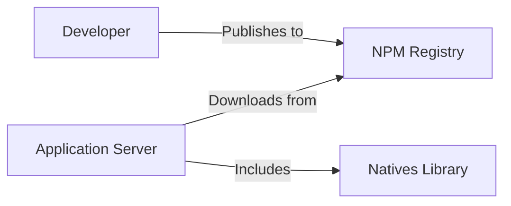
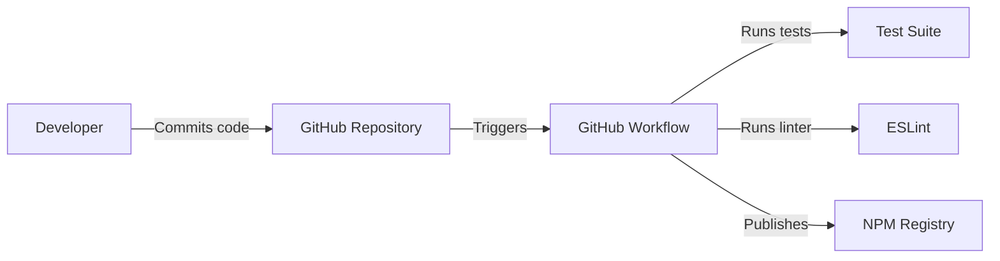

Okay, let's create a design document for the `natives` project, focusing on aspects relevant to threat modeling.

# BUSINESS POSTURE

Business Priorities and Goals:

*   Provide a reliable and efficient way to access Node.js's internal native modules.
*   Minimize the overhead of accessing these modules.
*   Maintain compatibility across different Node.js versions.
*   Simplify debugging and introspection of native modules.
*   Offer a stable and consistent API for developers.

Most Important Business Risks:

*   Security vulnerabilities introduced by exposing internal Node.js modules could lead to system compromise.
*   Compatibility issues with future Node.js versions could break existing applications relying on this module.
*   Performance degradation caused by inefficient access to native modules could impact application responsiveness.
*   Instability or unexpected behavior could lead to application crashes or data corruption.
*   Lack of adoption due to complexity or perceived risks could limit the project's impact.

# SECURITY POSTURE

Existing Security Controls:

*   security control: Code Review: The project is hosted on GitHub, suggesting that code reviews are part of the development process. (Implicit in the open-source nature and GitHub platform).
*   security control: Testing: The project includes a test suite (`test/test.js`), indicating efforts to ensure code correctness and prevent regressions. (Visible in the repository structure).
*   security control: Dependency Management: The project uses `package.json` and `package-lock.json` to manage dependencies, which helps control the supply chain to some extent. (Visible in the repository).
*   security control: Linter: Project is using eslint. (Visible in package.json)

Accepted Risks:

*   accepted risk: Reliance on undocumented Node.js internals: The project inherently depends on the internal structure of Node.js, which is subject to change without notice. This is a fundamental aspect of the project's functionality.
*   accepted risk: Potential for misuse: Exposing native modules could be exploited by malicious actors if used improperly in an application. This risk is mitigated by user awareness and responsible usage.

Recommended Security Controls:

*   security control: Sandboxing: Explore the possibility of using Node.js's `vm` module or other sandboxing techniques to isolate the execution of native modules, limiting their potential impact on the host system.
*   security control: Input Validation: Although this module itself doesn't take direct user input, any application using it should rigorously validate any input used to access native modules through this library.
*   security control: Security Audits: Conduct regular security audits, both manual and automated, to identify potential vulnerabilities.
*   security control: Least Privilege: Document clearly which native modules are exposed and advise users to only access the ones absolutely necessary for their application, minimizing the attack surface.
*   security control: Fuzzing: Implement fuzz testing to identify unexpected behavior and potential crashes when accessing native modules with various inputs.

Security Requirements:

*   Authentication: Not directly applicable to this module itself, as it's a library. However, applications using this module should implement appropriate authentication mechanisms.
*   Authorization: Not directly applicable to this module itself. Applications using it should implement proper authorization to control access to sensitive native modules.
*   Input Validation: As mentioned above, applications using this module must validate any input that influences which native modules are accessed.
*   Cryptography: Not directly applicable to this module itself, but applications using it might leverage native cryptographic modules. If so, they should follow cryptographic best practices.

# DESIGN

## C4 CONTEXT

Element Descriptions:

*   Element:
    *   Name: User/Application
    *   Type: User/External System
    *   Description: A Node.js application or user that utilizes the `natives` library.
    *   Responsibilities: Consumes the `natives` API to access Node.js internal modules.
    *   Security controls: Implements application-level security controls (authentication, authorization, input validation).

*   Element:
    *   Name: Natives Library
    *   Type: Library/Project
    *   Description: The `natives` library itself, providing an interface to Node.js internals.
    *   Responsibilities: Provides a stable API for accessing native modules, handles version compatibility, and manages internal caching.
    *   Security controls: Code reviews, testing, dependency management.

*   Element:
    *   Name: Node.js Internals
    *   Type: External System
    *   Description: The internal, undocumented native modules of Node.js.
    *   Responsibilities: Provides core functionality of Node.js.
    *   Security controls: Relies on Node.js's own security measures and development practices.

## C4 CONTAINER

Since this project is a simple library, the container diagram is essentially the same as the context diagram. It doesn't have separate deployable units.

Element Descriptions:

*   Element:
    *   Name: User/Application
    *   Type: User/External System
    *   Description: A Node.js application or user that utilizes the `natives` library.
    *   Responsibilities: Consumes the `natives` API to access Node.js internal modules.
    *   Security controls: Implements application-level security controls (authentication, authorization, input validation).

*   Element:
    *   Name: Natives Library
    *   Type: Library/Project
    *   Description: The `natives` library itself, providing an interface to Node.js internals.
    *   Responsibilities: Provides a stable API for accessing native modules, handles version compatibility, and manages internal caching.
    *   Security controls: Code reviews, testing, dependency management.

*   Element:
    *   Name: Node.js Internals
    *   Type: External System
    *   Description: The internal, undocumented native modules of Node.js.
    *   Responsibilities: Provides core functionality of Node.js.
    *   Security controls: Relies on Node.js's own security measures and development practices.

## DEPLOYMENT

Possible Deployment Solutions:

1.  NPM Package: The standard way to distribute Node.js libraries. Users install it via `npm install natives`.
2.  Bundled with Application: The library's code could be directly included within an application's codebase.
3.  Git Submodule: The library could be included as a Git submodule within a larger project.

Chosen Solution (NPM Package):

Element Descriptions:

*   Element:
    *   Name: Developer
    *   Type: Person
    *   Description: The developer of the `natives` library.
    *   Responsibilities: Writes code, runs tests, and publishes the package to NPM.
    *   Security controls: Uses secure credentials for NPM publishing.

*   Element:
    *   Name: NPM Registry
    *   Type: External System
    *   Description: The public NPM registry, hosting the `natives` package.
    *   Responsibilities: Stores and distributes the package.
    *   Security controls: NPM's own security measures (e.g., two-factor authentication for publishers).

*   Element:
    *   Name: Application Server
    *   Type: Server
    *   Description: The server where an application using `natives` is deployed.
    *   Responsibilities: Runs the application code.
    *   Security controls: Standard server security practices (firewalls, intrusion detection, etc.).

*   Element:
    *   Name: Natives Library
    *   Type: Library
    *   Description: The `natives` library, downloaded from NPM.
    *   Responsibilities: Provides access to Node.js internals.
    *   Security controls: Inherits security from the NPM download process and the application's environment.

*   Element:
    *   Name: Application
    *   Type: Application
    *   Description: Application that is using Natives Library.
    *   Responsibilities: Application logic.
    *   Security controls: Implemented security controls.

## BUILD

Build Process Description:

1.  Developer commits code changes to the GitHub repository.
2.  GitHub Actions workflow is triggered.
3.  The workflow sets up the Node.js environment.
4.  Dependencies are installed using `npm install`.
5.  The test suite (`test/test.js`) is executed using `npm test`.
6.  The linter (ESLint) is executed.
7.  If tests and linter pass, and the commit is tagged appropriately, the workflow publishes the package to the NPM registry using `npm publish`.

Security Controls in Build Process:

*   security control: Automated Testing: The test suite helps ensure code quality and prevent regressions.
*   security control: Linting: ESLint enforces code style and helps identify potential errors.
*   security control: Dependency Management: `package-lock.json` ensures consistent dependency versions, reducing the risk of supply chain attacks.
*   security control: GitHub Actions: Provides a controlled and auditable build environment.
*   security control: NPM Publish Authentication: Requires secure credentials to publish to NPM, preventing unauthorized package releases.

# RISK ASSESSMENT

Critical Business Processes:

*   Providing reliable access to Node.js native modules for applications that depend on them.
*   Maintaining the stability and compatibility of the library across Node.js versions.

Data to Protect:

*   This library itself doesn't handle sensitive data directly. However, it provides access to Node.js internals, which *could* be used to access or manipulate sensitive data within an application. Therefore, the primary concern is the *integrity* of the library and the *security of the applications* that use it.
*   Data Sensitivity: Indirectly, the sensitivity is high, as misuse could lead to system compromise or data breaches within applications using the library.

# QUESTIONS & ASSUMPTIONS

Questions:

*   Are there any specific Node.js versions that need to be prioritized for compatibility?
*   What level of performance overhead is considered acceptable?
*   Are there any specific security certifications or compliance requirements that need to be considered?
*   What is the expected usage pattern of this library (e.g., frequency of access to native modules)?

Assumptions:

*   BUSINESS POSTURE: The primary goal is to provide a useful tool for the Node.js community, balancing functionality with security.
*   SECURITY POSTURE: Users of the library are responsible for securing their own applications and understanding the risks of accessing native modules.
*   DESIGN: The library will be distributed as an NPM package and will follow standard Node.js development practices. The build process will be automated using GitHub Actions.