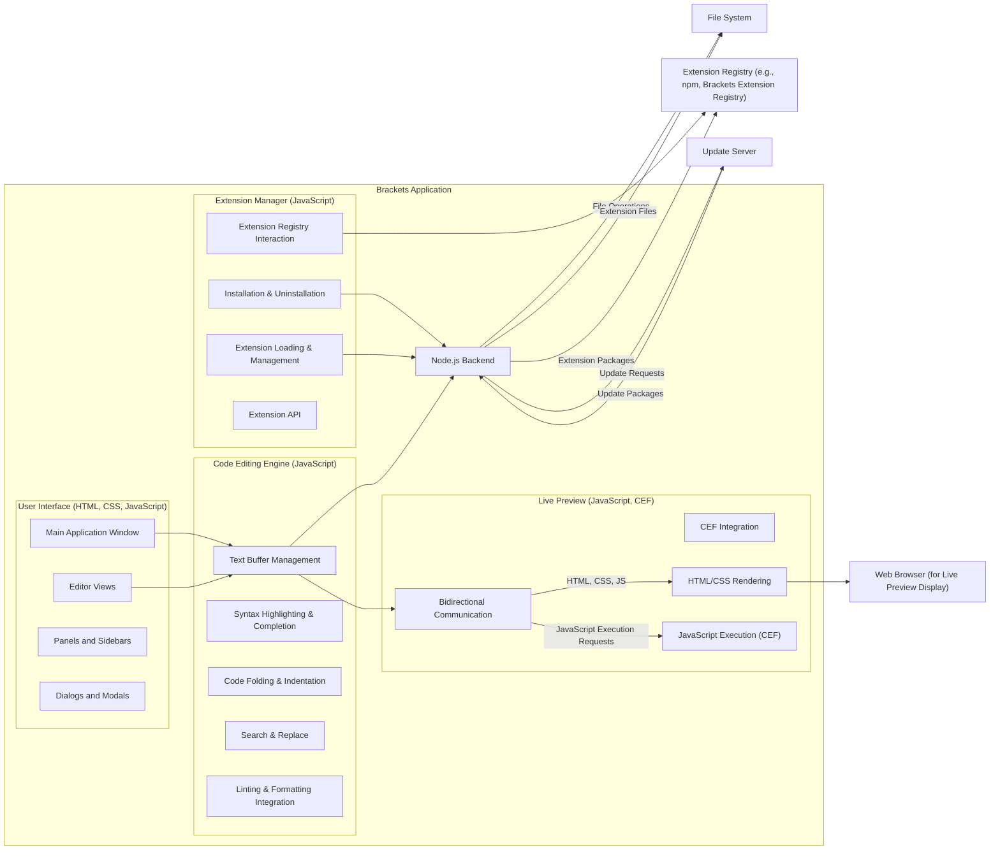
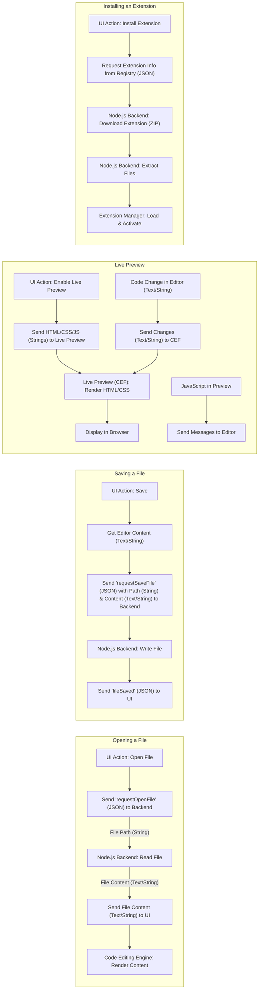

# Project Design Document: Brackets Code Editor

**Version:** 1.1
**Date:** October 26, 2023
**Author:** AI Software Architect

## 1. Introduction

This document provides an enhanced and more detailed architectural design of the Brackets code editor project, an open-source text and source code editor with a focus on web development. This revised document aims to provide a more robust foundation for subsequent threat modeling activities by offering a deeper understanding of the system's components, interactions, and data flow.

### 1.1. Purpose

The primary purpose of this document is to:

*   Describe the detailed architecture of the Brackets code editor, including sub-components.
*   Identify key components and their specific responsibilities and functionalities.
*   Illustrate the data flow within the application with more granularity.
*   Outline the technologies, key libraries, and dependencies involved.
*   Provide a more comprehensive basis for identifying potential security threats and vulnerabilities.

### 1.2. Scope

This document covers the core architecture of the Brackets application, including its user interface, core editing functionalities, live preview mechanism, extension management, and interaction with the underlying operating system. It focuses on the software components and their interactions, including specific data types exchanged, excluding detailed infrastructure or deployment specifics unless directly relevant to the application's design and security.

### 1.3. Target Audience

This document is intended for:

*   Security engineers and architects involved in threat modeling and security assessments.
*   Software developers working on or contributing to the Brackets project, requiring a deeper understanding of the architecture.
*   Project managers and stakeholders requiring a detailed technical overview of the system for strategic planning and risk assessment.

## 2. System Overview

Brackets is a desktop application built using web technologies (HTML, CSS, JavaScript) and runs on top of a Node.js backend, leveraging the Chromium Embedded Framework (CEF) for rendering. It provides a sophisticated user interface for editing code, offering features like live preview, inline editors, and extensive extensibility through a robust extension ecosystem.

## 3. Architectural Design

The Brackets architecture is composed of several interconnected components, each with specific responsibilities:

*   User Interface (UI) Layer
    *   Main Application Window
    *   Editor Views
    *   Panels and Sidebars
    *   Dialogs and Modals
*   Code Editing Engine
    *   Text Buffer Management
    *   Syntax Highlighting and Code Completion
    *   Code Folding and Indentation
    *   Search and Replace Functionality
    *   Linting and Formatting Integration
*   Live Preview Feature
    *   CEF Integration
    *   Bidirectional Communication Bridge
    *   HTML/CSS Rendering Engine
    *   JavaScript Execution Environment (within CEF)
*   Extension Manager
    *   Extension Registry Interaction
    *   Installation and Uninstallation Logic
    *   Extension Loading and Management
    *   API for Extension Development
*   Node.js Backend
    *   File System Access and Management
    *   Inter-Process Communication (IPC) Handler
    *   Extension Management Services
    *   Application Update Mechanism

### 3.1. Component Descriptions

*   **User Interface (UI) Layer:**
    *   **Main Application Window:** The top-level window containing all UI elements.
    *   **Editor Views:** Components responsible for displaying and interacting with code editors.
    *   **Panels and Sidebars:**  UI elements providing supplementary information and tools (e.g., project explorer, debugging tools).
    *   **Dialogs and Modals:**  Interactive windows for user input and displaying information.
    *   Implemented using HTML, CSS, and JavaScript, leveraging frameworks for UI management.
    *   Handles user input and renders the application's visual elements.
    *   Communicates with the Code Editing Engine and other components via defined APIs.

*   **Code Editing Engine:**
    *   **Text Buffer Management:**  Manages the in-memory representation of the code being edited.
    *   **Syntax Highlighting & Code Completion:** Provides real-time syntax highlighting and intelligent code completion suggestions.
    *   **Code Folding & Indentation:**  Handles collapsing and expanding code blocks and automatic indentation.
    *   **Search & Replace:** Implements functionalities for finding and replacing text within the editor.
    *   **Linting & Formatting Integration:** Integrates with external linters and formatters to ensure code quality and consistency.
    *   Implemented primarily in JavaScript.
    *   Provides core editing functionalities and interacts with the Node.js backend for file operations.

*   **Live Preview Feature:**
    *   **CEF Integration:**  Embeds the Chromium rendering engine within the application.
    *   **Bidirectional Communication Bridge:** Establishes a communication channel between the editor and the CEF instance.
    *   **HTML/CSS Rendering Engine:**  The part of CEF responsible for rendering web content.
    *   **JavaScript Execution Environment (within CEF):**  Allows JavaScript code within the previewed web page to execute.
    *   Enables real-time preview of HTML and CSS changes in a sandboxed environment.

*   **Extension Manager:**
    *   **Extension Registry Interaction:**  Communicates with extension registries (e.g., Brackets Extension Registry, npm) to search for and download extensions.
    *   **Installation & Uninstallation Logic:** Handles the process of installing, updating, and removing extensions.
    *   **Extension Loading & Management:**  Loads and manages installed extensions, providing APIs for them to interact with the core application.
    *   **Extension API:**  Provides a set of JavaScript APIs that extensions can use to extend Brackets' functionality.

*   **Node.js Backend:**
    *   **File System Access and Management:** Provides the application with the ability to read, write, create, and delete files and directories on the user's system.
    *   **Inter-Process Communication (IPC) Handler:** Manages communication between the UI process and the backend process.
    *   **Extension Management Services:**  Provides backend services for the Extension Manager, such as managing extension files and dependencies.
    *   **Application Update Mechanism:**  Handles checking for and downloading application updates.

### 3.2. Data Flow

The following describes the data flow for key operations within Brackets, highlighting the types of data exchanged:

*   **Opening a File:**
    *   User initiates "Open File" (UI Event).
    *   UI sends a "requestOpenFile" message (JSON) to the Node.js backend via IPC.
    *   Node.js backend receives the request, including the file path (String).
    *   Node.js backend reads the file content (Text/String) from the file system.
    *   Node.js backend sends the file content (Text/String) back to the UI via IPC.
    *   Code Editing Engine in the UI receives the content and renders it in the editor view.

*   **Saving a File:**
    *   User initiates "Save" (UI Event).
    *   UI retrieves the current editor content (Text/String) from the Code Editing Engine.
    *   UI sends a "requestSaveFile" message (JSON) with the file path (String) and content (Text/String) to the Node.js backend via IPC.
    *   Node.js backend receives the request and writes the content (Text/String) to the specified file path on the file system.
    *   Node.js backend sends a "fileSaved" confirmation (JSON) back to the UI via IPC.

*   **Live Preview:**
    *   User enables Live Preview (UI Event).
    *   Code Editing Engine sends the relevant file content (HTML, CSS, JavaScript as Strings) to the Live Preview component.
    *   Live Preview component (CEF) renders the HTML and CSS.
    *   Bidirectional communication bridge sends code changes (Text/String) from the editor to the CEF instance.
    *   CEF updates the rendered page in real-time based on the received changes.
    *   JavaScript code within the previewed page can send messages back to the editor via the communication bridge (e.g., for debugging).

*   **Installing an Extension:**
    *   User initiates extension installation (Extension Manager UI Event).
    *   Extension Manager sends a request to the Node.js backend to fetch extension information (e.g., from the Extension Registry API - JSON).
    *   Node.js backend downloads the extension package (ZIP archive) from the Extension Registry.
    *   Node.js backend extracts the extension files (JavaScript, CSS, HTML, Images) to the extensions directory on the file system.
    *   Extension Manager loads the extension metadata and activates it.

## 4. Security Considerations (Detailed)

This section expands on the initial security considerations, providing more specific potential threats and vulnerabilities based on the detailed architectural design.

*   **Extension Security:**
    *   **Malicious Code Execution:** Extensions have access to Brackets' APIs and can potentially execute arbitrary code, leading to system compromise.
    *   **Data Exfiltration:** Malicious extensions could access and exfiltrate sensitive data from the user's projects or system.
    *   **API Abuse:** Extensions might misuse Brackets' APIs to perform unauthorized actions.
    *   **Supply Chain Attacks:** Compromised extension packages in the registry could introduce vulnerabilities.

*   **File System Access:**
    *   **Path Traversal:** Vulnerabilities in the Node.js backend or extension APIs could allow attackers to access files outside the intended project directory.
    *   **Unauthorized File Modification/Deletion:**  Exploits could lead to the modification or deletion of critical system files or user data.

*   **Live Preview Security:**
    *   **Cross-Site Scripting (XSS):** If the Live Preview feature doesn't properly sanitize content, it could be vulnerable to XSS attacks if previewing untrusted HTML.
    *   **Content Security Policy (CSP) Bypasses:**  Vulnerabilities in CEF integration could allow bypassing CSP, leading to script injection.

*   **Update Mechanism:**
    *   **Man-in-the-Middle (MITM) Attacks:** If the update process is not secured with HTTPS and proper certificate validation, attackers could inject malicious updates.
    *   **Compromised Update Server:**  If the update server is compromised, attackers could distribute malware disguised as legitimate updates.

*   **Inter-Process Communication (IPC):**
    *   **Message Injection/Tampering:** If IPC channels are not properly secured, malicious processes could inject or tamper with messages exchanged between components.
    *   **Information Disclosure:**  Sensitive information exchanged over IPC could be intercepted if not properly protected.

*   **Dependencies:**
    *   **Vulnerabilities in Node.js, CEF, or other libraries:**  Brackets relies on numerous external libraries, and vulnerabilities in these dependencies could be exploited.

## 5. Dependencies

Brackets relies on the following key technologies, libraries, and frameworks:

*   **Runtime Environment:**
    *   Node.js
*   **UI Rendering:**
    *   Chromium Embedded Framework (CEF)
*   **Core Technologies:**
    *   HTML5
    *   CSS3
    *   JavaScript (including ES6+)
*   **Key JavaScript Libraries and Frameworks:**
    *   Likely uses a framework for UI component management (e.g., React, Vue.js, or a custom framework).
    *   Libraries for code editing functionalities (e.g., CodeMirror or a custom editor).
    *   Libraries for managing asynchronous operations (e.g., Promises).
    *   Libraries for handling file system operations in Node.js (e.g., `fs` module).
    *   Libraries for inter-process communication.
*   **Package Management:**
    *   npm (Node Package Manager) for managing backend dependencies and potentially extension dependencies.

## 6. Deployment

Brackets is typically deployed as a standalone desktop application for:

*   **Operating Systems:** Windows, macOS, and Linux.
*   **Packaging:**  Utilizes platform-specific packaging mechanisms (e.g., installers for Windows, DMG for macOS, DEB/RPM for Linux).
*   **Distribution:**  Distributed through the official Brackets website and potentially through package managers on Linux distributions.
*   **Self-Contained:** The application package includes the necessary runtime environment (Node.js, CEF) and application code, minimizing external dependencies on the user's system.

## 7. Future Considerations

Potential future architectural changes or additions that could impact the design and security include:

*   **Cloud-Based Features:** Integration with cloud storage services or collaborative editing features.
*   **WebAssembly (Wasm) Integration:**  Potentially using WebAssembly for performance-critical parts of the editor or for running code within the Live Preview.
*   **Decentralized Extension Management:** Exploring alternative, more secure mechanisms for managing and distributing extensions.
*   **Enhanced Sandboxing:**  Further isolating extensions and the Live Preview environment to mitigate security risks.

This enhanced document provides a more granular and detailed view of the Brackets code editor's architecture, offering a stronger foundation for comprehensive threat modeling and ongoing development efforts.