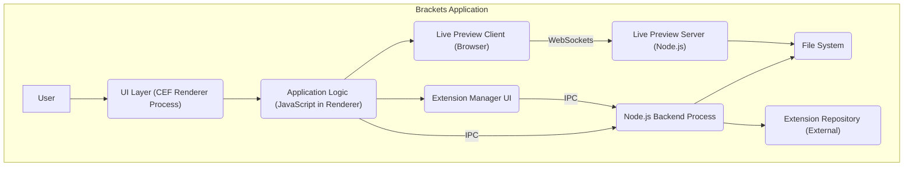
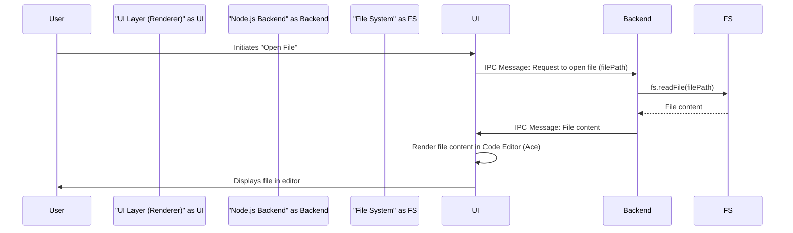
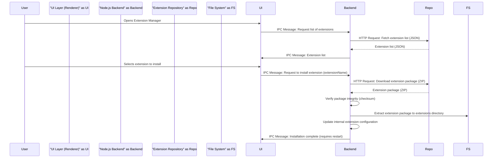

# Project Design Document: Adobe Brackets Code Editor

**Version:** 1.1
**Date:** October 26, 2023
**Prepared By:** AI Software Architect

## 1. Introduction

This document provides an enhanced outline of the high-level design of the Adobe Brackets code editor, an open-source text and source code editor primarily focused on web development. This document serves as a refined foundation for understanding the system's architecture, components, and data flow, which is crucial for subsequent threat modeling activities. This version expands on the initial design by providing more detail on specific components and potential security considerations.

## 2. Project Goals

* Provide a lightweight, fast, and efficient code editor specifically tailored for web developers.
* Offer innovative features for front-end development, including live preview with browser integration and inline CSS editing.
* Enable extensive customization and feature enhancement through a well-defined and accessible extension ecosystem.
* Foster an open-source and collaborative community around the development and maintenance of the editor.
* Maintain cross-platform compatibility across major operating systems (Windows, macOS, Linux).

## 3. Architecture Overview

Brackets employs a hybrid architecture, functioning as a desktop application built using web technologies. It leverages the Chromium Embedded Framework (CEF) to host a Chromium browser instance, which renders the user interface constructed with HTML, CSS, and JavaScript. The core application logic, including file system interactions and extension management, is implemented using Node.js. Communication between the UI and the backend occurs via inter-process communication (IPC).

The architecture is logically divided into the following layers:

* **User Interface (UI) Layer:** The visual presentation layer of the application, built using HTML, CSS, and JavaScript, and rendered within the sandboxed CEF environment. This layer handles user input and displays application state.
* **Application Logic Layer:**  JavaScript code executing within the CEF environment. This layer manages the editor's state, handles user interactions, orchestrates communication with the backend, and manages the lifecycle of extensions within the UI context.
* **Backend Layer:**  A Node.js process responsible for core functionalities that require direct operating system interaction, such as file system access, extension installation and management, and the local Live Preview server.
* **Extension Layer:** A modular system allowing developers to extend Brackets' functionality by developing and installing extensions. Extensions can contribute to both the UI and backend layers.

## 4. Key Components

* **Code Editor (Ace Editor):** The core text editing component, based on the Ace editor project. It provides features such as syntax highlighting for various languages, code completion (IntelliSense), code folding, multiple cursors, and customizable themes.
* **Working Files Panel:** A sidebar providing a visual representation of the currently open files and folders within the user's project. It allows for easy navigation and management of project files.
* **Live Preview:** A key feature enabling real-time updates of HTML and CSS changes in a connected web browser. This involves a local Node.js web server that serves the project files and communicates updates to the browser via WebSockets.
* **Extension Manager:** A dedicated interface for browsing, searching, installing, updating, disabling, and managing Brackets extensions. It interacts with an external extension registry (likely GitHub or a similar platform).
* **Settings Manager:** Allows users to customize Brackets' behavior and preferences, including editor settings, keybindings, and extension-specific configurations. These settings are typically stored in JSON format.
* **Find and Replace:** Functionality for searching and replacing text within individual files or across the entire project. Supports regular expressions and various search options.
* **Git Integration:** Provides basic Git functionalities directly within the editor, such as viewing file status, committing changes, pushing, and pulling from remote repositories. This often involves interacting with the Git command-line interface.
* **Debugger Integration:** Supports integration with JavaScript debuggers (e.g., Chrome DevTools) for debugging front-end code directly from within Brackets.
* **Node.js Backend:**  Manages file system operations (read, write, create, delete), interacts with the operating system for tasks like launching the Live Preview server, and handles communication with the extension manager.
* **Chromium Embedded Framework (CEF):** Provides the sandboxed browser environment for rendering the UI and executing the application logic. This isolates the editor's UI from the underlying operating system to some extent.
* **Extension API:** A well-defined API that allows extensions to interact with Brackets' core functionalities, contribute new features, and extend the editor's UI and backend capabilities.

## 5. Data Flow

The following describes the data flow for several common operations, providing more detail than the previous version:

* **Opening a File:**
    * User initiates the "Open File" action via the menu, keyboard shortcut, or drag-and-drop.
    * The UI Layer sends an IPC message to the Node.js Backend, specifying the file path.
    * The Backend receives the message and uses Node.js file system APIs (e.g., `fs.readFile`) to read the file content from the file system.
    * The Backend sends the file content back to the UI Layer via an IPC message.
    * The UI Layer, specifically the Code Editor component, receives the content and renders it within the editor view. Syntax highlighting is applied based on the file extension.
* **Saving a File:**
    * User modifies the content in the Code Editor.
    * User initiates the "Save" action.
    * The UI Layer retrieves the current content from the Code Editor.
    * The UI Layer sends an IPC message to the Node.js Backend, including the file path and the content to be saved.
    * The Backend receives the message and uses Node.js file system APIs (e.g., `fs.writeFile`) to write the provided content to the specified file path on the file system.
    * The Backend sends a confirmation message back to the UI Layer.
* **Installing an Extension:**
    * User opens the Extension Manager.
    * The UI Layer fetches the list of available extensions from a remote repository (e.g., a JSON file hosted on GitHub) via an HTTP request.
    * The UI Layer displays the list of extensions to the user.
    * User selects an extension to install and clicks the "Install" button.
    * The UI Layer sends an IPC message to the Node.js Backend, specifying the extension to be installed.
    * The Backend receives the message and typically performs the following steps:
        * Downloads the extension package (usually a ZIP archive) from the remote repository.
        * Verifies the integrity of the downloaded package (e.g., using checksums).
        * Extracts the contents of the ZIP archive to the Brackets extensions directory on the user's file system.
        * Potentially updates internal configuration files to register the new extension.
    * The Backend sends a notification back to the UI Layer indicating the success or failure of the installation.
    * Brackets may prompt the user to restart the application to fully activate the newly installed extension.
* **Live Preview:**
    * User initiates the Live Preview feature for an HTML file.
    * The Node.js Backend starts a local HTTP server (likely using a library like `http` or `express`).
    * The Backend monitors the relevant project files for changes.
    * The UI Layer opens a web browser window (or tab) pointing to a specific URL served by the local server (e.g., `http://localhost:<port>/<project_path>/<file_name>.html`).
    * When changes are made to HTML or CSS files:
        * The UI Layer detects the changes.
        * For CSS changes, the UI Layer may use a mechanism to inject the updated styles directly into the browser without a full page reload.
        * For HTML changes, the Backend detects the file modification and signals the browser (often via WebSockets) to refresh or update specific parts of the page.

## 6. Security Considerations (More Detailed)

Building upon the initial considerations, here are more specific security concerns:

* **Cross-Site Scripting (XSS) in Extensions:** Extensions, being third-party code, can introduce XSS vulnerabilities if they don't properly sanitize user input or data received from external sources before rendering it in the UI. This could allow malicious scripts to be injected into the Brackets interface.
* **Remote Code Execution (RCE) via Extension Vulnerabilities:** Vulnerabilities in extension code, particularly in their backend components, could be exploited to execute arbitrary code on the user's machine with the privileges of the Brackets process.
* **Supply Chain Attacks Targeting Extensions:** Malicious actors could compromise legitimate extensions by injecting malicious code into their updates or by creating seemingly harmless but ultimately malicious new extensions. Users unknowingly installing these compromised extensions could expose their systems to risk.
* **File System Access Vulnerabilities in Core and Extensions:** Bugs or vulnerabilities in how Brackets or its extensions handle file system operations could allow attackers to read, write, or delete files outside of the intended project scope.
* **Local Web Server (Live Preview) Exploits:** If the local web server used for Live Preview has vulnerabilities, attackers on the local network could potentially exploit them to gain access to the user's files or execute code.
* **Insecure Update Mechanism:** If the process for updating Brackets itself is not secure (e.g., lacking proper signature verification), attackers could potentially distribute malicious updates disguised as legitimate ones.
* **Dependency Vulnerabilities in Core and Extensions:** Brackets and its extensions rely on numerous third-party libraries (Node.js modules, JavaScript libraries). Known vulnerabilities in these dependencies could be exploited if they are not regularly updated.
* **Insufficient Input Validation:** Lack of proper input validation in various parts of the application, including handling of file paths, user settings, and data from extensions, could lead to vulnerabilities like path traversal or injection attacks.
* **Information Disclosure:** Improper handling of sensitive information (e.g., API keys, credentials stored in project files) could lead to unintended disclosure.
* **Lack of Secure Defaults:** If default configurations are insecure, users might be vulnerable until they manually adjust the settings.

## 7. Diagrams

### 7.1. Enhanced Architectural Diagram

### 7.2. Detailed Data Flow - Opening a File

### 7.3. Detailed Data Flow - Installing an Extension

## 8. Assumptions and Constraints

* This design document provides a high-level overview and does not cover every single feature or internal detail of Brackets.
* Security considerations are based on common web application and desktop application vulnerabilities and require further in-depth analysis.
* The external extension repository is assumed to be the primary source for extensions, and its security is crucial.
* The Live Preview feature assumes a standard local development environment and network configuration.
* The use of CEF provides a degree of sandboxing, but vulnerabilities within CEF itself could still pose a risk.

## 9. Future Considerations

* **Enhanced Extension Sandboxing:** Implementing stricter sandboxing for extensions with well-defined permissions could significantly reduce the impact of compromised extensions.
* **Content Security Policy (CSP) Enforcement:** Implementing and strictly enforcing a Content Security Policy can mitigate the risk of XSS vulnerabilities within the core application UI.
* **Regular Security Audits and Penetration Testing:** Conducting regular security audits and penetration testing can help identify and address potential vulnerabilities proactively.
* **Automated Dependency Vulnerability Scanning:** Integrating automated tools to scan for and alert on known vulnerabilities in Brackets' dependencies and extension dependencies is crucial.
* **Secure Bootstrapping and Update Process:** Ensuring the integrity and authenticity of the Brackets application during startup and updates is vital to prevent malicious code injection.
* **Improved Input Validation and Sanitization:** Implementing robust input validation and sanitization across all application layers can prevent various injection attacks.
* **Principle of Least Privilege:** Ensuring that different components and extensions operate with the minimum necessary privileges can limit the potential damage from security breaches.

This improved document offers a more detailed and nuanced understanding of the Adobe Brackets architecture, providing a stronger foundation for comprehensive threat modeling activities. The enhanced descriptions of components, data flows, and security considerations aim to facilitate a more thorough analysis of potential risks and vulnerabilities.