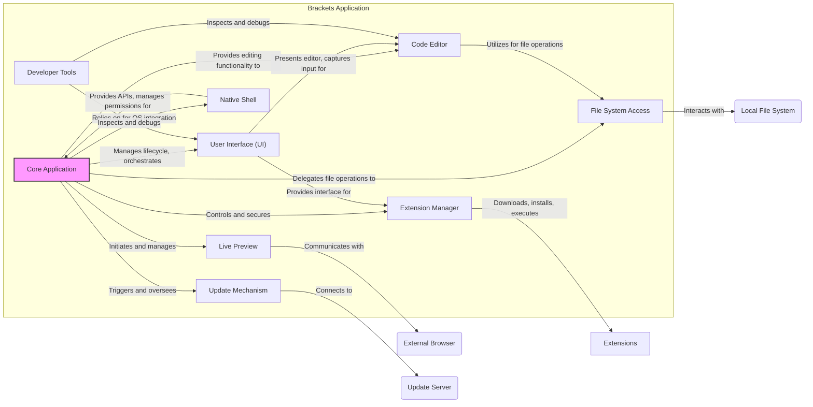
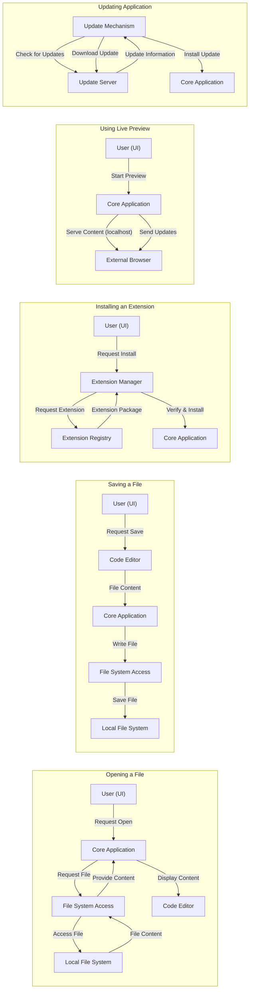

# Project Design Document: Brackets Code Editor

**Version:** 1.1
**Date:** October 26, 2023
**Prepared By:** Gemini (AI Language Model)

## 1. Introduction

This document provides a detailed architectural design of the Brackets code editor, an open-source text and source code editor primarily focused on web development. This document is specifically crafted to serve as a foundation for subsequent threat modeling activities. It meticulously outlines the key components, their interactions, and the data flow within the application, with a focus on potential security implications.

## 2. Goals

*   Provide a clear, concise, and detailed overview of the Brackets architecture, emphasizing security-relevant aspects.
*   Identify the major components and their specific responsibilities, highlighting potential attack surfaces.
*   Describe the data flow within the application, paying close attention to the movement of sensitive data and interactions with external systems.
*   Highlight key technologies and dependencies, noting potential security vulnerabilities associated with them.
*   Serve as a robust and comprehensive basis for identifying potential security threats, vulnerabilities, and attack vectors.

## 3. Scope

This document covers the core architecture of the Brackets application as a desktop application. It includes the main application components, the extension mechanism with its associated risks, and key features like Live Preview and its network interactions. The focus is on aspects relevant to security threat modeling. Internal implementation details of specific modules are generally excluded unless directly relevant to security concerns.

## 4. Target Audience

This document is primarily intended for:

*   Security engineers and architects responsible for performing threat modeling and security assessments.
*   Developers working on or contributing to the Brackets project, particularly those involved in security-sensitive areas.
*   Anyone requiring a detailed understanding of the Brackets architecture from a security perspective.

## 5. Architectural Overview

Brackets is a desktop application constructed using a blend of web technologies (HTML, CSS, JavaScript) and a native application shell. It employs a modular architecture, featuring a core application that can be extended through a robust plugin system. This architecture presents various interaction points and potential attack surfaces.

### 5.1. High-Level Components

*   **Core Application:** The central executable of Brackets. It manages the application lifecycle, orchestrates component interactions, handles core functionalities (like file management and basic editing), and enforces application-level security policies.
*   **User Interface (UI):**  Built using standard web technologies (HTML, CSS, and JavaScript). It's rendered within the native shell's embedded browser and is responsible for presenting the editor and handling user input. This is a primary interaction point for users and potential attackers.
*   **Code Editor:** The core component for text manipulation, providing features like syntax highlighting, code completion, and error checking. It directly handles potentially untrusted user input (code).
*   **Extension Manager:**  A critical component that manages the installation, updating, removal, and execution of extensions. It interacts with external sources (extension registries) and grants extensions access to Brackets APIs, making it a significant security focal point.
*   **Live Preview:** Enables a real-time preview of HTML and CSS changes in an external web browser. This involves network communication and the potential for exposing local files or introducing vulnerabilities through the preview mechanism.
*   **File System Access:** Provides the necessary functionalities for reading, writing, creating, and deleting files and directories on the local file system. This component requires careful security considerations to prevent unauthorized file access.
*   **Native Shell:**  The underlying framework (likely Electron or CEF) that provides the bridge between the web technologies and the host operating system. It exposes native APIs and handles operating system interactions, making its security crucial.
*   **Update Mechanism:** Responsible for checking for new versions of Brackets and facilitating the update process. A compromised update mechanism can lead to the distribution of malicious software.
*   **Developer Tools:** Integrated browser developer tools (like Chrome DevTools) that allow inspection and debugging of the application's UI and JavaScript code. While useful for development, they can also be misused by attackers if access is not properly controlled.

### 5.2. Component Interactions

*   The **Core Application** acts as the central controller, managing the lifecycle of the application and coordinating the interactions between other components. It also plays a role in enforcing security policies.
*   The **User Interface** serves as the primary point of interaction for the user, relaying user actions to other components. It also renders the output from the Code Editor and other parts of the application.
*   The **Code Editor** component is responsible for the core text editing functionalities and interacts with the File System Access component to load and save files.
*   The **Extension Manager** is responsible for managing extensions, which can significantly extend the functionality of Brackets but also introduce security risks if not handled carefully. It interacts with external extension registries.
*   **Live Preview** establishes communication with an external browser to display a real-time preview of the code being edited. This involves network communication and potential security implications.
*   **File System Access** provides the crucial functionality for interacting with the local file system, requiring strict access controls and security measures.
*   The **Native Shell** provides the necessary platform integration, allowing Brackets to interact with the underlying operating system. Its security is paramount for the overall security of the application.
*   The **Update Mechanism** is responsible for keeping the application up-to-date, a critical aspect of security. It interacts with an external update server.
*   **Developer Tools** provide powerful debugging capabilities but can also be misused if access is not properly controlled.

## 6. Data Flow

The data flow within Brackets involves the movement and processing of various types of data. Understanding this flow is crucial for identifying potential vulnerabilities.

*   **Opening a File:**
    *   The User interacts with the **User Interface** to initiate the "Open File" action.
    *   The **User Interface** sends a request to the **Core Application**.
    *   The **Core Application** utilizes the **File System Access** component to request the file from the **Local File System**.
    *   The **Local File System** provides the file content to the **File System Access** component.
    *   The **File System Access** component passes the file content to the **Core Application**.
    *   The **Core Application** sends the file content to the **Code Editor** for rendering and display.

*   **Saving a File:**
    *   The User interacts with the **User Interface** to initiate the "Save" action.
    *   The **Code Editor** provides the current file content to the **Core Application**.
    *   The **Core Application** uses the **File System Access** component to write the content to the specified location on the **Local File System**.

*   **Installing an Extension:**
    *   The User interacts with the **Extension Manager** through the **User Interface**.
    *   The **Extension Manager** may send a request to an external **Extension Registry** to retrieve extension information or download the extension package.
    *   The **Extension Registry** provides the extension package to the **Extension Manager**.
    *   The **Extension Manager** verifies the extension (signature, integrity) and installs the extension files.
    *   The **Core Application** loads and initializes the installed extension, granting it access to specific APIs.

*   **Using Live Preview:**
    *   The User initiates Live Preview through the **User Interface**.
    *   The **Core Application** starts a local web server (or utilizes a similar mechanism).
    *   The **Core Application** communicates with an **External Browser**, providing it with a URL (typically `localhost`) to access the content being edited.
    *   Changes made in the **Code Editor** are communicated to the Live Preview mechanism, which updates the content served to the **External Browser**.

*   **Updating the Application:**
    *   The **Update Mechanism** periodically sends requests to the **Update Server** to check for new versions.
    *   The **Update Server** responds with information about available updates.
    *   If an update is available, the **Update Mechanism** downloads the new version from the **Update Server**.
    *   The **Update Mechanism** verifies the downloaded update (signature, integrity) and installs the new version, potentially requiring elevated privileges.

## 7. Security Considerations

Based on the architecture and data flow, several potential security considerations need to be addressed during threat modeling:

*   **Extension Security:**
    *   Malicious Extensions: Extensions have access to Brackets APIs and potentially the file system. A malicious extension could steal data, execute arbitrary code, or compromise the user's system.
    *   Vulnerable Extensions: Even well-intentioned extensions might contain security vulnerabilities that could be exploited.
    *   Supply Chain Attacks: Compromised extension repositories or developer accounts could lead to the distribution of malicious extensions.
*   **File System Access Vulnerabilities:**
    *   Path Traversal: Vulnerabilities in the File System Access component could allow attackers to access files outside of the intended project directory.
    *   Privilege Escalation: If Brackets runs with elevated privileges, vulnerabilities in file system operations could be exploited to gain further access.
    *   Data Exfiltration/Modification: Unauthorized read or write access to files could lead to data breaches or tampering.
*   **Live Preview Security:**
    *   Cross-Site Scripting (XSS): If user-provided content is not properly sanitized before being served by the Live Preview server, it could lead to XSS attacks in the preview browser.
    *   Information Disclosure: The Live Preview server might inadvertently expose sensitive information or local files if not configured securely.
    *   Man-in-the-Middle Attacks: Communication between Brackets and the external browser could be intercepted if not properly secured (e.g., using HTTPS for remote previews).
*   **Update Mechanism Attacks:**
    *   Man-in-the-Middle Attacks: Attackers could intercept update requests and serve malicious updates if the communication is not secured (e.g., using HTTPS and verifying signatures).
    *   Compromised Update Server: If the update server is compromised, attackers could distribute malware to a large number of users.
    *   Lack of Integrity Checks: If updates are not properly signed and verified, attackers could distribute tampered versions of the application.
*   **Native Shell Vulnerabilities:**
    *   Exploits in the underlying Chromium Embedded Framework (CEF) or Electron could directly impact Brackets.
    *   Improper handling of native APIs could introduce vulnerabilities.
*   **Code Injection:**
    *   Improper sanitization of user input or data from external sources could lead to JavaScript or HTML injection vulnerabilities.
*   **Dependency Vulnerabilities:**
    *   Brackets relies on various third-party libraries and frameworks (e.g., Node.js modules). Vulnerabilities in these dependencies could be exploited.
    *   Regularly scanning and updating dependencies is crucial.
*   **Developer Tools Security:**
    *   If Developer Tools are accessible in production builds or to unauthorized users, they could be used to inspect sensitive data or manipulate the application's behavior.

## 8. Technologies Used

*   **Frontend:** HTML5, CSS3, JavaScript
*   **JavaScript Frameworks/Libraries:**  Likely includes libraries like jQuery, potentially React or similar for parts of the UI. Specific versions are important for vulnerability analysis.
*   **Native Shell:**  Likely **Electron** or **Chromium Embedded Framework (CEF)**. The specific version is critical for security considerations.
*   **Backend (for extensions and potentially core features):** **Node.js** (specific version).
*   **Operating Systems:** Windows, macOS, Linux.
*   **Package Management:** **npm** or **yarn** for managing JavaScript dependencies.
*   **Version Control:** **Git**.
*   **Update Mechanism:**  Potentially uses a framework like **Squirrel.Windows** or **autoUpdater** (Electron).

## 9. Diagrams

The diagrams included in sections 5.2 and 6 provide a visual representation of the component interactions and data flow, aiding in understanding potential attack paths.

## 10. Future Considerations

This document provides a solid foundation for threat modeling. Future enhancements could include:

*   More granular details about the security mechanisms implemented within each component (e.g., input validation, output encoding).
*   Specific details about the Brackets extension API and its security model, including permission management.
*   Detailed data flow diagrams focusing on specific security-sensitive operations.
*   Identification of specific trust boundaries within the application.
*   Integration with code repositories to track changes and potential security impacts of new features.

This improved design document aims to provide a more comprehensive and security-focused view of the Brackets architecture, facilitating a more effective and thorough threat modeling process.