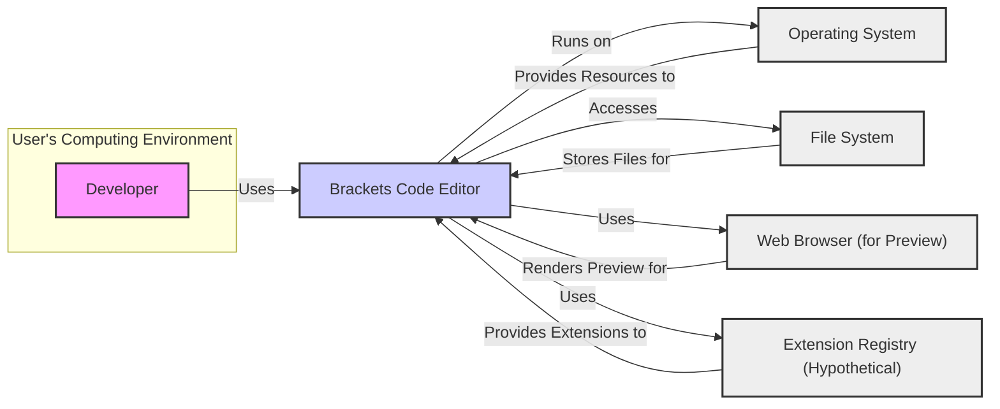
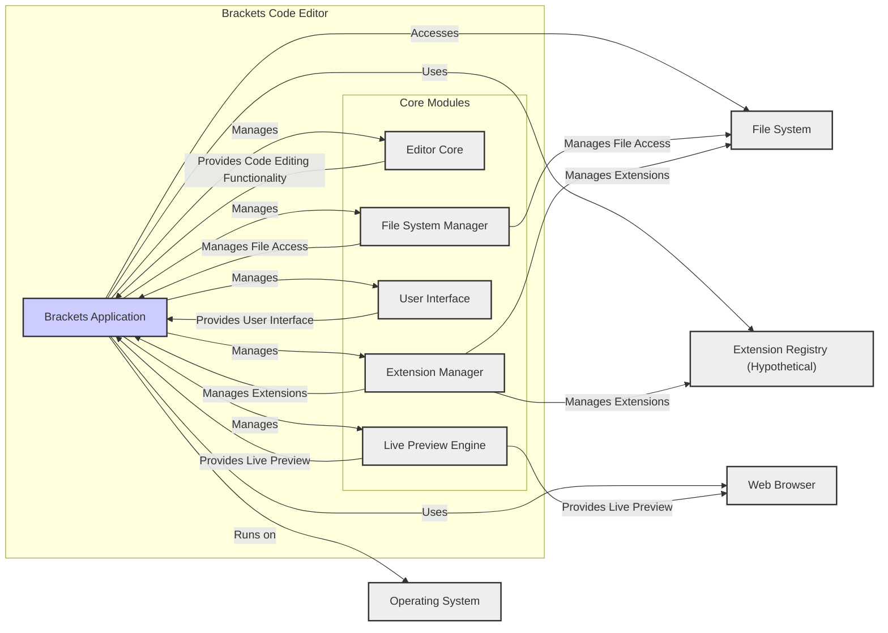
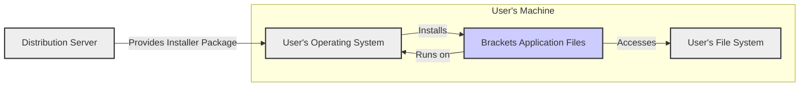
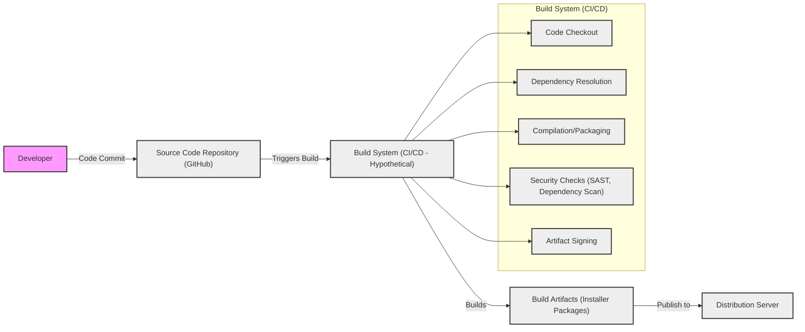

# BUSINESS POSTURE

- Business Priorities and Goals:
  - Provide a free and open-source code editor tailored for web development.
  - Offer a user-friendly environment for front-end developers.
  - Foster a community around web development tools and practices.
  - Enable extensibility through a robust extension ecosystem.
  - Support modern web technologies and workflows.
- Business Risks:
  - Risk of losing community support and contributions if the project becomes stagnant or misaligned with community needs.
  - Risk of security vulnerabilities in the editor or extensions that could harm users or their projects.
  - Risk of competition from other code editors with more features or better performance.
  - Risk of project abandonment if maintainers lose interest or resources.
  - Risk of supply chain attacks through compromised dependencies or build processes.

# SECURITY POSTURE

- Existing Security Controls:
  - security control: Code reviews are likely performed by maintainers and contributors as part of the open-source development process. (Location: GitHub Pull Request process)
  - security control: Static code analysis tools might be used to identify potential code quality and security issues. (Location: Potentially integrated into CI/CD pipelines, if any)
  - security control: Dependency scanning to identify known vulnerabilities in third-party libraries. (Location: Potentially integrated into CI/CD pipelines, if any)
  - security control: Operating system level security controls on user's machine where Brackets is installed. (Location: User's responsibility, OS documentation)
- Accepted Risks:
  - accepted risk: Vulnerabilities in third-party extensions due to the open and community-driven nature of the extension ecosystem.
  - accepted risk: Users running Brackets on potentially insecure operating systems or environments.
  - accepted risk: Social engineering attacks targeting developers using Brackets.
- Recommended Security Controls:
  - security control: Implement a Software Bill of Materials (SBOM) to track dependencies and components. (Location: Build process and release artifacts)
  - security control: Enhance input validation and sanitization throughout the application, especially in features that handle external data or user input (e.g., file handling, extension loading, preferences). (Location: Codebase - backend and frontend)
  - security control: Implement automated security testing (SAST, DAST) in the CI/CD pipeline. (Location: CI/CD pipeline)
  - security control: Establish a clear vulnerability reporting and response process. (Location: Project documentation and security policy)
  - security control: Provide guidelines and best practices for extension developers to promote secure extension development. (Location: Extension development documentation)
- Security Requirements:
  - Authentication:
    - Not directly applicable to a desktop code editor in terms of user authentication to the application itself.
    - Consider authentication for any online services integrated with Brackets (e.g., extension marketplace, if any).
  - Authorization:
    - File system access should be limited to the user's permissions.
    - Access to system resources should be minimized and follow the principle of least privilege.
    - Extension permissions should be clearly defined and controlled to prevent malicious extensions from gaining excessive access.
  - Input Validation:
    - Validate all user inputs, including file content, settings, and extension inputs, to prevent injection attacks (e.g., code injection, command injection).
    - Sanitize inputs to prevent cross-site scripting (XSS) vulnerabilities if Brackets renders web content (e.g., in live preview or extension UIs).
  - Cryptography:
    - Use cryptography for secure storage of sensitive data, such as user credentials if any are stored locally (though unlikely for a code editor itself, potentially relevant for extension settings).
    - Ensure secure communication if Brackets communicates with external services (e.g., for updates or extension downloads).

# DESIGN

## C4 CONTEXT

- Context Diagram Elements:
  - - Name: Developer
    - Type: Person
    - Description: A software developer who uses Brackets to write and edit code, primarily for web development.
    - Responsibilities: Writes, edits, and debugs code using Brackets. Manages project files and configurations.
    - Security controls: User authentication to their own operating system account. Responsible for secure coding practices in their projects.
  - - Name: Brackets Code Editor
    - Type: Software System
    - Description: A free, open-source code editor primarily focused on web development technologies like HTML, CSS, and JavaScript. Provides features like live preview, extension support, and code hinting.
    - Responsibilities: Provides a user interface for code editing, file management, and project management. Executes code preview functionality. Manages and loads extensions.
    - Security controls: Input validation, file system access control (through OS permissions), extension permission management, software updates.
  - - Name: Operating System
    - Type: Software System
    - Description: The operating system (e.g., Windows, macOS, Linux) on which Brackets is installed and runs. Provides system resources and manages hardware interactions.
    - Responsibilities: Provides the runtime environment for Brackets. Manages file system access, process execution, and network communication. Enforces user permissions and system-level security policies.
    - Security controls: Operating system access controls, user account management, system firewalls, security updates.
  - - Name: File System
    - Type: Data Store
    - Description: The local file system on the user's computer where project files and Brackets configuration are stored.
    - Responsibilities: Stores project files, code files, configuration files, and extension files. Provides file access to Brackets based on operating system permissions.
    - Security controls: File system permissions, access control lists (ACLs), encryption at rest (optional, OS-dependent).
  - - Name: Web Browser (for Preview)
    - Type: Software System
    - Description: A web browser (e.g., Chrome, Firefox, Safari) used by Brackets to display a live preview of web projects being edited.
    - Responsibilities: Renders HTML, CSS, and JavaScript code provided by Brackets to display a live preview of web pages. Executes JavaScript code in a browser environment.
    - Security controls: Browser security features (sandboxing, content security policy), browser updates, protection against malicious web content.
  - - Name: Extension Registry (Hypothetical)
    - Type: Software System
    - Description: A hypothetical online service or repository where Brackets extensions are hosted and can be discovered and downloaded. (Note: Brackets extensions are primarily managed through local file system or external repositories, but a registry is considered for context).
    - Responsibilities: Hosts and distributes Brackets extensions. Provides metadata and information about extensions. Potentially handles extension updates.
    - Security controls: Secure hosting infrastructure, malware scanning of extensions, code signing (if implemented), user reviews and ratings.

## C4 CONTAINER

- Container Diagram Elements:
  - - Name: Brackets Application
    - Type: Application
    - Description: The main Brackets desktop application, encompassing all core functionalities and modules. It's a single executable or application package that runs on the user's operating system.
    - Responsibilities: Orchestrates all core modules, manages user interactions, provides the main application window, and handles application lifecycle.
    - Security controls: Application-level input validation, process isolation (within OS capabilities), update mechanism, extension permission management.
  - - Name: Editor Core
    - Type: Component
    - Description: The core text editing engine of Brackets. Handles text input, syntax highlighting, code completion, and other editor-specific functionalities.
    - Responsibilities: Provides core text editing capabilities. Manages document models and editor state. Implements code editing features.
    - Security controls: Input validation for text input, protection against buffer overflows, secure handling of code parsing and syntax highlighting.
  - - Name: File System Manager
    - Type: Component
    - Description: Manages file system interactions for Brackets. Handles file opening, saving, directory browsing, and file system operations.
    - Responsibilities: Provides an abstraction layer for file system access. Manages file I/O operations. Enforces file access permissions based on OS.
    - Security controls: File path validation, access control checks before file operations, secure handling of file metadata, protection against path traversal vulnerabilities.
  - - Name: User Interface
    - Type: Component
    - Description: The graphical user interface of Brackets, responsible for rendering the editor window, menus, panels, and dialogs.
    - Responsibilities: Provides the visual interface for user interaction. Handles user input events (keyboard, mouse). Renders editor views and UI elements.
    - Security controls: Input sanitization for UI elements, protection against UI-based injection attacks (if applicable), secure rendering of web content within UI (if used).
  - - Name: Extension Manager
    - Type: Component
    - Description: Manages Brackets extensions. Handles extension installation, loading, updating, and disabling.
    - Responsibilities: Discovers, downloads, installs, and manages extensions. Provides an API for extensions to interact with Brackets. Enforces extension permissions.
    - Security controls: Extension validation during installation, permission management for extensions, secure extension update mechanism, isolation of extension execution (if possible).
  - - Name: Live Preview Engine
    - Type: Component
    - Description: The component responsible for providing the live preview functionality in Brackets. Integrates with a web browser to display a live view of web projects.
    - Responsibilities: Translates code changes into browser-renderable content. Communicates with a web browser to display live previews. Manages the preview session.
    - Security controls: Secure communication with the browser, input sanitization for content sent to the browser, protection against XSS vulnerabilities in previewed content.

## DEPLOYMENT

- Deployment Options:
  - Desktop Installation Packages: Distribute Brackets as platform-specific installer packages (e.g., .exe for Windows, .dmg for macOS, .deb/.rpm for Linux). This is the primary deployment method.
  - Source Code Distribution: Provide the source code on GitHub, allowing users to build and install Brackets themselves.
  - Package Managers: Make Brackets available through operating system package managers (e.g., apt, yum, brew).

- Detailed Deployment (Desktop Installation Packages):

- Deployment Diagram Elements:
  - - Name: User's Operating System
    - Type: Infrastructure
    - Description: The user's desktop operating system (Windows, macOS, Linux) where Brackets is installed.
    - Responsibilities: Provides the runtime environment for Brackets. Manages system resources and security policies.
    - Security controls: Operating system security features, user account controls, system updates.
  - - Name: Brackets Application Files
    - Type: Software
    - Description: The installed Brackets application files on the user's machine, including executables, libraries, and resources.
    - Responsibilities: Provides the application code and resources for Brackets to run. Executes when the user launches Brackets.
    - Security controls: File system permissions, code signing (if implemented for installer packages), integrity checks during installation.
  - - Name: User's File System
    - Type: Infrastructure
    - Description: The local file system on the user's machine where Brackets application files are installed and where user projects are stored.
    - Responsibilities: Stores application files and user project data. Provides file access to Brackets.
    - Security controls: File system permissions, access control lists, encryption at rest (optional, OS-dependent).
  - - Name: Distribution Server
    - Type: Infrastructure
    - Description: A server or content delivery network (CDN) that hosts Brackets installer packages for download.
    - Responsibilities: Stores and distributes Brackets installer packages to users. Handles download requests.
    - Security controls: Secure server infrastructure, access controls to installer packages, HTTPS for download delivery, integrity checks for installer packages.

## BUILD

- Build Process Elements:
  - - Name: Developer
    - Type: Person
    - Description: A software developer contributing code to the Brackets project.
    - Responsibilities: Writes code, fixes bugs, and contributes features. Commits code changes to the source code repository.
    - Security controls: Secure development environment, code review participation, adherence to secure coding practices.
  - - Name: Source Code Repository (GitHub)
    - Type: Software System
    - Description: The GitHub repository hosting the Brackets source code.
    - Responsibilities: Stores and manages the source code, version history, and collaboration features.
    - Security controls: Access controls to the repository, branch protection, commit signing, vulnerability scanning (GitHub Security Features).
  - - Name: Build System (CI/CD - Hypothetical)
    - Type: Software System
    - Description: A hypothetical Continuous Integration/Continuous Delivery (CI/CD) system used to automate the build, test, and release process for Brackets. (Could be GitHub Actions, Jenkins, or similar).
    - Responsibilities: Automates the build process, runs tests, performs security checks, and generates release artifacts.
    - Security controls: Secure CI/CD pipeline configuration, access controls to CI/CD system, secure build environment, dependency scanning, SAST/DAST integration, artifact signing.
    - - Name: Code Checkout
      - Type: Build Step
      - Description: Step in CI/CD pipeline to checkout source code from repository.
      - Responsibilities: Retrieve latest source code for build.
      - Security controls: Access control to repository, secure communication with repository.
    - - Name: Dependency Resolution
      - Type: Build Step
      - Description: Step in CI/CD pipeline to resolve and download project dependencies.
      - Responsibilities: Manage and download required libraries and modules.
      - Security controls: Dependency scanning, using trusted package registries, verifying dependency integrity (e.g., checksums).
    - - Name: Compilation/Packaging
      - Type: Build Step
      - Description: Step in CI/CD pipeline to compile source code and package application into distributable formats.
      - Responsibilities: Compile code, create installer packages for different platforms.
      - Security controls: Secure build environment, compiler security features, integrity checks of build outputs.
    - - Name: Security Checks (SAST, Dependency Scan)
      - Type: Build Step
      - Description: Step in CI/CD pipeline to perform static application security testing (SAST) and dependency vulnerability scanning.
      - Responsibilities: Identify potential security vulnerabilities in code and dependencies. Generate security reports.
      - Security controls: SAST tool configuration, dependency scanning tool configuration, vulnerability reporting and tracking.
    - - Name: Artifact Signing
      - Type: Build Step
      - Description: Step in CI/CD pipeline to digitally sign build artifacts (installer packages).
      - Responsibilities: Sign installer packages to ensure authenticity and integrity.
      - Security controls: Secure key management for signing, code signing certificates, verification of signatures during installation.
  - - Name: Build Artifacts (Installer Packages)
    - Type: Data Store
    - Description: The output of the build process, which are the installer packages for different operating systems.
    - Responsibilities: Represent the distributable versions of Brackets.
    - Security controls: Integrity protection (signing), secure storage of artifacts before distribution.
  - - Name: Distribution Server
    - Type: Software System
    - Description: The server or CDN used to distribute Brackets installer packages to users.
    - Responsibilities: Hosts and distributes installer packages.
    - Security controls: Secure server infrastructure, access controls to artifacts, HTTPS for distribution.

# RISK ASSESSMENT

- Critical Business Processes:
  - Providing a functional and reliable code editor to users.
  - Maintaining the open-source community and contributions.
  - Ensuring the security and integrity of the Brackets application and its extensions.
- Data Sensitivity:
  - User Project Code: Sensitive. Contains intellectual property, potentially confidential information, and business logic. Confidentiality, integrity, and availability are important.
  - User Settings and Preferences: Low to Medium sensitivity. Contains user-specific configurations. Integrity and availability are important.
  - Extension Code: Medium to High sensitivity. Extensions can have significant access to the editor and user projects. Integrity and availability are critical.
  - Application Code: Publicly available as open source. Integrity and availability are important to maintain trust and prevent supply chain attacks.

# QUESTIONS & ASSUMPTIONS

- Questions:
  - What is the current process for managing and reviewing extension security?
  - Are there any automated security tests currently integrated into the development or release process?
  - Is there a formal vulnerability reporting and response process in place?
  - What is the strategy for maintaining Brackets in the long term, given it's no longer actively developed by Adobe?
- Assumptions:
  - BUSINESS POSTURE: The primary goal is to maintain Brackets as a useful open-source tool for the web development community.
  - SECURITY POSTURE: Security is considered important, but resources for dedicated security efforts might be limited due to the community-driven nature of the project.
  - DESIGN: The architecture is relatively straightforward for a desktop application, with core modules and an extension system. The build and deployment processes are likely standard for open-source desktop software.