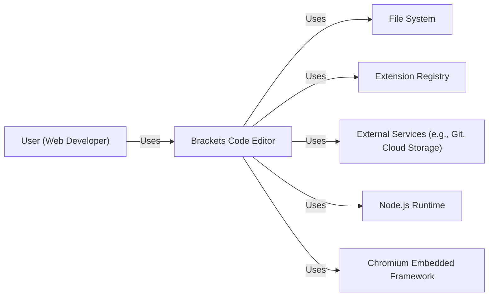
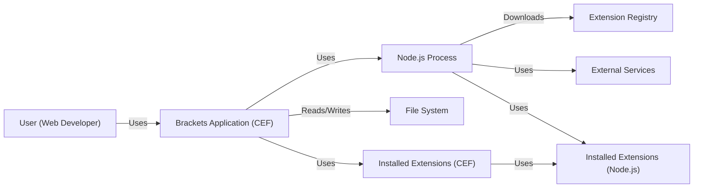
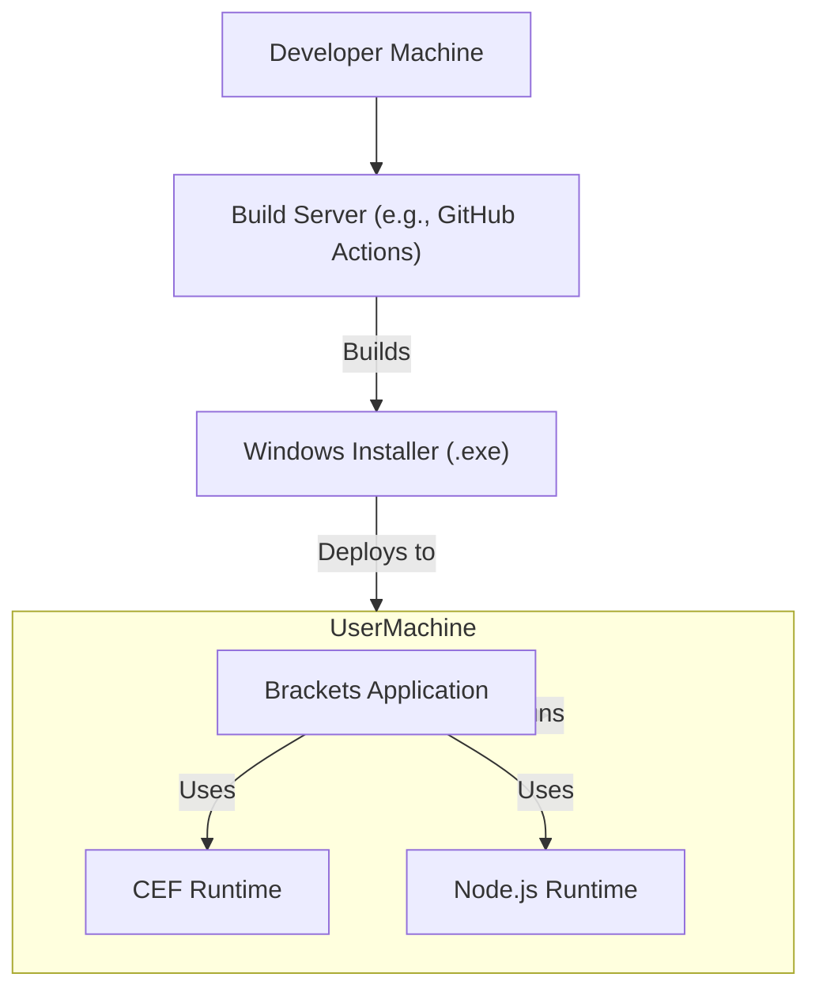
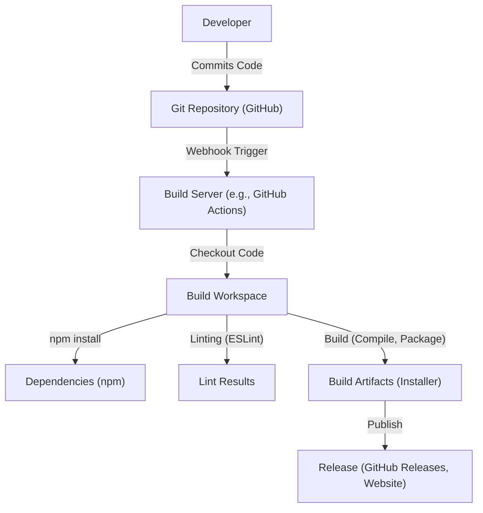

Okay, let's create a design document for the Brackets project, focusing on aspects relevant to threat modeling.

# BUSINESS POSTURE

Brackets is an open-source code editor primarily focused on web development (HTML, CSS, JavaScript).  It was initially developed by Adobe and later transitioned to a community-maintained project.  Given its history and current state, here's a likely business posture:

Priorities and Goals:

*   Provide a free, lightweight, and extensible code editor for web developers.
*   Foster a community-driven development model, encouraging contributions and extensions.
*   Maintain a user-friendly experience with a focus on visual tools and live preview capabilities.
*   Ensure the editor remains relevant in a competitive landscape (e.g., VS Code, Atom).
*   Minimize maintenance overhead and security risks, given the reliance on community contributions.

Business Risks:

*   Reputational Damage:  Security vulnerabilities in Brackets could damage the reputation of the project and potentially Adobe (due to its historical association).
*   User Data Compromise:  While Brackets primarily deals with code, extensions could potentially access or manipulate user data (e.g., files, API keys).
*   Supply Chain Attacks:  Dependencies (npm packages, extensions) could introduce vulnerabilities.
*   Lack of Resources:  As a community-maintained project, resources for security audits and incident response may be limited.
*   Code Injection: Malicious code could be injected through extensions or manipulated project files, leading to execution of arbitrary code on the user's machine.

# SECURITY POSTURE

Existing Security Controls:

*   security control: Extension Registry Validation: Brackets has an extension registry, which likely includes some level of validation and review for submitted extensions (though the extent and rigor are unclear without further investigation). Described in: https://github.com/adobe/brackets/tree/master/src/extensions
*   security control: Code Signing (Potentially): Depending on the distribution method, Brackets binaries *might* be code-signed to ensure authenticity and prevent tampering. Described in: Not explicitly described in the repository, but common practice for distributed software.
*   security control: Static Analysis (Likely): The project likely uses linters (e.g., ESLint) and potentially other static analysis tools to identify potential code quality and security issues during development. Described in: https://github.com/adobe/brackets/blob/master/.eslintrc.js
*   security control: Dependency Management: The project uses npm for managing dependencies, allowing for version pinning and updates. Described in: https://github.com/adobe/brackets/blob/master/package.json
*   security control: Community Reporting: Vulnerabilities can be reported by the community, allowing for a crowdsourced approach to security. Described in: https://github.com/adobe/brackets/blob/master/SECURITY.md
*   security control: Content Security Policy (CSP): Brackets, being a web-technology-based application, can leverage CSP to mitigate XSS and other injection attacks within the editor itself. Described in: Not explicitly described, but inherent to the technology (CEF).

Accepted Risks:

*   accepted risk: Extension Security: While the extension registry exists, the level of security vetting for each extension may vary, and users ultimately bear some risk when installing third-party extensions.
*   accepted risk: Limited Security Resources: As a community-driven project, dedicated security personnel and resources may be limited compared to a commercially-backed product.
*   accepted risk: Zero-Day Vulnerabilities: Like all software, Brackets is susceptible to zero-day vulnerabilities in its codebase or dependencies.

Recommended Security Controls:

*   Implement a robust Software Bill of Materials (SBOM) management process to track all dependencies and their versions.
*   Integrate automated vulnerability scanning (e.g., Snyk, Dependabot) into the build process to identify known vulnerabilities in dependencies.
*   Establish a clear and documented process for handling security vulnerability reports, including timelines for response and remediation.
*   Consider implementing a sandboxing mechanism for extensions to limit their access to the user's system and data.
*   Provide security guidelines and best practices for extension developers.

Security Requirements:

*   Authentication: Not directly applicable to the core editor, as it operates on local files. However, extensions might require authentication to external services (e.g., cloud storage).  Extensions should use secure methods for storing credentials (e.g., OS-provided credential managers).
*   Authorization: The editor itself has limited authorization needs, primarily file system access. Extensions should adhere to the principle of least privilege, requesting only the necessary permissions.
*   Input Validation:  Crucial for preventing code injection attacks.  The editor and extensions must properly sanitize and validate any user-provided input, especially when handling file paths, URLs, or data displayed in the editor.
*   Cryptography:  If extensions handle sensitive data (e.g., API keys), they should use appropriate cryptographic techniques for storage and transmission. The editor itself might use cryptography for features like secure file storage (if implemented).

# DESIGN

## C4 CONTEXT

Element Descriptions:

*   Element:
    *   Name: User (Web Developer)
    *   Type: Person
    *   Description: A web developer who uses Brackets to write and edit code.
    *   Responsibilities: Writes code, manages files, installs extensions.
    *   Security controls: Uses strong passwords, keeps their system up-to-date, exercises caution when installing extensions.

*   Element:
    *   Name: Brackets Code Editor
    *   Type: Software System
    *   Description: The core Brackets application.
    *   Responsibilities: Provides code editing features, manages extensions, interacts with the file system.
    *   Security controls: Input validation, CSP, potential code signing.

*   Element:
    *   Name: File System
    *   Type: Software System
    *   Description: The user's local file system.
    *   Responsibilities: Stores project files, configuration files, and extensions.
    *   Security controls: Operating system file permissions.

*   Element:
    *   Name: Extension Registry
    *   Type: Software System
    *   Description: A repository of Brackets extensions.
    *   Responsibilities: Provides a mechanism for discovering and installing extensions.
    *   Security controls: Extension validation, code signing (potentially).

*   Element:
    *   Name: External Services (e.g., Git, Cloud Storage)
    *   Type: Software System
    *   Description: Third-party services that extensions might interact with.
    *   Responsibilities: Varies depending on the service.
    *   Security controls: Authentication, authorization, encryption (handled by the service and the extension).

*   Element:
    *   Name: Node.js Runtime
    *   Type: Software System
    *   Description: The Node.js runtime environment used by Brackets for various tasks, including extension management.
    *   Responsibilities: Executes Node.js code.
    *   Security controls: Regular updates to the Node.js runtime to address security vulnerabilities.

*   Element:
    *   Name: Chromium Embedded Framework
    *   Type: Software System
    *   Description: The embedded browser framework used by Brackets to render the user interface.
    *   Responsibilities: Renders HTML, CSS, and JavaScript.
    *   Security controls: Regular updates to CEF to address security vulnerabilities, CSP.

## C4 CONTAINER

Element Descriptions:

*   Element:
    *   Name: User (Web Developer)
    *   Type: Person
    *   Description: A web developer who uses Brackets to write and edit code.
    *   Responsibilities: Writes code, manages files, installs extensions.
    *   Security controls: Uses strong passwords, keeps their system up-to-date, exercises caution when installing extensions.

*   Element:
    *   Name: Brackets Application (CEF)
    *   Type: Container (Chromium Embedded Framework)
    *   Description: The main Brackets application running within CEF.
    *   Responsibilities: Renders the UI, handles user input, manages the editor core.
    *   Security controls: Input validation, CSP, sandboxing (potentially).

*   Element:
    *   Name: Node.js Process
    *   Type: Container (Node.js Runtime)
    *   Description: A separate Node.js process used for tasks like extension management and interacting with external services.
    *   Responsibilities: Manages extensions, communicates with the extension registry, interacts with external services.
    *   Security controls: Secure communication with external services, dependency management.

*   Element:
    *   Name: File System
    *   Type: Container (File System)
    *   Description: The user's local file system.
    *   Responsibilities: Stores project files, configuration files, and extensions.
    *   Security controls: Operating system file permissions.

*   Element:
    *   Name: Extension Registry
    *   Type: Container (Web Server/Database)
    *   Description: A repository of Brackets extensions.
    *   Responsibilities: Provides a mechanism for discovering and installing extensions.
    *   Security controls: Extension validation, code signing (potentially).

*   Element:
    *   Name: External Services
    *   Type: Container (Varies)
    *   Description: Third-party services that extensions might interact with.
    *   Responsibilities: Varies depending on the service.
    *   Security controls: Authentication, authorization, encryption (handled by the service and the extension).

*   Element:
    *   Name: Installed Extensions (CEF)
    *   Type: Container (Chromium Embedded Framework)
    *   Description: Extensions that run within the CEF context, typically for UI modifications.
    *   Responsibilities: Extend the functionality of the editor's UI.
    *   Security controls: Limited by the CEF sandbox and Brackets' extension API.

*   Element:
    *   Name: Installed Extensions (Node.js)
    *   Type: Container (Node.js Runtime)
    *   Description: Extensions that run within the Node.js context, typically for backend tasks.
    *   Responsibilities: Extend the functionality of the editor's backend.
    *   Security controls: Secure coding practices, dependency management, limited access to system resources.

## DEPLOYMENT

Possible Deployment Solutions:

1.  Standalone Installer (Windows, macOS, Linux):  Traditional desktop application installation.
2.  Portable Version:  A self-contained version that doesn't require installation.
3.  Web-Based Version (Less Likely):  Potentially running Brackets in a browser using technologies like WebAssembly (though this is not the current deployment model).

Chosen Solution (Detailed Description): Standalone Installer (Windows)

Element Descriptions:

*   Element:
    *   Name: Developer Machine
    *   Type: Node (Physical/Virtual Machine)
    *   Description: The machine where developers write and commit code.
    *   Responsibilities: Code development, testing.
    *   Security controls: Secure coding practices, code review.

*   Element:
    *   Name: Build Server (e.g., GitHub Actions)
    *   Type: Node (Virtual Machine)
    *   Description: A server that automates the build process.
    *   Responsibilities: Compiles code, runs tests, creates installers.
    *   Security controls: Secure configuration, access control, vulnerability scanning.

*   Element:
    *   Name: Windows Installer (.exe)
    *   Type: Node (File)
    *   Description: The installer file for Windows.
    *   Responsibilities: Installs Brackets on the user's machine.
    *   Security controls: Code signing.

*   Element:
    *   Name: User Machine (Windows)
    *   Type: Node (Physical/Virtual Machine)
    *   Description: The user's computer where Brackets is installed.
    *   Responsibilities: Runs Brackets.
    *   Security controls: Operating system security features, antivirus software.

*   Element:
    *   Name: Brackets Application
    *   Type: Application
    *   Description: The running instance of Brackets.
    *   Responsibilities: Provides code editing features.
    *   Security controls: Input validation, CSP.

*   Element:
    *   Name: CEF Runtime
    *   Type: Library
    *   Description: The Chromium Embedded Framework runtime.
    *   Responsibilities: Renders the UI.
    *   Security controls: Regular updates.

*   Element:
    *   Name: Node.js Runtime
    *   Type: Library
    *   Description: The Node.js runtime.
    *   Responsibilities: Executes Node.js code.
    *   Security controls: Regular updates.

## BUILD

Build Process Description:

1.  Developers commit code to the GitHub repository.
2.  A webhook triggers the build server (e.g., GitHub Actions).
3.  The build server checks out the code into a build workspace.
4.  `npm install` is run to install project dependencies.
5.  Linters (e.g., ESLint) are run to check code quality and identify potential security issues.
6.  The build process compiles the code and packages it into an installer (e.g., .exe for Windows).
7.  The build artifacts (installer) are published to a release location (e.g., GitHub Releases, project website).

Security Controls in Build Process:

*   Supply Chain Security: `npm audit` (or similar tools) should be integrated into the build process to identify known vulnerabilities in dependencies.  SBOM generation should also be part of the build.
*   Build Automation: GitHub Actions (or similar CI/CD systems) provide a consistent and automated build process, reducing the risk of manual errors.
*   Security Checks: Linters (ESLint) and static analysis tools help identify potential security issues in the code.
*   Code Signing: The final installer should be code-signed to ensure authenticity and prevent tampering.

# RISK ASSESSMENT

Critical Business Processes:

*   Code Editing: The core functionality of Brackets must be reliable and secure.
*   Extension Management:  The process of installing and managing extensions must be secure to prevent the introduction of malicious code.
*   Community Engagement:  Maintaining a healthy and active community is crucial for the long-term sustainability of the project.

Data Sensitivity:

*   Source Code:  The primary data handled by Brackets is source code.  The sensitivity of this data varies depending on the project.  Open-source projects are publicly available, while closed-source projects may contain proprietary information.
*   Configuration Files:  Brackets and its extensions may store configuration files that could contain sensitive information (e.g., API keys, access tokens).
*   User Data (Indirectly):  Extensions could potentially access or manipulate user data, depending on their functionality.

# QUESTIONS & ASSUMPTIONS

Questions:

*   What is the current level of security review performed on extensions submitted to the Brackets Extension Registry?
*   Are there any existing mechanisms for sandboxing extensions or limiting their access to system resources?
*   What is the process for handling security vulnerability reports?
*   Are Brackets binaries code-signed?
*   What specific static analysis tools (besides ESLint) are used, and how are they configured?
*   What is the update mechanism for Brackets and its dependencies (CEF, Node.js)?

Assumptions:

*   BUSINESS POSTURE: The Brackets project prioritizes user experience and community contributions over enterprise-grade security features.
*   SECURITY POSTURE: The project relies on a combination of community vigilance, basic security practices, and the inherent security features of CEF and Node.js.
*   DESIGN: The design is relatively straightforward, with a clear separation between the CEF-based UI and the Node.js backend. The primary security concern is the extension system.