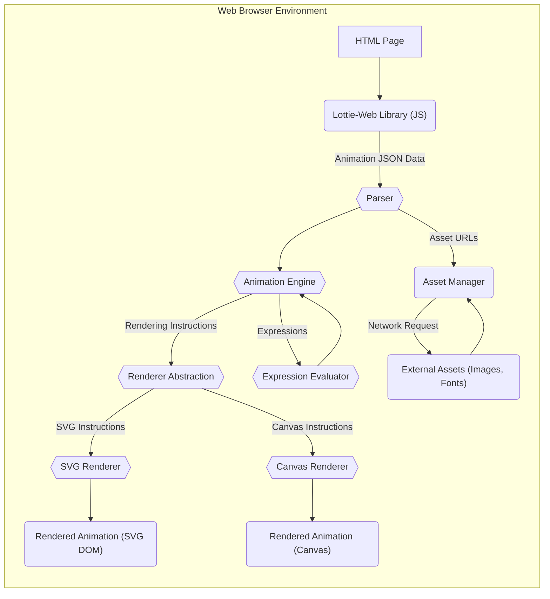

# Lottie-Web Project Design Document for Threat Modeling

**Version:** 1.1
**Date:** October 26, 2023
**Author:** AI Software Architect

## 1. Introduction

This document outlines the design of the Lottie-Web project, a JavaScript library that renders Adobe After Effects animations natively on the web. This document is specifically tailored for threat modeling, focusing on the architecture, data flow, and potential security vulnerabilities. It aims to provide a comprehensive understanding of the system's components and their interactions to facilitate the identification of potential threats and inform security mitigation strategies.

## 2. Goals

*   Provide a clear and concise description of the Lottie-Web architecture relevant for security analysis.
*   Identify key components, their functionalities, and their interactions.
*   Map the complete data flow within the system, highlighting trust boundaries.
*   Detail potential security threats associated with each component and data flow.
*   Serve as a foundational document for conducting thorough threat modeling exercises.
*   Inform the development of secure coding practices and security testing strategies.

## 3. Target Audience

This document is intended for:

*   Security engineers and architects responsible for threat modeling and security assessments.
*   Software developers contributing to or integrating Lottie-Web.
*   Quality assurance engineers involved in security testing.
*   Anyone requiring a deep understanding of Lottie-Web's security architecture.

## 4. System Overview

Lottie-Web is a client-side JavaScript library that interprets animation data exported from Adobe After Effects (typically in JSON format) and renders these animations within a web browser. The rendering process utilizes either Scalable Vector Graphics (SVG) or the HTML5 Canvas API. The core functionality involves parsing the JSON, interpreting animation instructions, and dynamically manipulating the Document Object Model (DOM) or Canvas drawing context to produce the animated visuals.

## 5. Architectural Design

The Lottie-Web architecture comprises the following key components, along with their primary responsibilities and interactions:

*   **Core Library (JavaScript):** The central component responsible for the entire animation rendering lifecycle. It consists of several modules:
    *   **Parser:**  Responsible for reading and interpreting the JSON animation data. This involves validating the structure and extracting animation parameters.
    *   **Animation Engine:** Manages the animation timeline, interpolation of values between keyframes, and orchestrates the rendering process.
    *   **Renderer Abstraction:** Provides an interface for different rendering mechanisms (SVG and Canvas), allowing the core logic to be independent of the specific rendering technology.
    *   **SVG Renderer:** Implements the rendering logic using SVG elements and DOM manipulation. It translates animation instructions into SVG commands and attributes.
    *   **Canvas Renderer:** Implements the rendering logic using the HTML5 Canvas API. It translates animation instructions into drawing operations on the canvas context.
    *   **Asset Manager:** Handles the loading and management of external assets referenced in the animation data, such as images and fonts.
    *   **Expression Evaluator:**  Interprets and executes JavaScript-like expressions embedded within the After Effects animation data (with limitations).
*   **Animation Data (JSON):** The structured input that defines the animation. It contains:
    *   **Composition Data:** Overall animation settings like dimensions, frame rate, and duration.
    *   **Layer Data:** Information about individual layers, including their type (shape, image, text), properties, and transformations.
    *   **Shape Data:** Defines the geometry of vector shapes using paths, points, and Bezier curves.
    *   **Keyframe Data:** Specifies property values at specific points in time, defining the animation's motion.
    *   **Asset References:** URLs or paths to external images and font files.
    *   **Expressions:** Optional JavaScript-like code snippets that can dynamically control layer properties.
*   **Host Environment (Web Browser):** The execution environment for Lottie-Web, providing essential services:
    *   **JavaScript Engine:** Executes the Lottie-Web JavaScript code.
    *   **DOM (Document Object Model):**  Used by the SVG renderer to create and manipulate SVG elements.
    *   **Canvas API:** Used by the Canvas renderer for drawing operations.
    *   **Network Stack:** Facilitates fetching external assets.
    *   **Local Storage/Cache:** Potentially used by the browser for caching animation data or assets.
*   **External Assets (Images, Fonts):**  Resources referenced by the animation data, loaded from external sources.

## 6. Data Flow

The following diagram illustrates the typical data flow involved in rendering a Lottie animation:

Detailed steps of the data flow:

*   The web page loads the Lottie-Web JavaScript library.
*   The application code provides the animation data (JSON) to the Lottie-Web library, either embedded directly or fetched from a source.
*   The **Parser** module within the core library receives the JSON data and begins the parsing and validation process.
*   The parsed data is passed to the **Animation Engine**, which manages the animation timeline and determines the state of the animation at each frame.
*   The **Animation Engine** interacts with the **Renderer Abstraction** layer to initiate the rendering process.
*   Based on the configured renderer (SVG or Canvas), the **Renderer Abstraction** directs the rendering instructions to the appropriate renderer.
*   The **SVG Renderer** manipulates the browser's DOM, creating and updating SVG elements based on the animation instructions.
*   The **Canvas Renderer** uses the Canvas API to draw shapes, images, and text onto the canvas element.
*   If the animation data contains references to external assets, the **Parser** identifies these URLs, and the **Asset Manager** initiates network requests to fetch these assets.
*   Fetched external assets are then used by the respective renderers during the rendering process.
*   If the animation data includes expressions, the **Animation Engine** utilizes the **Expression Evaluator** to calculate dynamic property values.
*   The final rendered animation is displayed within the web browser.

## 7. Security Considerations

The following section details potential security threats associated with Lottie-Web, categorized for clarity:

*   **Threat Category: Malicious Animation Data (JSON Injection)**
    *   **Threat:**  Providing maliciously crafted JSON animation data to Lottie-Web.
    *   **Description:**  An attacker could provide specially crafted JSON that exploits vulnerabilities in the parser, animation engine, or renderers.
    *   **Potential Impacts:**
        *   **Denial of Service (DoS):**  Crafting excessively complex animations leading to excessive CPU or memory consumption, causing the browser or page to become unresponsive.
        *   **Client-Side Resource Exhaustion:**  Animations with a large number of layers, complex shapes, or excessive keyframes can strain client-side resources.
        *   **Exploiting Parser Vulnerabilities:**  Maliciously formed JSON could trigger bugs in the parsing logic, potentially leading to unexpected behavior or even code execution (though less likely in a sandboxed browser environment).
        *   **Logic Bugs:**  Crafted data could trigger unexpected states or behaviors in the animation engine, leading to incorrect rendering or application logic errors.
    *   **Mitigation Strategies:**
        *   **Input Validation and Sanitization:** Implement strict validation of the animation JSON data on the server-side before it reaches the client.
        *   **Resource Limits:**  Consider implementing client-side limits on the complexity of animations (e.g., maximum number of layers, shapes).
        *   **Regular Security Audits:** Conduct regular security audits of the Lottie-Web codebase, particularly the parsing and rendering logic.

*   **Threat Category: External Asset Handling**
    *   **Threat:**  Malicious or compromised external assets referenced in the animation data.
    *   **Description:**  If the animation JSON references external images or fonts from untrusted sources, these assets could be malicious.
    *   **Potential Impacts:**
        *   **Cross-Site Scripting (XSS):** If an attacker can control the URL of an image asset, they might be able to serve an SVG image containing malicious JavaScript that executes in the context of the website.
        *   **Information Disclosure:**  Malicious assets could attempt to exfiltrate data from the user's browser.
        *   **Malware Delivery:**  Although less likely with image assets, compromised servers could potentially serve other types of malicious content.
    *   **Mitigation Strategies:**
        *   **Content Security Policy (CSP):** Implement a strong CSP to restrict the sources from which the browser can load assets.
        *   **Subresource Integrity (SRI):** Use SRI tags to ensure that fetched assets have not been tampered with.
        *   **HTTPS Enforcement:** Ensure all asset URLs use HTTPS to prevent man-in-the-middle attacks.
        *   **Asset Validation:**  If possible, validate the integrity and expected type of fetched assets.

*   **Threat Category: Renderer-Specific Vulnerabilities**
    *   **Threat:**  Security vulnerabilities within the SVG or Canvas rendering implementations.
    *   **Description:**  Bugs or weaknesses in how the renderers handle animation instructions could be exploited.
    *   **Potential Impacts:**
        *   **Cross-Site Scripting (XSS) via SVG:**  If the SVG renderer doesn't properly sanitize animation data, attacker-controlled data could be injected into the rendered SVG, leading to XSS.
        *   **Canvas API Exploits:**  Although less common, vulnerabilities in the browser's Canvas API implementation could be triggered by specific drawing operations.
    *   **Mitigation Strategies:**
        *   **Regularly Update Browsers:** Encourage users to keep their browsers up to date to patch known vulnerabilities.
        *   **Security Reviews of Rendering Logic:**  Focus security reviews on the code responsible for translating animation data into SVG or Canvas commands.

*   **Threat Category: Expression Engine Security**
    *   **Threat:**  Abuse of the expression evaluation functionality.
    *   **Description:**  While Lottie-Web's expression engine has limitations, vulnerabilities in its implementation could allow attackers to execute unintended code or cause unexpected behavior.
    *   **Potential Impacts:**
        *   **Logic Manipulation:**  Malicious expressions could alter the intended animation behavior in unexpected ways.
        *   **Resource Exhaustion:**  Complex or poorly written expressions could lead to performance issues or crashes.
    *   **Mitigation Strategies:**
        *   **Strict Sandboxing:** Ensure the expression evaluator operates within a tightly controlled sandbox with limited access to the browser environment.
        *   **Input Validation for Expressions:**  If possible, validate or sanitize expressions before evaluation.
        *   **Disable Expressions:**  Provide an option to disable expression evaluation if it's not a critical feature.

*   **Threat Category: Dependency Vulnerabilities**
    *   **Threat:**  Vulnerabilities in third-party libraries used by Lottie-Web.
    *   **Description:**  Lottie-Web may rely on other JavaScript libraries, and vulnerabilities in these dependencies could indirectly affect Lottie-Web's security.
    *   **Potential Impacts:**  The impact depends on the specific vulnerability in the dependency.
    *   **Mitigation Strategies:**
        *   **Regular Dependency Updates:** Keep all dependencies up to date with the latest security patches.
        *   **Software Composition Analysis (SCA):** Use SCA tools to identify and track known vulnerabilities in dependencies.

## 8. Deployment Considerations

Secure deployment practices are crucial for mitigating risks associated with Lottie-Web:

*   **Serving over HTTPS:**  Always serve the web page and Lottie-Web library over HTTPS to protect against man-in-the-middle attacks.
*   **Content Security Policy (CSP):** Implement a restrictive CSP to control the resources the browser is allowed to load, mitigating the risk of malicious external assets.
*   **Subresource Integrity (SRI):** Use SRI tags when including the Lottie-Web library to ensure its integrity.
*   **Input Sanitization:**  Thoroughly sanitize and validate animation data on the server-side before serving it to the client.
*   **Regular Security Updates:** Keep the Lottie-Web library updated to benefit from bug fixes and security patches.

## 9. Future Considerations

*   **Enhanced Sandboxing for Expressions:** Explore more robust sandboxing techniques for the expression evaluator.
*   **Formal Security Audits:** Conduct regular professional security audits and penetration testing.
*   **Client-Side Integrity Checks:**  Investigate methods for verifying the integrity of the Lottie-Web library on the client-side.
*   **Consider a "Safe Mode":**  Potentially offer a configuration option to disable features like expressions or external asset loading for environments with heightened security concerns.

## 10. Conclusion

This design document provides a detailed architectural overview of Lottie-Web, specifically focusing on aspects relevant to threat modeling. By understanding the components, data flow, and potential security considerations outlined in this document, security engineers and developers can effectively identify and mitigate potential risks associated with using Lottie-Web in web applications. This document serves as a crucial foundation for building secure applications that leverage the capabilities of Lottie animations.