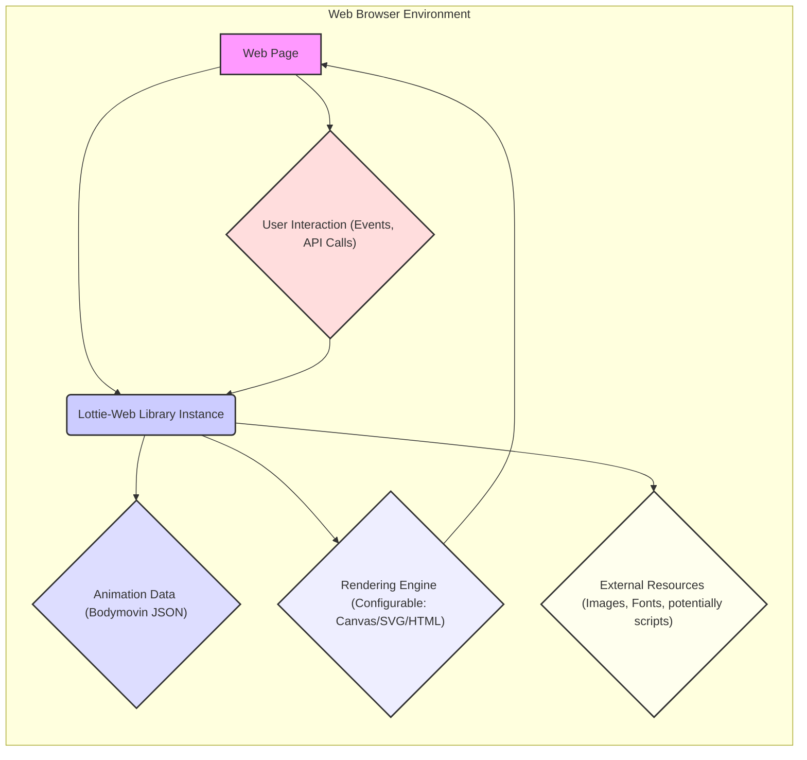
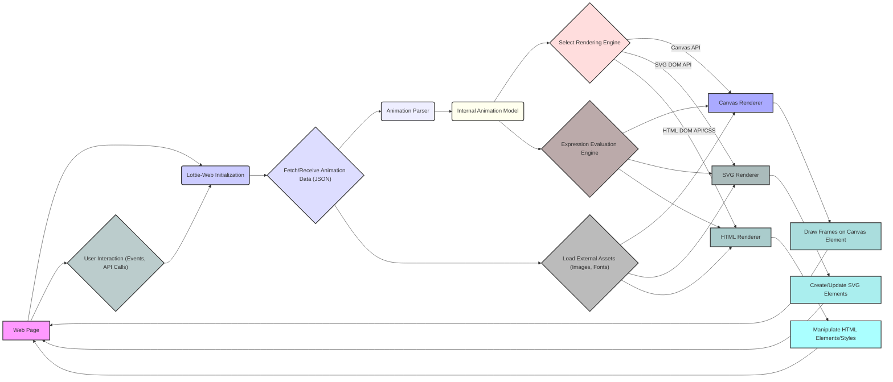

# Project Design Document: Lottie-Web

**Version:** 1.1
**Date:** October 26, 2023
**Author:** AI Software Architect

## 1. Introduction

This document provides an enhanced and more detailed design overview of the Lottie-Web project, an open-source JavaScript library that renders Adobe After Effects animations natively on web and mobile. This document is specifically tailored to serve as a robust foundation for subsequent threat modeling activities. It meticulously outlines the key components, data flow, interactions, and potential security considerations within the Lottie-Web ecosystem.

## 2. Goals and Objectives

*   Provide a comprehensive and in-depth architectural overview of Lottie-Web.
*   Clearly identify key components, their specific responsibilities, and their interactions.
*   Thoroughly describe the data flow within the system, highlighting potential transformation and access points.
*   Explicitly highlight potential areas of interest and specific threats relevant for security analysis and threat modeling.
*   Serve as a definitive and easily understandable reference point for understanding the system's inner workings, particularly from a security perspective.

## 3. System Overview

Lottie-Web is a client-side JavaScript library that interprets animation data exported from Adobe After Effects (in JSON format, often referred to as Bodymovin JSON) and renders these animations within a web browser environment. It achieves this rendering using various browser APIs, primarily Canvas, SVG, and to a lesser extent, HTML. The core functionality involves a multi-stage process: loading the JSON animation data, parsing its structure, interpreting the animation instructions, and finally, drawing the animation frames using the selected rendering technique.

## 4. Architectural Design

### 4.1. High-Level Architecture

**Description:**

*   **"Web Page"**: The HTML document where the Lottie animation is integrated and rendered. This page hosts the Lottie-Web library.
*   **"Lottie-Web Library Instance"**: A running instance of the Lottie-Web JavaScript library within the web page's context. This is the central orchestrator of the animation rendering process.
*   **"Animation Data (Bodymovin JSON)"**: The JSON file containing the animation instructions, exported from Adobe After Effects using the Bodymovin plugin. This data dictates the animation's content and behavior.
*   **"Rendering Engine (Configurable: Canvas/SVG/HTML)"**: The browser API utilized by Lottie-Web to visually represent the animation. The choice of engine is often configurable during initialization, impacting performance and features.
*   **"External Resources (Images, Fonts, potentially scripts)"**: Optional external assets referenced within the animation data. These can include image files, custom fonts, or even, in some scenarios, references to external scripts (though less common and a significant security concern).
*   **"User Interaction (Events, API Calls)"**: Actions initiated by the user (e.g., mouse movements, clicks, keyboard input) or through programmatic API calls that can control the animation's playback, speed, or other properties.

### 4.2. Component Breakdown

*   **`lottie.js` (or the main library file):**
    *   Serves as the primary entry point for the library.
    *   Handles the initial setup and configuration of the animation instance.
    *   Provides the public API for developers to load, play, pause, and control animations.
    *   Manages the overall lifecycle of an animation.
*   **`core/animationParser.js`:**
    *   Crucially responsible for parsing the Bodymovin JSON animation data.
    *   Transforms the raw JSON structure into an internal, object-based representation that the rendering engine can understand.
    *   Handles different versions and complexities of the Bodymovin JSON format, including handling potentially malformed or unexpected data.
*   **`render/` directory:**
    *   Contains the implementations for different rendering strategies:
        *   **`render/canvas/`**: Implements rendering using the HTML5 Canvas API. This involves drawing shapes and paths directly onto the canvas element.
        *   **`render/svg/`**: Implements rendering by creating and manipulating SVG (Scalable Vector Graphics) elements in the DOM.
        *   **`render/html/`**: A less common renderer that uses standard HTML elements and CSS transformations to represent the animation.
    *   Each renderer interprets the internal animation representation and translates it into visual output using its respective browser API.
*   **`expression/` directory:**
    *   Handles the evaluation of expressions embedded within the animation data.
    *   Allows for dynamic and procedural animation properties, where values can change based on calculations or other factors.
    *   This component is a significant area for potential security vulnerabilities if expressions are not handled carefully.
*   **`shapes/` directory:**
    *   Defines classes and logic for representing various geometric shapes (e.g., rectangles, circles, paths, polygons) used in animations.
    *   Provides the building blocks for the renderers to draw the visual elements of the animation.
*   **`layers/` directory:**
    *   Manages the concept of layers within the animation, similar to layers in After Effects.
    *   Handles layer transformations (position, scale, rotation), masking, and applying effects to individual layers.
*   **`utils/common.js` (and other utility files):**
    *   Contains a collection of utility functions used throughout the library.
    *   Examples include mathematical functions, color manipulation routines, and helper functions for DOM manipulation.
*   **`assets/` directory (and related asset handling logic):**
    *   Manages the loading and referencing of external assets, such as images and fonts, that are referenced by the animation data.
    *   This component is critical for security, as it deals with loading resources from potentially untrusted sources.

### 4.3. Data Flow Diagram

**Description:**

1. The "Web Page" initiates the "Lottie-Web Initialization" process, typically by including the library's JavaScript file.
2. The library then "Fetch/Receive Animation Data (JSON)" from a specified source (e.g., a local file, a remote URL, or an embedded JavaScript object).
3. The "Animation Parser" takes the raw JSON data and transforms it into an "Internal Animation Model," a structured representation of the animation's elements and properties.
4. Based on configuration or browser capabilities, the system "Select Rendering Engine" (Canvas, SVG, or HTML).
5. The chosen renderer (e.g., "Canvas Renderer") utilizes the corresponding browser API (e.g., "Canvas API") to visually represent the animation:
    *   "Canvas Renderer" "Draw Frames on Canvas Element".
    *   "SVG Renderer" "Create/Update SVG Elements" in the DOM.
    *   "HTML Renderer" "Manipulate HTML Elements/Styles".
6. The "Expression Evaluation Engine" dynamically calculates property values based on expressions within the "Internal Animation Model," influencing the rendering process.
7. The library may also "Load External Assets (Images, Fonts)" as specified in the animation data.
8. "User Interaction (Events, API Calls)" can trigger changes or control the animation through the "Lottie-Web Initialization" instance.

## 5. Security Considerations for Threat Modeling

This section provides a more detailed breakdown of potential security threats and vulnerabilities relevant to Lottie-Web.

*   **Cross-Site Scripting (XSS) via Malicious Animation Data:**
    *   **Threat:** If the source of the "Animation Data (JSON)" is untrusted or user-provided, it could contain malicious payloads. This is especially critical in scenarios where users can upload or provide their own animation files.
    *   **Vulnerability:**  Exploitation could occur through:
        *   **Script injection in expressions:** Malicious JavaScript code embedded within animation expressions.
        *   **Malicious external asset paths:**  Pointing to external resources that execute scripts or serve malicious content.
        *   **Exploiting vulnerabilities in the parsing logic:** Crafting JSON data that causes the parser to behave unexpectedly, potentially leading to code execution.
    *   **Mitigation Strategies:**
        *   Strictly control the source of animation data.
        *   Implement robust input validation and sanitization of the JSON data.
        *   Consider sandboxing or isolating the rendering environment.
        *   Carefully review and potentially disable or restrict the use of expressions, especially when handling untrusted data.
*   **Supply Chain Attacks:**
    *   **Threat:**  Compromise of dependencies used by Lottie-Web could introduce vulnerabilities.
    *   **Vulnerability:**  Malicious code injected into a dependency could be executed within the context of the web page.
    *   **Mitigation Strategies:**
        *   Regularly audit and update dependencies.
        *   Use dependency scanning tools to identify known vulnerabilities.
        *   Consider using a Software Bill of Materials (SBOM).
*   **Data Integrity and Man-in-the-Middle Attacks:**
    *   **Threat:** If animation data or external assets are fetched over an insecure connection (HTTP), they could be intercepted and tampered with.
    *   **Vulnerability:**  An attacker could modify the animation data or replace assets with malicious ones.
    *   **Mitigation Strategies:**
        *   Always serve animation data and assets over HTTPS.
        *   Consider using Content Integrity (SRI) hashes to verify the integrity of fetched resources.
*   **Denial of Service (DoS) through Complex Animations:**
    *   **Threat:**  Maliciously crafted or excessively complex animation data could consume excessive browser resources (CPU, memory), leading to performance degradation or a complete denial of service for the user.
    *   **Vulnerability:**  Exploiting inefficient rendering logic or creating animations with an extremely high number of elements or complex expressions.
    *   **Mitigation Strategies:**
        *   Implement limits on animation complexity or resource consumption.
        *   Consider server-side validation of animation data before serving it to the client.
*   **Prototype Pollution:**
    *   **Threat:**  Exploiting vulnerabilities in how the library handles object properties during JSON parsing could allow an attacker to modify the prototypes of built-in JavaScript objects, potentially leading to arbitrary code execution.
    *   **Vulnerability:**  Manipulating the JSON data to inject properties into object prototypes.
    *   **Mitigation Strategies:**
        *   Carefully review and secure the JSON parsing logic.
        *   Avoid using `eval()` or similar dangerous functions.
        *   Implement safeguards against modifying object prototypes.
*   **Regular Expression Denial of Service (ReDoS):**
    *   **Threat:** If regular expressions are used for parsing or validating animation data, a carefully crafted input could cause the regex engine to take an extremely long time to process, leading to a denial of service.
    *   **Vulnerability:**  Using vulnerable regular expressions that exhibit exponential backtracking.
    *   **Mitigation Strategies:**
        *   Carefully review and test all regular expressions used in the library.
        *   Avoid overly complex or nested regular expressions.
        *   Consider using alternative parsing techniques if regular expressions are a significant risk.
*   **Content Security Policy (CSP) Bypasses:**
    *   **Threat:**  If Lottie-Web relies on techniques that are restricted by a strict CSP (e.g., `unsafe-inline` for scripts or styles), it could either fail to render correctly or provide an avenue for bypassing the CSP.
    *   **Vulnerability:**  Reliance on inline scripts, styles, or `eval()`.
    *   **Mitigation Strategies:**
        *   Ensure Lottie-Web is compatible with strict CSP configurations.
        *   Avoid the use of inline scripts and styles.
        *   Use nonces or hashes for allowed inline resources if absolutely necessary.

## 6. Deployment Considerations

Lottie-Web is primarily a client-side library and is typically deployed as a static JavaScript file integrated into web pages.

*   **CDN (Content Delivery Network):**  A common and recommended approach for deploying Lottie-Web. CDNs offer benefits like improved loading times, caching, and geographical distribution. Ensure the CDN used is reputable and secure.
*   **Bundled with Application Assets:** The library can be included directly within the application's asset bundle, which is suitable for applications with specific versioning or customization needs.
*   **Self-Hosted:** Hosting the library on the application's own servers provides maximum control but requires careful management and security considerations.

## 7. Future Considerations

*   **Enhanced Security Audits:**  Regular security audits and penetration testing are crucial for identifying and addressing potential vulnerabilities.
*   **Subresource Integrity (SRI) by Default:**  Encouraging or enforcing the use of SRI hashes for Lottie-Web files when included from CDNs.
*   **WebAssembly (Wasm) for Performance and Security:** Exploring the use of WebAssembly for performance-critical parts of the rendering process, potentially offering a more secure execution environment for certain operations.
*   **Formal Security Review Process:** Establishing a formal process for reviewing security implications of new features and changes.

## 8. Conclusion

This enhanced design document provides a comprehensive and security-focused overview of the Lottie-Web project. By detailing its architecture, components, data flow, and critically, its potential security considerations, this document serves as a valuable resource for threat modeling and security analysis. Understanding these aspects is essential for building secure applications that leverage the capabilities of Lottie-Web.