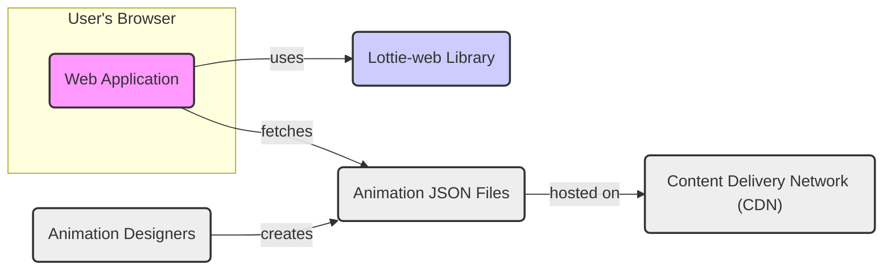
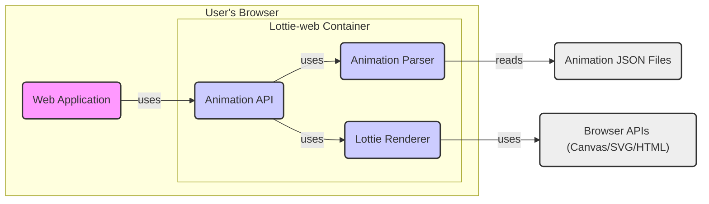
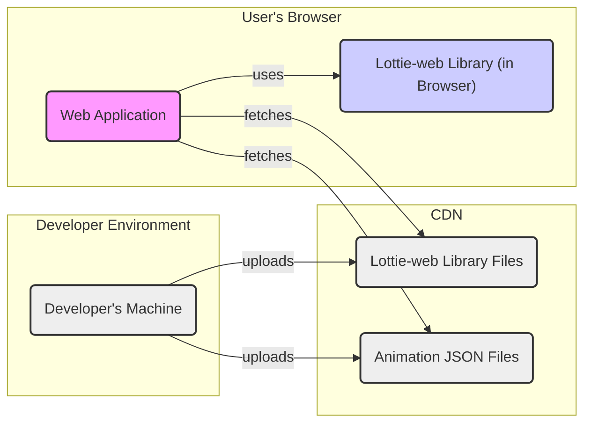

# BUSINESS POSTURE

The Lottie-web project is a Javascript library that renders After Effects animations natively on Web, Android, iOS, and React Native. It uses JSON files exported from After Effects with Bodymovin/Lottie.

Business Priorities and Goals:
- Enhance user interface and user experience of web and mobile applications by enabling the use of high-quality vector animations.
- Improve user engagement and visual appeal of digital products.
- Provide a cross-platform solution for animation rendering, reducing development effort and ensuring consistency across different platforms.
- Enable designers to create complex animations using familiar tools (After Effects) and easily integrate them into applications.
- Improve website and application performance compared to traditional animation methods (e.g., GIFs, videos) due to vector-based rendering and smaller file sizes.

Most Important Business Risks:
- Performance impact: Incorrectly implemented or overly complex animations could negatively impact application performance, leading to a poor user experience.
- Compatibility issues: The library might not be compatible with all browsers or devices, leading to inconsistent animation rendering or application crashes.
- Dependency vulnerabilities: The library relies on Javascript and potentially other dependencies, which could introduce security vulnerabilities if not properly managed and updated.
- Supply chain risks: Compromised build or distribution processes could lead to the delivery of a malicious version of the library.
- Input validation vulnerabilities: Processing maliciously crafted animation files could lead to client-side vulnerabilities, such as Cross-Site Scripting (XSS) if the library is not robust against malicious inputs.

# SECURITY POSTURE

Existing Security Controls:
- security control: Use of GitHub for version control and collaboration, providing transparency and history of changes. (Implemented in: GitHub repository)
- security control: Open-source nature of the project allows for community review and contribution, potentially leading to faster identification and resolution of security issues. (Implemented in: Open GitHub repository)
- security control: Standard web security practices applied by developers using the library in their applications (e.g., Content Security Policy, input sanitization in application code). (Implemented in: Dependent applications)

Accepted Risks:
- accepted risk: Reliance on client-side security measures, as the library operates within the user's browser environment.
- accepted risk: Potential vulnerabilities in third-party dependencies, which require ongoing monitoring and updates.
- accepted risk: Risk of misuse by developers who might not implement animations securely or efficiently, leading to performance or security issues in their applications.

Recommended Security Controls:
- security control: Implement automated security scanning (SAST and dependency scanning) in the build process to identify potential vulnerabilities in the code and dependencies.
- security control: Establish a clear process for reporting and handling security vulnerabilities, including a security policy and contact information.
- security control: Provide security guidelines and best practices for developers using the library, focusing on secure animation creation and integration.
- security control: Regularly update dependencies to patch known vulnerabilities.
- security control: Implement input validation within the library to handle potentially malicious animation files and prevent client-side vulnerabilities.

Security Requirements:
- Authentication: Not directly applicable to the library itself, as it's a client-side rendering engine. Authentication is the responsibility of the applications using the library.
- Authorization: Not directly applicable to the library itself. Authorization is the responsibility of the applications using the library to control access to animations and application features.
- Input Validation: Critical for the library. The library must validate the structure and content of animation JSON files to prevent processing of malicious or malformed data that could lead to vulnerabilities (e.g., XSS, denial of service). Input validation should focus on:
    - JSON schema validation to ensure the animation file conforms to the expected structure.
    - Range checks and sanitization of animation data to prevent unexpected behavior or exploits.
    - Handling of potentially malicious data within animation properties (e.g., embedded scripts or URLs).
- Cryptography: Not directly required for the core functionality of the library, which is animation rendering. However, if future features involve handling sensitive data or secure communication, cryptographic measures might be necessary. For now, it's not a primary security requirement for the library itself.

# DESIGN

## C4 CONTEXT



Context Diagram Elements:

- Element:
    - Name: Web Application
    - Type: Software System
    - Description: A web application that integrates the Lottie-web library to display animations. This could be any website or web-based application.
    - Responsibilities:
        - Integrate the Lottie-web library into its codebase.
        - Fetch animation JSON files from a source (e.g., CDN, local storage).
        - Initialize and control animation playback using the Lottie-web API.
        - Implement application-level security controls, such as Content Security Policy (CSP) to mitigate XSS risks.
    - Security controls:
        - security control: Content Security Policy (CSP) to restrict the sources from which resources can be loaded, mitigating XSS risks. (Implemented in: Web Application)
        - security control: Input sanitization and output encoding in other parts of the web application to prevent vulnerabilities that could be exploited through animation interactions. (Implemented in: Web Application)

- Element:
    - Name: Lottie-web Library
    - Type: Software System / Library
    - Description: The Lottie-web Javascript library, responsible for parsing and rendering animation JSON files in web browsers.
    - Responsibilities:
        - Parse animation JSON files.
        - Render vector animations using browser APIs (Canvas, SVG, HTML).
        - Provide an API for controlling animation playback (play, pause, stop, loop, etc.).
        - Handle different animation features and complexities defined in the Lottie format.
        - Ensure efficient and performant animation rendering in web browsers.
        - Implement input validation to handle potentially malicious animation files.
    - Security controls:
        - security control: Input validation of animation JSON files to prevent processing of malicious or malformed data. (To be implemented in: Lottie-web Library)
        - security control: Regular updates to address identified vulnerabilities and improve security. (Implemented in: Lottie-web Library development process)

- Element:
    - Name: Animation JSON Files
    - Type: Data
    - Description: JSON files containing animation data exported from After Effects using the Bodymovin/Lottie plugin. These files are the input for the Lottie-web library.
    - Responsibilities:
        - Store animation data in a structured JSON format.
        - Define animation properties, keyframes, and assets.
        - Be accessible to web applications for fetching and rendering.
    - Security controls:
        - security control: Secure storage and delivery of animation JSON files to prevent unauthorized modification or access. (Implemented in: CDN and Web Application infrastructure)
        - security control: Content integrity checks (e.g., checksums) to ensure animation files are not tampered with during delivery. (Can be implemented in: CDN and Web Application)

- Element:
    - Name: Content Delivery Network (CDN)
    - Type: Infrastructure
    - Description: A CDN used to host and distribute animation JSON files to web applications globally.
    - Responsibilities:
        - Host animation JSON files.
        - Provide fast and reliable delivery of animation files to web applications.
        - Ensure scalability and availability of animation files.
        - Potentially provide caching and optimization for animation file delivery.
    - Security controls:
        - security control: Access control to prevent unauthorized modification or deletion of animation files. (Implemented in: CDN infrastructure)
        - security control: HTTPS for secure delivery of animation files to protect data in transit. (Implemented in: CDN infrastructure)

- Element:
    - Name: Animation Designers
    - Type: Person / Role
    - Description: Designers who create animations using After Effects and export them as JSON files using the Bodymovin/Lottie plugin.
    - Responsibilities:
        - Design and create visually appealing and performant animations.
        - Export animations in the Lottie JSON format.
        - Potentially optimize animations for web performance.
        - Adhere to security guidelines when creating animations to avoid introducing potential vulnerabilities (e.g., avoid embedding external links or scripts within animations if possible).
    - Security controls:
        - security control: Training and awareness for designers on secure animation design practices. (To be implemented by: Organizations using Lottie-web)
        - security control: Review process for animation files to identify and mitigate potential security risks before deployment. (To be implemented by: Organizations using Lottie-web)

## C4 CONTAINER



Container Diagram Elements:

- Element:
    - Name: Web Application
    - Type: Software System
    - Description: Same as in the Context Diagram. The web application that embeds and uses the Lottie-web library.
    - Responsibilities: Same as in the Context Diagram.
    - Security controls: Same as in the Context Diagram.

- Element:
    - Name: Lottie Renderer
    - Type: Container / Component
    - Description: The core rendering engine of Lottie-web. It takes parsed animation data and uses browser APIs (Canvas, SVG, or HTML) to draw the animation frames in the browser.
    - Responsibilities:
        - Interpret animation data.
        - Draw animation frames using browser rendering APIs.
        - Optimize rendering performance.
        - Handle different animation features and effects.
    - Security controls:
        - security control: Secure coding practices to prevent vulnerabilities in the rendering logic. (Implemented in: Lottie-web Library development)
        - security control: Resource management to prevent denial-of-service conditions due to overly complex animations. (Implemented in: Lottie-web Library development)

- Element:
    - Name: Animation Parser
    - Type: Container / Component
    - Description: Responsible for parsing the animation JSON files and converting them into an internal data structure that the Lottie Renderer can understand.
    - Responsibilities:
        - Read and parse JSON animation files.
        - Validate the structure and data within the JSON files.
        - Convert JSON data into an internal animation data model.
        - Handle errors during parsing.
        - Implement input validation to detect and reject malicious or malformed animation files.
    - Security controls:
        - security control: Input validation logic to ensure animation files conform to the expected schema and data types. (Implemented in: Animation Parser component)
        - security control: Error handling to gracefully handle invalid or malicious input without crashing or exposing sensitive information. (Implemented in: Animation Parser component)

- Element:
    - Name: Animation API
    - Type: Container / Component
    - Description: The Javascript API exposed by Lottie-web that web applications use to interact with the library. This API provides functions to load animations, control playback, and access animation properties.
    - Responsibilities:
        - Provide a user-friendly Javascript API for web developers.
        - Manage the lifecycle of animations.
        - Expose controls for animation playback (play, pause, stop, loop, etc.).
        - Allow access to animation properties and events.
        - Serve as the entry point for web applications to use Lottie-web functionality.
    - Security controls:
        - security control: API design that minimizes the risk of misuse or unintended side effects. (Implemented in: Lottie-web Library design)
        - security control: Clear documentation and examples to guide developers on secure and correct usage of the API. (Implemented in: Lottie-web documentation)

- Element:
    - Name: Animation JSON Files
    - Type: Data
    - Description: Same as in the Context Diagram.
    - Responsibilities: Same as in the Context Diagram.
    - Security controls: Same as in the Context Diagram.

- Element:
    - Name: Browser APIs (Canvas/SVG/HTML)
    - Type: Infrastructure / Platform API
    - Description: The web browser's built-in APIs used by Lottie-web to render graphics. These include Canvas, SVG, and HTML rendering capabilities.
    - Responsibilities:
        - Provide low-level graphics rendering capabilities.
        - Handle browser-specific rendering optimizations.
        - Enforce browser security policies and sandboxing.
    - Security controls:
        - security control: Browser security model and sandboxing to isolate web applications and prevent malicious code from accessing system resources. (Implemented in: Web Browsers)
        - security control: Regular browser updates to patch security vulnerabilities in browser APIs. (Implemented by: Browser vendors)

## DEPLOYMENT

Deployment Architecture: Client-Side Deployment

Lottie-web is primarily a client-side library, so its deployment is focused on how it's integrated and delivered to web browsers. The typical deployment scenario involves:

1. **Hosting Lottie-web Library Files**: The Lottie-web Javascript files (lottie.js or similar) are hosted on a web server or CDN.
2. **Embedding in Web Application**: Web application developers include the Lottie-web library in their HTML pages using `<script>` tags.
3. **Hosting Animation JSON Files**: Animation JSON files are hosted on a web server or CDN, accessible via URLs.
4. **Fetching and Rendering**: When a user accesses the web application, the browser downloads the Lottie-web library and animation JSON files. The web application's Javascript code uses Lottie-web to fetch the animation files and render them in the browser.



Deployment Diagram Elements:

- Element:
    - Name: Developer's Machine
    - Type: Environment
    - Description: The development environment where Lottie-web library files and animation JSON files are prepared and uploaded to the CDN.
    - Responsibilities:
        - Development and testing of Lottie-web library (for library developers).
        - Creation and export of animation JSON files (for animation designers).
        - Uploading library files and animation files to the CDN.
    - Security controls:
        - security control: Secure development practices on developer machines to prevent malware or unauthorized access. (Implemented by: Developers and Designers)
        - security control: Access control and authentication for uploading files to the CDN. (Implemented in: CDN infrastructure)

- Element:
    - Name: CDN (Content Delivery Network)
    - Type: Infrastructure
    - Description: Same as in the Context Diagram. Hosts and delivers Lottie-web library files and animation JSON files.
    - Responsibilities: Same as in the Context Diagram.
    - Security controls: Same as in the Context Diagram.

- Element:
    - Name: Lottie-web Library Files (on CDN)
    - Type: Software Artifact
    - Description: The compiled and minified Javascript files of the Lottie-web library, hosted on the CDN.
    - Responsibilities:
        - Provide the Lottie-web library code to web applications.
        - Ensure availability and fast delivery of the library files.
    - Security controls:
        - security control: Integrity checks (e.g., checksums, SRI) to ensure the library files downloaded by browsers are not tampered with. (Can be implemented in: CDN and Web Application)
        - security control: HTTPS for secure delivery of library files. (Implemented in: CDN infrastructure)

- Element:
    - Name: Animation JSON Files (on CDN)
    - Type: Data
    - Description: Same as in the Context Diagram. Hosted on the CDN.
    - Responsibilities: Same as in the Context Diagram.
    - Security controls: Same as in the Context Diagram.

- Element:
    - Name: Web Application (in User's Browser)
    - Type: Software System
    - Description: Same as in the Context Diagram. Running in the user's web browser.
    - Responsibilities: Same as in the Context Diagram.
    - Security controls: Same as in the Context Diagram.

- Element:
    - Name: Lottie-web Library (in Browser)
    - Type: Software System / Library
    - Description: The Lottie-web library loaded and running within the user's web browser, as part of the web application.
    - Responsibilities: Same as in the Container Diagram (Lottie Renderer, Animation Parser, Animation API).
    - Security controls: Same as in the Container Diagram (Lottie Renderer, Animation Parser, Animation API).

## BUILD

Build Process: GitHub Actions based CI/CD

The Lottie-web project uses GitHub Actions for its build and release process. The typical build process involves:

1. **Code Changes**: Developers commit and push code changes to the GitHub repository.
2. **GitHub Actions Trigger**: Pushing code changes triggers GitHub Actions workflows defined in `.github/workflows`.
3. **Build Environment**: GitHub Actions spins up a virtual environment (e.g., Node.js environment).
4. **Build Steps**: The workflow executes build steps, including:
    - Checking out the code.
    - Setting up Node.js environment.
    - Installing dependencies (using npm or yarn).
    - Running linters and code formatters.
    - Running unit tests.
    - Building the library (e.g., using Webpack or Rollup).
    - Minifying and optimizing the build artifacts.
    - Potentially running security scans (SAST, dependency checks - recommended).
5. **Artifact Upload**: Build artifacts (e.g., lottie.js, CSS files, distribution packages) are uploaded as GitHub Actions artifacts.
6. **Release (Optional)**: Upon tagging a release, a GitHub Actions workflow can be triggered to:
    - Publish the build artifacts to npm or other package registries.
    - Create a GitHub release with the build artifacts.
    - Deploy documentation or website updates.

```mermaid
flowchart LR
    A("Developer") --> B("GitHub Repository");
    B -- Push Code --> C("GitHub Actions");
    C --> D("Build Environment");
    D --> E{Build Steps\n(Lint, Test, Build,\nSecurity Scan)};
    E -- Success --> F("Build Artifacts");
    F --> G("GitHub Releases / npm");

    style A fill:#eee,stroke:#333,stroke-width:2px
    style B fill:#eee,stroke:#333,stroke-width:2px
    style C fill:#eee,stroke:#333,stroke-width:2px
    style D fill:#eee,stroke:#333,stroke-width:2px
    style E fill:#eee,stroke:#333,stroke-width:2px
    style F fill:#eee,stroke:#333,stroke-width:2px
    style G fill:#eee,stroke:#333,stroke-width:2px
```

Build Process Elements:

- Element:
    - Name: Developer
    - Type: Person / Role
    - Description: Software developers contributing to the Lottie-web project.
    - Responsibilities:
        - Write and maintain code for the Lottie-web library.
        - Commit and push code changes to the GitHub repository.
        - Review code changes from other developers.
        - Fix bugs and address security vulnerabilities.
    - Security controls:
        - security control: Secure coding practices to minimize vulnerabilities in the code. (Implemented by: Developers)
        - security control: Code review process to identify and address potential security issues before code is merged. (Implemented in: Lottie-web development process)
        - security control: Access control to the GitHub repository to restrict who can commit and modify code. (Implemented in: GitHub repository settings)

- Element:
    - Name: GitHub Repository
    - Type: Code Repository
    - Description: The GitHub repository hosting the Lottie-web source code, build scripts, and workflow definitions.
    - Responsibilities:
        - Store and version control the source code.
        - Manage code branches and releases.
        - Trigger CI/CD pipelines through GitHub Actions.
        - Track issues and pull requests.
    - Security controls:
        - security control: Access control to the repository to manage who can access and modify the code. (Implemented in: GitHub repository settings)
        - security control: Branch protection rules to enforce code review and prevent direct commits to protected branches. (Implemented in: GitHub repository settings)
        - security control: Audit logs to track changes and activities within the repository. (Implemented in: GitHub platform)

- Element:
    - Name: GitHub Actions
    - Type: CI/CD Platform
    - Description: GitHub's built-in CI/CD service used to automate the build, test, and release processes for Lottie-web.
    - Responsibilities:
        - Automate the build process based on workflow definitions.
        - Provide a secure and isolated build environment.
        - Execute build steps defined in workflows.
        - Manage build artifacts.
        - Integrate with GitHub releases and package registries.
    - Security controls:
        - security control: Secure execution environment for build jobs. (Implemented in: GitHub Actions platform)
        - security control: Secrets management to securely store and use API keys and credentials in workflows. (Implemented in: GitHub Actions secrets)
        - security control: Workflow permissions to control access to resources and actions within workflows. (Implemented in: GitHub Actions workflow configuration)

- Element:
    - Name: Build Environment
    - Type: Environment
    - Description: A virtual environment provisioned by GitHub Actions to execute the build steps. Typically a containerized environment with Node.js and other necessary tools.
    - Responsibilities:
        - Provide a consistent and reproducible environment for builds.
        - Isolate build processes from each other.
        - Provide access to necessary build tools and dependencies.
    - Security controls:
        - security control: Secure and hardened build environment provided by GitHub Actions. (Implemented in: GitHub Actions platform)
        - security control: Isolation between build environments to prevent cross-contamination. (Implemented in: GitHub Actions platform)

- Element:
    - Name: Build Steps (Lint, Test, Build, Security Scan)
    - Type: Process
    - Description: The sequence of automated steps executed in the build environment to validate, build, and test the Lottie-web library. Includes linting, unit testing, building, and ideally security scanning.
    - Responsibilities:
        - Ensure code quality through linting and formatting.
        - Verify functionality through unit tests.
        - Compile and build the library.
        - Identify potential security vulnerabilities through static analysis and dependency scanning (recommended).
    - Security controls:
        - security control: Static Application Security Testing (SAST) to identify potential code-level vulnerabilities. (Recommended to be implemented in: Build Steps)
        - security control: Dependency scanning to identify known vulnerabilities in third-party dependencies. (Recommended to be implemented in: Build Steps)
        - security control: Code linting and formatting to enforce coding standards and reduce potential errors. (Implemented in: Build Steps)
        - security control: Unit testing to verify code functionality and prevent regressions. (Implemented in: Build Steps)

- Element:
    - Name: Build Artifacts
    - Type: Software Artifact
    - Description: The output of the build process, including compiled Javascript files (lottie.js), CSS files, distribution packages, and other generated files.
    - Responsibilities:
        - Represent the distributable version of the Lottie-web library.
        - Be stored securely and made available for release and distribution.
    - Security controls:
        - security control: Secure storage of build artifacts. (Implemented in: GitHub Actions artifacts storage)
        - security control: Integrity checks (e.g., checksums) for build artifacts to ensure they are not tampered with. (Can be implemented in: Build Process and Release Process)

- Element:
    - Name: GitHub Releases / npm
    - Type: Distribution Platform
    - Description: Platforms used to distribute the Lottie-web library to users and developers. GitHub Releases for direct download and npm for package management.
    - Responsibilities:
        - Host and distribute Lottie-web library releases.
        - Provide versioning and package management for users.
        - Ensure availability and accessibility of releases.
    - Security controls:
        - security control: Secure publishing process to prevent unauthorized modification of releases. (Implemented in: GitHub Releases and npm platform)
        - security control: Package signing (e.g., npm package signing) to verify the authenticity and integrity of releases. (Can be implemented in: Release Process)
        - security control: HTTPS for secure download of releases. (Implemented in: GitHub and npm platforms)

# RISK ASSESSMENT

Critical Business Processes:
- Rendering animations in web and mobile applications to enhance user experience and engagement.
- Delivery of animation content to users without performance degradation or security vulnerabilities.
- Maintaining the Lottie-web library as a reliable and secure animation rendering solution.

Data Sensitivity:
- Animation JSON files themselves are generally not considered highly sensitive data. They are typically visual assets and do not contain personal or confidential information.
- However, the integrity and availability of animation files are important for maintaining the intended user experience and application functionality.
- Compromised animation files could potentially be used to deliver malicious content or disrupt application functionality, making integrity a key security concern.
- The Lottie-web library code itself is publicly available and open-source, so confidentiality is not a primary concern. Integrity and availability of the library are more important.

# QUESTIONS & ASSUMPTIONS

Questions:
- What is the intended audience and use case for this design document? Is it primarily for threat modeling, or will it also be used for development and operations?
- Are there any specific compliance requirements or security standards that the Lottie-web project needs to adhere to?
- What is the organization's risk appetite regarding client-side vulnerabilities and supply chain security?
- Are there any existing security tools or processes in place that can be leveraged for the Lottie-web project (e.g., security scanning tools, incident response procedures)?
- What is the process for handling security vulnerabilities reported by the community or identified through internal testing?

Assumptions:
- BUSINESS POSTURE: The primary business goal is to enhance user experience through animations, and performance and cross-platform compatibility are key priorities. Security is important but balanced with development velocity and ease of use.
- SECURITY POSTURE: Currently, security controls are primarily focused on standard open-source development practices and client-side web security measures implemented by applications using the library. There is an opportunity to enhance security controls in the build process and within the library itself (input validation).
- DESIGN: The deployment model is primarily client-side, with the library and animation files delivered via CDN. The build process is automated using GitHub Actions. The focus of security within the design should be on input validation in the library, supply chain security in the build process, and secure delivery of library and animation files.