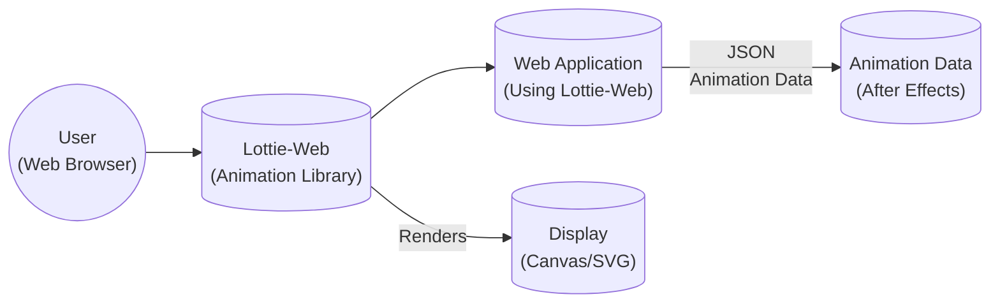
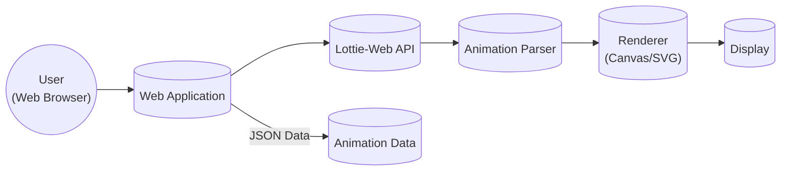
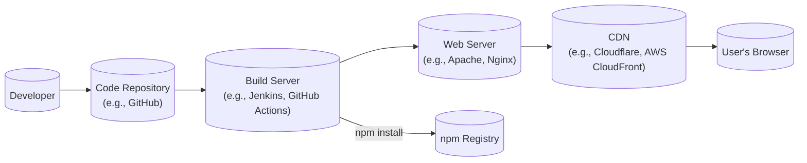
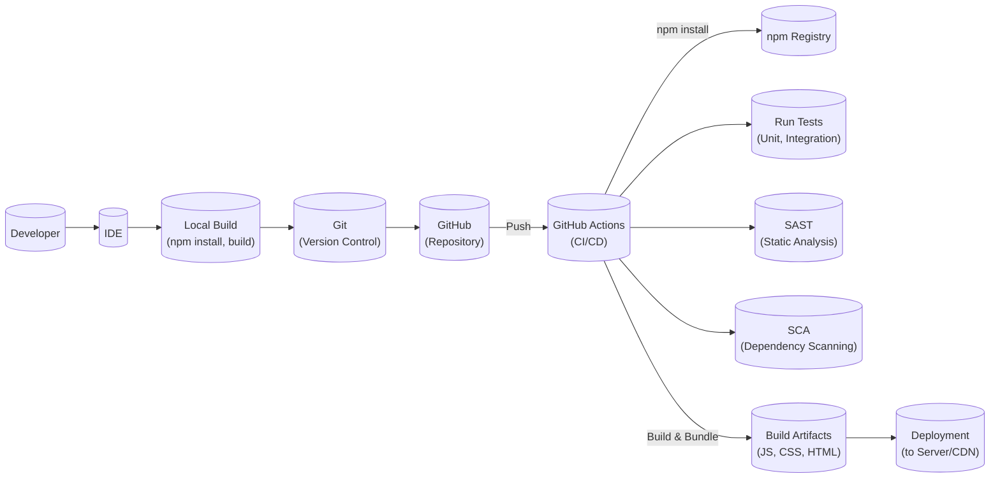

Okay, let's create a design document for the Lottie-Web project, focusing on aspects relevant to threat modeling.

# BUSINESS POSTURE

Lottie-Web is a library that renders After Effects animations in real-time, allowing applications to use animations as easily as they use static images.  It's an open-source project maintained by Airbnb.  The primary business goals and priorities appear to be:

*   Brand Enhancement:  Enable rich, engaging user experiences through animations, improving brand perception and user engagement.
*   Developer Adoption:  Provide a simple, efficient, and reliable way for developers to integrate animations into web applications, fostering a strong community and widespread use.
*   Cross-Platform Consistency: Ensure animations render consistently across different browsers and devices, maintaining a uniform user experience.
*   Performance Optimization:  Minimize the performance impact of animations on web applications, ensuring smooth and responsive user interfaces.
*   Open Source Contribution: Maintain a healthy open-source project, encouraging community contributions and ensuring long-term sustainability.

Based on these, the most important business risks are:

*   Malicious Animation Files:  The library could be exploited to render malicious animation files, potentially leading to XSS attacks, data exfiltration, or denial of service. This is the most critical risk.
*   Performance Degradation: Poorly optimized or overly complex animations could degrade the performance of web applications, leading to a poor user experience.
*   Cross-Browser Incompatibility:  Inconsistencies in rendering across different browsers could lead to a fragmented user experience and damage brand reputation.
*   Library Vulnerabilities:  Vulnerabilities in the Lottie-Web library itself could be exploited by attackers, potentially compromising applications that use it.
*   Supply Chain Attacks: Compromised dependencies or build processes could introduce malicious code into the library.

# SECURITY POSTURE

Existing security controls (based on the GitHub repository and common practices):

*   security control: Code Reviews: Pull requests are used, implying a code review process before merging changes. (Visible in the GitHub repository's contribution guidelines and pull request history).
*   security control: Static Analysis: Likely used, although not explicitly mentioned. Common practice for JavaScript projects. (Assumed based on industry best practices).
*   security control: Dependency Management:  Dependencies are managed using npm (package.json), allowing for version tracking and updates. (Visible in the `package.json` file).
*   security control: Issue Tracking:  Security vulnerabilities can be reported and tracked via GitHub Issues. (Visible in the GitHub repository's issue tracker).
*   security control: Open Source: Open Sourcing project allows for community review and contributions, potentially identifying and fixing security issues faster.

Accepted risks:

*   accepted risk:  Reliance on External Libraries: The library depends on external libraries (e.g., for rendering), which may have their own vulnerabilities.
*   accepted risk:  Complexity of Animation Parsing:  The library parses complex animation data, which inherently increases the risk of parsing-related vulnerabilities.
*   accepted risk: User-Provided Content: The core functionality involves rendering user-provided (or third-party provided) animation files, which is an inherent risk.

Recommended security controls:

*   security control:  Content Security Policy (CSP):  Implement a strong CSP to mitigate the impact of XSS vulnerabilities.
*   security control:  Input Sanitization/Validation:  Thoroughly sanitize and validate animation data before parsing and rendering it. This should include checks for malicious patterns, size limits, and resource usage limits.
*   security control:  Regular Security Audits:  Conduct regular security audits, including penetration testing and code reviews, to identify and address potential vulnerabilities.
*   security control:  Software Composition Analysis (SCA):  Use SCA tools to identify and manage vulnerabilities in third-party dependencies.
*   security control:  Fuzzing: Implement fuzzing to test the library's resilience to unexpected or malformed animation data.
*   security control: Sandboxing: Explore sandboxing techniques to isolate the animation rendering process and limit its access to system resources.

Security Requirements:

*   Authentication: Not directly applicable to the library itself, as it's a client-side rendering library. Authentication would be handled by the application using Lottie-Web.
*   Authorization: Not directly applicable, similar to authentication. The application using Lottie-Web would handle authorization.
*   Input Validation:  Crucially important. The library *must* validate and sanitize all animation data before processing it. This is the primary defense against malicious animation files. Specific requirements include:
    *   Structure Validation: Verify that the animation data conforms to the expected JSON schema.
    *   Content Validation:  Check for suspicious patterns or elements within the animation data that could indicate malicious intent.
    *   Resource Limits:  Enforce limits on animation size, complexity, and resource usage (e.g., memory, CPU) to prevent denial-of-service attacks.
*   Cryptography: Not directly applicable for core functionality. If the application using Lottie-Web requires encrypted animation data, it should handle decryption before passing the data to Lottie-Web.
*   Output Encoding: Important. If animation data includes any user provided strings, they should be properly encoded to prevent XSS.

# DESIGN

## C4 CONTEXT

Element Descriptions:

*   Element:
    *   Name: User
    *   Type: Person
    *   Description: A person interacting with a web application that uses Lottie-Web.
    *   Responsibilities: Views and interacts with animations.
    *   Security controls: Browser security features (e.g., same-origin policy, CSP).

*   Element:
    *   Name: Lottie-Web
    *   Type: Software System
    *   Description: The JavaScript library that renders After Effects animations.
    *   Responsibilities: Parses animation data, renders animations to the display, manages animation playback.
    *   Security controls: Input validation, sanitization, resource limits.

*   Element:
    *   Name: Web Application
    *   Type: Software System
    *   Description: The web application that integrates Lottie-Web to display animations.
    *   Responsibilities: Loads animation data, initializes Lottie-Web, handles user interactions.
    *   Security controls: Application-level security controls (e.g., authentication, authorization, CSP).

*   Element:
    *   Name: Animation Data
    *   Type: Data
    *   Description: The JSON data representing the After Effects animation.
    *   Responsibilities: Provides the animation data to be rendered.
    *   Security controls: Source verification, integrity checks (if applicable).

*   Element:
    *   Name: Display
    *   Type: Output
    *   Description: Canvas or SVG where animation is rendered.
    *   Responsibilities: Displaying animation.
    *   Security controls: Browser security features.

## C4 CONTAINER

Element Descriptions:

*   Element:
    *   Name: User
    *   Type: Person
    *   Description: A person interacting with the web application.
    *   Responsibilities: Views and interacts with animations.
    *   Security controls: Browser security features.

*   Element:
    *   Name: Web Application
    *   Type: Web Application
    *   Description: The application using Lottie-Web.
    *   Responsibilities: Loads animation data, initializes Lottie-Web, handles user interactions.
    *   Security controls: Application-level security controls.

*   Element:
    *   Name: Lottie-Web API
    *   Type: API
    *   Description: The public API of the Lottie-Web library.
    *   Responsibilities: Provides methods for loading, controlling, and manipulating animations.
    *   Security controls: Input validation.

*   Element:
    *   Name: Animation Parser
    *   Type: Component
    *   Description: Parses the JSON animation data.
    *   Responsibilities: Converts the JSON data into an internal representation.
    *   Security controls: Input validation, sanitization, resource limits.

*   Element:
    *   Name: Renderer
    *   Type: Component
    *   Description: Renders the animation to the display (Canvas or SVG).
    *   Responsibilities: Draws the animation frames.
    *   Security controls: Output encoding.

*   Element:
    *   Name: Display
    *   Type: Output
    *   Description: Canvas or SVG where animation is rendered.
    *   Responsibilities: Displaying animation.
    *   Security controls: Browser security features.

*   Element:
    *   Name: Animation Data
    *   Type: Data
    *   Description: The JSON data representing the After Effects animation.
    *   Responsibilities: Provides the animation data to be rendered.
    *   Security controls: Source verification, integrity checks (if applicable).

## DEPLOYMENT

Lottie-Web is a client-side library, so deployment typically involves including it in a web application's codebase.  There are several ways to do this:

1.  **npm/yarn:** Install the library as a dependency using npm or yarn. This is the recommended approach for most projects.
2.  **CDN:** Include the library directly from a CDN (e.g., unpkg, jsDelivr). This is convenient for quick prototyping or small projects.
3.  **Manual Download:** Download the library files and include them directly in the project. This is less common but may be used in specific cases.

We'll describe the npm/yarn approach, as it's the most common and recommended for production environments.

Element Descriptions:

*   Element:
    *   Name: Developer
    *   Type: Person
    *   Description: Develops web application and integrates Lottie-Web.
    *   Responsibilities: Writes code, manages dependencies.
    *   Security controls: Secure coding practices, access controls to the code repository.

*   Element:
    *   Name: Code Repository
    *   Type: System
    *   Description: Stores the source code of the web application and Lottie-Web.
    *   Responsibilities: Version control, collaboration.
    *   Security controls: Access controls, branch protection rules.

*   Element:
    *   Name: Build Server
    *   Type: System
    *   Description: Builds the web application, including Lottie-Web.
    *   Responsibilities: Compiles code, runs tests, packages the application.
    *   Security controls: Secure build environment, dependency scanning.

*   Element:
    *   Name: Web Server
    *   Type: System
    *   Description: Serves the web application to users.
    *   Responsibilities: Handles HTTP requests, serves static files.
    *   Security controls: Web server security configuration, firewall.

*   Element:
    *   Name: CDN
    *   Type: System
    *   Description: Content Delivery Network that caches and distributes the web application's assets.
    *   Responsibilities: Improves performance and availability.
    *   Security controls: CDN security features (e.g., DDoS protection, WAF).

*   Element:
    *   Name: User's Browser
    *   Type: System
    *   Description: The user's web browser.
    *   Responsibilities: Renders the web application and executes Lottie-Web.
    *   Security controls: Browser security features.

*   Element:
    *   Name: npm Registry
    *   Type: System
    *   Description: The public registry for npm packages.
    *   Responsibilities: Provides the Lottie-Web package.
    *   Security controls: npm's security measures.

## BUILD

The build process for a web application using Lottie-Web (installed via npm) typically involves the following steps:

1.  **Dependency Installation:** `npm install` or `yarn install` is used to download Lottie-Web and other dependencies from the npm registry.
2.  **Bundling:** A bundler (e.g., Webpack, Parcel, Rollup) combines the application code and Lottie-Web into one or more JavaScript bundles.
3.  **Minification/Optimization:** The bundled code is often minified and optimized to reduce file size and improve performance.
4.  **Testing:** Automated tests (unit, integration, end-to-end) are run to ensure the application is working correctly.
5.  **Deployment:** The built assets (HTML, CSS, JavaScript) are deployed to a web server or CDN.

Security Controls in the Build Process:

*   security control:  Dependency Scanning (SCA): Tools like `npm audit` or dedicated SCA tools (e.g., Snyk, Dependabot) are used to identify vulnerabilities in dependencies.
*   security control:  Static Application Security Testing (SAST):  SAST tools (e.g., ESLint with security plugins, SonarQube) are used to analyze the code for potential security vulnerabilities.
*   security control:  Secure Build Environment: The build server should be configured securely, with limited access and appropriate security measures.
*   security control:  Code Signing:  Consider code signing the build artifacts to ensure their integrity.

# RISK ASSESSMENT

*   Critical Business Process: Delivering engaging and interactive user experiences through animations, enhancing brand image and user engagement.
*   Data to Protect:
    *   Animation Data (JSON): Sensitivity: Low to Medium (depending on the content of the animation).  Could potentially contain sensitive information if misused, but primarily poses a risk through malicious code injection.
    *   User Data (Indirectly): Sensitivity: High.  While Lottie-Web doesn't directly handle user data, vulnerabilities in the library could be exploited to access or manipulate user data within the application that uses it.
    *   Source Code: Sensitivity: Medium. The source code of the library itself is open source, but vulnerabilities could impact many applications.

# QUESTIONS & ASSUMPTIONS

*   Questions:
    *   What specific types of animations are expected to be used with Lottie-Web? (This helps assess the complexity and potential attack surface).
    *   Are there any existing security policies or guidelines for web application development at Airbnb that should be considered?
    *   What is the expected scale of usage for applications using Lottie-Web? (This helps determine the performance requirements and potential impact of denial-of-service attacks).
    *   Are there any plans to support encrypted or signed animation data?
    *   What is the process for handling reported security vulnerabilities?
    *   What level of detail is required for the threat model? (e.g., specific attack vectors, data flow diagrams).

*   Assumptions:
    *   BUSINESS POSTURE: Assumes that Airbnb prioritizes brand reputation, user experience, and developer adoption.
    *   SECURITY POSTURE: Assumes that basic security practices (code reviews, dependency management) are already in place. Assumes a moderate risk appetite, typical for a large tech company with a significant online presence.
    *   DESIGN: Assumes that the primary use case is rendering animations in web browsers. Assumes that the library is used as intended, with animation data loaded from trusted sources (although this should be explicitly addressed in the threat model).