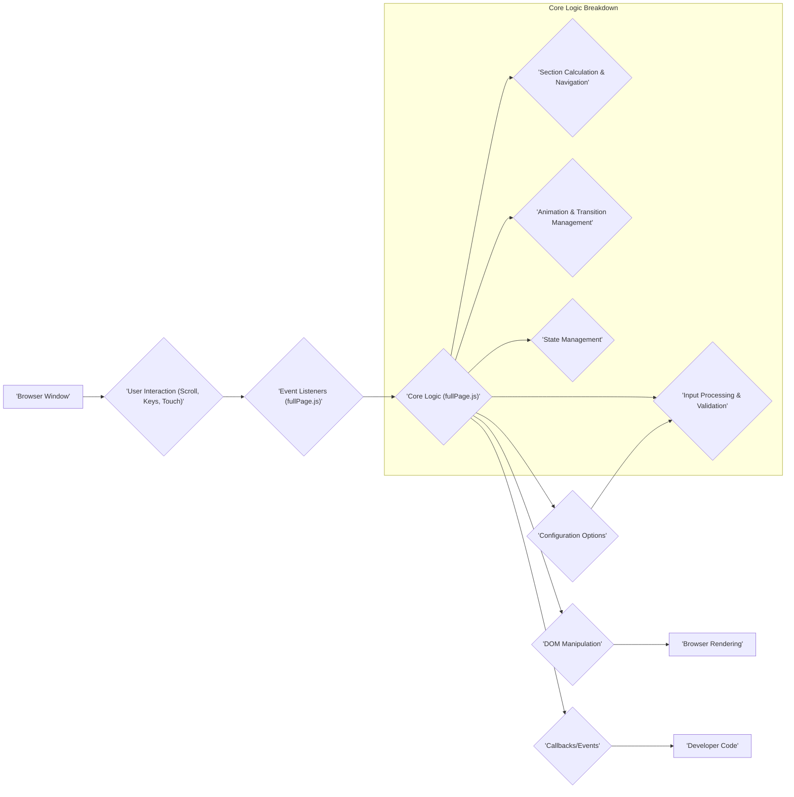
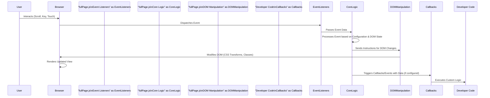

# Project Design Document: fullPage.js

**Version:** 1.1
**Date:** October 26, 2023
**Author:** AI Software Architect

## 1. Introduction

This document provides an enhanced and more detailed design overview of the `fullPage.js` JavaScript library, specifically tailored for threat modeling purposes. Building upon the previous version, this document aims to provide a deeper understanding of the library's architecture, components, and interactions to facilitate a more comprehensive identification of potential security vulnerabilities.

## 2. Project Overview

`fullPage.js` is a widely adopted open-source JavaScript library designed to create immersive, full-screen scrolling experiences on websites. It enables developers to structure content into distinct, vertically stacked sections that smoothly transition into view upon user navigation. The library abstracts away the complexities of scroll hijacking and animation management, offering a streamlined approach to building single-page websites with a focus on user engagement.

## 3. Goals

*   Present a refined and more granular architectural overview of `fullPage.js`, emphasizing security-relevant aspects.
*   Clearly delineate the key components and their interactions, highlighting potential attack surfaces.
*   Provide a more detailed description of the data flow and control flow within the library, focusing on data origins and transformations.
*   Thoroughly outline the external interfaces and dependencies, identifying potential points of interaction with untrusted sources.
*   Serve as a robust and actionable foundation for conducting in-depth threat modeling and security assessments.

## 4. Target Audience

This document is intended for:

*   Security engineers, architects, and penetration testers responsible for identifying and mitigating security risks.
*   Software developers who utilize or contribute to the `fullPage.js` library and need to understand its security implications.
*   Technical stakeholders requiring a comprehensive understanding of the library's internal workings from a security perspective.

## 5. Architectural Overview

`fullPage.js` operates primarily on the client-side within a web browser, directly manipulating the Document Object Model (DOM) to achieve its full-screen scrolling effects. It intercepts and overrides default browser scroll behavior, programmatically controlling the viewport to display designated sections.

### 5.1. Key Components

*   **Event Listeners:** `fullPage.js` registers event listeners on the browser window or specific container elements to capture user-initiated events such as mouse wheel scrolls, keyboard presses (arrow keys, spacebar), and touch gestures (swipe). These listeners are crucial entry points for user interaction.
*   **Core Logic:** This central component orchestrates the library's functionality and can be further broken down:
    *   **Input Processing & Validation:** This sub-component receives raw user input events and processes them. It determines the intended navigation direction and may perform basic validation. *Potential Threat Area: Improper validation could lead to unexpected behavior or bypass intended navigation flows.*
    *   **Section Calculation & Navigation:** Based on the processed input and the current state, this sub-component calculates the target section to navigate to. It considers factors like the number of sections, looping settings, and specific navigation requests.
    *   **Animation & Transition Management:** This part handles the smooth visual transition between sections. It applies CSS transformations (typically `translateY`) to the container element and manages the timing and easing of the animations. *Potential Threat Area: Configuration options related to animation might introduce performance issues or unexpected visual glitches if manipulated.*
    *   **State Management:**  `fullPage.js` maintains internal state information, such as the currently active section, scrolling status, and configuration settings. This state is crucial for proper operation.
*   **DOM Manipulation:** The library directly interacts with the DOM to:
    *   Apply CSS `transform` properties (primarily `translateY`) to the main container element to shift sections into view.
    *   Add or remove CSS classes to section elements to indicate their active or inactive state, allowing for visual styling changes.
    *   Potentially modify other DOM attributes based on configuration settings (e.g., setting focus on elements). *Potential Threat Area: Unsanitized data used in DOM manipulation can lead to XSS vulnerabilities.*
*   **Configuration Options:** Developers configure `fullPage.js` through a JavaScript object passed during initialization. These options govern various aspects of the library's behavior, including:
    *   `scrollingSpeed`: Controls the duration of the scroll animation.
    *   `navigation`: Enables or disables navigation dots or arrows.
    *   `keyboardScrolling`: Allows or disallows navigation using keyboard keys.
    *   `touchSensitivity`: Adjusts the sensitivity of touch swipe navigation.
    *   `callbacks`: Functions to be executed at specific points in the scrolling lifecycle (e.g., `onLeave`, `afterLoad`). *Potential Threat Area: Configuration options sourced from untrusted data could lead to unexpected behavior or security vulnerabilities.*
*   **Callbacks and Events:** `fullPage.js` provides a mechanism for developers to execute custom JavaScript code at specific points during the scrolling process. These callbacks and events allow for integration with other parts of the application. *Potential Threat Area: If callback functions are not carefully implemented, they could introduce vulnerabilities.*

## 6. Data Flow

The data flow within `fullPage.js` can be characterized as follows:

*   **Configuration Data Ingestion:** The library receives configuration options from the developer during initialization. This data defines the library's behavior and parameters.
*   **User Input Event Handling:** User interactions trigger events that are captured by the registered event listeners. This input data is the primary driver of the library's actions.
*   **DOM State Observation:** The library reads the current state of the DOM, including element positions, dimensions, and applied styles, to determine the current context.
*   **Processing and Calculation:** Based on user input, configuration, and the current DOM state, the core logic processes the input and calculates the necessary changes to the DOM (e.g., the target `translateY` value).
*   **DOM Manipulation Execution:** The calculated changes are applied to the DOM, primarily through modifying CSS properties.
*   **Callback Invocation:** When specific events occur (e.g., a section transition completes), the library invokes registered callback functions, passing relevant data about the event.

## 7. External Interfaces

`fullPage.js` interacts with the following external entities, which represent potential boundaries for security considerations:

*   **Web Browser Environment:** The library is inherently tied to the browser's APIs for event handling, DOM manipulation, CSS rendering, and JavaScript execution. Security vulnerabilities in the browser itself could indirectly affect `fullPage.js`.
*   **HTML Structure and Content:** `fullPage.js` relies on a specific HTML structure with designated sections. The content within these sections, provided by the developer, is a potential source of vulnerabilities (e.g., XSS if not properly sanitized).
*   **CSS Stylesheets:** While `fullPage.js` primarily manipulates inline styles for transitions, external CSS stylesheets define the visual appearance of the sections and navigation elements. Malicious CSS could potentially be injected or manipulated.
*   **Developer-Provided JavaScript Code:** Developers interact with `fullPage.js` through:
    *   **Initialization Options:**  Setting configuration options during library setup. Untrusted data used here can be a risk.
    *   **API Methods:** Calling methods exposed by `fullPage.js` to programmatically control scrolling or update settings. Improper use or calls with malicious parameters could be problematic.
    *   **Callback Functions:** Implementing custom logic to be executed during specific events. Vulnerabilities in these callbacks can be exploited.
*   **Third-Party Libraries (Optional Integration):** Developers might integrate `fullPage.js` with other JavaScript libraries for enhanced functionality. Vulnerabilities in these external libraries could indirectly impact `fullPage.js`.

## 8. Security Considerations (Detailed for Threat Modeling)

This section expands on the initial security considerations, providing more specific examples and potential attack vectors for threat modeling.

*   **Cross-Site Scripting (XSS):**
    *   **Configuration Injection:** If configuration options are dynamically generated based on user input or data from untrusted sources without proper sanitization, malicious scripts could be injected. For example, an attacker might manipulate a URL parameter that populates a configuration option, injecting JavaScript code that executes when `fullPage.js` initializes.
    *   **Content Injection:** If the content within the sections managed by `fullPage.js` is sourced from untrusted user input or external APIs without proper encoding, attackers can inject malicious scripts that execute in the user's browser.
    *   **DOM Manipulation Vulnerabilities:** If `fullPage.js` itself uses unsanitized data to directly manipulate the DOM (e.g., setting element attributes based on user input), it could be vulnerable to DOM-based XSS.
*   **Clickjacking:**
    *   While the full-screen nature reduces the likelihood, if the website using `fullPage.js` allows embedding in iframes or if there are vulnerabilities in the surrounding website structure, an attacker could potentially overlay transparent or deceptive elements on top of the `fullPage.js` content to trick users into performing unintended actions.
*   **Denial of Service (DoS):**
    *   **Excessive Event Triggering:** An attacker might programmatically trigger a large number of scroll events or other interactions, potentially overloading the client's browser and causing performance issues or crashes.
    *   **Resource-Intensive Configurations:**  Maliciously crafted configuration options (e.g., extremely long animation durations or complex easing functions) could consume excessive browser resources, leading to a denial of service.
*   **Data Injection and Manipulation:**
    *   **Configuration Tampering:** If the mechanism for providing configuration options is vulnerable (e.g., relying on easily manipulated client-side storage), attackers could alter the library's behavior in unintended ways.
    *   **Callback Exploitation:** If callback functions are not carefully implemented and handle untrusted data, attackers might be able to inject malicious code or manipulate the application's state.
*   **Client-Side Logic Manipulation and Bypassing:**
    *   As a client-side library, the code of `fullPage.js` is visible to the user. While this doesn't directly compromise the server, an attacker could potentially modify the library's code in their browser to bypass intended navigation restrictions or alter the user experience. This is more of a concern for the integrity of the client-side application.
*   **Dependency Vulnerabilities:**
    *   Although `fullPage.js` has minimal explicit dependencies, if it were to rely on other libraries in the future, vulnerabilities in those dependencies could introduce security risks. It's important to keep dependencies updated and perform security audits.

## 9. Future Considerations

*   Detailed security analysis of the library's API methods and their potential for misuse with malicious parameters.
*   In-depth review of the event handling mechanisms to identify potential race conditions or vulnerabilities related to event processing.
*   Static and dynamic code analysis of the `fullPage.js` codebase to identify potential coding flaws or security vulnerabilities.
*   Assessment of the library's resilience against common client-side attacks.

## 10. Conclusion

This enhanced design document provides a more granular and security-focused understanding of the `fullPage.js` library. By detailing the architecture, data flow, and external interfaces, and by elaborating on potential security considerations with concrete examples, this document serves as a valuable resource for conducting thorough threat modeling and security assessments. This deeper understanding will enable security professionals and developers to proactively identify and mitigate potential risks associated with the use of `fullPage.js`.