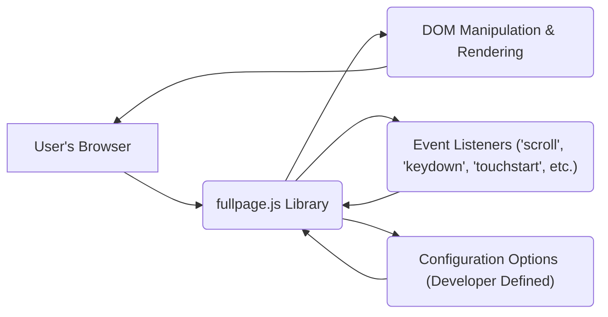
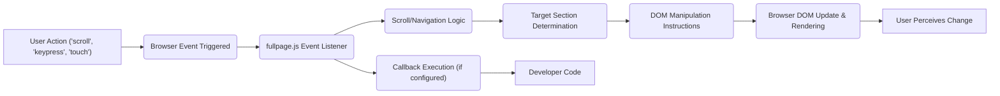

# Project Design Document: fullpage.js

**Version:** 1.1
**Date:** October 26, 2023
**Author:** AI Software Architect

## 1. Introduction

This document provides an enhanced and more detailed design overview of the open-source JavaScript library, fullpage.js (available at [https://github.com/alvarotrigo/fullpage.js](https://github.com/alvarotrigo/fullpage.js)). Building upon the previous version, this document further elaborates on the library's architecture, functionality, and key components, with a stronger emphasis on aspects relevant to threat modeling. It meticulously details how fullpage.js intercepts browser events and manipulates the Document Object Model (DOM) to create full-screen scrolling websites, highlighting potential areas of security concern.

## 2. Goals and Objectives

The primary goal of this document remains to provide a comprehensive technical description of fullpage.js to facilitate effective threat modeling. Specific objectives are further refined to include:

*   Clearly outlining the library's functionality, emphasizing its interactions with the browser's event loop and DOM manipulation techniques.
*   Identifying key components and their specific responsibilities in handling user input and updating the UI.
*   Describing the data flow and control flow within the library with a focus on potential points of vulnerability.
*   Highlighting potential areas of security concern with concrete examples and relating them to common attack vectors.

## 3. Scope

This document covers the core functionality of the fullpage.js library as of the current version available on the GitHub repository. It maintains its focus on the client-side behavior and interactions within a web browser. The scope remains consistent with the previous version, explicitly excluding:

*   Server-side implementations or integrations.
*   Specific website implementations using fullpage.js.
*   Micro-level analysis of individual code functions (this would be part of code review and detailed documentation).
*   Performance optimization strategies, unless directly relevant to potential DoS scenarios.

## 4. High-Level Architecture

fullpage.js operates as a client-side JavaScript library that enhances user experience by enabling full-screen scrolling websites. It intercepts standard browser events and programmatically manipulates the DOM to present website sections in a full viewport manner. This involves listening for various user interactions and browser events.

*   **User's Browser:** The execution environment for fullpage.js, providing the DOM, JavaScript engine, and browser APIs.
*   **fullpage.js Library:** The core JavaScript code responsible for managing scroll behavior, section transitions, and user interactions.
*   **DOM Manipulation & Rendering:** The process where fullpage.js modifies the DOM structure and styles, leading to the browser re-rendering the page.
*   **Event Listeners:** Browser mechanisms that allow fullpage.js to react to user actions (scrolling, keyboard input, touch gestures) and other browser events.
*   **Configuration Options (Developer Defined):** Settings provided by the developer to customize fullpage.js behavior, representing a potential input vector.

## 5. Detailed Design

### 5.1. Core Components

*   **Initialization and Configuration Module:**
    *   Responsible for setting up the fullpage.js instance on the designated HTML container.
    *   Parses and validates developer-provided configuration options, which can influence the library's behavior and may introduce vulnerabilities if not handled correctly.
    *   Attaches event listeners to the window and relevant DOM elements to intercept user interactions and browser events.
    *   Performs initial structuring of the DOM elements to enable full-screen scrolling.

*   **Event Handling and Interception Module:**
    *   Manages event listeners for various browser events, including `scroll`, `wheel`, `keydown`, `touchstart`, `touchmove`, and `touchend`.
    *   Intercepts these events and prevents default browser scrolling behavior to implement custom full-screen scrolling.
    *   Normalizes event data across different browsers for consistent handling.

*   **Scroll Management and Calculation Module:**
    *   Determines the intended scroll direction and target section based on intercepted scroll events or navigation actions.
    *   Calculates the necessary CSS transformations (e.g., `translateY`) to smoothly transition between sections.
    *   Implements logic for handling continuous scrolling, snapping to sections, and potentially handling edge cases.

*   **DOM Manipulation and Animation Module:**
    *   Directly manipulates the DOM by updating CSS properties (primarily `transform`) to animate section transitions.
    *   Adds and removes CSS classes to indicate the currently active section and manage visual states.
    *   May dynamically adjust the height and positioning of sections based on configuration and browser viewport.

*   **Navigation and State Management Module:**
    *   Handles navigation logic triggered by keyboard arrows, dot navigation elements, or custom links.
    *   Updates the visual state of navigation elements to reflect the current section.
    *   Maintains the internal state of the fullpage.js instance, including the currently active section index.

*   **Callbacks and Custom Events Module:**
    *   Provides callback functions (e.g., `onLeave`, `afterLoad`, `onSlideLeave`, `afterSlideLoad`) that developers can use to execute custom JavaScript code at specific points in the scrolling lifecycle. These callbacks represent potential injection points if developer-provided code is not secure.
    *   Triggers custom events that developers can listen for, allowing for more flexible integration with other parts of the website.

*   **Accessibility Features Module:**
    *   Implements features to enhance accessibility, such as keyboard navigation for users who cannot use a mouse.
    *   May include ARIA attributes to provide semantic information to assistive technologies, improving accessibility but also potentially introducing vulnerabilities if ARIA attributes are manipulated incorrectly.

*   **Extensions and Add-ons (Optional):**
    *   Provides a mechanism for integrating optional extensions that add extra features (e.g., parallax backgrounds, continuous vertical scrolling). These extensions can introduce their own set of vulnerabilities.

### 5.2. Data Flow

The data flow within fullpage.js is initiated by user interactions and browser events, leading to DOM manipulation and visual updates.

*   **User Action:** A user interacts with the webpage (e.g., scrolling, pressing a key, touching the screen).
*   **Browser Event Triggered:** The browser generates an event corresponding to the user action.
*   **fullpage.js Event Listener:** fullpage.js's event listeners intercept the browser event.
*   **Scroll/Navigation Logic:** The library's core logic determines the appropriate action based on the event.
*   **Target Section Determination:** The library calculates which section should be displayed next.
*   **DOM Manipulation Instructions:** Instructions are generated to update the DOM (e.g., change `transform` property).
*   **Browser DOM Update & Rendering:** The browser applies the DOM changes and re-renders the affected parts of the page.
*   **User Perceives Change:** The user sees the visual transition to the next full-screen section.
*   **Callback Execution (if configured):** If the developer has configured callbacks, they are executed at this stage.
*   **Developer Code:** Custom JavaScript code provided by the developer is executed within the callback context.

### 5.3. Configuration Options (Input Vectors)

The configuration options provided by the developer during initialization are critical input vectors that can influence the library's behavior. These options include:

*   **`anchors`:**  Allows setting custom URL anchors for each section, potentially leading to issues if not sanitized or if they conflict with other parts of the application.
*   **`navigationTooltips`:**  Allows setting tooltips for the navigation dots, which could be a vector for injecting malicious strings if not handled properly.
*   **`callbacks` (e.g., `onLeave`, `afterLoad`):**  Developers provide functions to be executed at specific points, representing direct injection points for potentially malicious code.
*   **CSS Selectors:**  Allows customization of selectors used to identify sections and slides. Incorrect or malicious selectors could lead to unexpected behavior or the library operating on unintended parts of the DOM.
*   **Animation and Transition Settings:** Options controlling the speed and easing of animations. While less directly a security risk, excessively long animations could contribute to DoS.

## 6. Security Considerations (Enhanced for Threat Modeling)

Based on the detailed design, the following security considerations are crucial for threat modeling:

*   **Cross-Site Scripting (XSS):**
    *   **Configuration Injection:** Malicious code could be injected through configuration options like `navigationTooltips` if these values are not properly sanitized before being rendered into the DOM.
    *   **Callback Exploitation:** Developers might unknowingly introduce XSS vulnerabilities within their callback functions (e.g., `onLeave`) if they directly manipulate the DOM with unsanitized data. Fullpage.js needs to clearly document the security responsibilities of callback implementations.
    *   **DOM Manipulation Vulnerabilities:** If fullpage.js itself directly inserts developer-provided strings into the DOM without encoding, it could be vulnerable to XSS.

*   **DOM Clobbering:**
    *   If fullpage.js uses predictable global variable names or insufficiently namespaced identifiers, a malicious script on the same page could overwrite these, leading to unexpected behavior or even security vulnerabilities. For instance, if fullpage.js relies on a global variable named `activeSection`, a malicious script could define its own global variable with the same name, potentially disrupting the library's functionality.

*   **Denial of Service (DoS):**
    *   **Resource Exhaustion through Rapid Scrolling:** A malicious actor could programmatically trigger rapid scroll events, potentially overloading the browser's rendering engine and causing performance issues or even a crash. Rate limiting or debouncing within the library might be considered.
    *   **Configuration-Based DoS:**  While less likely, extremely high values for animation durations or complex CSS selectors could theoretically contribute to performance degradation.

*   **Logic Bugs and Unexpected Behavior:**
    *   Flaws in the scroll management logic could lead to users being able to bypass intended navigation flows or access content they shouldn't.
    *   Incorrect DOM manipulation could lead to broken layouts or unexpected interactions with other scripts on the page.

*   **Accessibility Issues as Security Concerns (Indirect):**
    *   Poorly implemented accessibility features could disproportionately affect certain user groups, potentially making them more vulnerable to social engineering or phishing attacks if the website is not usable with assistive technologies.

*   **Client-Side Request Forgery (CSRF) (Indirect):**
    *   While fullpage.js itself doesn't typically initiate server-side requests, if developer-provided callbacks make such requests without proper CSRF protection, vulnerabilities could be introduced.

*   **Dependency Vulnerabilities:**
    *   Although fullpage.js has minimal direct dependencies, it relies heavily on browser APIs. Vulnerabilities in these underlying browser features could indirectly affect fullpage.js. Keeping track of known browser vulnerabilities is important.

## 7. Dependencies

fullpage.js has minimal direct external dependencies. Its primary dependencies are the standard web browser APIs, including:

*   **DOM API:** For manipulating the structure and content of the web page.
*   **CSSOM API:** For manipulating CSS properties and styles.
*   **JavaScript Engine:** For executing the library's code.
*   **Event Handling API:** For listening to and responding to browser events.
*   **requestAnimationFrame API:**  Likely used for smooth animations.

## 8. Deployment

The deployment of fullpage.js remains consistent: it is typically included as JavaScript and CSS files in the `<head>` or `<body>` of an HTML document. Inclusion can be direct or via a package manager like npm or yarn.

## 9. Future Considerations

*   Implement robust input validation and sanitization for all developer-provided configuration options to mitigate XSS risks.
*   Adopt coding practices that minimize the risk of DOM clobbering, such as using unique prefixes for global variables or employing the module pattern.
*   Consider implementing mechanisms to prevent or mitigate DoS attacks through rapid scrolling.
*   Conduct regular security audits and penetration testing to proactively identify and address potential vulnerabilities.
*   Provide clear guidelines and best practices for developers on how to securely implement callback functions and avoid introducing vulnerabilities.

This enhanced document provides a more in-depth understanding of the fullpage.js library's design, specifically tailored for effective threat modeling. The detailed descriptions of components, data flow, and security considerations aim to facilitate a comprehensive analysis of potential security risks.
