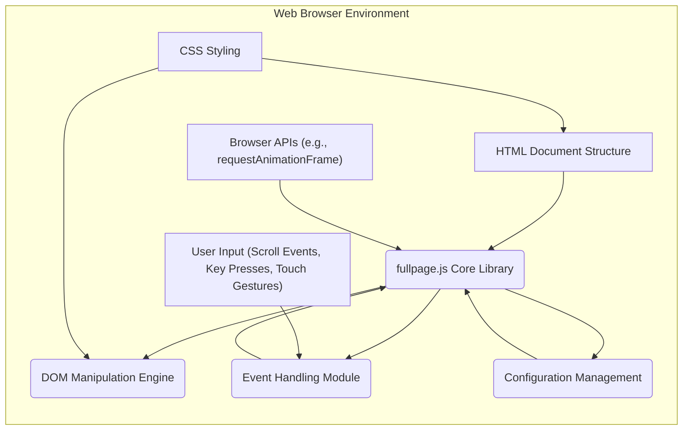
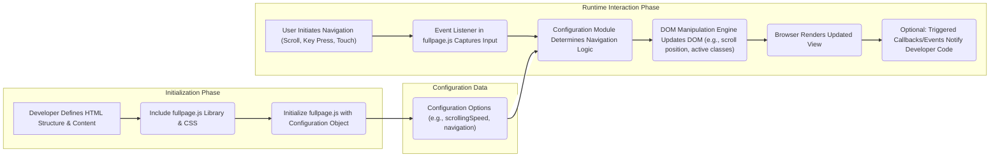

# Project Design Document: fullpage.js

**Version:** 1.1
**Date:** October 26, 2023
**Author:** AI Software Architect

## 1. Introduction

This document provides an enhanced and more detailed design overview of the `fullpage.js` JavaScript library, building upon the previous version. This document is intended to serve as a robust foundation for subsequent threat modeling activities, offering a clear understanding of the system's architecture, data flow, and key components.

`fullpage.js` is a widely adopted open-source JavaScript library designed to facilitate the creation of immersive full-screen scrolling websites, often referred to as single-page websites or onepage sites. It empowers developers to construct websites where each section elegantly occupies the entire viewport, enabling users to navigate seamlessly between these sections through intuitive scrolling, keyboard interactions, or touch gestures.

## 2. Goals

* Provide a clear, comprehensive, and more granular architectural overview of `fullpage.js`.
* Identify key components, their specific functionalities, and their interactions in greater detail.
* Describe the data flow within the library, including the types of data being processed.
* Outline the deployment and integration process with more specific examples.
* Serve as a robust and detailed basis for identifying potential security vulnerabilities during threat modeling, highlighting potential attack surfaces.

## 3. Non-Goals

* This document does not aim to provide an exhaustive, line-by-line code-level analysis of `fullpage.js`.
* It does not cover the intricate implementation details of every single feature or all possible configuration options.
* In-depth performance optimization strategies and benchmarking are outside the scope of this document.
* Specific UI/UX design principles and considerations are not addressed within this document.

## 4. System Architecture

`fullpage.js` operates primarily as a client-side JavaScript library, executing within the user's web browser. Its core function is to dynamically manipulate the Document Object Model (DOM) in response to user interactions and various browser events.

**Detailed Component Descriptions:**

* **HTML Document Structure:** The foundational HTML document where `fullpage.js` is integrated. This includes the main container element and the individual section elements that are transformed into full-screen slides. The structure and content of these sections are defined by the developer.
* **`fullpage.js` Core Library:** The primary JavaScript file containing the core logic of the library. This includes modules for event handling, DOM manipulation, animation control, and state management.
* **DOM Manipulation Engine:** This module within `fullpage.js` is responsible for directly interacting with the browser's DOM. It dynamically adjusts the layout, positioning (e.g., `scrollTop`), visibility, and applies CSS classes to the sections to achieve the full-screen scrolling effect.
* **Event Handling Module:** This module manages the attachment and processing of event listeners to the window and specific DOM elements. It captures user interactions like scrolling, keyboard presses, and touch events, as well as browser events like resize.
* **Configuration Management:** This component handles the parsing and application of the configuration options provided by the developer during initialization. These options dictate the library's behavior, such as scrolling speed, navigation controls, and easing functions.
* **User Input (Scroll Events, Key Presses, Touch Gestures):** The various ways in which users interact with the webpage to trigger navigation between the full-screen sections. These interactions are captured by the Event Handling Module.
* **CSS Styling:** CSS rules that define the visual presentation of the full-screen sections and the overall layout. `fullpage.js` often adds or modifies inline styles dynamically to control the scrolling behavior.
* **Browser APIs (e.g., `requestAnimationFrame`):** `fullpage.js` leverages standard browser APIs for tasks like smooth animations (`requestAnimationFrame`) and DOM manipulation.

## 5. Data Flow

The data flow within `fullpage.js` primarily involves the initial configuration provided by the developer and the subsequent user interactions that trigger dynamic updates to the DOM.

**Detailed Data Flow Description:**

1. **Initialization Phase:**
    * The developer defines the HTML structure, including the content of each full-screen section.
    * The `fullpage.js` library files (JavaScript and CSS) are included in the HTML document.
    * The developer initializes `fullpage.js` by instantiating it with a configuration object. This object contains parameters that customize the library's behavior.
2. **Runtime Interaction Phase:**
    * The user interacts with the webpage, initiating navigation through scrolling, pressing keyboard keys, or using touch gestures.
    * The Event Listener module within `fullpage.js` captures these user input events.
    * The Configuration Module uses the provided configuration options to determine the appropriate navigation logic (e.g., how far to scroll, what animation to use).
    * The DOM Manipulation Engine then updates the DOM. This involves actions like adjusting the `scrollTop` property of the container, adding or removing CSS classes to indicate the active section, and potentially modifying inline styles.
    * The browser then re-renders the webpage based on the updated DOM, visually reflecting the navigation.
    * Optionally, `fullpage.js` can trigger callback functions or emit custom events, allowing the developer to execute additional code in response to navigation events.
3. **Configuration Data:**
    * The configuration object passed during initialization contains various settings that directly influence the behavior of the Event Listener and DOM Manipulation Engine during runtime.

## 6. Dependencies

`fullpage.js` is designed to have minimal external dependencies, relying primarily on standard browser APIs for its core functionality.

* **Essential Browser APIs:**
    * **DOM API:** For accessing and manipulating the HTML structure and styles.
    * **Event API:** For attaching and handling user interactions and browser events.
    * **`requestAnimationFrame` API:** Used for creating smooth and performant animations.
    * **`classList` API:** For efficiently adding, removing, and toggling CSS classes on DOM elements.
* **Optional Considerations:**
    * **jQuery (Historically):** While modern versions of `fullpage.js` aim to be dependency-free, older versions or community examples might utilize jQuery for DOM manipulation or event handling. This is generally discouraged in current implementations.
    * **CSS Transitions and Animations:** `fullpage.js` leverages the browser's built-in CSS transitions and animations for visual effects. The availability and behavior of these features depend on the user's browser.

## 7. Deployment and Integration

`fullpage.js` is a client-side library and is typically deployed as static files alongside the website's HTML, CSS, and other assets.

**Common Integration Methods:**

* **Direct Script Inclusion:** Downloading the `fullpage.js` JavaScript and CSS files and including them directly within the HTML document using `<script>` and `<link>` tags. This is the simplest integration method.
* **Package Managers (npm, yarn, etc.):** Installing `fullpage.js` as a project dependency using package managers like npm or yarn. This allows for better dependency management and integration with build processes.
* **Content Delivery Networks (CDNs):** Linking to `fullpage.js` hosted on a CDN. This can improve loading times by leveraging cached versions of the library.
* **Bundlers (Webpack, Parcel, Rollup):** Integrating `fullpage.js` into a JavaScript bundle using tools like Webpack, Parcel, or Rollup. This is common in modern JavaScript development workflows.

**Deployment Environment:**

* **Web Browsers:** The primary execution environment is the user's web browser. Compatibility depends on the browser's support for the JavaScript features utilized by `fullpage.js`. Developers should consider the target audience's browser usage when deploying.

## 8. Security Considerations (For Threat Modeling)

This section outlines potential security considerations relevant for threat modeling. It highlights potential attack surfaces and vulnerabilities based on the library's design and functionality.

* **Cross-Site Scripting (XSS) Vulnerabilities:**
    * **Configuration Options as Attack Vectors:** If the developer allows user-controlled data to influence `fullpage.js` configuration options (e.g., through URL parameters or form inputs) without proper sanitization, it could lead to XSS. Malicious scripts could be injected through these configuration settings.
    * **Unsanitized Content in Sections:** If the content within the HTML sections managed by `fullpage.js` is dynamically generated from untrusted sources without proper encoding, it can create XSS vulnerabilities.
    * **Callback Functions and Event Handlers:** If developer-provided callback functions or event handlers within the `fullpage.js` context manipulate the DOM using unsanitized data, it can lead to XSS.
* **Content Security Policy (CSP) Bypasses:**
    * **Inline Styles and Scripts:** `fullpage.js` might dynamically add inline styles or, in some configurations, execute inline scripts. This can conflict with strict CSP directives and might require developers to loosen their CSP, potentially introducing vulnerabilities.
* **Client-Side Resource Exhaustion/Denial of Service (DoS):**
    * **Excessive DOM Manipulation:** While less likely, a malicious actor could potentially craft input or interactions that cause `fullpage.js` to perform excessive DOM manipulations, leading to performance degradation or even browser crashes on the client-side.
    * **Resource-Intensive Animations:**  If the configuration allows for extremely complex or resource-intensive animations, it could potentially lead to client-side performance issues.
* **Clickjacking Attacks:**
    * While less probable with typical usage, if the structure and styling of the full-screen sections are not carefully managed, there's a theoretical risk of an attacker overlaying malicious content on top of the legitimate sections and tricking users into unintended actions.
* **Data Exposure:**
    * **Sensitive Data in Client-Side Code:** Developers should avoid embedding sensitive information directly within the HTML sections or configuration options, as this data is readily accessible in the client-side code.
* **Third-Party Dependency Vulnerabilities (Historical):**
    * If using older versions of `fullpage.js` that rely on libraries like jQuery, developers need to be aware of and mitigate any known vulnerabilities in those dependencies.

## 9. Future Considerations

* **Enhanced Accessibility Features:** Continued focus on improving the accessibility of websites built with `fullpage.js`, ensuring better support for assistive technologies and keyboard navigation for all users.
* **Performance Optimization and Lazy Loading:** Exploring advanced performance optimization techniques, such as lazy loading of section content, to improve initial load times and reduce resource consumption.
* **Modularity and Plugin Architecture:** Developing a more modular architecture and potentially a plugin system to allow developers to extend the functionality of `fullpage.js` in a more structured and maintainable way.
* **Security Audits and Best Practices:** Encouraging regular security audits and providing clear guidelines and best practices for developers to use `fullpage.js` securely.

This enhanced design document provides a more detailed and comprehensive overview of `fullpage.js`, offering a stronger foundation for conducting thorough threat modeling activities. By understanding the intricacies of its architecture, data flow, and potential security considerations, developers and security professionals can more effectively identify and mitigate potential vulnerabilities.