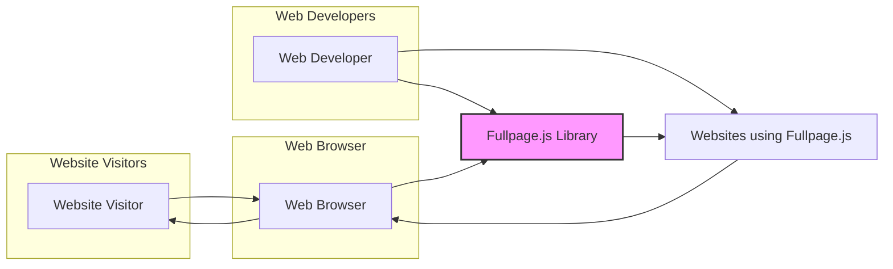

# BUSINESS POSTURE

*   Business Priorities and Goals
    *   Provide web developers with a user-friendly and efficient JavaScript library to create full-screen scrolling websites.
    *   Enable visually engaging and interactive web experiences for website visitors.
    *   Maintain a lightweight and performant library to ensure fast loading times and smooth scrolling.
    *   Offer a customizable and flexible solution to cater to diverse website design requirements.
*   Business Risks
    *   Security vulnerabilities in the library could be exploited by malicious actors, potentially affecting websites that implement it.
    *   Performance issues or bugs in the library could negatively impact the user experience and website functionality.
    *   Lack of compatibility with certain browsers or devices could limit the reach and usability of websites using the library.
    *   Poor documentation or lack of community support could hinder adoption and developer satisfaction.

# SECURITY POSTURE

*   Existing Security Controls
    *   security control: Code hosted on GitHub, allowing for community review and contributions. Implemented: GitHub repository.
    *   security control: Open-source license, promoting transparency and scrutiny of the codebase. Implemented: LICENSE file in repository.
*   Accepted Risks
    *   accepted risk: Reliance on client-side security measures implemented by websites using the library.
    *   accepted risk: Potential for misuse of the library by website developers leading to insecure configurations or implementations.
*   Recommended Security Controls
    *   security control: Implement automated security scanning (SAST) in the CI/CD pipeline to detect potential vulnerabilities in the code.
    *   security control: Regularly update dependencies to address known security issues in underlying libraries.
    *   security control: Provide security guidelines and best practices in the documentation for developers using the library.
*   Security Requirements
    *   Authentication: Not applicable for a client-side JavaScript library. Authentication is the responsibility of the web application using the library.
    *   Authorization: Not applicable for a client-side JavaScript library. Authorization is the responsibility of the web application using the library.
    *   Input Validation: The library should handle configuration options and user interactions safely. Input validation should be implemented to prevent unexpected behavior or potential vulnerabilities arising from malformed input. This primarily applies to configuration options passed to the library during initialization.
    *   Cryptography: Not applicable for the core functionality of this client-side JavaScript library. Cryptographic operations are the responsibility of the web application if needed.

# DESIGN

## C4 CONTEXT



*   Context Diagram Elements
    *   Element:
        *   Name: Website Visitor
        *   Type: Person
        *   Description: End-users who browse websites that implement the Fullpage.js library.
        *   Responsibilities: Interact with websites using a web browser, experience full-screen scrolling functionality.
        *   Security controls: Web browser security features (e.g., Content Security Policy, Same-Origin Policy), user awareness of website security practices.
    *   Element:
        *   Name: Web Developer
        *   Type: Person
        *   Description: Developers who integrate the Fullpage.js library into their websites.
        *   Responsibilities: Integrate and configure the Fullpage.js library, develop website content, ensure proper implementation and security of their websites.
        *   Security controls: Secure coding practices, input validation on website forms, server-side security controls, responsible use of third-party libraries.
    *   Element:
        *   Name: Web Browser
        *   Type: Software System
        *   Description: Software application used by website visitors to access and interact with websites. Examples include Chrome, Firefox, Safari, Edge.
        *   Responsibilities: Render web pages, execute JavaScript code, enforce web security policies, provide user interface for web interaction.
        *   Security controls: Browser security features (e.g., sandboxing, anti-malware, extension security), regular browser updates, user security settings.
    *   Element:
        *   Name: Fullpage.js Library
        *   Type: Software System
        *   Description: JavaScript library that enables full-screen scrolling functionality on websites.
        *   Responsibilities: Handle page scrolling, provide API for customization, integrate with website content, operate within the web browser environment.
        *   Security controls: Code reviews, security testing, input validation of configuration options, adherence to secure coding practices.
    *   Element:
        *   Name: Websites using Fullpage.js
        *   Type: Software System
        *   Description: Websites that have integrated the Fullpage.js library to provide full-screen scrolling experiences to their visitors.
        *   Responsibilities: Deliver website content, implement website functionality, manage user interactions, ensure overall website security.
        *   Security controls: Server-side security controls, input validation, output encoding, authentication, authorization, session management, secure deployment practices, and responsible integration of third-party libraries like Fullpage.js.

## C4 CONTAINER

```mermaid
flowchart LR
    subgraph "Web Browser"
        FPJS["Fullpage.js Library (JavaScript)"]
    end
    WB[Web Browser]
    WS[Websites using Fullpage.js (HTML, CSS, JavaScript)]

    WB --> FPJS
    FPJS --> WS
    style FPJS fill:#f9f,stroke:#333,stroke-width:2px
```

*   Container Diagram Elements
    *   Element:
        *   Name: Fullpage.js Library (JavaScript)
        *   Type: Container
        *   Description: The core JavaScript library providing full-screen scrolling functionality. It is delivered to the web browser as a static JavaScript file.
        *   Responsibilities: Handle scrolling logic, manage sections and slides, provide API for website integration, execute within the web browser's JavaScript engine.
        *   Security controls: Minification to reduce attack surface, code reviews, security testing, input validation of configuration options, adherence to secure coding practices.
    *   Element:
        *   Name: Websites using Fullpage.js (HTML, CSS, JavaScript)
        *   Type: Container
        *   Description: The web application code (HTML, CSS, and potentially other JavaScript) that integrates and utilizes the Fullpage.js library. This represents the website itself.
        *   Responsibilities: Define website structure and content, configure Fullpage.js library, handle user interactions, implement website-specific functionality.
        *   Security controls: Server-side security controls, input validation, output encoding, authentication, authorization, session management, secure deployment practices, and responsible integration of Fullpage.js library.

## DEPLOYMENT

*   Deployment Architecture Options
    *   Option 1: Static File Hosting (Common Scenario) - Fullpage.js library files are hosted on a static file server or CDN and linked to from websites.
    *   Option 2: Bundled with Website Application - Fullpage.js library is bundled as part of the website's application deployment package.

*   Detailed Deployment Architecture (Option 1: Static File Hosting)

```mermaid
flowchart LR
    subgraph "Developer Machine"
        Dev[Developer]
    end
    subgraph "Static File Server / CDN"
        CDN[Static File Server / CDN]
    end
    subgraph "Website Server"
        WebServer[Web Server]
    end
    subgraph "Website Visitor Browser"
        Browser[Website Visitor Browser]
    end

    Dev --> CDN: Upload Library Files
    WebServer --> CDN: Link to Library Files
    Browser --> WebServer: Request Website
    WebServer --> Browser: Website HTML, CSS, JS
    Browser --> CDN: Request Fullpage.js Library
    CDN --> Browser: Fullpage.js Library
    style CDN fill:#ccf,stroke:#333,stroke-width:2px
```

*   Deployment Diagram Elements
    *   Element:
        *   Name: Developer Machine
        *   Type: Infrastructure
        *   Description: Developer's local computer used for development and uploading library files.
        *   Responsibilities: Development of the library, testing, and uploading compiled library files to the static file server/CDN.
        *   Security controls: Secure development environment, access control to developer machine, secure transfer protocols for uploading files.
    *   Element:
        *   Name: Static File Server / CDN
        *   Type: Infrastructure
        *   Description: Infrastructure for hosting and serving static files, including the Fullpage.js library. CDN (Content Delivery Network) enhances performance by distributing files geographically.
        *   Responsibilities: Store and serve static files, ensure high availability and performance, handle client requests for library files.
        *   Security controls: Access control to file storage, secure server configuration, DDoS protection, HTTPS for secure delivery, content integrity checks.
    *   Element:
        *   Name: Web Server
        *   Type: Infrastructure
        *   Description: Server hosting the website application that utilizes the Fullpage.js library.
        *   Responsibilities: Serve website HTML, CSS, and JavaScript files, handle website logic, link to the Fullpage.js library hosted on the static file server/CDN.
        *   Security controls: Web server hardening, access control, application security controls, HTTPS for secure communication, regular security updates.
    *   Element:
        *   Name: Website Visitor Browser
        *   Type: Infrastructure
        *   Description: Website visitor's web browser that requests and executes website code and the Fullpage.js library.
        *   Responsibilities: Request website resources, execute JavaScript code including Fullpage.js, render web pages, provide user interface.
        *   Security controls: Browser security features, user security settings, safe browsing practices.

## BUILD

```mermaid
flowchart LR
    subgraph "Developer Machine"
        Dev[Developer]
        CodeEditor[Code Editor]
    end
    subgraph "GitHub Repository"
        Repo[GitHub Repository]
    end
    subgraph "CI/CD System (e.g., GitHub Actions)"
        CI[CI/CD System]
        BuildProcess[Build Process]
        SAST[SAST Scanner]
        Linter[Linter]
    end
    subgraph "Artifact Repository (e.g., npm)"
        ArtifactRepo[Artifact Repository]
    end

    Dev -- Code Changes --> CodeEditor
    CodeEditor -- Commit & Push --> Repo
    Repo -- Webhook --> CI
    CI --> BuildProcess: Checkout Code
    BuildProcess --> SAST: Security Scan
    BuildProcess --> Linter: Code Linting
    BuildProcess -- Build Artifacts --> ArtifactRepo: Publish Library
    style CI fill:#cce,stroke:#333,stroke-width:2px
```

*   Build Process Description
    *   Developer writes and modifies code in a code editor on their local machine.
    *   Code changes are committed and pushed to the GitHub repository.
    *   A webhook in GitHub triggers the CI/CD system (e.g., GitHub Actions) upon code changes.
    *   The CI/CD system checks out the code from the repository.
    *   The build process includes:
        *   Static Application Security Testing (SAST) scanner to identify potential security vulnerabilities in the code.
        *   Linter to enforce code style and quality standards.
        *   Build steps to compile, minify, and package the JavaScript library.
    *   The build artifacts (minified JavaScript files, distribution packages) are published to an artifact repository (e.g., npm if it were a package, or a designated storage for distribution).
*   Build Process Security Controls
    *   security control: Code review process before merging code changes to the main branch. Implemented: GitHub Pull Requests.
    *   security control: Automated SAST scanning integrated into the CI/CD pipeline to detect vulnerabilities early in the development cycle. Implemented: CI/CD system.
    *   security control: Code linting to enforce coding standards and reduce potential code quality issues. Implemented: CI/CD system.
    *   security control: Dependency scanning to identify and manage vulnerabilities in third-party libraries used by the project (if any, though less relevant for a standalone library like this). Can be added to CI/CD.
    *   security control: Secure build environment for the CI/CD system, ensuring isolation and preventing unauthorized access. Implemented: CI/CD platform security configurations.
    *   security control: Access control to the artifact repository to prevent unauthorized modifications or access to published artifacts. Implemented: Artifact repository access controls.
    *   security control: Signing of artifacts to ensure integrity and authenticity of the published library. Can be added to build process and artifact repository.

# RISK ASSESSMENT

*   Critical Business Processes
    *   Ensuring the availability and integrity of the Fullpage.js library for web developers.
    *   Maintaining the performance and functionality of websites that utilize the Fullpage.js library.
    *   Protecting the reputation and brand associated with the Fullpage.js library.
*   Data Sensitivity
    *   Data being protected: The source code of the Fullpage.js library and the compiled library files.
    *   Data sensitivity: Low to Medium. The source code is publicly available on GitHub. However, unauthorized modification or malicious injection into the library could have a medium impact on websites using it. Compiled library files served via CDN should be protected from tampering to ensure integrity.

# QUESTIONS & ASSUMPTIONS

*   BUSINESS POSTURE Questions
    *   What is the primary target audience for the Fullpage.js library (e.g., hobbyists, professional developers, specific industries)?
    *   Are there any specific performance or scalability requirements for the library?
    *   What are the key competitive advantages of Fullpage.js compared to other similar libraries?
*   BUSINESS POSTURE Assumptions
    *   The primary business goal is to provide a widely adopted and well-regarded JavaScript library for full-screen scrolling.
    *   Performance and ease of use are critical factors for user adoption.
    *   Maintaining a secure and reliable library is important for user trust and brand reputation.
*   SECURITY POSTURE Questions
    *   Are there any known security vulnerabilities reported for Fullpage.js?
    *   Are there any specific security concerns related to the configuration options or API of the library?
    *   What is the process for handling security vulnerability reports and releasing security patches?
*   SECURITY POSTURE Assumptions
    *   Security is a secondary consideration compared to functionality and ease of use, but still important for maintaining user trust.
    *   Security responsibility is shared between the library developers and website developers using the library.
    *   Common web security best practices should be followed in the development and deployment of the library.
*   DESIGN Questions
    *   Are there any plans to expand the functionality of Fullpage.js in the future?
    *   Are there any specific browser compatibility requirements or limitations?
    *   What is the intended mechanism for developers to report issues or contribute to the library?
*   DESIGN Assumptions
    *   The library is primarily designed for client-side rendering and operation within web browsers.
    *   The library is intended to be lightweight and have minimal dependencies.
    *   The library is designed to be easily integrated into various web development workflows and frameworks.