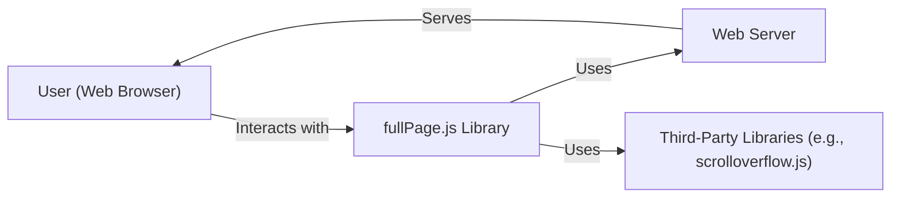
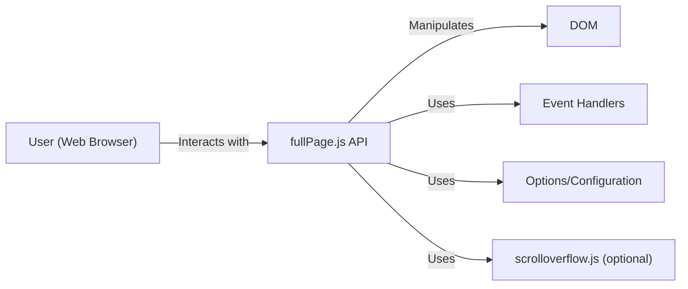
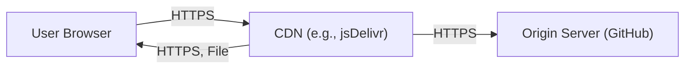
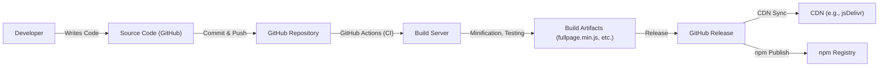

# BUSINESS POSTURE

Business Priorities and Goals:

*   Provide a simple, customizable, and easy-to-use full-screen scrolling library.
*   Maintain high compatibility across different browsers and devices (including touch devices).
*   Offer a free and open-source solution with optional paid extensions for additional features and support.
*   Foster a large and active community around the project.
*   Ensure the library is lightweight and performs well.
*   Provide clear and comprehensive documentation.

Business Risks:

*   Malicious actors could exploit vulnerabilities in the library to compromise websites using it, potentially leading to data breaches or defacement.
*   Lack of proper input sanitization could lead to Cross-Site Scripting (XSS) attacks.
*   Compatibility issues with newer browser versions or specific devices could lead to broken functionality and negative user experience.
*   The library's popularity could make it a target for supply chain attacks, where malicious code is injected into the library itself.
*   Reliance on third-party dependencies could introduce vulnerabilities if those dependencies are not properly vetted and maintained.

# SECURITY POSTURE

Existing Security Controls:

*   security control: The project is open-source, allowing for community review and contributions to identify and fix security issues. (GitHub repository)
*   security control: The library is hosted on GitHub, which provides some inherent security features like vulnerability scanning and dependency analysis. (GitHub repository)
*   security control: Basic instructions and examples are provided in the documentation, which implicitly encourages secure usage by demonstrating proper implementation. (README.md)

Accepted Risks:

*   accepted risk: The library relies on user-provided configuration and callbacks, which could be exploited if not properly sanitized by the user.
*   accepted risk: The library uses JavaScript, which is inherently susceptible to client-side attacks like XSS if not used carefully.

Recommended Security Controls:

*   security control: Implement a robust Content Security Policy (CSP) to mitigate the risk of XSS attacks.
*   security control: Provide clear and explicit guidance in the documentation on how to securely handle user input and avoid XSS vulnerabilities.
*   security control: Regularly update dependencies to address known vulnerabilities.
*   security control: Implement automated security testing, including static analysis (SAST) and dynamic analysis (DAST), to identify potential vulnerabilities.
*   security control: Consider implementing a mechanism for digitally signing releases to ensure the integrity of the library and prevent tampering.

Security Requirements:

*   Authentication: Not directly applicable, as the library itself does not handle authentication.
*   Authorization: Not directly applicable, as the library itself does not handle authorization.
*   Input Validation:
    *   The library should provide options for sanitizing user-provided configuration options, especially those related to HTML content or URLs.
    *   Developers using the library should be strongly encouraged to sanitize any user-provided data before passing it to the library.
*   Cryptography: Not directly applicable, as the library does not handle sensitive data requiring encryption. However, if URLs are used within the library, they should be validated to prevent potential injection attacks.

# DESIGN

## C4 CONTEXT

Element Descriptions:

*   Element:
    *   Name: User (Web Browser)
    *   Type: Person
    *   Description: A person interacting with a website that uses the fullPage.js library.
    *   Responsibilities: Navigates through the full-screen sections, triggers events, and interacts with the website's content.
    *   Security controls: Browser security features (e.g., same-origin policy, CSP), user-provided security software (e.g., antivirus, firewall).

*   Element:
    *   Name: fullPage.js Library
    *   Type: Software System
    *   Description: The JavaScript library that provides full-screen scrolling functionality.
    *   Responsibilities: Manages the full-screen sections, handles scrolling events, provides customization options, and interacts with the DOM.
    *   Security controls: Input validation (limited), reliance on user-provided secure configurations.

*   Element:
    *   Name: Web Server
    *   Type: Software System
    *   Description: The server that hosts the website and serves the fullPage.js library and related assets.
    *   Responsibilities: Serves HTML, CSS, JavaScript, and other assets to the user's browser.
    *   Security controls: Server-side security measures (e.g., firewalls, intrusion detection systems), secure configurations, regular security updates.

*   Element:
    *   Name: Third-Party Libraries (e.g., scrolloverflow.js)
    *   Type: Software System
    *   Description: External libraries that fullPage.js may depend on for specific functionality.
    *   Responsibilities: Provide specific features (e.g., scroll overflow handling) as required by fullPage.js.
    *   Security controls: Vetting of third-party libraries, regular updates to address vulnerabilities.

## C4 CONTAINER

Element Descriptions:

*   Element:
    *   Name: User (Web Browser)
    *   Type: Person
    *   Description: A person interacting with a website that uses the fullPage.js library.
    *   Responsibilities: Navigates through the full-screen sections, triggers events, and interacts with the website's content.
    *   Security controls: Browser security features (e.g., same-origin policy, CSP), user-provided security software (e.g., antivirus, firewall).

*   Element:
    *   Name: fullPage.js API
    *   Type: Container: JavaScript Library
    *   Description: The core component of the library, providing methods and properties for controlling the full-screen scrolling behavior.
    *   Responsibilities: Manages sections, handles scrolling, provides customization, and interacts with the DOM.
    *   Security controls: Input validation (limited), reliance on user-provided secure configurations.

*   Element:
    *   Name: DOM
    *   Type: Container: Browser DOM
    *   Description: The Document Object Model of the webpage.
    *   Responsibilities: Represents the structure and content of the webpage.
    *   Security controls: Browser's built-in DOM security mechanisms.

*   Element:
    *   Name: Event Handlers
    *   Type: Container: JavaScript Functions
    *   Description: Functions that respond to user interactions and scrolling events.
    *   Responsibilities: Handle events like scrolling, resizing, and touch interactions.
    *   Security controls: Careful handling of user input within event handlers to prevent XSS.

*   Element:
    *   Name: Options/Configuration
    *   Type: Container: JavaScript Object
    *   Description: User-provided settings that customize the behavior of the library.
    *   Responsibilities: Stores configuration values for various aspects of the library.
    *   Security controls: Input validation and sanitization of user-provided options.

*   Element:
    *   Name: scrolloverflow.js (optional)
    *   Type: Container: JavaScript Library
    *   Description: An optional external library for handling scroll overflow within sections.
    *   Responsibilities: Provides scroll overflow functionality.
    *   Security controls: Vetting of the library, regular updates.

## DEPLOYMENT

Possible Deployment Solutions:

1.  Direct inclusion via `<script>` tag from a CDN (e.g., jsDelivr, cdnjs).
2.  Inclusion via `<script>` tag from a self-hosted server.
3.  Installation via package managers (npm, yarn) and bundling with a build tool (e.g., Webpack, Parcel).
4.  Integration within a larger JavaScript framework (e.g., React, Vue, Angular).

Chosen Deployment Solution (CDN):

Element Descriptions:

*   Element:
    *   Name: User Browser
    *   Type: Software System
    *   Description: The user's web browser.
    *   Responsibilities: Requests and renders web pages, executes JavaScript.
    *   Security controls: Browser security features, user-configured security settings.

*   Element:
    *   Name: CDN (e.g., jsDelivr)
    *   Type: Infrastructure Node
    *   Description: A Content Delivery Network that caches and serves the fullPage.js library.
    *   Responsibilities: Delivers the library quickly and reliably to users worldwide.
    *   Security controls: CDN's security measures (e.g., DDoS protection, HTTPS).

*   Element:
    *   Name: Origin Server (GitHub)
    *   Type: Infrastructure Node
    *   Description: The server where the fullPage.js library is originally hosted (GitHub).
    *   Responsibilities: Stores the source code and releases of the library.
    *   Security controls: GitHub's security features, secure repository management.

## BUILD

The build process for fullPage.js is relatively simple, as it's primarily a JavaScript library. However, there are steps involved in preparing releases and distributing the library.

Build Process Description:

1.  Developer writes code and commits changes to the local repository.
2.  Changes are pushed to the GitHub repository.
3.  GitHub Actions (or a similar CI/CD system) is triggered.
4.  The build server checks out the code.
5.  Build steps are executed:
    *   Dependencies are installed (if any).
    *   The code is linted (e.g., using ESLint) to check for code style and potential errors.
    *   The code is minified (e.g., using UglifyJS) to reduce file size.
    *   Tests are run (if any).
6.  Build artifacts (e.g., `fullpage.min.js`, `fullpage.js`, `fullpage.css`) are created.
7.  A new release is created on GitHub, including the build artifacts.
8.  The CDN (e.g., jsDelivr) automatically syncs with the GitHub release, making the new version available.
9.  The package is published to the npm registry.

Security Controls in Build Process:

*   security control: Code linting helps enforce code style and identify potential security issues.
*   security control: Minification reduces the attack surface by removing unnecessary characters and obfuscating the code (slightly).
*   security control: GitHub Actions (or similar CI/CD) provides a controlled and automated build environment.
*   security control: Publishing to npm with signed commits and two-factor authentication enhances supply chain security.
*   security control: Using a reputable CDN adds another layer of security and availability.

# RISK ASSESSMENT

Critical Business Processes:

*   Providing a functional and reliable full-screen scrolling experience to users.
*   Maintaining the reputation and trust of the library and its developers.
*   Ensuring the continued development and maintenance of the project.

Data to Protect:

*   Source code of the library (sensitivity: low - public repository).
*   User data (if any) passed to the library through configuration options or event handlers (sensitivity: depends on the user's implementation - potentially high). The library itself does not store user data, but the *usage* of the library might involve sensitive data. This is the responsibility of the website implementing fullPage.js, not the library itself.
*   Website content displayed using the library (sensitivity: depends on the website - potentially high). Again, this is the responsibility of the website implementing fullPage.js.

# QUESTIONS & ASSUMPTIONS

Questions:

*   Are there any specific security audits or penetration tests performed on the library?
*   What is the process for handling reported security vulnerabilities?
*   Are there any plans to implement more robust input validation or sanitization within the library itself?
*   Is there a documented process for managing and updating dependencies?
*   Are there any specific security requirements or compliance standards that the library needs to meet?

Assumptions:

*   BUSINESS POSTURE: The primary goal is to provide a free and open-source library, with a focus on ease of use and wide compatibility. Security is important, but not at the expense of usability or simplicity.
*   SECURITY POSTURE: The library relies heavily on the user implementing secure coding practices when using the library. The library itself provides minimal built-in security features.
*   DESIGN: The library is designed to be lightweight and performant, with a focus on core functionality. Optional extensions provide additional features. The deployment model primarily relies on CDNs for distribution. The build process is relatively simple, with basic linting and minification.