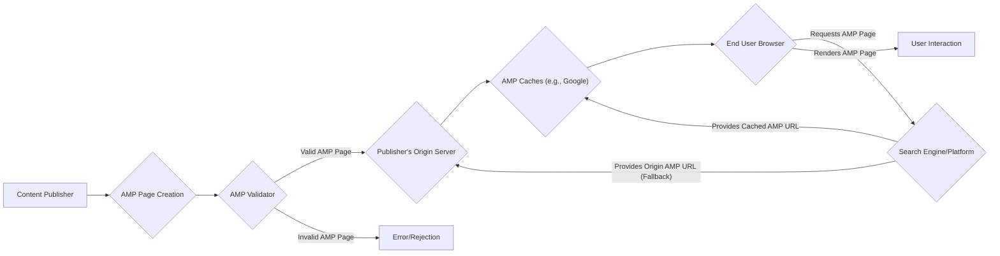
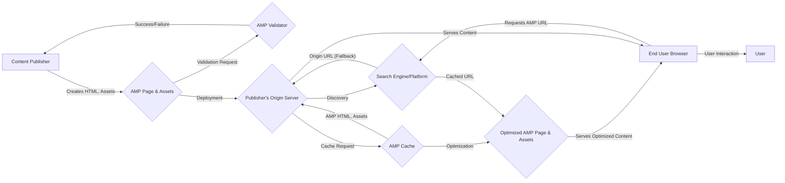

# Project Design Document: AMP HTML

**Version:** 1.1
**Date:** October 26, 2023
**Author:** Gemini (AI Language Model)

## 1. Introduction

This document provides a detailed design overview of the AMP HTML project, as represented by the codebase at [https://github.com/ampproject/amphtml](https://github.com/ampproject/amphtml). This document aims to provide a comprehensive understanding of the project's architecture, key components, and data flow, which will serve as the foundation for subsequent threat modeling activities. This revision includes more granular detail and specific security considerations for each component.

## 2. Goals and Objectives

The primary goals of the AMP HTML project are to:

*   Provide a framework for creating web pages that are consistently fast, performant, and user-first.
*   Ensure a predictable and reliable user experience across various devices and platforms.
*   Enable content to be easily discoverable and distributed across the web.
*   Offer a standardized approach to web development that promotes best practices for web performance.

The objective of this design document is to:

*   Clearly articulate the architecture and components of the AMP HTML project with increased detail.
*   Describe the data flow within the AMP ecosystem, highlighting data transformations and potential vulnerabilities.
*   Identify key security considerations and potential vulnerabilities for each component based on the design.
*   Provide a robust basis for conducting thorough threat modeling exercises.

## 3. Architectural Overview

The AMP HTML ecosystem involves several key players and processes. At a high level, the architecture can be visualized as follows:

This diagram illustrates the flow: content publishers create AMP pages, which are validated. Valid pages are hosted on the publisher's server and can be cached by AMP caches for faster delivery to end users who discover them through search engines or other platforms.

## 4. Detailed Architecture

The AMP HTML project encompasses several interconnected components and processes, each with specific responsibilities:

*   **Content Publisher:**  The entity responsible for creating and hosting AMP HTML documents. This involves writing the HTML markup, incorporating AMP components, and ensuring the page is valid.
*   **AMP Page Creation:** The process of authoring an HTML document that adheres to the AMP HTML specification. This includes using allowed HTML tags, specific AMP components, and the required `<script>` tag for `amp.js`.
*   **AMP HTML Format:** A restricted subset of HTML with custom elements and properties designed for performance and security. It disallows certain HTML features (like author-written JavaScript) and requires specific tags for asynchronous resource loading.
*   **AMP JavaScript Library (`amp.js`):** The core JavaScript library that implements AMP's performance optimizations, manages resource loading, enforces AMP's rules in the browser, and provides the functionality for AMP components.
*   **AMP Components:** Custom HTML elements (e.g., `<amp-img>`, `<amp-video>`, `<amp-script>`) that provide enhanced functionality and performance optimizations. These components often have specific security considerations and are designed to prevent common web vulnerabilities.
*   **AMP Extensions:** Optional JavaScript modules that provide additional functionality beyond the core AMP library (e.g., analytics, social media integrations). These extensions must also adhere to AMP's performance and security guidelines and are loaded on demand.
*   **AMP Validator:** A tool (available as a library, browser extension, command-line tool, and online service) that programmatically checks if an HTML document conforms to the AMP HTML specification. Validation is crucial for AMP pages to be eligible for caching and to ensure predictable behavior.
*   **Publisher's Origin Server:** The web server hosting the original AMP HTML documents created by the content publisher. This server is responsible for serving the AMP pages when a cached version is not available or when directly accessed.
*   **AMP Caches:** Content Delivery Networks (CDNs), such as Google's AMP Cache, that crawl, cache, and serve valid AMP pages. Caching is a key factor in AMP's performance. These caches often perform transformations and optimizations on the AMP pages, such as image resizing and format conversion.
*   **Search Engines/Platforms:** Platforms like Google Search, Twitter, and others that discover and link to AMP pages. They often prioritize and display AMP pages due to their performance characteristics. They may also be responsible for directing users to cached versions of AMP pages.
*   **End User Browser:** The web browser used by the user to access and render AMP pages. `amp.js` within the browser is responsible for enforcing AMP's rules and managing the lifecycle of the AMP page.

## 5. Data Flow

The typical data flow for an AMP page involves the following steps, with specific data types being transferred:

1. **Content Creation (HTML, Images, Videos, etc.):** A content publisher creates an HTML document adhering to the AMP HTML specification, including associated assets like images and videos.
2. **Validation Request (AMP HTML):** The publisher or a build process sends the AMP HTML document to the AMP Validator for verification.
3. **Validation Response (Success/Failure, Error Messages):** The AMP Validator returns a response indicating whether the document is valid and, if not, provides specific error messages.
4. **Deployment (AMP HTML, Assets):** The valid AMP page and its associated assets are deployed to the publisher's origin server.
5. **Discovery (AMP HTML URL):** Search engines and other platforms discover the AMP page, often through the `<link rel="amphtml">` tag on the canonical page, obtaining the URL of the AMP version.
6. **Cache Request (AMP HTML):** AMP caches crawl and request valid AMP pages from the publisher's origin server.
7. **Cache Response (AMP HTML, Assets):** The publisher's origin server responds with the AMP HTML document and its associated assets.
8. **Caching and Optimization (Optimized AMP HTML, Assets):** AMP caches store the AMP page and may perform optimizations like image resizing, format conversion (e.g., to WebP), and minification of HTML and CSS.
9. **User Request (AMP Page URL):** An end user clicks on a link to an AMP page, often from a search result on a search engine or platform.
10. **Serving from Cache (Optimized AMP HTML, Assets):** If the AMP page is cached, the AMP cache serves the optimized version of the page and its assets to the user's browser.
11. **Serving from Origin (AMP HTML, Assets - Fallback):** If the AMP page is not cached or the cache is unavailable, the user's browser requests the page directly from the publisher's origin server.
12. **Rendering (DOM, CSSOM, JavaScript Execution):** The user's browser receives the AMP HTML, parses it to build the DOM, applies CSS, and executes `amp.js` to manage resource loading and ensure performance.
13. **User Interaction (User Input, Events):** The user interacts with the AMP page, generating events that are handled by `amp.js` and potentially AMP components.

## 6. Key Components and their Security Considerations

*   **AMP HTML Format:**
    *   **Security Consideration:** While the restricted nature limits certain attacks, improper sanitization or parsing of allowed HTML attributes could lead to XSS. For example, carefully crafted URLs in `<amp-img>` `src` attributes could potentially be exploited.
    *   **Security Consideration:**  Bugs in the browser's rendering engine when handling specific combinations of allowed AMP HTML features could lead to unexpected behavior or vulnerabilities.
*   **AMP JavaScript Library (`amp.js`):**
    *   **Security Consideration:**  Vulnerabilities in `amp.js` could allow attackers to bypass AMP's security restrictions, potentially leading to XSS, information disclosure, or other malicious activities. Careful review of the library's code and dependencies is crucial.
    *   **Security Consideration:**  The library's handling of user input and interactions with external resources (e.g., fetching data for components) needs to be robust against injection attacks and SSRF.
    *   **Security Consideration:**  The mechanism for loading and executing AMP extensions needs to be secure to prevent malicious extensions from compromising the page.
*   **AMP Components:**
    *   **Security Consideration:**  Each component is a potential attack surface. For example, `<amp-iframe>` needs strict sandboxing to prevent the embedded iframe from accessing the parent page's context.
    *   **Security Consideration:** Components that fetch external resources (e.g., `<amp-list>`) need to validate the responses and prevent issues like data injection or SSRF.
    *   **Security Consideration:** Components that handle user input (e.g., `<amp-form>`) must be protected against XSS and other input validation vulnerabilities. Ensure proper handling of sensitive data submitted through forms.
*   **AMP Extensions:**
    *   **Security Consideration:**  Malicious or poorly written extensions could introduce vulnerabilities. A robust review process and potentially sandboxing for extensions are necessary.
    *   **Security Consideration:**  The mechanism for loading extensions should prevent the loading of unauthorized or tampered extensions.
*   **AMP Validator:**
    *   **Security Consideration:**  Bypasses or vulnerabilities in the validator could allow malicious or non-compliant AMP pages to be considered valid, leading to their caching and serving.
    *   **Security Consideration:**  The validator itself needs to be protected against denial-of-service attacks if it's exposed as an online service.
*   **Publisher's Origin Server:**
    *   **Security Consideration:**  Standard web server security practices apply. Vulnerabilities on the origin server could allow attackers to modify the AMP pages before they are cached.
    *   **Security Consideration:**  Proper authentication and authorization are needed to prevent unauthorized modification or deletion of AMP pages.
*   **AMP Caches:**
    *   **Security Consideration:**  Compromise of an AMP cache could lead to the widespread distribution of malicious content (cache poisoning). Strong security measures are essential.
    *   **Security Consideration:**  The cache needs to ensure the integrity of the cached content and prevent tampering.
    *   **Security Consideration:**  The process of fetching and updating cached content from origin servers needs to be secure to prevent man-in-the-middle attacks.
*   **Search Engines/Platforms:**
    *   **Security Consideration:**  While not directly part of the AMP codebase, vulnerabilities in how these platforms handle and serve AMP links could be exploited. For example, issues with URL handling or redirection.
*   **End User Browser:**
    *   **Security Consideration:**  The security of the AMP framework relies on the security of the user's browser. Browser vulnerabilities could potentially be exploited in the context of rendering AMP pages.

## 7. Assumptions and Constraints

*   This design document is based on the current understanding of the AMP HTML project as represented by the provided GitHub repository as of the current date.
*   The focus is on the core AMP HTML framework and its immediate ecosystem. External services and integrations are considered where they directly impact the core functionality.
*   It is assumed that the official AMP documentation and specifications are the primary sources of truth for the project's behavior and security guidelines.
*   The threat modeling exercise based on this document will need to consider the specific context of deployment and usage, including the specific AMP cache being used.

## 8. Future Considerations

*   The AMP project is continuously evolving. New features, components, and extensions are regularly added. Future design changes and additions will need to be reflected in updated versions of this document and considered in ongoing threat modeling efforts.
*   Emerging web technologies (e.g., Web Components, Privacy-Preserving APIs) and security threats will necessitate ongoing review and adaptation of the AMP architecture and security measures.
*   The increasing complexity of web applications and the demand for richer user experiences may lead to further evolution of the AMP specification and components, potentially introducing new security challenges. For example, the introduction of features that allow more dynamic content or interaction with third-party services will require careful security analysis.
*   The ongoing development of privacy-focused web technologies and regulations will likely impact the design and implementation of AMP, particularly in areas like analytics and user tracking.
