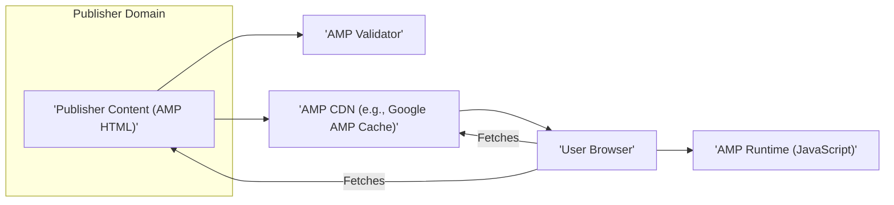
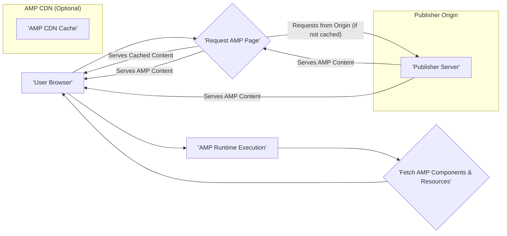

# Project Design Document: AMP HTML Framework

**Version:** 1.1
**Date:** October 26, 2023
**Author:** AI Software Architecture Expert

## 1. Introduction

This document provides an enhanced architectural design overview of the AMP HTML framework (Accelerated Mobile Pages). Building upon the previous version, this document offers greater detail and clarity, serving as a robust foundation for subsequent threat modeling activities. It aims to equip security professionals with a comprehensive understanding of the system's components, data flows, and potential vulnerabilities.

## 2. Project Overview

The AMP (Accelerated Mobile Pages) Project is an open-source HTML framework meticulously designed to enable the creation of web pages that are not only visually engaging and fluid but also load with near-instantaneous speed for users. AMP's primary objective is to significantly enhance the mobile web experience by strictly adhering to a defined set of HTML, CSS, and JavaScript constraints and by promoting established best practices in web development.

**Key Goals of AMP:**

*   **Unrivaled Performance:** Guarantee exceptionally fast loading times, leading to a superior user experience and reduced bounce rates.
*   **Commitment to the Open Web:** Leverage and extend existing web technologies, ensuring compatibility and ease of integration.
*   **Facilitating Distribution:** Enable seamless distribution and efficient caching of content by various platforms and intermediaries.
*   **Elevated User Experience:** Deliver a consistent, reliable, and high-quality experience for all users, regardless of device or network conditions.

## 3. Architectural Overview

The AMP ecosystem is composed of several interconnected components that collaborate to deliver highly optimized web content. The core architecture can be visualized as follows:

**Key Architectural Components:**

*   **Publisher Content (AMP HTML):** This forms the bedrock of the AMP framework. Publishers meticulously craft web pages using a restricted yet powerful subset of HTML, incorporating specific custom elements known as AMP components, and employing a streamlined approach to CSS styling. A notable constraint is the general prohibition of author-written JavaScript, with the exception of the AMP Runtime.
*   **AMP Validator:** A critical component responsible for rigorously ensuring that AMP HTML documents strictly conform to the AMP specification. Validation can occur at various stages, including build time during development, or when a CDN ingests AMP content for distribution.
*   **AMP Runtime (JavaScript):** A sophisticated JavaScript library provided and maintained by the AMP Project. This runtime is instrumental in managing resource loading, orchestrating the rendering process, and ensuring the performance characteristics that define AMP pages. It intelligently handles asynchronous loading of resources and proactively prevents performance bottlenecks.
*   **AMP CDN (Content Delivery Network):** While optional, the utilization of AMP CDNs (such as the Google AMP Cache) is highly recommended. These CDNs proactively fetch and cache valid AMP content. They apply further optimizations, including image optimization and minification, and serve the content from strategically distributed geographic locations, thereby guaranteeing rapid delivery to users worldwide.
*   **User Browser:** The end-user's web browser, which initiates requests for and subsequently renders AMP content.

## 4. Detailed Component Descriptions

This section provides a more in-depth examination of the key components identified in the architectural overview:

*   **Publisher Content (AMP HTML):**
    *   **Description:**  Consists of standard HTML markup, but with specific limitations and extensions as defined by the comprehensive AMP specification.
    *   **Key Features:**
        *   A carefully curated and limited set of allowed HTML tags to ensure performance and predictability.
        *   Specialized custom HTML elements (AMP components) designed to provide common functionalities, such as image handling (`<amp-img>`) and video embedding (`<amp-video>`), in an optimized manner.
        *   Restrictions on inline styles concerning size and complexity to maintain rendering performance.
        *   Allowance of external stylesheets, but with specific constraints to prevent performance degradation.
        *   Strict prohibition of author-written JavaScript (except within sandboxed iframes) to enforce performance and security.
    *   **Security Relevance:**  Presents a potential attack surface for Cross-Site Scripting (XSS) if publisher-authored content is not diligently sanitized or if vulnerabilities exist within the implementation of custom AMP components.

*   **AMP Validator:**
    *   **Description:**  A vital tool and library that programmatically verifies whether an HTML document adheres precisely to the stringent rules of the AMP specification.
    *   **Key Features:**
        *   Available in multiple forms, including a command-line tool for automated checks, a browser extension for real-time validation during development, and a library for seamless integration into build processes and content management systems.
        *   Performs thorough static analysis of HTML structure, CSS rules, and attributes to identify deviations from the AMP specification.
        *   Generates detailed reports of any identified violations, aiding developers in correcting non-compliant code.
    *   **Security Relevance:**  Absolutely critical for upholding AMP's security and performance guarantees. Any circumvention or vulnerabilities within the validator could potentially lead to the delivery of non-compliant and potentially malicious content to end-users.

*   **AMP Runtime (JavaScript):**
    *   **Description:**  A sophisticated and carefully engineered JavaScript library that is loaded onto AMP pages. Its primary responsibility is to manage the entire lifecycle of AMP components, orchestrate resource loading with optimal efficiency, and ensure the overall performance characteristics that define the AMP experience.
    *   **Key Features:**
        *   Implements asynchronous loading of resources to prevent blocking the main rendering thread and improve perceived performance.
        *   Intelligently prioritizes the loading of resources that are currently visible within the user's viewport, further enhancing perceived speed.
        *   Employs sandboxing techniques for iframes to isolate potentially risky content and prevent it from interfering with the main page.
        *   Manages the initialization, updates, and destruction of AMP components throughout the page's lifecycle.
        *   Handles user interactions and gestures in a performant and predictable manner.
    *   **Security Relevance:**  Represents a complex JavaScript codebase that necessitates rigorous security measures to prevent vulnerabilities. Exploitable flaws in the runtime could potentially lead to Cross-Site Scripting (XSS) attacks, unauthorized information disclosure, or other client-side security breaches.

*   **AMP CDN (Content Delivery Network):**
    *   **Description:**  A distributed network of strategically located servers that cache and efficiently deliver valid AMP content to users across the globe.
    *   **Key Features:**
        *   Proactively fetches and stores valid AMP HTML content from publisher origin servers.
        *   Applies further performance optimizations, such as aggressive image optimization (e.g., format conversion, compression) and code minification (removal of unnecessary characters).
        *   Serves content from servers geographically closest to the requesting user, minimizing latency and improving loading times.
        *   Typically enforces HTTPS delivery, ensuring secure communication between the CDN and the user's browser.
        *   May perform additional validation checks on ingested content to ensure compliance.
    *   **Security Relevance:**  Must guarantee the integrity and authenticity of the cached content to prevent the serving of tampered or malicious AMP pages. Robust handling of HTTPS certificates and rigorous origin verification mechanisms are paramount. Vulnerabilities in the CDN infrastructure itself could have widespread security implications.

## 5. Data Flow

The typical sequence of events when a user accesses an AMP page unfolds as follows:

1. **User Discovery:** A user encounters an AMP link, typically through a search engine results page, a social media platform, or a referring website.
2. **Request to CDN (Conditional):** If the AMP content is configured to be served via an AMP CDN, the user's browser initiates a request for the page from the CDN's infrastructure.
3. **CDN Serving (Conditional):** If the requested content is present in the CDN's cache, the CDN directly serves the optimized AMP HTML, associated CSS, and other resources to the user's browser.
4. **Direct Request to Publisher (If CDN Miss):** If the content is not yet cached or the CDN is not utilized, the user's browser directly requests the AMP page from the publisher's origin server.
5. **Publisher Serving:** The publisher's web server processes the request and serves the AMP HTML, CSS, and any necessary associated resources.
6. **Browser Rendering:** The user's browser receives the AMP content and begins the rendering process.
7. **AMP Runtime Execution:** As the browser parses the HTML, it encounters and executes the AMP Runtime JavaScript. This runtime then takes over, responsible for:
    *   Fetching and rendering the various AMP components present on the page.
    *   Managing the efficient loading of all required resources, adhering to AMP's performance guidelines.
    *   Handling user interactions and dynamic updates on the page.
8. **Resource Loading:** The AMP Runtime may initiate requests for additional resources (such as images, videos, or data for dynamic components) as needed, always respecting the performance-centric principles of AMP.

## 6. Security Considerations (Detailed for Threat Modeling)

This section expands upon the initial security considerations, providing more specific examples of potential threats and vulnerabilities that should be thoroughly investigated during threat modeling:

*   **Cross-Site Scripting (XSS):**
    *   **Publisher-Introduced XSS:**  Vulnerabilities can arise from improperly sanitized user-generated content or developer errors within the publisher's AMP HTML, particularly when using features like `<amp-script>` (iframes) or dynamic content injection.
    *   **AMP Runtime Vulnerabilities:**  Bugs or design flaws within the AMP Runtime JavaScript itself could be exploited to inject and execute malicious scripts within the context of an AMP page.
    *   **CDN Compromise:** If an AMP CDN is compromised, attackers could potentially inject malicious scripts into cached AMP pages, affecting a large number of users.
*   **Content Security Policy (CSP):**  AMP heavily relies on CSP to mitigate XSS risks by restricting the sources from which resources can be loaded. Misconfigured or overly permissive CSP directives can weaken this defense.
*   **Subresource Integrity (SRI):**  Ensuring the integrity of the AMP Runtime and other externally hosted resources (e.g., fonts, analytics scripts) through SRI is crucial. Without it, compromised CDNs or hosting providers could serve tampered resources.
*   **Clickjacking:**  Attackers might attempt to embed AMP pages within malicious iframes on attacker-controlled websites to trick users into performing unintended actions (e.g., liking a page, making a purchase). Robust frame busting techniques are necessary.
*   **Data Integrity:**  Mechanisms are needed to ensure that AMP content served by CDNs or publisher origins has not been maliciously altered in transit or at rest. This includes using HTTPS and potentially content signing.
*   **Denial of Service (DoS):**
    *   **CDN Level Attacks:**  Attackers might target AMP CDNs with high volumes of requests to overwhelm their infrastructure and prevent legitimate users from accessing content.
    *   **Publisher Origin Attacks:**  While AMP aims to offload traffic to CDNs, publishers' origin servers could still be targeted if the CDN's caching is ineffective or during cache misses.
*   **Bypass of AMP Restrictions:**  Attackers may try to circumvent AMP's limitations on JavaScript or resource loading to inject arbitrary scripts or load unoptimized, potentially malicious content. This could involve exploiting vulnerabilities in the validator or the runtime.
*   **Vulnerabilities in AMP Components:**  Security flaws within the implementation of specific AMP components (e.g., image handling, ad integrations) could be exploited to cause various issues, including XSS or information disclosure.
*   **CDN Security:**  The security of the AMP CDN infrastructure itself is paramount. This includes robust access controls, encryption of sensitive data, regular security audits, and timely patching of vulnerabilities.
*   **Validation Bypass:**  Exploiting weaknesses or inconsistencies in the AMP Validator logic could allow attackers to serve non-compliant or malicious content that bypasses AMP's security checks.

## 7. Technology Stack

The AMP project leverages a diverse range of technologies for its development, deployment, and operation:

*   **Core Languages:** HTML (for content structure), CSS (for styling), JavaScript (for the AMP Runtime and component logic), Go (used for some backend tooling, the AMP Validator implementation, and infrastructure components).
*   **JavaScript Libraries and Frameworks:**  A custom-built JavaScript runtime specifically for AMP, various utility libraries, and potentially frameworks for building specific AMP components.
*   **Build Tools and Testing Frameworks:**  Node.js based build tools (e.g., npm, yarn), testing frameworks for JavaScript (e.g., Mocha, Jest), and potentially Go testing frameworks.
*   **Infrastructure (for AMP CDN examples like Google AMP Cache):**  Large-scale, globally distributed infrastructure likely involving:
    *   Load balancers (e.g., Google Cloud Load Balancing).
    *   Caching servers (e.g., Varnish, Nginx with caching modules).
    *   Origin servers for fetching content.
    *   Content optimization services (e.g., image optimizers).
    *   Potentially databases for metadata and configuration.
*   **Validation Tools:**  The AMP Validator is primarily implemented in Go, with JavaScript versions available for client-side validation in browsers and build processes.

## 8. Deployment Model

AMP content can be deployed and served to users through several distinct models:

*   **Publisher-Served AMP:**  Publishers directly host valid AMP HTML pages on their own web servers. In this model, when a user clicks on an AMP link, their browser directly requests the page from the publisher's domain. This approach gives publishers full control over their content but requires them to handle all serving and optimization.
*   **CDN-Served AMP (e.g., Google AMP Cache):**  In this widely adopted model, AMP content is cached and served by a dedicated AMP CDN. Publishers typically configure their servers to allow the CDN to crawl and cache their AMP pages. When a user clicks on an AMP link that is served via a CDN, their browser fetches the optimized content from the CDN's infrastructure. This model offers significant performance benefits due to caching and geographic distribution.
*   **Hybrid Deployment:**  Some publishers might employ a hybrid approach, serving some AMP content directly while leveraging a CDN for other parts or for specific purposes.

## 9. Threat Modeling Scope

For the purpose of this threat modeling exercise, we will focus on the following components and interactions as being within the scope of our analysis:

*   **Publisher-authored AMP HTML content and its potential vulnerabilities.**
*   **The AMP Validator:**  Both the client-side (browser-based) and server-side implementations, focusing on its effectiveness in preventing malicious content.
*   **The AMP Runtime JavaScript library:**  Analyzing potential vulnerabilities within its code and its interactions with the browser environment.
*   **The infrastructure of a representative AMP CDN (e.g., Google AMP Cache):**  Specifically focusing on the processes of content ingestion, caching mechanisms, content delivery, and the security measures in place to protect the CDN infrastructure itself.
*   **The interaction between the user's browser and AMP content:**  Considering both publisher-served and CDN-served scenarios, including the execution of the AMP Runtime and the loading of resources.

The following items are explicitly considered **out of scope** for this initial threat modeling exercise to maintain focus and manage complexity:

*   The specific infrastructure of individual publishers beyond the basic serving of valid AMP content.
*   Third-party integrations and APIs that may be used within AMP pages (e.g., analytics providers, social media embeds). These would require separate, focused threat modeling efforts.
*   The internal workings and security of search engines or other platforms that discover, index, and link to AMP content.
*   The process of AMP component development and the security of the individual component codebases (this could be a separate area of focus).

## 10. Conclusion

This enhanced design document provides a more comprehensive and detailed understanding of the AMP HTML framework's architecture, its constituent components, and the intricate data flows within the system. By elaborating on the initial security considerations and clearly defining the scope for threat modeling, this document serves as a robust and valuable resource for security professionals embarking on a thorough threat analysis of the AMP ecosystem. This deeper understanding is crucial for identifying potential security vulnerabilities and designing effective mitigation strategies to ensure the security and integrity of AMP-powered web experiences.