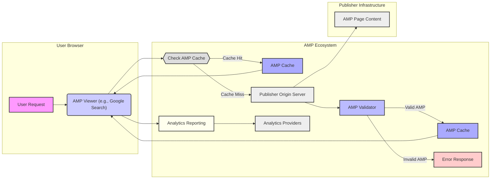

## Project Design Document: AMP HTML (Improved)

**1. Introduction**

This document provides an enhanced design overview of the AMP HTML project (Accelerated Mobile Pages), based on the information available at [https://github.com/ampproject/amphtml](https://github.com/ampproject/amphtml). This iteration aims for improved clarity and detail, specifically to facilitate comprehensive threat modeling. It outlines the core architectural components, data flows, and technologies inherent in the AMP project.

**2. Goals and Objectives**

The fundamental goals driving the AMP HTML project are:

*   **Performance Optimization:** To significantly enhance the loading speed of web pages, particularly on mobile devices.
*   **Enhanced User Experience:** To deliver a smoother and more responsive browsing experience for users.
*   **Wider Content Distribution:** To enable seamless discovery and distribution of content across diverse platforms and applications.
*   **Standardized Development Framework:** To offer a consistent and performant framework for building web content.

**3. System Architecture**

The AMP ecosystem is structured around several interacting components:

*   **AMP Pages:**
    *   HTML documents adhering to the restricted AMP specification.
    *   Utilize a limited set of HTML tags and custom AMP components.
    *   Restrictions on arbitrary JavaScript to ensure performance and security.
*   **AMP Validator:**
    *   A critical service responsible for verifying the compliance of AMP pages against the official AMP specification.
    *   Ensures adherence to performance guidelines and security constraints.
    *   Available as a browser extension, command-line tool, and library.
*   **AMP Caches:**
    *   Content Delivery Networks (CDNs) that store and serve valid AMP pages.
    *   Perform optimizations and transformations for faster content delivery.
    *   Google's AMP Cache is a prominent example, but other implementations exist.
*   **AMP JS Library:**
    *   A JavaScript library providing core functionality for AMP components.
    *   Manages resource loading, rendering, and enforces performance constraints.
    *   Ensures asynchronous loading and prioritizes critical resources.
*   **Publisher Origin Servers:**
    *   The web servers where AMP pages are initially created and hosted by content publishers.
    *   Responsible for serving the original AMP content.
*   **AMP Viewers:**
    *   Applications or platforms that render and display AMP pages.
    *   Examples include Google Search, Twitter, and other mobile applications.
    *   Often integrate AMP pages within their own user interfaces.
*   **AMP Extensions:**
    *   Optional, modular components that extend the functionality of AMP pages.
    *   Examples include support for carousels, lightboxes, analytics, and social media integrations.

**4. Technology Stack**

The AMP project leverages the following key technologies:

*   **Core Web Technologies:** HTML5, CSS3, JavaScript (with limitations).
*   **Build and Management Tools:** Node.js, npm or yarn, gulp, webpack.
*   **Testing Infrastructure:** Mocha, Chai, Karma for unit and integration testing.
*   **Server-Side Technologies (for Validator and Caches):**
    *   Primarily Go for Google's AMP Cache and core validator components.
    *   Other languages may be used for alternative cache implementations.
*   **Data Storage (for Caches):** Distributed caching systems for efficient content retrieval.
*   **Networking and Security:** HTTPS for secure communication.
*   **Content Delivery Network Infrastructure:**  Utilizes CDNs like Akamai, Cloudflare, and Google Cloud CDN.

**5. Security Considerations**

Security is a fundamental aspect of the AMP framework. Key security mechanisms and considerations include:

*   **Strict Content Security Policy (CSP):** Enforced to mitigate Cross-Site Scripting (XSS) attacks by controlling the sources from which the page can load resources.
*   **Subresource Integrity (SRI):** Implemented to ensure that resources fetched from CDNs have not been tampered with by verifying cryptographic hashes.
*   **Mandatory HTTPS:** All AMP pages must be served over HTTPS to ensure secure communication and prevent man-in-the-middle attacks.
*   **Rigorous Input Validation via AMP Validator:** The validator acts as a gatekeeper, preventing invalid or potentially malicious code from being served through AMP caches. This includes validating HTML structure, attribute usage, and JavaScript restrictions.
*   **Limited and Controlled JavaScript Execution:** Restrictions on custom JavaScript significantly reduce the attack surface and improve performance predictability. Only specific AMP components and libraries are allowed.
*   **Origin Isolation through AMP Caches:** AMP caches serve content from their own domain (e.g., `cdn.ampproject.org`), isolating the cached content from the publisher's origin. This helps prevent certain types of attacks that rely on shared origin contexts.
*   **Cache Poisoning Prevention Mechanisms:** Implementations within AMP caches are designed to prevent attackers from injecting malicious content into the cache. This includes verifying the integrity of fetched content and using secure update mechanisms.
*   **Regular Security Audits and Vulnerability Management:** The AMP project undergoes periodic security reviews and has processes for addressing reported vulnerabilities.
*   ** sandboxed iframes for certain components:** Some AMP components utilize sandboxed iframes to further isolate potentially risky code.

**6. Deployment Model**

The deployment lifecycle of AMP pages involves these key stages:

*   **Content Creation and Authoring:** Publishers create AMP pages on their web servers, adhering to the AMP specification.
*   **Validation Process:** Publishers utilize the AMP Validator (browser extension, command-line tool, or integrated into build processes) to ensure their AMP pages are valid and compliant.
*   **Discovery and Linking:** AMP pages are linked from canonical HTML pages using the `<link rel="amphtml">` tag. Search engines and other platforms discover these links through web crawling.
*   **Caching and Distribution:** When a user requests an AMP page, AMP viewers (e.g., Google Search) may fetch and cache the page, either from the publisher's origin server or directly from an AMP cache.
*   **Serving to End Users:** The AMP viewer serves the cached and optimized AMP page to the user, often within a streamlined viewing experience.

**7. Data Flow Diagram**

**Data Flow Description:**

*   A user initiates a request for a web page through their browser.
*   The AMP Viewer (e.g., Google Search) intercepts the request and checks if an AMP version of the page is available.
*   The viewer queries the AMP Cache to see if the requested page is already cached.
    *   **Cache Hit:** If the page is found in the cache, it is served directly to the viewer.
    *   **Cache Miss:** If the page is not in the cache, the viewer fetches the AMP page from the Publisher Origin Server.
*   The fetched AMP page is then passed to the AMP Validator for verification against the AMP specification.
    *   **Valid AMP:** If the page is valid, it is stored in the AMP Cache for future requests and served to the viewer.
    *   **Invalid AMP:** If the page is invalid, an error response is generated, and the page is not cached.
*   The AMP Viewer renders the content to the user.
*   Optionally, analytics data related to the page view and user interactions is sent to configured Analytics Providers.

**8. Key Stakeholders**

*   **AMP Project Developers and Contributors:** The individuals and teams responsible for developing and maintaining the AMP framework, including the core libraries, validator, and documentation.
*   **Content Publishers:** Website owners, bloggers, and news organizations who implement AMP on their sites to improve performance and distribution.
*   **End Users:** Individuals who consume AMP content and benefit from faster loading times and improved user experience.
*   **Platform Integrators:** Companies and organizations that integrate AMP into their platforms, such as search engines, social media platforms, and content aggregators.
*   **Security Researchers and Auditors:** Individuals and organizations who analyze the AMP project for potential security vulnerabilities and provide feedback.
*   **Infrastructure Providers:** Companies providing the underlying infrastructure for AMP Caches and related services.

**9. Future Considerations**

*   **Continued Evolution of AMP Specifications:** The AMP project is actively developed, with ongoing additions of new features, components, and improvements to existing functionalities.
*   **Decentralization and Federation of Caching:** Exploring and implementing more diverse and decentralized AMP caching solutions to reduce reliance on a single provider.
*   **Enhancements to Security Features and Mitigation Strategies:** Continuously improving the security posture of the AMP framework to address emerging threats and vulnerabilities.
*   **Integration with Emerging Web Technologies and Standards:** Adapting AMP to work seamlessly with new web standards and browser capabilities.
*   **Improved Developer Experience:** Efforts to simplify the development and deployment process for AMP pages.

This improved design document provides a more detailed and structured overview of the AMP HTML project, emphasizing aspects relevant for thorough threat modeling. The enhanced descriptions and the refined data flow diagram aim to provide a clearer understanding of the system's components and interactions.