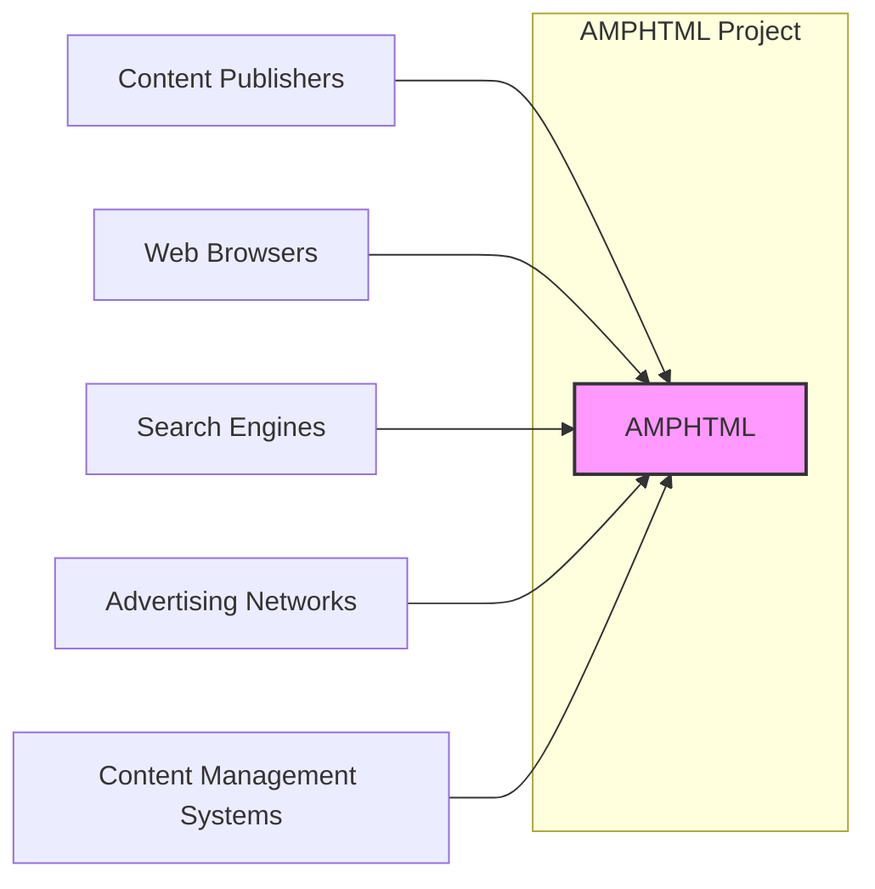
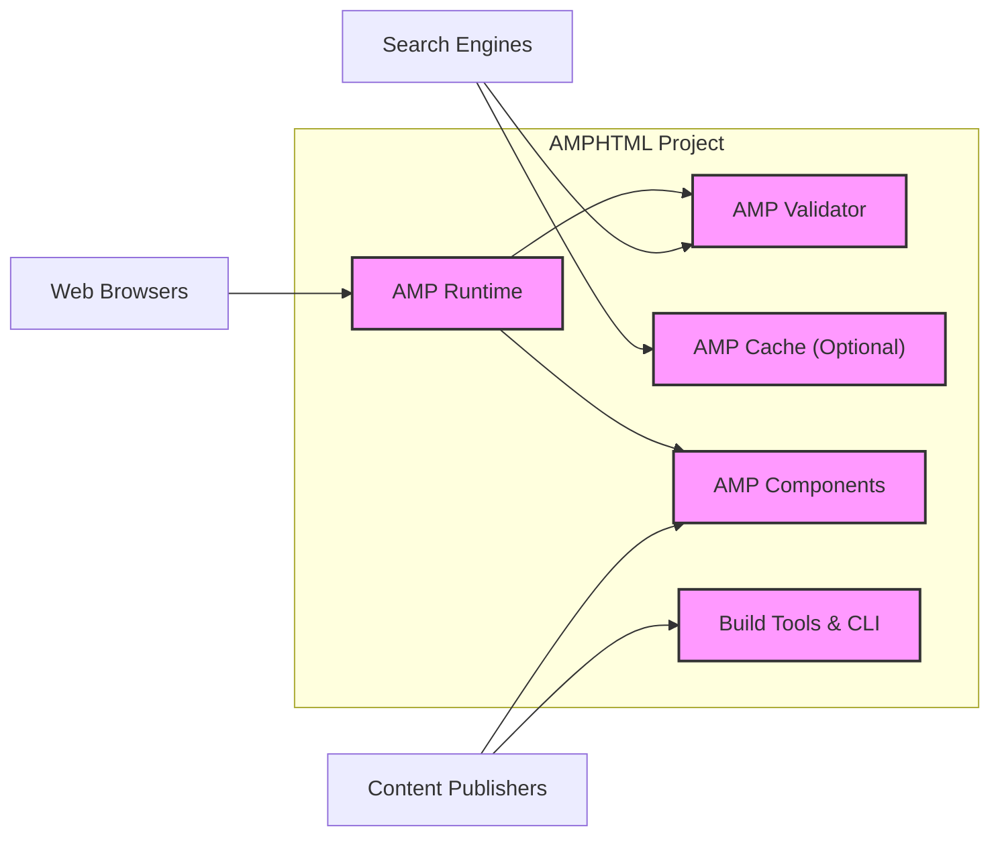

# BUSINESS POSTURE

- Business Priorities and Goals:
 - Priority 1: Ensure fast loading times for web pages on mobile devices.
 - Priority 2: Improve user experience on the mobile web by providing a standardized and performant framework.
 - Priority 3: Support content publishers in creating mobile-friendly content that can be easily discovered and distributed across the web.
 - Priority 4: Maintain an open and collaborative ecosystem for developing and evolving the AMPHTML framework.

- Business Risks:
 - Risk 1: Adoption risk - if publishers do not widely adopt AMPHTML, the project may fail to achieve its goals of improving the mobile web experience.
 - Risk 2: Technical complexity risk - the framework needs to be technically robust and easy to use for developers, otherwise adoption will be hindered.
 - Risk 3: Performance risk - if AMPHTML pages do not consistently deliver on the promise of fast loading times, user trust and adoption will decline.
 - Risk 4: Security risk - vulnerabilities in the AMPHTML framework could be exploited to compromise publisher websites or end-user devices, damaging reputation and trust.
 - Risk 5: Ecosystem risk - reliance on a healthy and active open-source community for contributions and maintenance.

# SECURITY POSTURE

- Existing Security Controls:
 - security control: Code reviews are likely performed by maintainers before merging pull requests. (Location: GitHub repository - Pull Request process)
 - security control: Static analysis tools are likely used to identify potential code quality and security issues. (Location: CI/CD pipelines - assumed)
 - security control: Vulnerability reporting process is in place to handle security issues reported by the community. (Location: GitHub repository - SECURITY.md or similar - assumed)
 - security control: HTTPS is enforced for serving AMP pages, ensuring data in transit is encrypted. (Location: Web server configuration - assumed)
 - security control: Sandboxing of AMP components within browsers to limit access to resources and prevent cross-site scripting (XSS) attacks. (Location: AMP Runtime - implementation detail)

- Accepted Risks:
 - accepted risk: Reliance on community contributions may introduce vulnerabilities if not properly vetted.
 - accepted risk: Open-source nature means code is publicly available, potentially making it easier for attackers to find vulnerabilities.
 - accepted risk: Complexity of the framework may lead to unforeseen security issues.

- Recommended Security Controls:
 - security control: Implement automated security scanning tools (SAST, DAST, dependency scanning) in the CI/CD pipeline.
 - security control: Establish a formal Security Response Team and incident response plan for handling security vulnerabilities.
 - security control: Conduct regular penetration testing and security audits of the AMPHTML framework.
 - security control: Implement a Software Bill of Materials (SBOM) to track dependencies and manage supply chain risks.
 - security control: Provide security training for developers contributing to the project.

- Security Requirements:
 - Authentication:
  - Requirement: AMPHTML itself does not directly handle user authentication. Authentication is the responsibility of the website hosting the AMP page.
  - Requirement: For administrative interfaces related to AMP project infrastructure (if any), strong authentication mechanisms (e.g., multi-factor authentication) should be enforced.
 - Authorization:
  - Requirement: AMPHTML should enforce authorization mechanisms to control access to resources and functionalities within the framework. This is primarily relevant for internal components and APIs, not for end-users viewing AMP pages.
  - Requirement: Publishers are responsible for authorization of content displayed within their AMP pages.
 - Input Validation:
  - Requirement: AMPHTML must rigorously validate all inputs, especially those originating from external sources (e.g., URL parameters, user-provided data in AMP components).
  - Requirement: Input validation should prevent common injection attacks such as Cross-Site Scripting (XSS) and SQL Injection (though SQL injection is less relevant for a front-end framework).
  - Requirement: Validation should be applied on both client-side (browser) and server-side (where applicable, e.g., in AMP Cache or validator services).
 - Cryptography:
  - Requirement: HTTPS must be enforced for all communication involving AMP pages and related services to protect data in transit.
  - Requirement: Sensitive data at rest (if any, within AMP infrastructure) should be encrypted.
  - Requirement: Use of strong and up-to-date cryptographic algorithms and libraries.

# DESIGN

## C4 CONTEXT



- Context Diagram Elements:
 - - Name: Content Publishers
   - Type: User
   - Description: Website owners and content creators who use AMPHTML to build fast-loading mobile web pages.
   - Responsibilities: Develop and deploy AMPHTML pages, manage content, integrate with advertising networks.
   - Security controls: Implement secure content management practices, manage access to publishing platforms, ensure proper configuration of AMP components.
 - - Name: Web Browsers
   - Type: System
   - Description: Software applications used by end-users to access and view web pages, including AMPHTML pages.
   - Responsibilities: Render HTML, CSS, and JavaScript, execute AMP Runtime, enforce security policies (e.g., sandboxing).
   - Security controls: Browser security features (e.g., Content Security Policy, XSS protection), sandboxing of web content, regular security updates.
 - - Name: Search Engines
   - Type: System
   - Description: Services like Google Search that discover, index, and serve AMPHTML pages to users.
   - Responsibilities: Crawl and index web pages, validate AMPHTML markup, serve AMP pages from cache or original source, rank search results.
   - Security controls: Secure crawling and indexing processes, validation of AMP markup, protection against serving malicious content.
 - - Name: Advertising Networks
   - Type: System
   - Description: Platforms that serve advertisements on web pages, including AMPHTML pages.
   - Responsibilities: Provide ad serving infrastructure, track ad impressions and clicks, manage advertiser campaigns.
   - Security controls: Secure ad serving infrastructure, protection against malvertising, adherence to privacy regulations.
 - - Name: Content Management Systems
   - Type: System
   - Description: Software applications used by content publishers to create, manage, and publish website content, potentially including AMPHTML pages.
   - Responsibilities: Content creation and management, template management, integration with AMPHTML framework, publishing workflows.
   - Security controls: Access control to CMS, secure content storage, input validation for content creation, protection against CMS vulnerabilities.
 - - Name: AMPHTML
   - Type: System
   - Description: Open-source HTML framework for building fast-loading mobile web pages.
   - Responsibilities: Provide a standardized set of HTML tags and JavaScript libraries, enforce performance best practices, ensure security and stability of the framework.
   - Security controls: Input validation, output encoding, sandboxing, secure development practices, vulnerability management.

## C4 CONTAINER



- Container Diagram Elements:
 - - Name: AMP Runtime
   - Type: Software Library
   - Description: JavaScript library that is included in AMPHTML pages and is responsible for rendering and managing AMP components, enforcing AMP validation rules in the browser, and optimizing performance.
   - Responsibilities: Load and execute AMP components, manage page lifecycle, enforce AMP validation, handle user interactions, optimize performance.
   - Security controls: Sandboxing of AMP components, input validation within runtime, Content Security Policy enforcement, protection against XSS attacks.
 - - Name: AMP Validator
   - Type: Software Application/Library
   - Description: Tool used to validate AMPHTML markup against the AMP specification. It can be used during development, build process, and by search engines to ensure AMP pages are valid.
   - Responsibilities: Parse and validate AMPHTML markup, report validation errors, ensure compliance with AMP specification.
   - Security controls: Input validation of AMPHTML markup, protection against denial-of-service attacks, secure API endpoints (if exposed as a service).
 - - Name: AMP Cache (Optional)
   - Type: CDN/Proxy
   - Description: Content Delivery Network (CDN) that caches valid AMPHTML pages and serves them to end-users, often operated by search engines like Google. Improves page loading speed and availability.
   - Responsibilities: Cache valid AMP pages, serve cached pages to end-users, perform content transformations (e.g., image optimization), enforce security policies.
   - Security controls: Secure CDN infrastructure, protection against cache poisoning attacks, HTTPS enforcement, content integrity checks, access control to cache management interfaces.
 - - Name: AMP Components
   - Type: Software Libraries/Web Components
   - Description: Reusable HTML tags and JavaScript modules that provide specific functionalities within AMPHTML pages (e.g., carousels, ads, analytics).
   - Responsibilities: Provide specific functionalities, adhere to AMP performance and security guidelines, interact with AMP Runtime.
   - Security controls: Input validation within components, output encoding, protection against XSS vulnerabilities, adherence to secure coding practices.
 - - Name: Build Tools & CLI
   - Type: Software Application
   - Description: Command-line interface (CLI) and other build tools that assist developers in creating, developing, and testing AMPHTML pages.
   - Responsibilities: Provide development tooling, facilitate AMP validation, optimize AMP pages for production.
   - Security controls: Secure distribution of build tools, protection against supply chain attacks, input validation in CLI tools, secure handling of developer credentials (if any).

## DEPLOYMENT

```mermaid
flowchart LR
    subgraph "Publisher Infrastructure"
        PublisherServer["Publisher Web Server"]
    end
    subgraph "AMP Cache Infrastructure"
        AMPCacheServer["AMP Cache Server"]
    end
    EndUserBrowser["End-User Web Browser"]

    PublisherServer --> AMPCacheServer: Fetches & Caches Valid AMP Pages
    AMPCacheServer --> EndUserBrowser: Serves Cached AMP Pages
    PublisherServer --> EndUserBrowser: Serves Original AMP Pages (Fallback)

    style PublisherServer fill:#f9f,stroke:#333,stroke-width:2px
    style AMPCacheServer fill:#f9f,stroke:#333,stroke-width:2px
```

- Deployment Diagram Elements:
 - - Name: Publisher Web Server
   - Type: Web Server
   - Description: Infrastructure operated by content publishers to host their websites, including AMPHTML pages.
   - Responsibilities: Serve AMPHTML pages, host website assets, handle user requests, manage content.
   - Security controls: Web server hardening, HTTPS configuration, access control, input validation, regular security updates, web application firewall (WAF).
 - - Name: AMP Cache Server
   - Type: CDN Server
   - Description: Infrastructure operated by AMP Cache providers (e.g., Google) to cache and serve AMPHTML pages.
   - Responsibilities: Cache valid AMP pages, serve cached pages to end-users, optimize content delivery, handle cache invalidation.
   - Security controls: CDN security measures, DDoS protection, cache poisoning prevention, HTTPS enforcement, access control, content integrity checks.
 - - Name: End-User Web Browser
   - Type: Client Application
   - Description: Web browser used by end-users to access and view AMPHTML pages.
   - Responsibilities: Request and render web pages, execute JavaScript (AMP Runtime), enforce browser security policies.
   - Security controls: Browser security features (CSP, XSS protection), sandboxing, regular security updates, user privacy controls.

## BUILD

```mermaid
flowchart LR
    Developer["Developer"] --> CodeRepository["Code Repository (GitHub)"]: Code Changes
    CodeRepository --> BuildSystem["Build System (CI/CD - e.g., GitHub Actions)"]: Trigger Build
    BuildSystem --> Validator["AMP Validator"]: Validation Checks
    BuildSystem --> SAST["SAST Scanner"]: Security Checks
    BuildSystem --> DependencyCheck["Dependency Check"]: Dependency Security Scan
    BuildSystem --> ArtifactRepository["Artifact Repository"]: Store Build Artifacts (e.g., JavaScript libraries)

    style Developer fill:#f9f,stroke:#333,stroke-width:2px
    style CodeRepository fill:#f9f,stroke:#333,stroke-width:2px
    style BuildSystem fill:#f9f,stroke:#333,stroke-width:2px
    style Validator fill:#f9f,stroke:#333,stroke-width:2px
    style SAST fill:#f9f,stroke:#333,stroke-width:2px
    style DependencyCheck fill:#f9f,stroke:#333,stroke-width:2px
    style ArtifactRepository fill:#f9f,stroke:#333,stroke-width:2px
```

- Build Process Elements:
 - - Name: Developer
   - Type: User
   - Description: Software developers who contribute code to the AMPHTML project.
   - Responsibilities: Write code, fix bugs, implement new features, submit code changes via pull requests.
   - Security controls: Secure development environment, code review participation, security training, adherence to secure coding practices.
 - - Name: Code Repository (GitHub)
   - Type: Version Control System
   - Description: Git repository hosted on GitHub that stores the source code of the AMPHTML project.
   - Responsibilities: Version control, code collaboration, pull request management, access control to code.
   - Security controls: Access control to repository, branch protection, audit logging, vulnerability scanning of repository infrastructure.
 - - Name: Build System (CI/CD - e.g., GitHub Actions)
   - Type: Automation System
   - Description: Continuous Integration and Continuous Delivery (CI/CD) system used to automate the build, test, and release process of AMPHTML.
   - Responsibilities: Automate build process, run tests, perform security checks, generate build artifacts, publish releases.
   - Security controls: Secure CI/CD pipeline configuration, access control to CI/CD system, secrets management, secure build environment, audit logging.
 - - Name: AMP Validator
   - Type: Software Application
   - Description: AMP Validator tool integrated into the build process to automatically validate AMPHTML markup during builds.
   - Responsibilities: Validate AMPHTML markup, report validation errors to the build system.
   - Security controls: Same as described in Container Diagram - AMP Validator.
 - - Name: SAST Scanner
   - Type: Security Tool
   - Description: Static Application Security Testing (SAST) tool integrated into the build process to automatically scan code for potential security vulnerabilities.
   - Responsibilities: Analyze source code for security vulnerabilities, report findings to the build system.
   - Security controls: Secure configuration of SAST tool, regular updates to vulnerability rules, integration with build system for automated checks.
 - - Name: Dependency Check
   - Type: Security Tool
   - Description: Tool to scan project dependencies for known vulnerabilities.
   - Responsibilities: Analyze project dependencies, identify vulnerable libraries, report findings to the build system.
   - Security controls: Secure configuration of dependency check tool, regular updates to vulnerability databases, integration with build system for automated checks.
 - - Name: Artifact Repository
   - Type: Storage System
   - Description: System to store and manage build artifacts, such as compiled JavaScript libraries and distribution packages.
   - Responsibilities: Store build artifacts, provide access to artifacts for distribution, version control of artifacts.
   - Security controls: Access control to artifact repository, integrity checks of artifacts, secure storage infrastructure.

# RISK ASSESSMENT

- Critical Business Processes:
 - Process 1: Serving fast-loading and performant AMPHTML pages to end-users. Disruption would negatively impact user experience and publisher satisfaction.
 - Process 2: Maintaining the integrity and security of the AMPHTML framework. Compromise could lead to widespread vulnerabilities affecting publishers and end-users.
 - Process 3: Ensuring the availability and reliability of the AMP infrastructure (e.g., validator, cache). Downtime would disrupt the AMP ecosystem.

- Data to Protect and Sensitivity:
 - Data 1: AMPHTML source code. Sensitivity: Publicly accessible, but integrity is critical to prevent malicious modifications.
 - Data 2: Build artifacts (JavaScript libraries, etc.). Sensitivity: Publicly accessible, but integrity is critical to prevent supply chain attacks.
 - Data 3: Infrastructure configuration and secrets (CI/CD, servers). Sensitivity: High, compromise could lead to system compromise and data breaches.
 - Data 4: Potentially aggregated usage data and logs from AMP infrastructure. Sensitivity: Medium, may contain some user-related information, needs to be protected according to privacy policies.

# QUESTIONS & ASSUMPTIONS

- Questions:
 - Question 1: What specific SAST and DAST tools are currently used in the AMPHTML project's CI/CD pipeline?
 - Question 2: Is there a formal Security Response Team and incident response plan in place for handling security vulnerabilities?
 - Question 3: Are regular penetration tests or security audits conducted for the AMPHTML framework and infrastructure?
 - Question 4: What is the process for managing and updating dependencies to address known vulnerabilities?
 - Question 5: Are there specific security guidelines or training provided to developers contributing to the AMPHTML project?

- Assumptions:
 - Assumption 1: The AMPHTML project follows standard open-source development practices, including code reviews and community contributions.
 - Assumption 2: Security is a significant concern for the AMPHTML project due to its widespread use and potential impact on the web ecosystem.
 - Assumption 3: HTTPS is enforced for all public-facing AMP services and pages.
 - Assumption 4: The project utilizes a CI/CD pipeline for automated builds and deployments.
 - Assumption 5: The provided GitHub repository (https://github.com/ampproject/amphtml) is the primary and authoritative source of the AMPHTML project's code.