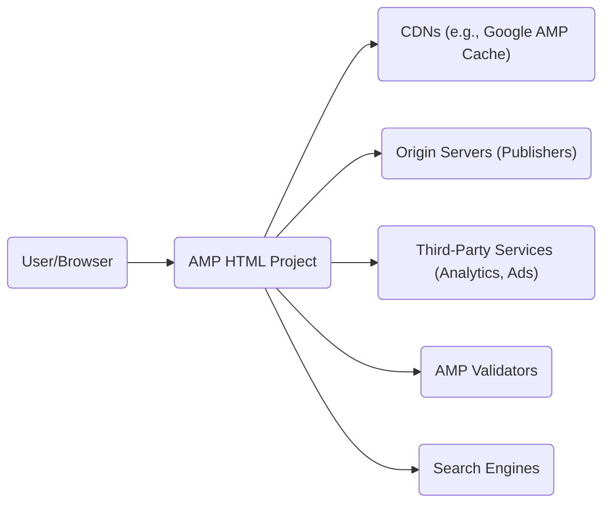
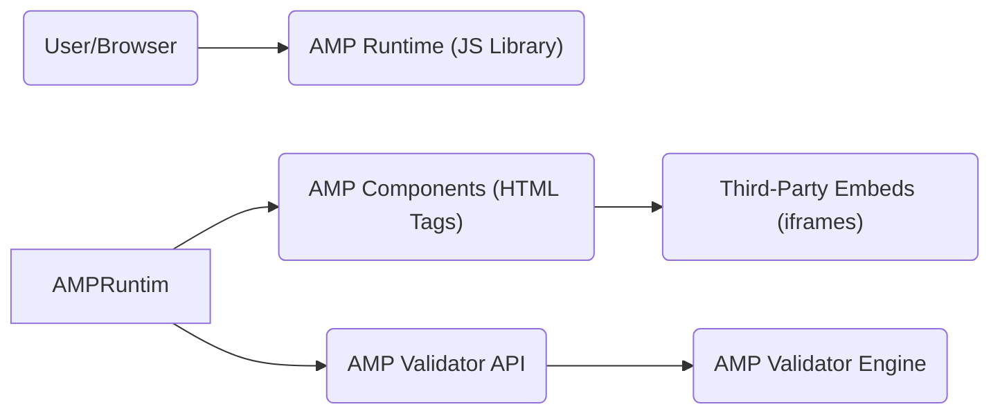
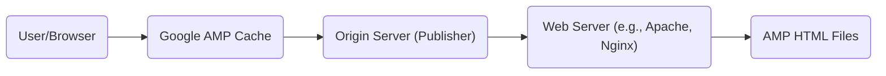
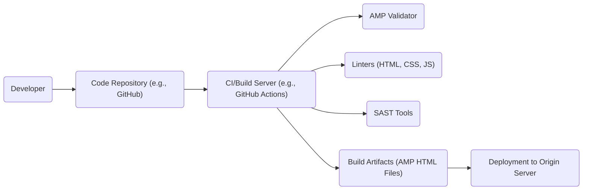

Okay, let's create a design document for the AMP HTML project.

# BUSINESS POSTURE

Business Priorities and Goals:

*   Improve web page loading speed and user experience, particularly on mobile devices.
*   Increase user engagement and reduce bounce rates for publishers.
*   Provide a standardized, open-source framework for creating fast-loading web pages.
*   Enhance the mobile web ecosystem and make it more competitive with native apps.
*   Improve SEO ranking.
*   Improve ad viewability and performance.

Most Important Business Risks:

*   Compatibility issues with existing websites and web technologies.
*   Limited adoption by publishers and developers.
*   Negative impact on website functionality or design due to AMP restrictions.
*   Dependence on the AMP Cache and potential centralization concerns.
*   Security vulnerabilities within the AMP framework itself.
*   Keeping up with evolving web standards and browser technologies.
*   Negative perception or criticism from the web development community.

# SECURITY POSTURE

Existing Security Controls:

*   security control: Strict Content Security Policy (CSP). Enforced by the AMP Validator and runtime.
*   security control: Limited use of JavaScript. Only AMP-approved JavaScript components are allowed, reducing the attack surface for XSS. Described in AMP documentation.
*   security control: Mandatory HTTPS. AMP pages must be served over HTTPS, ensuring encrypted communication. Enforced by the AMP Validator.
*   security control: Sandboxing of iframes. Third-party content in iframes is heavily sandboxed to prevent malicious behavior. Described in AMP documentation.
*   security control: Validation of HTML, CSS, and JavaScript. The AMP Validator enforces strict rules to prevent common web vulnerabilities.
*   security control: Built-in protections against common XSS vectors. AMP components are designed with security in mind. Described in AMP documentation.
*   security control: Regular security audits and updates. The AMP Project undergoes regular security reviews.
*   security control: Open-source codebase. Allows for community scrutiny and vulnerability identification.

Accepted Risks:

*   accepted risk: Reliance on third-party AMP components. While AMP components are vetted, there's a residual risk associated with their use.
*   accepted risk: Potential for vulnerabilities in the AMP runtime or validator. Despite rigorous testing, complex software can have undiscovered flaws.
*   accepted risk: Limited customization due to AMP restrictions. This can impact the ability to implement certain security features or configurations.
*   accepted risk: Dependence on the AMP Cache. While it provides performance benefits, it also introduces a potential single point of failure or control.

Recommended Security Controls:

*   security control: Implement a robust vulnerability disclosure program to encourage responsible reporting of security issues.
*   security control: Conduct regular penetration testing of the AMP framework and its components.
*   security control: Provide clear security guidance and best practices for developers building AMP components.
*   security control: Implement a mechanism for quickly patching and deploying security updates to the AMP runtime and validator.
*   security control: Explore the use of Subresource Integrity (SRI) for AMP components to further mitigate the risk of compromised third-party code.

Security Requirements:

*   Authentication: Not directly applicable to the core AMP framework, as it focuses on content delivery. Authentication is handled by the origin server hosting the AMP pages.
*   Authorization: Not directly applicable to the core AMP framework. Authorization is handled by the origin server.
*   Input Validation: AMP strictly enforces input validation through the AMP Validator. All HTML, CSS, and JavaScript must conform to the AMP specification. This is a core security control.
*   Cryptography: AMP requires HTTPS, ensuring all communication is encrypted using TLS. The specific cryptographic protocols and ciphers are determined by the server configuration.
*   Output Encoding: AMP components are designed to properly encode output to prevent XSS vulnerabilities.

# DESIGN

## C4 CONTEXT

Element Descriptions:

*   Element:
    *   Name: User/Browser
    *   Type: Person
    *   Description: A person using a web browser to access AMP pages.
    *   Responsibilities: Requests and renders AMP pages.
    *   Security controls: Browser security features (e.g., same-origin policy, XSS filters).

*   Element:
    *   Name: AMP HTML Project
    *   Type: Software System
    *   Description: The core AMP framework, including the runtime, validator, and components.
    *   Responsibilities: Provides the building blocks for creating fast-loading web pages. Enforces AMP restrictions.
    *   Security controls: Strict CSP, limited JavaScript, mandatory HTTPS, iframe sandboxing, validation, built-in XSS protections.

*   Element:
    *   Name: CDNs (e.g., Google AMP Cache)
    *   Type: Software System
    *   Description: Content Delivery Networks that cache and serve AMP pages.
    *   Responsibilities: Caches AMP pages for faster delivery.
    *   Security controls: HTTPS, DDoS protection, CDN security features.

*   Element:
    *   Name: Origin Servers (Publishers)
    *   Type: Software System
    *   Description: Servers hosting the original AMP pages.
    *   Responsibilities: Serves AMP pages to users and CDNs.
    *   Security controls: HTTPS, server-side security measures, authentication/authorization (if applicable).

*   Element:
    *   Name: Third-Party Services (Analytics, Ads)
    *   Type: Software System
    *   Description: Services integrated into AMP pages, such as analytics and advertising platforms.
    *   Responsibilities: Provides analytics tracking and ad serving.
    *   Security controls: AMP-approved components, iframe sandboxing, CSP restrictions.

*   Element:
    *   Name: AMP Validators
    *   Type: Software System
    *   Description: Tools that validate AMP pages against the AMP specification.
    *   Responsibilities: Enforces AMP rules and identifies errors.
    *   Security controls: Regular updates to reflect the latest AMP specification.

*   Element:
    *   Name: Search Engines
    *   Type: Software System
    *   Description: Search engines that index and display AMP pages.
    *   Responsibilities: Crawls and indexes AMP pages.
    *   Security controls: Standard search engine security practices.

## C4 CONTAINER

Element Descriptions:

*   Element:
    *   Name: User/Browser
    *   Type: Person
    *   Description: A person using a web browser.
    *   Responsibilities: Requests and renders AMP pages.
    *   Security controls: Browser security features.

*   Element:
    *   Name: AMP Runtime (JS Library)
    *   Type: Container: JavaScript Library
    *   Description: The core JavaScript library that manages AMP components and enforces restrictions.
    *   Responsibilities: Controls the loading and rendering of AMP components. Enforces CSP and other security policies.
    *   Security controls: Strict CSP, limited JavaScript execution, built-in XSS protections.

*   Element:
    *   Name: AMP Components (HTML Tags)
    *   Type: Container: Web Components
    *   Description: Pre-built, validated components that provide specific functionality (e.g., images, videos, carousels).
    *   Responsibilities: Provides specific UI elements and functionality.
    *   Security controls: Built-in security features, adherence to AMP specifications.

*   Element:
    *   Name: Third-Party Embeds (iframes)
    *   Type: Container: iframe
    *   Description: Sandboxed iframes used to embed third-party content.
    *   Responsibilities: Isolates third-party content from the main AMP page.
    *   Security controls: Strict iframe sandboxing, CSP restrictions.

*   Element:
    *   Name: AMP Validator API
    *   Type: Container: API
    *   Description: API for accessing the AMP Validator.
    *   Responsibilities: Provides an interface for validating AMP pages.
    *   Security controls: Input validation, access controls.

*   Element:
    *   Name: AMP Validator Engine
    *   Type: Container: Library
    *   Description: The core engine that performs AMP validation.
    *   Responsibilities: Checks AMP pages against the AMP specification.
    *   Security controls: Regular updates, robust validation logic.

## DEPLOYMENT

Possible Deployment Solutions:

1.  Self-hosting: Publishers host AMP pages on their own servers.
2.  CDN Hosting: Publishers use a CDN to cache and serve AMP pages.
3.  AMP Cache: Publishers rely on the Google AMP Cache (or other AMP caches) to automatically cache and serve AMP pages.

Chosen Solution (AMP Cache + Origin Server):

Element Descriptions:

*   Element:
    *   Name: User/Browser
    *   Type: Person
    *   Description: A person using a web browser.
    *   Responsibilities: Requests AMP pages.
    *   Security controls: Browser security features.

*   Element:
    *   Name: Google AMP Cache
    *   Type: Node: CDN
    *   Description: Google's CDN that caches and serves AMP pages.
    *   Responsibilities: Caches AMP pages, serves them to users, performs optimizations.
    *   Security controls: HTTPS, DDoS protection, CDN security features.

*   Element:
    *   Name: Origin Server (Publisher)
    *   Type: Node: Server
    *   Description: The publisher's server hosting the original AMP pages.
    *   Responsibilities: Serves AMP pages to the AMP Cache.
    *   Security controls: HTTPS, server-side security measures.

*   Element:
    *   Name: Web Server (e.g., Apache, Nginx)
    *   Type: Node: Web Server
    *   Description: The web server software running on the origin server.
    *   Responsibilities: Handles HTTP requests and serves AMP files.
    *   Security controls: Web server security configurations, HTTPS.

*   Element:
    *   Name: AMP HTML Files
    *   Type: Node: Files
    *   Description: The AMP HTML files stored on the origin server.
    *   Responsibilities: Contains the content and structure of the AMP pages.
    *   Security controls: File system permissions, regular backups.

## BUILD

Build Process Description:

1.  Developers write AMP HTML code and commit it to a code repository (e.g., GitHub).
2.  A CI/Build server (e.g., GitHub Actions, Jenkins) is triggered by the commit.
3.  The build server runs the AMP Validator to ensure the code conforms to the AMP specification.
4.  Linters (HTML, CSS, JS) are used to check for code style and potential errors.
5.  SAST (Static Application Security Testing) tools are used to scan for security vulnerabilities.
6.  If all checks pass, the build server produces build artifacts (AMP HTML files).
7.  The build artifacts are deployed to the origin server.

Security Controls:

*   security control: AMP Validator: Enforces AMP restrictions during the build process.
*   security control: Linters: Identify potential code quality issues that could lead to vulnerabilities.
*   security control: SAST Tools: Scan for security vulnerabilities in the code.
*   security control: CI/Build Server: Automates the build process and ensures consistent security checks.
*   security control: Code Repository: Provides version control and access control for the codebase.
*   security control: Dependency Management: Tools to manage and vet third-party dependencies (if any are used, which is limited in AMP).

# RISK ASSESSMENT

Critical Business Processes:

*   Content delivery: Ensuring fast and reliable delivery of web content to users.
*   User engagement: Maintaining user interest and minimizing bounce rates.
*   Monetization: Serving ads effectively to generate revenue.
*   SEO: Maintaining high search engine rankings.

Data Sensitivity:

*   User data (if collected through forms or analytics): Potentially sensitive, depending on the data collected. Requires appropriate privacy protections.
*   Content data: Generally not sensitive, but may contain proprietary information in some cases.
*   Analytics data: Aggregated data is generally not sensitive, but individual user data may be.

# QUESTIONS & ASSUMPTIONS

Questions:

*   What specific third-party services are commonly integrated with AMP pages in this context?
*   What is the process for handling security vulnerabilities discovered in the AMP framework or its components?
*   What level of customization is required for AMP pages, and how does this impact security?
*   Are there any specific compliance requirements (e.g., GDPR, CCPA) that need to be considered?
*   What is the expected traffic volume and performance requirements for AMP pages?

Assumptions:

*   BUSINESS POSTURE: The primary goal is to improve website performance and user experience.
*   BUSINESS POSTURE: The organization is willing to accept some limitations in functionality and design to achieve performance gains.
*   SECURITY POSTURE: The organization prioritizes security and is willing to invest in necessary controls.
*   SECURITY POSTURE: The AMP framework is regularly updated and maintained to address security vulnerabilities.
*   DESIGN: The Google AMP Cache will be used for caching and serving AMP pages.
*   DESIGN: The origin server will be properly configured with HTTPS and other security measures.
*   DESIGN: The build process will include automated security checks.
*   DESIGN: Developers are familiar with AMP best practices and security guidelines.