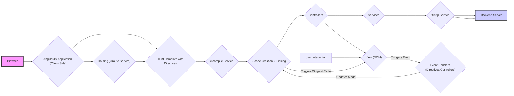

# Project Design Document: AngularJS (Version 1.x) - For Threat Modeling

**Document Version:** 1.1
**Date:** October 26, 2023
**Prepared By:** Gemini (AI Language Model)

## 1. Introduction

This document provides a detailed architectural design of the AngularJS framework (version 1.x), based on the codebase at [https://github.com/angular/angular.js](https://github.com/angular/angular.js). Its primary purpose is to serve as a comprehensive reference for conducting thorough threat modeling of the framework. Understanding the architecture, components, and data flow is crucial for identifying potential security vulnerabilities and attack vectors. This document aims to provide that foundational knowledge.

## 2. Goals

The key objectives of this design document are to:

*   Present a clear and in-depth architectural overview of the AngularJS framework.
*   Thoroughly describe the major components, their functionalities, and interdependencies.
*   Illustrate the data flow within an AngularJS application, emphasizing key stages and transformations.
*   Explicitly highlight areas within the architecture that are particularly relevant to security considerations and potential vulnerabilities.
*   Serve as the definitive basis for subsequent threat modeling activities, enabling a systematic and comprehensive security analysis.

## 3. Scope

This document focuses on the intrinsic architectural characteristics of the AngularJS framework (version 1.x). It encompasses:

*   The core building blocks of the framework: modules, directives, services, controllers, scopes, and templates.
*   The mechanisms for data binding and the `$digest` cycle.
*   The template compilation and linking process.
*   The client-side routing mechanism and its components.
*   The framework's interaction with the Document Object Model (DOM) and the browser environment.
*   Key extension points and common patterns within AngularJS applications.

This document explicitly excludes:

*   Specific applications or websites built using AngularJS.
*   The development, build, and testing processes associated with AngularJS itself.
*   Low-level implementation details of individual functions or internal modules unless directly relevant to security.
*   Detailed guidance on secure coding practices for *using* AngularJS (these will be informed by the threat model derived from this document).

## 4. Architectural Overview

AngularJS implements a Model-View-Controller (MVC) architectural pattern, often described as MVW (Model-View-Whatever) to reflect the flexible nature of the "Controller" role. It extends HTML's capabilities to build dynamic, single-page applications.

The core architectural components are:

*   **Modules:**
    *   Serve as containers for organizing different parts of an application, such as controllers, services, directives, and filters.
    *   Provide a mechanism for dependency injection and managing component lifecycles.
    *   Enable modularity and reusability of code.
*   **Directives:**
    *   Extend HTML vocabulary by introducing new attributes, elements, or CSS classes.
    *   Instruct AngularJS's HTML compiler (`$compile`) to manipulate the DOM or attach specific behaviors.
    *   Can be used to create reusable UI components and encapsulate DOM manipulation logic.
    *   Examples include structural directives (`ng-if`, `ng-repeat`) and attribute directives (`ng-class`, `ng-style`).
*   **Services:**
    *   Singletons responsible for encapsulating reusable business logic and data.
    *   Injected into controllers, directives, or other services.
    *   Provide core functionalities like making HTTP requests (`$http`), handling routing (`$route`), and managing application state.
    *   Can be built-in or custom-defined.
*   **Controllers:**
    *   JavaScript functions associated with a specific scope.
    *   Act as intermediaries between the model and the view.
    *   Provide data and methods to the view through the scope.
    *   Handle user interactions and update the model accordingly.
*   **Scopes:**
    *   Objects that hold the application model data.
    *   Act as the glue between controllers and views.
    *   Provide a context for evaluating expressions within the view.
    *   Form a hierarchical structure, inheriting properties from parent scopes.
    *   Play a crucial role in the `$digest` cycle.
*   **Templates:**
    *   HTML markup enhanced with AngularJS-specific directives and expressions.
    *   Processed by the `$compile` service to create the dynamic view.
    *   Can include data bindings to display model data and handle user input.
*   **Data Binding:**
    *   A core feature that automatically synchronizes data between the model (in the scope) and the view.
    *   Typically two-way, meaning changes in the model update the view, and user interactions in the view update the model.
    *   Implemented through the `$digest` cycle.
*   **`$digest` Cycle:**
    *   The mechanism by which AngularJS detects changes in the model and updates the view.
    *   Involves iterating through watchers set up on scope properties.
    *   Triggered by various events, such as user interactions, `$timeout`, `$http` responses, and manual calls to `$scope.$apply()` or `$scope.$digest()`.
    *   Can have performance implications if not managed efficiently.
*   **Dependency Injection:**
    *   A design pattern where components receive their dependencies from an external source (the AngularJS injector) rather than creating them themselves.
    *   Promotes loose coupling and testability.
    *   AngularJS has a built-in dependency injection system.
*   **Routing (`$route`):**
    *   The mechanism for navigating between different views or states within the application, typically based on changes in the URL.
    *   The `$route` service parses the URL, matches it to a configured route, and loads the corresponding template and controller.
    *   Uses the `$routeProvider` to configure routes.
*   **HTML Compiler (`$compile`):**
    *   The service responsible for processing the HTML template.
    *   Traverses the DOM, identifies directives, and executes their associated logic.
    *   Links directives with their corresponding scopes and controllers.
    *   Produces a live, data-bound view.

## 5. Data Flow

The typical data flow within an AngularJS application can be broken down into the following steps:

*   **Application Initialization:**
    *   The browser loads the HTML page containing the AngularJS application.
    *   The `ng-app` directive (or manual bootstrapping) signals the start of the AngularJS framework.
    *   The AngularJS injector is initialized.
*   **Template Compilation and Linking:**
    *   The `$compile` service parses the HTML template.
    *   It identifies directives within the template.
    *   For each directive, the `$compile` service executes its compile function (if defined).
    *   The compile function returns a link function.
    *   The link function is associated with a specific scope and attaches the directive's behavior to the DOM element.
*   **Scope Creation and Controller Instantiation:**
    *   Scopes are created and organized hierarchically.
    *   Controllers are instantiated and linked to their respective scopes.
    *   Data and methods defined in the controller are made available on the scope.
*   **Initial `$digest` Cycle:**
    *   After compilation and linking, an initial `$digest` cycle is triggered.
    *   AngularJS iterates through the watchers on the scope, evaluating the watched expressions.
    *   If any changes are detected, the corresponding listener functions are executed, updating the view.
*   **User Interaction and Event Handling:**
    *   The user interacts with the view (e.g., clicking a button, entering text in an input field).
    *   Browser events are triggered.
    *   AngularJS directives (like `ng-click`, `ng-model`) listen for these events.
    *   Event handlers in controllers or directives are executed.
*   **Model Updates:**
    *   Event handlers often update the model (data on the scope). For example, `ng-model` automatically updates the scope variable bound to an input field.
*   **Triggering the `$digest` Cycle:**
    *   After a model update, AngularJS needs to update the view. This is done by triggering a new `$digest` cycle.
    *   This can happen automatically (e.g., after an `ng-click` handler) or manually using `$scope.$apply()` or `$scope.$digest()`.
*   **View Updates:**
    *   During the `$digest` cycle, AngularJS checks for changes in the model.
    *   If changes are detected, the view is updated to reflect the new model values through data binding.
*   **Service Interaction:**
    *   Controllers or directives can interact with services to perform tasks.
    *   For example, a controller might use the `$http` service to fetch data from a backend API.
*   **Backend Communication:**
    *   The `$http` service sends HTTP requests to a backend server.
    *   The server processes the request and sends a response.
*   **Handling Backend Responses:**
    *   The `$http` service's promise resolves with the backend response.
    *   The response data is typically used to update the model.
    *   Updating the model triggers a new `$digest` cycle to update the view.
*   **Routing:**
    *   User actions (e.g., clicking a link) or application logic can trigger a change in the application's route.
    *   The `$route` service intercepts the URL change.
    *   It matches the URL to a configured route.
    *   The corresponding controller and template are loaded.
    *   The process of compilation, linking, and the `$digest` cycle repeats for the new view.

## 6. Security Considerations

The architecture of AngularJS introduces several areas of concern from a security perspective:

*   **Cross-Site Scripting (XSS):**
    *   AngularJS renders templates on the client-side, making it vulnerable to XSS if user-provided data is not properly handled.
    *   **Types of XSS:** Stored XSS (data stored on the server), Reflected XSS (data reflected back to the user), and DOM-based XSS (vulnerability within the client-side code itself).
    *   **Mitigation in AngularJS:** AngularJS provides mechanisms like contextual escaping (e.g., using `{{ }}`) which automatically escapes data based on the context. However, using directives like `ng-bind-html` bypasses this and requires manual sanitization using the `$sce` service.
*   **Cross-Site Request Forgery (CSRF):**
    *   AngularJS applications that make state-changing requests to a backend server are susceptible to CSRF attacks.
    *   An attacker can trick a logged-in user into making unintended requests.
    *   **Mitigation:** Implementing anti-CSRF tokens (Synchronizer Token Pattern) is crucial. The server should generate a unique token, which is included in the request and validated on the server-side.
*   **Server-Side Security Dependencies:**
    *   While AngularJS is a client-side framework, its security is heavily dependent on the security of the backend APIs it interacts with.
    *   Vulnerabilities in the backend (e.g., SQL injection, authentication bypass) can be exploited regardless of the client-side security measures.
    *   **Considerations:** Secure authentication and authorization mechanisms, input validation on the server-side, and protection against common web application vulnerabilities are essential.
*   **Dependency Management Risks:**
    *   AngularJS applications often rely on third-party libraries and components.
    *   Vulnerabilities in these dependencies can introduce security risks into the application.
    *   **Mitigation:** Regularly audit and update dependencies, use tools to identify known vulnerabilities, and consider the security posture of the libraries being used.
*   **Client-Side Data Exposure:**
    *   Data handled by AngularJS on the client-side is inherently visible to the user through browser developer tools.
    *   Sensitive information should be minimized on the client-side and never stored directly in the client-side code.
    *   **Considerations:** Avoid storing secrets or highly sensitive data in the client-side application.
*   **Client-Side Logic Manipulation:**
    *   The application logic resides on the client-side, making it susceptible to inspection and potential manipulation by malicious actors.
    *   Security-critical logic should ideally be handled on the server-side.
    *   **Considerations:** Do not rely solely on client-side validation for security. Implement robust server-side validation.
*   **Template Injection Vulnerabilities:**
    *   If the application dynamically generates templates based on user input without proper sanitization, it can be vulnerable to template injection attacks.
    *   Attackers can inject malicious AngularJS expressions that execute arbitrary JavaScript code.
    *   **Mitigation:** Avoid dynamically generating templates from untrusted user input. If necessary, use strict sanitization techniques.
*   **Open Redirects:**
    *   If routing logic relies on user-controlled input without proper validation, it could lead to open redirect vulnerabilities.
    *   Attackers can craft malicious URLs that redirect users to attacker-controlled websites.
    *   **Mitigation:** Validate and sanitize any user-provided input used in routing logic. Use whitelisting for allowed redirect destinations.
*   **`$digest` Cycle Performance and Security:**
    *   Inefficiently written AngularJS applications with a large number of watchers can lead to performance issues and potential denial-of-service if an attacker can trigger excessive `$digest` cycles.
    *   **Considerations:** Optimize the number of watchers and the complexity of watched expressions. Be mindful of performance implications when designing the application.

## 7. Assumptions

The following assumptions underpin this design document:

*   This document focuses specifically on the AngularJS framework (version 1.x) as represented by the official GitHub repository.
*   The AngularJS application is intended to run within a standard web browser environment.
*   The application typically interacts with a backend server via standard HTTP or HTTPS protocols.
*   General web security best practices are expected to be implemented at both the client-side (within the AngularJS application) and the server-side.
*   Developers using AngularJS are expected to have a basic understanding of web security principles.

## 8. Further Steps

This design document provides the necessary architectural context for conducting a thorough threat model. The subsequent steps should include:

*   **Threat Identification:** Systematically identify potential threats and vulnerabilities associated with each component and stage of the data flow described in this document. This can be done using frameworks like STRIDE or PASTA.
*   **Attack Vector Analysis:** Analyze potential attack vectors and how malicious actors could exploit the identified vulnerabilities. Consider different attacker profiles and their capabilities.
*   **Risk Assessment and Prioritization:** Evaluate the likelihood and potential impact of each identified threat to prioritize mitigation efforts.
*   **Security Control Definition:** Define and document specific security controls and countermeasures to mitigate the identified risks. This may involve changes to the application code, infrastructure, or development processes.
*   **Security Testing and Validation:** Implement security testing techniques (e.g., penetration testing, static analysis) to validate the effectiveness of the implemented security controls.
*   **Continuous Monitoring and Improvement:** Regularly review and update the threat model and security controls as the application evolves and new threats emerge.
