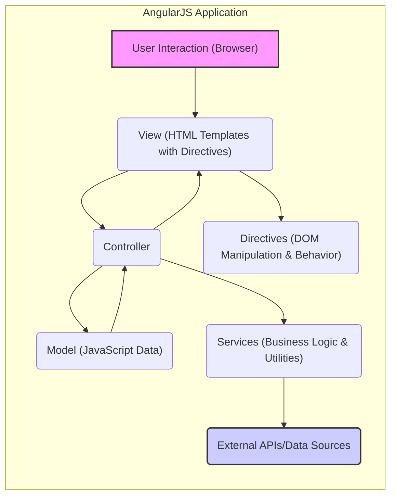
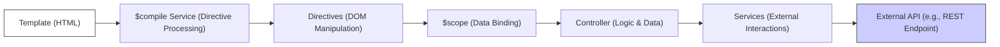
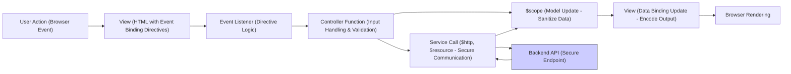
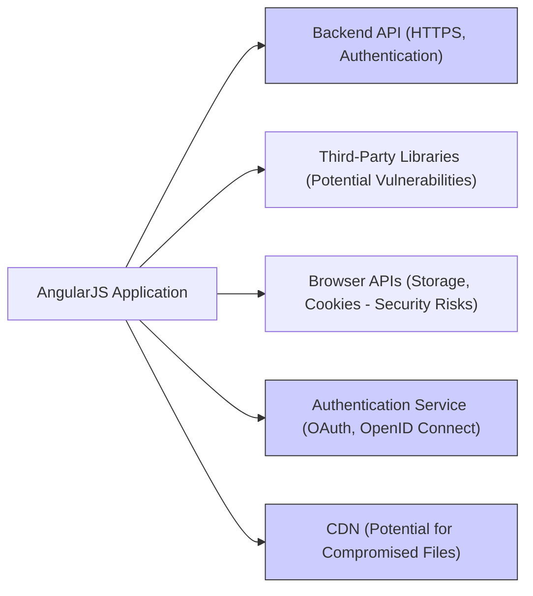

## Project Design Document: AngularJS (Legacy) for Threat Modeling (Improved)

**1. Project Overview**

*   **Project Name:** AngularJS (Version 1.x)
*   **Project Repository:** [https://github.com/angular/angular.js](https://github.com/angular/angular.js)
*   **Project Description:** AngularJS is a legacy, open-source, client-side JavaScript framework primarily used for building dynamic web applications and single-page applications (SPAs). It extends traditional HTML with declarative directives and supports features like data binding and dependency injection. While no longer under active feature development by Google, many applications still rely on AngularJS, making its security understanding crucial for maintenance and risk mitigation.
*   **Project Goal (from a security perspective):** To provide a comprehensive architectural overview of AngularJS applications, highlighting key components, data flow, and external interactions to facilitate effective threat modeling and the identification of potential security vulnerabilities. This document aims to enable the design of appropriate security controls and mitigation strategies for applications built with AngularJS.

**2. Architecture Overview**

AngularJS implements a Model-View-Whatever (MVW) architectural pattern. This pattern emphasizes separation of concerns, making applications more modular and maintainable. The core components work together to manage the application's data, presentation, and logic.

*   **Model:** Represents the application's data. This is typically composed of plain JavaScript objects and does not contain any framework-specific logic.
*   **View:** The user interface, defined using HTML templates. AngularJS enhances these templates with directives and expressions to dynamically display data and handle user interactions.
*   **Controller/ViewModel:** Acts as an intermediary between the Model and the View. Controllers in AngularJS are JavaScript functions that manage the application's behavior and data within a specific scope. They update the Model based on user actions and prepare data for the View.
*   **Services:** Singleton objects that encapsulate reusable business logic, data access, or utility functions. Services are injected into controllers, directives, or other services using AngularJS's dependency injection system. Examples include `$http` for making API calls and custom services for specific application logic.
*   **Directives:**  Custom HTML attributes, elements, or CSS classes that extend HTML's vocabulary and instruct AngularJS's compiler (`$compile`) to manipulate the DOM. Directives can add behavior to existing elements or create reusable UI components.
*   **Modules:**  Containers that organize different parts of an AngularJS application, such as controllers, services, directives, and configuration settings. Modules promote modularity and prevent naming collisions.
*   **Dependency Injection:** A core feature of AngularJS that allows components to receive their dependencies from an external source (the injector) instead of creating them themselves. This promotes loose coupling and testability.
*   **Data Binding:** A mechanism that automatically synchronizes data between the Model and the View. AngularJS primarily uses two-way data binding, where changes in the View update the Model, and changes in the Model update the View.
*   **Routing:**  A mechanism provided by the `$route` service (or `ui-router` in some applications) for managing navigation between different views or application states based on URL changes.

**3. Key Components and Their Interactions (Detailed)**

*   **`angular.module()`:**  The fundamental API for creating, registering, and retrieving AngularJS modules. Modules act as namespaces and dependency management units.
*   **`$scope`:**  A JavaScript object that serves as the binding context between the Controller and the View. Properties and methods attached to `$scope` are directly accessible within the associated HTML template. Improper handling or exposure of sensitive data on `$scope` can lead to vulnerabilities.
*   **Controllers:** JavaScript functions responsible for initializing the `$scope` and defining the behavior of the View. Controllers handle user input, interact with services, and update the Model. Security considerations include preventing logic vulnerabilities within controllers that could be exploited through manipulated user input.
*   **Services (Examples):**
    *   `$http`:  A core service for making HTTP requests to backend servers or external APIs. Security considerations include proper handling of API responses, setting appropriate headers, and preventing Server-Side Request Forgery (SSRF) if user-controlled data influences the request.
    *   `$resource`:  A service built on top of `$http` that provides a higher-level abstraction for interacting with RESTful APIs. Similar security considerations as `$http` apply.
    *   `$route` (or `ui-router`): Manages routing and navigation within the application. Misconfigured routes can lead to unauthorized access or information disclosure.
    *   Custom Services:  Developers create these to encapsulate specific business logic. Security vulnerabilities within custom services can have significant impact.
*   **Directives (Examples):**
    *   `ng-model`:  Binds HTML form elements to properties on the `$scope`, enabling two-way data binding. Care must be taken to sanitize data bound using `ng-model` to prevent XSS vulnerabilities.
    *   `ng-click`:  Executes an expression when an HTML element is clicked. Ensure that the expressions executed by `ng-click` do not introduce security risks.
    *   `ng-repeat`:  Repeats a section of the HTML template for each item in a collection. Be mindful of potential performance issues and ensure that data displayed within `ng-repeat` is properly sanitized.
    *   Custom Directives:  Offer powerful ways to extend HTML. Security vulnerabilities in custom directives can be particularly impactful as they can affect multiple parts of the application.
*   **Filters (Examples: `filter`, `orderBy`, custom filters):** Used to format or filter data before it is displayed in the View. While primarily for presentation, ensure that filters do not inadvertently expose sensitive information or introduce vulnerabilities.
*   **Templates (HTML files):**  Define the structure and content of the user interface. Templates containing unsanitized user input are a primary source of XSS vulnerabilities.
*   **`$compile` service:**  The AngularJS service responsible for traversing the DOM and processing directives, linking them to the appropriate `$scope`. Understanding how `$compile` works is crucial for identifying potential directive-related vulnerabilities.
*   **`$parse` service:**  Evaluates AngularJS expressions, often within directives and data binding. Care must be taken to prevent the execution of malicious code through manipulated expressions.
*   **`$interpolate` service:**  Evaluates expressions embedded within double curly braces `{{ }}` in HTML templates. Ensure that data interpolated into the DOM is properly sanitized to prevent XSS.

**4. Data Flow (Detailed)**

The data flow in an AngularJS application typically follows these steps, with security implications at each stage:

*   **User Interaction:**  A user interacts with the application through the browser (e.g., submitting a form, clicking a button). This is a primary entry point for potentially malicious input.
*   **Event Handling (Directives):** AngularJS directives like `ng-click`, `ng-submit`, and `ng-change` capture user interactions. Ensure that event handlers do not directly execute untrusted code.
*   **Controller Logic Execution:**  The controller function associated with the event handler is executed. This is where input validation and sanitization should occur.
*   **Model Update (`$scope`):** The controller updates the application's model by modifying properties on the `$scope`. Care must be taken to prevent the storage of unsanitized or malicious data in the model.
*   **Data Binding (View Update):** AngularJS's data binding automatically updates the View based on changes in the `$scope`. Ensure that data displayed in the View is properly encoded to prevent XSS.
*   **Model-Driven View Updates:** Changes in the Model (e.g., from an API response) trigger updates in the View. Again, proper sanitization is crucial before rendering data.
*   **Service Interaction (API Calls):** Controllers or services may interact with backend APIs using services like `$http` or `$resource`. Secure communication (HTTPS), proper authentication and authorization, and protection against SSRF are essential.
*   **Backend API Processing:** The backend API receives the request, processes it, and returns a response. Backend security is paramount to prevent vulnerabilities that could be exploited by the AngularJS application.
*   **Response Handling:** The AngularJS application receives the API response. Carefully handle and validate the response data before updating the Model and View to prevent injection attacks or unexpected behavior.

**5. External Interactions (Detailed)**

AngularJS applications commonly interact with external systems, which introduce potential security risks:

*   **Backend APIs (via `$http`, `$resource`):**  Communication with backend APIs is a critical interaction point. Security considerations include:
    *   Ensuring all communication occurs over HTTPS.
    *   Implementing proper authentication (e.g., OAuth 2.0, JWT) and authorization.
    *   Protecting against Cross-Origin Request Forgery (CSRF) by implementing appropriate tokens or headers.
    *   Validating API responses to prevent unexpected data from compromising the application.
*   **Third-Party Libraries (Included via `<script>` or module bundlers):**  Using third-party libraries can introduce vulnerabilities if the libraries themselves have security flaws or are outdated.
    *   Regularly audit and update third-party dependencies.
    *   Use Software Composition Analysis (SCA) tools to identify known vulnerabilities.
    *   Consider the security reputation of the libraries being used.
*   **Browser APIs (e.g., `localStorage`, `sessionStorage`, Cookies):**  Storing sensitive information in browser storage mechanisms can be risky if not handled properly.
    *   Avoid storing highly sensitive data in `localStorage` or `sessionStorage`.
    *   Use secure flags for cookies (e.g., `HttpOnly`, `Secure`).
    *   Be aware of the Same-Origin Policy and Cross-Origin Resource Sharing (CORS) implications when interacting with browser APIs.
*   **Authentication and Authorization Services (e.g., Identity Providers):**  Integrating with external authentication providers requires careful implementation to prevent vulnerabilities like insecure redirects or token theft.
    *   Follow best practices for the chosen authentication protocol (e.g., OAuth 2.0, OpenID Connect).
    *   Validate tokens securely.
    *   Protect against authorization bypass vulnerabilities.
*   **Content Delivery Networks (CDNs):**  While CDNs can improve performance, using untrusted CDNs can introduce the risk of serving compromised AngularJS files.
    *   Use reputable CDNs with Subresource Integrity (SRI) to verify the integrity of the loaded files.

**6. Deployment Model (Security Implications)**

The deployment model of an AngularJS application can influence its security posture:

*   **Static Hosting:**  Deploying to static hosting services simplifies deployment but requires careful consideration of security headers and Content Security Policy (CSP).
*   **Server-Side Rendering (SSR) (Less Common for AngularJS):** While less common, if SSR is used, ensure the server-side rendering process is secure and does not introduce new vulnerabilities.
*   **Integration with Backend Frameworks:**  When deployed alongside a backend, the security of the backend infrastructure and the communication between the frontend and backend are crucial.

**7. Security Considerations (Detailed)**

Building upon the high-level considerations, here are more specific security concerns for AngularJS applications:

*   **Cross-Site Scripting (XSS):**  A primary concern due to AngularJS's dynamic HTML rendering.
    *   Sanitize user input before displaying it in templates using AngularJS's built-in `$sanitize` service or by encoding output.
    *   Be cautious when using `ng-bind-html` as it renders HTML directly.
    *   Implement a strong Content Security Policy (CSP) to mitigate XSS attacks.
*   **Cross-Site Request Forgery (CSRF):**  Protect API endpoints from unauthorized requests.
    *   Implement anti-CSRF tokens (Synchronizer Token Pattern).
    *   Use the `SameSite` attribute for cookies.
*   **Dependency Vulnerabilities:**  Outdated or vulnerable third-party libraries can be exploited.
    *   Regularly update AngularJS and all dependencies.
    *   Use tools like `npm audit` or `yarn audit` to identify vulnerabilities.
*   **Server-Side Security:**  The security of the backend APIs is paramount.
    *   Implement secure coding practices on the backend.
    *   Enforce proper authentication and authorization on API endpoints.
    *   Protect against injection attacks (SQL injection, command injection) on the backend.
*   **Authentication and Authorization:**  Securely manage user identities and access control.
    *   Use established authentication protocols (e.g., OAuth 2.0, OpenID Connect).
    *   Store authentication tokens securely (e.g., using `HttpOnly` and `Secure` cookies).
    *   Implement proper authorization checks to ensure users can only access resources they are permitted to.
*   **Client-Side Data Security:**  Avoid storing sensitive data on the client-side if possible.
    *   If client-side storage is necessary, encrypt the data.
    *   Be mindful of data leakage through browser history or caching.
*   **Open Redirects:**  Prevent attackers from using the application to redirect users to malicious sites.
    *   Validate and sanitize redirect URLs.
    *   Avoid using user-supplied data directly in redirect URLs.
*   **Template Injection:**  While less common in standard AngularJS usage, be cautious when dynamically generating templates based on user input.
*   **Information Disclosure:**  Avoid exposing sensitive information in client-side code, comments, or error messages.
*   **Insecure Direct Object References (IDOR):** Ensure that users can only access resources they are authorized to access, even if they know the direct identifier.

This improved design document provides a more detailed and security-focused overview of AngularJS applications, facilitating more effective threat modeling and the development of robust security measures.
