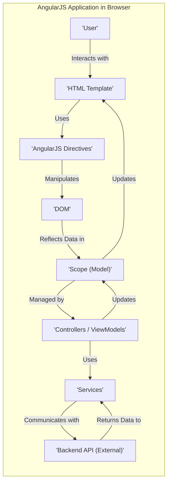
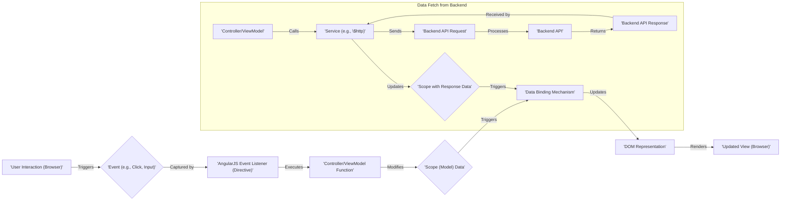

## Project Design Document: AngularJS (Version 1.x) for Threat Modeling (Improved)

**1. Introduction**

This document provides an enhanced design overview of the AngularJS (version 1.x) framework, specifically tailored to facilitate comprehensive threat modeling. It details the key architectural components, data flows, and interactions within an AngularJS application, emphasizing aspects relevant to security vulnerabilities. This document serves as a foundational resource for identifying potential attack vectors and designing effective mitigation strategies. The focus is on providing the necessary context for security analysis.

**2. Project Overview**

AngularJS (version 1.x) is a client-side JavaScript framework designed for building dynamic single-page web applications (SPAs). It extends standard HTML with custom attributes and elements (directives) and offers features like two-way data binding, dependency injection, and routing to streamline development. Understanding its client-side nature and architectural patterns is critical for identifying potential security weaknesses that arise from its execution within the user's browser.

**3. Architectural Overview**

AngularJS applications typically adhere to a Model-View-Controller (MVC) or Model-View-ViewModel (MVVM) architectural pattern. The following diagram illustrates the core components and their relationships within this pattern.

**4. Detailed Component Description**

This section provides a more granular description of the key components:

*   **User:** The end-user interacting with the application through their web browser. This is the primary entry point for potential attacks.
*   **HTML Template:** The base HTML structure of the application. AngularJS directives are embedded within this template to enhance its functionality. Untrusted data injected here can lead to XSS.
*   **AngularJS Directives:** Custom HTML attributes and elements that extend HTML's capabilities. They handle DOM manipulation, data binding, and event handling. Improperly implemented directives can introduce vulnerabilities. Examples include:
    *   `ng-model`: Binds HTML input elements to the scope.
    *   `ng-click`: Executes an expression when an element is clicked.
    *   `ng-repeat`:  Repeats a section of HTML for each item in a collection.
    *   Custom Directives: Developer-defined directives that can have complex logic and potential security flaws.
*   **DOM (Document Object Model):** The tree-like representation of the HTML document. AngularJS directives directly manipulate the DOM.
*   **Scope (Model):** A JavaScript object that serves as the data context for the view. It holds the application's data and functions. Access control and sanitization of data within the scope are important security considerations.
*   **Controllers / ViewModels:** JavaScript functions that manage the application's logic and interact with the scope. They handle user input, update the model, and interact with services. Vulnerabilities here can lead to unauthorized data manipulation or access.
*   **Services:** Reusable singleton objects that encapsulate business logic, data access, and other functionalities. They are injected into controllers and other services. Security flaws in services can have widespread impact. Examples include:
    *   `$http`: Used for making HTTP requests to backend APIs. Misuse can lead to information disclosure or SSRF.
    *   `$route`: Handles routing within the application. Improper configuration can lead to unauthorized access to views.
    *   Custom Services: Developer-defined services that require careful security review.
*   **Backend API (External):**  A server-side application that provides data and performs server-side operations. This is a critical point of interaction and a potential attack surface.

**5. Data Flow (Detailed)**

The following diagram illustrates a more detailed data flow, highlighting potential security touchpoints:

*   **User Interaction (Browser):** The user interacts with the application. This is the initial point where malicious input can be introduced.
*   **Event (e.g., Click, Input):** Browser events triggered by user actions.
*   **AngularJS Event Listener (Directive):** Directives like `ng-click` or `ng-change` listen for these events. Improperly secured event handlers can be exploited.
*   **Controller/ViewModel Function:** The JavaScript function executed in response to the event. This is where input validation and sanitization should occur.
*   **Scope (Model) Data:** The data within the scope that is modified by the controller/viewmodel. Ensure proper access controls and data integrity.
*   **Data Binding Mechanism:** AngularJS's two-way data binding automatically updates the view when the scope changes. Be mindful of displaying untrusted data without sanitization.
*   **DOM Representation:** The in-memory representation of the HTML. Direct manipulation of the DOM with untrusted data can lead to XSS.
*   **Updated View (Browser):** The browser renders the updated view.
*   **Data Fetch from Backend:**
    *   **Controller/ViewModel:** Initiates a request for data.
    *   **Service (e.g., `$http`):** Makes an HTTP request to the backend. Ensure proper configuration to prevent issues like SSRF.
    *   **Backend API Request:** The request sent to the server. This should be authenticated and authorized.
    *   **Backend API:** Processes the request. Backend security is crucial here.
    *   **Backend API Response:** The data returned by the server. Ensure the response is validated and sanitized on the client-side before rendering.
    *   **Scope with Response Data:** The scope is updated with the data from the backend.
    *   **Data Binding Mechanism:** Updates the view with the fetched data.

**6. Key Components and Their Interactions (Security Focus)**

*   **Modules:**  While primarily for organization, module definitions can impact security if dependencies are not managed carefully. Ensure only trusted modules are included.
*   **Dependency Injection:**  While beneficial for development, ensure that injected services do not have security vulnerabilities. Carefully review third-party service implementations.
*   **Routing:**  Improperly configured routes can allow unauthorized access to specific parts of the application. Ensure proper authentication and authorization checks are in place for sensitive routes.
*   **Templates:**  A major source of XSS vulnerabilities if user-provided data is directly embedded without proper sanitization using mechanisms like `$sce` (Strict Contextual Escaping).
*   **Forms:**  Client-side form validation can improve user experience but should not be relied upon for security. Server-side validation is essential. Be aware of potential injection attacks through form inputs.
*   **Filters:**  While primarily for formatting, custom filters that perform complex logic should be reviewed for potential vulnerabilities.
*   **Internationalization (i18n) and Localization (l10n):**  Ensure that translated strings and locale-specific data do not introduce vulnerabilities, especially if sourced from external sources.

**7. External Dependencies and Integrations (Security Implications)**

The security of an AngularJS application is often influenced by its external dependencies:

*   **Backend APIs:**  The security of the backend API is paramount. Vulnerabilities in the API can be exploited through the AngularJS application. Ensure proper authentication, authorization, input validation, and output encoding on the backend.
*   **Third-Party Libraries:**  Using vulnerable versions of libraries (e.g., jQuery, UI component libraries) can introduce security risks. Regularly update dependencies and perform security audits. Be aware of supply chain attacks.
*   **Authentication and Authorization Services:**  Ensure secure integration with authentication providers (e.g., OAuth 2.0, OpenID Connect). Improperly implemented authentication can lead to unauthorized access.
*   **Analytics Platforms:**  While generally low-risk, ensure that sensitive data is not inadvertently sent to analytics platforms.
*   **Social Media Platforms:**  Be cautious about the permissions granted to the application when integrating with social media APIs. Prevent CSRF attacks when interacting with these platforms.
*   **Payment Gateways:**  Security is critical when integrating with payment gateways. Follow best practices and PCI DSS compliance guidelines. Avoid handling sensitive payment information directly on the client-side.

**8. Security Considerations (Detailed)**

This section expands on the initial security considerations, providing more specific examples of potential threats:

*   **Client-Side Security:**
    *   **Cross-Site Scripting (XSS):**  A primary concern. Occurs when malicious scripts are injected into the application and executed in the user's browser. Focus on:
        *   **Input Sanitization:**  Sanitize user input before displaying it in the view using `$sce`.
        *   **Contextual Output Encoding:**  Encode data appropriately based on the output context (HTML, URL, JavaScript).
        *   **Content Security Policy (CSP):**  Implement CSP to restrict the sources from which the browser can load resources.
    *   **Cross-Site Request Forgery (CSRF):**  Attacker tricks an authenticated user into making unintended requests. Mitigation strategies include:
        *   **Synchronizer Tokens (CSRF Tokens):**  Include a unique, unpredictable token in requests.
        *   **SameSite Cookies:**  Configure cookies to prevent cross-site requests.
    *   **Client-Side Injection Attacks:**
        *   **DOM-based XSS:**  Occurs when the application's own JavaScript code manipulates the DOM in an unsafe way based on user input.
        *   **AngularJS Expression Injection:**  Carefully evaluate expressions used in directives like `ng-bind-html`.
    *   **Sensitive Data Exposure:**  Avoid storing sensitive data directly in the client-side code or local storage.
*   **Communication Security:**
    *   **HTTPS:**  Mandatory for protecting data in transit between the browser and the backend.
    *   **API Authentication and Authorization:**  Use secure authentication mechanisms (e.g., OAuth 2.0, JWT) and implement proper authorization checks on the backend.
*   **Dependency Management:**  Regularly scan dependencies for known vulnerabilities using tools like `npm audit` or `yarn audit`.
*   **State Management:**  Ensure that sensitive application state is not exposed or manipulated in an unauthorized manner.
*   **Routing Security:**  Implement authentication and authorization guards on routes that require specific permissions.
*   **Source Code Security:**  Protect the application's source code from unauthorized access. Avoid exposing sensitive information in client-side code. Consider using code obfuscation (with caution, as it's not a foolproof solution).

**9. Deployment Environment (Security Considerations)**

The deployment environment also presents security considerations:

*   **Web Server Configuration:**  Securely configure the web server (e.g., Nginx, Apache) to prevent common attacks. Disable unnecessary features and ensure proper access controls.
*   **CDN Security:**  If using a CDN, ensure its security configuration is appropriate. Be aware of potential CDN compromise.
*   **Static File Security:**  Protect the static files of the application from unauthorized access or modification.

**10. Conclusion**

This improved design document provides a more detailed and security-focused overview of AngularJS (version 1.x) applications. It highlights potential threat vectors and emphasizes the importance of security considerations throughout the development lifecycle. This document serves as a crucial input for a comprehensive threat modeling process, enabling the identification of vulnerabilities and the design of effective security controls to mitigate risks. The next step involves utilizing this document in a structured threat modeling exercise, such as STRIDE or PASTA, to systematically analyze potential threats and develop appropriate countermeasures.