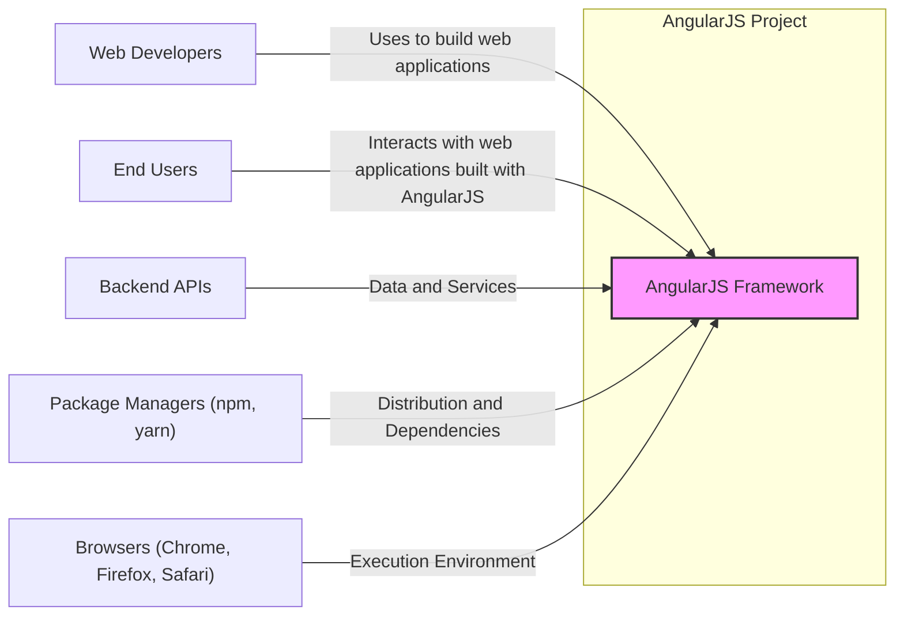
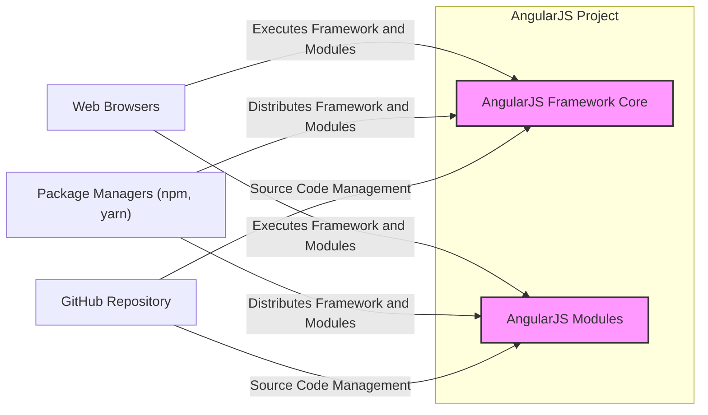
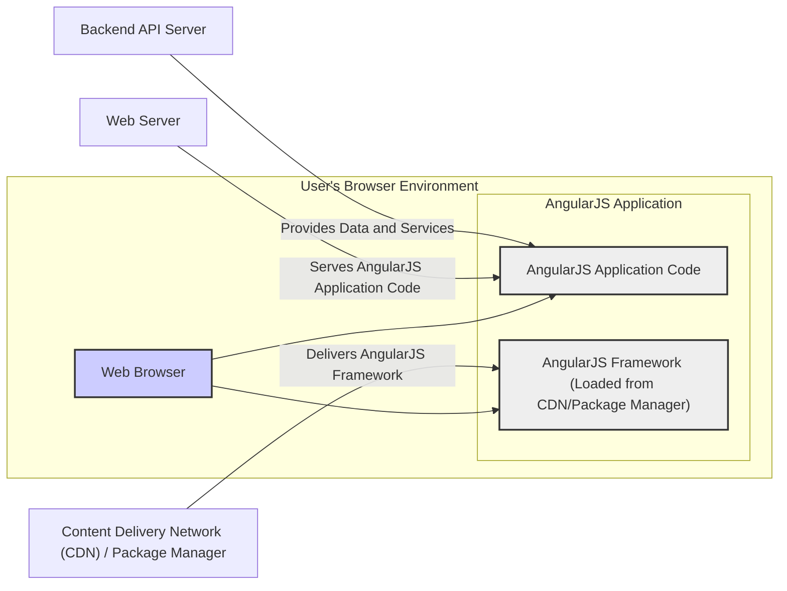
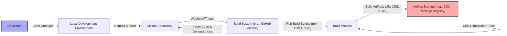

# BUSINESS POSTURE

The AngularJS project is an open-source JavaScript framework designed to simplify the development and testing of web applications. It provides a structured approach to building dynamic web applications, primarily Single Page Applications (SPAs).

Business Priorities and Goals:

- Goal: Provide a comprehensive and user-friendly framework for building dynamic web applications.
- Goal: Enable developers to create maintainable and testable front-end code.
- Goal: Foster a strong community around the framework to ensure its continued development and support.
- Priority: Maintain the stability and reliability of the framework for existing applications.
- Priority: Address critical security vulnerabilities promptly to maintain user trust.

Business Risks:

- Business Risk: Security vulnerabilities in the framework could lead to exploitation of applications built with AngularJS, resulting in data breaches, service disruption, or reputational damage.
- Business Risk: Lack of community support or maintainer burnout could lead to slow response times for bug fixes and security patches, impacting users.
- Business Risk:  Framework obsolescence as newer technologies emerge, potentially leading to reduced adoption and eventual decline in relevance.
- Business Risk: Compatibility issues with modern browsers and evolving web standards could require significant refactoring and maintenance efforts.

# SECURITY POSTURE

Existing Security Controls:

- security control: Open Source Code - The AngularJS codebase is publicly available on GitHub, allowing for community review and scrutiny, which can help identify potential security vulnerabilities. Implemented: GitHub Repository.
- security control: Community Contributions - Security vulnerabilities and bug fixes are often identified and contributed by the open-source community. Implemented: GitHub pull requests and issue tracking.
- security control: Standard Web Security Practices - Applications built with AngularJS are expected to follow standard web security practices, such as input validation, output encoding, and secure communication (HTTPS). Implemented: Developer responsibility when building applications.

Accepted Risks:

- accepted risk: Reliance on Community Security Contributions - The project relies on the community to identify and report security vulnerabilities. The speed and effectiveness of vulnerability discovery and patching are dependent on community engagement.
- accepted risk: Third-Party Dependencies - AngularJS relies on third-party libraries and tools (though minimized in core). Vulnerabilities in these dependencies could indirectly affect AngularJS applications. Mitigation: Dependency updates and scanning (generally expected from developers using the framework).
- accepted risk: Client-Side Execution - As a client-side framework, AngularJS code executes in the user's browser, making it susceptible to client-side attacks if applications are not developed securely. Mitigation: Developer responsibility for secure application development.

Recommended Security Controls:

- recommended security control: Security Audits - Periodic security audits of the AngularJS framework codebase by security experts to proactively identify potential vulnerabilities.
- recommended security control: Vulnerability Disclosure Policy - A clear and public vulnerability disclosure policy to guide security researchers on how to report vulnerabilities responsibly.
- recommended security control: Automated Security Scanning - Integrate automated security scanning tools (SAST, DAST, dependency scanning) into the development and release process to detect vulnerabilities early.
- recommended security control: Security focused documentation - Provide clear and comprehensive security guidelines and best practices for developers building applications with AngularJS.

Security Requirements:

- Authentication: AngularJS itself does not handle authentication. Authentication is the responsibility of the backend services and the applications built using AngularJS. Security Requirement: Applications built with AngularJS must integrate with secure authentication mechanisms provided by backend services.
- Authorization: AngularJS itself does not handle authorization. Authorization logic resides in the backend services. Security Requirement: Applications built with AngularJS must securely interact with backend authorization services to control access to resources and functionalities.
- Input Validation: AngularJS applications must perform input validation to prevent client-side vulnerabilities like Cross-Site Scripting (XSS). Security Requirement: Implement robust input validation on the client-side within AngularJS applications, especially when handling user-provided data.
- Cryptography: AngularJS itself does not provide cryptographic primitives. Cryptographic operations should ideally be handled by secure backend services. Security Requirement: If client-side cryptography is necessary within AngularJS applications, utilize well-vetted and secure JavaScript crypto libraries. Ensure sensitive cryptographic keys are not exposed client-side. Security Requirement: Secure communication (HTTPS) must be enforced for all communication between the browser and backend services.

# DESIGN

## C4 CONTEXT

Context Diagram Elements:

- Element:
    - Name: AngularJS Framework
    - Type: Software System
    - Description: The AngularJS JavaScript framework itself, providing the core functionalities for building web applications.
    - Responsibilities: Provides the structure, components, and tools for developing dynamic web applications. Handles data binding, routing, templating, and other front-end functionalities.
    - Security controls: Open source code, community review, adherence to web security best practices in framework design.

- Element:
    - Name: Web Developers
    - Type: Person
    - Description: Software engineers who use AngularJS to build web applications.
    - Responsibilities: Develop, test, and deploy web applications using AngularJS. Responsible for implementing security best practices in the applications they build.
    - Security controls: Secure coding practices, input validation, output encoding, secure configuration of applications.

- Element:
    - Name: End Users
    - Type: Person
    - Description: Users who interact with web applications built using AngularJS through their web browsers.
    - Responsibilities: Use web applications to access information or perform tasks.
    - Security controls: Browser security features, user awareness of phishing and other web-based attacks.

- Element:
    - Name: Backend APIs
    - Type: Software System
    - Description: Backend services and APIs that provide data and functionalities to AngularJS applications.
    - Responsibilities: Provide data, business logic, authentication, and authorization services to front-end applications.
    - Security controls: API authentication and authorization, input validation, secure data handling, rate limiting, protection against common web attacks (OWASP Top 10).

- Element:
    - Name: Package Managers (npm, yarn)
    - Type: Software System
    - Description: Package managers used to distribute and manage AngularJS and its dependencies.
    - Responsibilities: Provide a repository for AngularJS packages and manage dependencies for developers.
    - Security controls: Package integrity checks, vulnerability scanning of packages, secure distribution channels.

- Element:
    - Name: Browsers (Chrome, Firefox, Safari)
    - Type: Software System
    - Description: Web browsers that execute AngularJS applications.
    - Responsibilities: Execute JavaScript code, render web pages, enforce browser security policies.
    - Security controls: Browser security features (Content Security Policy, Same-Origin Policy, XSS protection), sandboxing, regular security updates.

## C4 CONTAINER

Container Diagram Elements:

- Element:
    - Name: AngularJS Framework Core
    - Type: Container (Code Library)
    - Description: The core JavaScript library of AngularJS, providing the fundamental functionalities of the framework (e.g., dependency injection, data binding, directives).
    - Responsibilities: Core framework logic, handling application bootstrapping, core modules, and basic functionalities.
    - Security controls: Code review, static analysis, community scrutiny, adherence to secure coding practices.

- Element:
    - Name: AngularJS Modules
    - Type: Container (Code Libraries)
    - Description:  Separate modules that extend the core functionality of AngularJS, providing features like routing, HTTP communication, forms, and more.
    - Responsibilities: Provide extended functionalities, modularity, and organization of the framework.
    - Security controls: Code review, static analysis, community scrutiny, adherence to secure coding practices, module-specific security considerations.

- Element:
    - Name: Web Browsers
    - Type: Container (Execution Environment)
    - Description: The runtime environment where AngularJS applications and the framework code are executed.
    - Responsibilities: Execute JavaScript code, render HTML and CSS, enforce browser security policies.
    - Security controls: Browser security features (CSP, SOP, XSS protection), sandboxing, regular updates.

- Element:
    - Name: Package Managers (npm, yarn)
    - Type: Container (Package Registry)
    - Description:  Repositories and tools used to distribute and manage AngularJS framework and module packages.
    - Responsibilities: Host and distribute AngularJS packages, manage dependencies for developers.
    - Security controls: Package integrity checks, vulnerability scanning of packages, secure distribution channels.

- Element:
    - Name: GitHub Repository
    - Type: Container (Source Code Repository)
    - Description: The Git repository hosting the AngularJS source code, issue tracking, and collaboration platform.
    - Responsibilities: Version control, source code management, issue tracking, pull request management, collaboration platform for developers.
    - Security controls: Access control, branch protection, code review processes, vulnerability scanning of repository.

## DEPLOYMENT

AngularJS applications are typically deployed as client-side web applications. The framework itself is distributed via package managers or CDNs and is executed within the user's web browser.

Deployment Architecture: Client-Side Application Deployment

Deployment Diagram Elements:

- Element:
    - Name: Web Browser
    - Type: Execution Environment
    - Description: The user's web browser (e.g., Chrome, Firefox, Safari) where the AngularJS application runs.
    - Responsibilities: Executes JavaScript code, renders the user interface, interacts with the user, and communicates with backend servers.
    - Security controls: Browser security features (CSP, SOP, XSS protection), sandboxing, regular security updates, user-controlled browser settings.

- Element:
    - Name: AngularJS Application Code
    - Type: Software Component (Static Files)
    - Description: The HTML, CSS, and JavaScript files that constitute the specific web application built using AngularJS.
    - Responsibilities: Defines the application's user interface, logic, and interactions.
    - Security controls: Secure coding practices, input validation, output encoding, protection against XSS and other client-side vulnerabilities, secure configuration.

- Element:
    - Name: AngularJS Framework (Loaded from CDN/Package Manager)
    - Type: Software Library (Static Files)
    - Description: The AngularJS framework files loaded into the browser, typically from a CDN or bundled with the application.
    - Responsibilities: Provides the framework functionalities required by the application code.
    - Security controls: Integrity checks of CDN/package manager, secure delivery channels (HTTPS for CDN), vulnerability scanning of framework versions.

- Element:
    - Name: Content Delivery Network (CDN) / Package Manager
    - Type: Infrastructure Service
    - Description: Services like CDNs or package managers (npm, yarn) that host and deliver the AngularJS framework files.
    - Responsibilities: Provide reliable and fast delivery of the framework files to users' browsers.
    - Security controls: CDN security measures, secure package registry infrastructure, integrity checks, HTTPS delivery.

- Element:
    - Name: Web Server
    - Type: Infrastructure Service
    - Description: Web server that hosts and serves the AngularJS application's static files (HTML, CSS, JavaScript).
    - Responsibilities: Serve application files to users' browsers.
    - Security controls: Web server hardening, access control, HTTPS configuration, protection against web server vulnerabilities.

- Element:
    - Name: Backend API Server
    - Type: Software System
    - Description: Backend server(s) that provide data and services to the AngularJS application via APIs.
    - Responsibilities: Handle business logic, data storage, authentication, authorization, and provide APIs for the front-end application.
    - Security controls: API security (authentication, authorization, input validation, rate limiting), backend server security hardening, database security, protection against common web attacks.

## BUILD

Build Process Elements:

- Element:
    - Name: Developer
    - Type: Person
    - Description: Software developer working on the AngularJS project.
    - Responsibilities: Writes code, fixes bugs, implements features, and contributes to the project.
    - Security controls: Secure coding practices, code review participation, awareness of security vulnerabilities.

- Element:
    - Name: Local Development Environment
    - Type: Development Tooling
    - Description: Developer's local machine with tools for coding, testing, and building AngularJS.
    - Responsibilities: Code development, local testing, running build scripts.
    - Security controls: Developer machine security, secure development practices, use of trusted development tools.

- Element:
    - Name: GitHub Repository
    - Type: Source Code Repository
    - Description: Central repository for AngularJS source code, version control, and collaboration.
    - Responsibilities: Version control, source code management, collaboration platform.
    - Security controls: Access control, branch protection, code review processes, vulnerability scanning of repository.

- Element:
    - Name: Build System (e.g., GitHub Actions)
    - Type: CI/CD System
    - Description: Automated build system that compiles, tests, and packages AngularJS.
    - Responsibilities: Automate build process, run tests, perform security checks, create build artifacts.
    - Security controls: Secure build environment, access control, build process integrity, security scanning integration, audit logging.

- Element:
    - Name: Build Process
    - Type: Automated Script
    - Description: Set of scripts and tools used to compile, test, and package AngularJS. Includes steps like dependency installation, compilation, linting, SAST scanning, unit testing, and integration testing.
    - Responsibilities: Compile code, run tests, perform security checks, generate build artifacts.
    - Security controls: SAST scanning, dependency vulnerability scanning, linting, unit and integration tests, secure build scripts, minimized dependencies in build process.

- Element:
    - Name: Artifact Storage (e.g., CDN, Package Registry)
    - Type: Distribution Platform
    - Description: Storage location for built AngularJS artifacts (JavaScript files, CSS, etc.), ready for distribution via CDN or package managers.
    - Responsibilities: Securely store and distribute build artifacts.
    - Security controls: Access control, integrity checks, secure storage, secure distribution channels (HTTPS).

# RISK ASSESSMENT

Critical Business Processes:

- Critical Business Process: Development and maintenance of the AngularJS framework itself. Disruption or compromise of this process would impact all users of AngularJS.
- Critical Business Process: Distribution of the AngularJS framework to developers and end-users. Compromised distribution channels could lead to the delivery of malicious code.
- Critical Business Process: Secure development of applications using AngularJS. Vulnerabilities in applications built with AngularJS can directly impact businesses relying on these applications.

Data Sensitivity:

- Data Sensitivity (AngularJS Framework): The AngularJS framework code itself is public and not sensitive in terms of confidentiality. Integrity and availability are critical. Tampering with the framework code or making it unavailable would be a significant security incident.
- Data Sensitivity (Applications built with AngularJS): Data sensitivity depends entirely on the specific applications built using AngularJS. Applications can handle highly sensitive data (e.g., personal data, financial data, health records). The security of AngularJS applications is crucial to protect this sensitive data.

# QUESTIONS & ASSUMPTIONS

Questions:

- Question: What is the intended audience for this design document? Is it primarily for security engineers, developers, or project stakeholders? (Assumption: Broad audience including security and development teams).
- Question: What is the current level of security maturity for the AngularJS project's development and release processes? (Assumption: Standard open-source project security practices are in place, but there's room for improvement).
- Question: Are there any specific compliance requirements or industry regulations that AngularJS needs to adhere to? (Assumption: No specific compliance requirements beyond general web security best practices for an open-source framework).
- Question: What are the priorities for security improvements? Is it focused on preventing framework vulnerabilities, improving build process security, or providing better security guidance for developers using AngularJS? (Assumption: All aspects are important, but preventing framework vulnerabilities and improving developer guidance are high priorities).

Assumptions:

- Assumption: The focus is on the security of the AngularJS framework itself and the general security considerations for applications built with it, rather than a specific application instance.
- Assumption: Standard open-source development practices are followed, including code review and community contributions.
- Assumption: Security is a concern for the AngularJS project, and there is a desire to improve the security posture.
- Assumption: The AngularJS project aims to provide a secure and reliable framework for web application development within the constraints of an open-source, community-driven project.