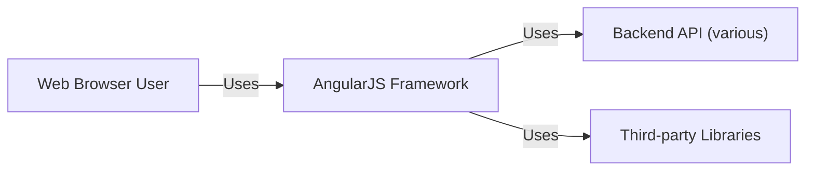
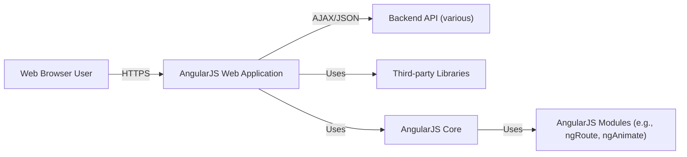
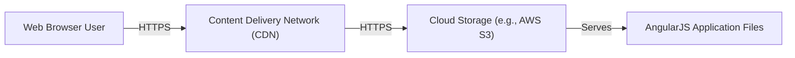
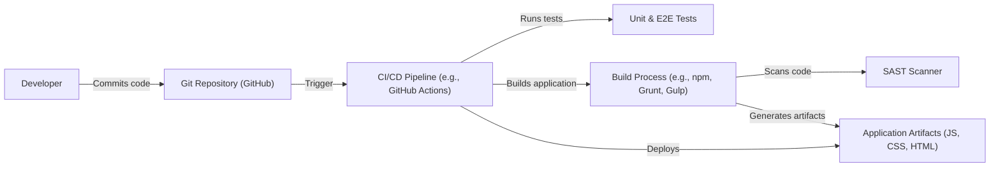

# BUSINESS POSTURE

Business Priorities and Goals:

*   Provide a robust and efficient framework for building dynamic web applications.
*   Maintain backward compatibility while introducing new features and improvements.
*   Foster a large and active community of developers.
*   Ensure the framework remains relevant and competitive in the evolving web development landscape.
*   Simplify the development of complex web applications, reducing development time and cost.
*   Provide a structured approach to web application development, promoting maintainability and scalability.

Business Risks:

*   Security vulnerabilities in the framework could expose applications built with it to attacks, leading to data breaches and reputational damage.
*   Performance issues or instability could negatively impact the user experience of applications built with the framework.
*   Lack of adoption or a decline in community support could lead to the framework becoming obsolete.
*   Failure to keep up with evolving web standards and technologies could render the framework less relevant.
*   Competition from other JavaScript frameworks could reduce market share.

# SECURITY POSTURE

Existing Security Controls:

*   security control: Regular security audits and code reviews (mentioned throughout the repository's commit history and contribution guidelines).
*   security control: Sanitization of user inputs to prevent Cross-Site Scripting (XSS) attacks (documented in the security guidelines and implemented in the core framework).
*   security control: Content Security Policy (CSP) compatibility (discussed in documentation and implemented in parts of the framework).
*   security control: Strict Contextual Escaping (SCE) to prevent XSS in different contexts (documented and implemented).
*   security control: Regular updates and patches to address security vulnerabilities (evident in the release history).
*   security control: Community involvement in identifying and reporting security issues (encouraged through contribution guidelines).

Accepted Risks:

*   accepted risk: Reliance on third-party libraries, which may introduce their own security vulnerabilities.
*   accepted risk: Potential for developers to introduce security vulnerabilities in their applications despite the framework's built-in security features.
*   accepted risk: Backward compatibility requirements may limit the implementation of certain security enhancements.

Recommended Security Controls:

*   security control: Implement a comprehensive and automated security testing pipeline, including static analysis, dynamic analysis, and dependency scanning.
*   security control: Provide more detailed and prescriptive security guidance for developers using the framework.
*   security control: Establish a formal vulnerability disclosure program.
*   security control: Conduct regular penetration testing of the framework.

Security Requirements:

*   Authentication: The framework itself does not handle authentication directly, but it should provide mechanisms to integrate with various authentication systems securely.
*   Authorization: The framework should facilitate the implementation of role-based access control (RBAC) and other authorization schemes.
*   Input Validation: All user inputs must be strictly validated and sanitized to prevent XSS, SQL injection, and other injection attacks.
*   Cryptography: The framework should provide secure defaults for cryptographic operations, such as hashing passwords and encrypting sensitive data. It should also allow developers to easily integrate with secure cryptographic libraries.

# DESIGN

## C4 CONTEXT

Context Diagram Element List:

*   Element:
    *   Name: Web Browser User
    *   Type: Person
    *   Description: A person interacting with a web application built using AngularJS.
    *   Responsibilities: Interacts with the web application, provides input, and views output.
    *   Security controls: Browser-based security controls (e.g., same-origin policy, cookies).

*   Element:
    *   Name: AngularJS Framework
    *   Type: Software System
    *   Description: The AngularJS JavaScript framework for building dynamic web applications.
    *   Responsibilities: Provides the structure and tools for building client-side web applications, handles data binding, routing, and other front-end functionalities.
    *   Security controls: Input sanitization, SCE, CSP compatibility, regular security audits.

*   Element:
    *   Name: Backend API (various)
    *   Type: Software System
    *   Description: Various backend APIs that the AngularJS application interacts with to retrieve and store data.
    *   Responsibilities: Provides data and services to the AngularJS application.
    *   Security controls: Authentication, authorization, input validation, encryption (implementation varies depending on the specific API).

*   Element:
    *   Name: Third-party Libraries
    *   Type: Software System
    *   Description: External JavaScript libraries used by the AngularJS application.
    *   Responsibilities: Provide additional functionality not included in the core AngularJS framework.
    *   Security controls: Dependent on the specific library; developers should choose libraries with a strong security track record.

## C4 CONTAINER

Container Diagram Element List:

*   Element:
    *   Name: Web Browser User
    *   Type: Person
    *   Description: A person interacting with a web application built using AngularJS.
    *   Responsibilities: Interacts with the web application, provides input, and views output.
    *   Security controls: Browser-based security controls (e.g., same-origin policy, cookies).

*   Element:
    *   Name: AngularJS Web Application
    *   Type: Container: Web Application
    *   Description: The web application built using the AngularJS framework, running in the user's web browser.
    *   Responsibilities: Handles user interaction, renders the user interface, communicates with the backend API.
    *   Security controls: Input sanitization, SCE, CSP compatibility, application-specific security logic.

*   Element:
    *   Name: Backend API (various)
    *   Type: Container: API Application
    *   Description: Various backend APIs that the AngularJS application interacts with to retrieve and store data.
    *   Responsibilities: Provides data and services to the AngularJS application.
    *   Security controls: Authentication, authorization, input validation, encryption (implementation varies depending on the specific API).

*   Element:
    *   Name: Third-party Libraries
    *   Type: Container: Library
    *   Description: External JavaScript libraries used by the AngularJS application.
    *   Responsibilities: Provide additional functionality not included in the core AngularJS framework.
    *   Security controls: Dependent on the specific library; developers should choose libraries with a strong security track record.

*   Element:
    *   Name: AngularJS Core
    *   Type: Container: Library
    *   Description: The core AngularJS framework.
    *   Responsibilities: Provides the foundation for building AngularJS applications, including data binding, dependency injection, and templating.
    *   Security controls: Input sanitization, SCE, CSP compatibility.

*   Element:
    *   Name: AngularJS Modules (e.g., ngRoute, ngAnimate)
    *   Type: Container: Library
    *   Description: Optional modules provided by AngularJS for specific functionalities like routing and animations.
    *   Responsibilities: Provide specific features to enhance the AngularJS application.
    *   Security controls: Security considerations specific to each module.

## DEPLOYMENT

Possible Deployment Solutions:

1.  Traditional Web Server (Apache, Nginx): The AngularJS application (HTML, CSS, JavaScript files) is deployed to a web server, which serves the files to users' browsers.
2.  Cloud-Based Hosting (AWS S3, Google Cloud Storage, Azure Blob Storage): The application files are stored in a cloud storage service and served directly to users' browsers, often in conjunction with a Content Delivery Network (CDN).
3.  Platform as a Service (PaaS) (Heroku, Netlify, Vercel): The application is deployed to a PaaS provider, which handles the underlying infrastructure and scaling.

Chosen Deployment Solution (Cloud-Based Hosting with CDN):

Deployment Diagram Element List:

*   Element:
    *   Name: Web Browser User
    *   Type: Person
    *   Description: A person interacting with the deployed AngularJS application.
    *   Responsibilities: Accesses the application through a web browser.
    *   Security controls: Browser-based security controls.

*   Element:
    *   Name: Content Delivery Network (CDN)
    *   Type: Infrastructure Node
    *   Description: A geographically distributed network of servers that cache and deliver the application files to users, improving performance and reducing latency.
    *   Responsibilities: Caches and serves static assets (HTML, CSS, JavaScript).
    *   Security controls: DDoS protection, HTTPS encryption, WAF (Web Application Firewall).

*   Element:
    *   Name: Cloud Storage (e.g., AWS S3)
    *   Type: Infrastructure Node
    *   Description: A cloud-based object storage service that stores the AngularJS application files.
    *   Responsibilities: Stores the application files and serves them to the CDN.
    *   Security controls: Access control lists (ACLs), server-side encryption, versioning.

*   Element:
    *   Name: AngularJS Application Files
    *   Type: Software
    *   Description: The compiled HTML, CSS, and JavaScript files that make up the AngularJS application.
    *   Responsibilities: Runs in the user's browser and provides the application's functionality.
    *   Security controls: Input sanitization, SCE, CSP compatibility.

## BUILD

Build Process Description:

1.  Developers write and commit code to the Git repository (GitHub).
2.  The CI/CD pipeline (e.g., GitHub Actions) is triggered by code commits.
3.  The CI pipeline runs unit and end-to-end (E2E) tests to ensure code quality.
4.  The build process (using tools like npm, Grunt, or Gulp) compiles and bundles the application code.
5.  A Static Application Security Testing (SAST) scanner analyzes the code for potential security vulnerabilities.
6.  The build process generates the application artifacts (minified JavaScript, CSS, and HTML files).
7.  The CI pipeline deploys the artifacts to the target environment (e.g., cloud storage).

Security Controls in Build Process:

*   security control: Git repository access control: Restricting access to the codebase to authorized developers.
*   security control: CI/CD pipeline security: Securing the CI/CD pipeline itself to prevent unauthorized access and modifications.
*   security control: Unit and E2E testing: Automated tests to identify bugs and potential security vulnerabilities early in the development process.
*   security control: SAST scanning: Static analysis to detect security vulnerabilities in the code.
*   security control: Dependency management: Using tools to manage and scan third-party dependencies for known vulnerabilities.
*   security control: Artifact signing: Digitally signing the build artifacts to ensure their integrity and authenticity.

# RISK ASSESSMENT

Critical Business Processes:

*   Providing a reliable and secure framework for web application development.
*   Maintaining a strong community and ecosystem around the framework.
*   Ensuring the framework remains competitive and relevant.

Data to Protect:

*   Source code of the framework (sensitivity: medium): Protecting the intellectual property of the framework.
*   User data processed by applications built with the framework (sensitivity: varies, potentially high): This depends on the specific applications, but could include personally identifiable information (PII), financial data, or other sensitive information. The framework itself does not store this data, but vulnerabilities in the framework could be exploited to access it.
*   Documentation and community resources (sensitivity: low): Ensuring the availability and integrity of resources for developers using the framework.

# QUESTIONS & ASSUMPTIONS

Questions:

*   What specific backend APIs are commonly used with AngularJS applications in this context?
*   What are the specific security requirements of those backend APIs?
*   What is the expected level of security expertise of developers using the framework?
*   Are there any specific compliance requirements (e.g., GDPR, HIPAA) that need to be considered?
*   What is the process for handling security vulnerabilities reported by the community?

Assumptions:

*   BUSINESS POSTURE: The primary goal is to provide a secure and reliable framework, even if it means sacrificing some backward compatibility or introducing breaking changes.
*   SECURITY POSTURE: Developers using the framework have a basic understanding of web security principles.
*   DESIGN: The AngularJS application primarily interacts with backend APIs using AJAX/JSON over HTTPS. The deployment environment is secure and follows best practices. The build process includes automated security checks.