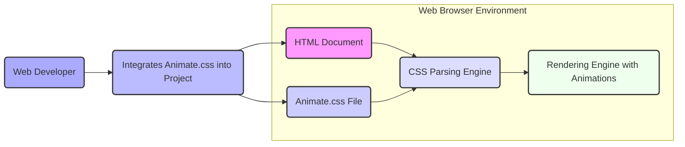

## Project Design Document: Animate.css (Improved)

**1. Introduction**

This document provides an enhanced design overview of the Animate.css project, an open-source library of ready-to-use CSS animations. This detailed description will serve as a robust foundation for subsequent threat modeling exercises.

**2. Project Overview**

Animate.css is a curated collection of cross-browser CSS animations, designed to be easily integrated into web projects. It empowers developers to enrich user interfaces with visually engaging animations by simply applying predefined CSS classes to HTML elements. The library prioritizes offering a diverse range of common animation effects, simplifying the process of enhancing user experience without requiring extensive custom CSS animation development.

**3. Goals**

* To provide a comprehensive and well-organized catalog of frequently used CSS animation effects.
* To offer a straightforward and intuitive method for integrating animations into diverse web development projects.
* To ensure broad cross-browser compatibility across modern web browsers.
* To maintain a lightweight footprint and optimize for performance to minimize impact on page load times and rendering.
* To provide clear, concise, and up-to-date documentation and illustrative examples for ease of use.

**4. Non-Goals**

* This project does not aim to be a comprehensive JavaScript animation library. Animate.css relies exclusively on CSS transitions and animations for its functionality.
* It is not intended to provide highly complex, interactive, or stateful animations that necessitate JavaScript manipulation or control.
* Server-side rendering or any form of server-side processing is outside the scope of this project.
* Managing the animation state or logic beyond the application of CSS classes is not a goal. The library focuses solely on the visual presentation of animations.

**5. System Architecture**

The architecture of Animate.css is intentionally simple, centered around static CSS files.

* **Core CSS File (`animate.css`):** This is the central component, containing all the definitions for animation keyframes and the corresponding CSS classes used to trigger them.
* **Potential Extension/Variation Files:** While the primary distribution is a single file, there might exist community-contributed or officially maintained extension files offering supplementary animations or variations on existing ones. For the purpose of this design document and subsequent threat modeling, the focus will remain on the core `animate.css` file.
* **Demonstration and Example Resources:** The project includes HTML and CSS files that serve as demonstrations of the library's capabilities and provide usage examples. These are for illustrative purposes and are not considered part of the core library's functional components.
* **Documentation Resources:** Markdown files (such as `README.md`) and potentially other documentation formats provide instructions on how to use the library, examples of applying animation classes, and licensing information.

**6. Component Breakdown**

* **`animate.css` File:**
    * Contains CSS rulesets defining animation keyframes using the `@keyframes` at-rule (e.g., `@keyframes fadeIn`).
    * Defines CSS classes that act as triggers for these animations, typically following a naming convention (e.g., `.animate__animated`, `.animate__fadeIn`).
    * Includes utility classes that allow for control over animation properties such as `animation-duration`, `animation-delay`, and `animation-iteration-count`.
    * Logically organized into sections based on animation types (e.g., entrance animations, exit animations, attention seeker animations).

* **Demo Pages (e.g., `index.html`):**
    * HTML files designed to showcase the various animations available in the library.
    * Include `<link>` elements referencing the `animate.css` file.
    * Contain HTML elements with the appropriate CSS classes applied to trigger specific animations.
    * May incorporate basic JavaScript for interactive demonstrations or to dynamically apply animation classes (though this is not a core requirement of the library itself).

* **Documentation Files (e.g., `README.md`):**
    * Provides instructions on how to install and integrate the library into a web project.
    * Offers clear examples demonstrating the application of animation classes to HTML elements.
    * May include a comprehensive list of available animation effects with descriptions.
    * Contains licensing information governing the use and distribution of the library.

**7. Data Flow Diagram**

**Description of Data Flow:**

1. **Web Developer Action:** A web developer (`E`) decides to utilize Animate.css within their web project.
2. **Integration Process:** The developer integrates the `animate.css` file (`C`) into their HTML document (`A`). This is typically achieved by adding a `<link>` tag within the `<head>` section of the HTML.
3. **Class Assignment:** The developer strategically adds specific CSS classes (e.g., `animate__animated`, `animate__bounce`) to relevant HTML elements within their document (`A`).
4. **CSS Processing:** When the web browser loads the HTML document (`A`), its CSS parsing engine (`B`) processes both the HTML structure and the linked `animate.css` file (`C`).
5. **Animation Application:** The CSS parsing engine (`B`) identifies the HTML elements that have been assigned Animate.css classes and applies the corresponding animation styles as defined in `animate.css`.
6. **Visual Rendering:** The browser's rendering engine (`D`) then renders the web page, incorporating the specified animations on the designated elements, creating the visual effects.

**8. Security Considerations**

While Animate.css is fundamentally a client-side CSS library and does not involve server-side processing or direct handling of user input, several security considerations are relevant when incorporating it into web projects:

* **Client-Side Security Risks:**
    * **CSS Injection Attacks:** If an attacker can inject arbitrary CSS into a website that uses Animate.css, they could potentially leverage the animation classes to create misleading, disruptive, or even malicious visual effects. For example, they could animate elements to cover critical information or mimic legitimate UI elements for phishing purposes. This highlights the importance of preventing CSS injection vulnerabilities.
    * **Client-Side Denial of Service (DoS):** Although less likely with typical usage, a malicious actor could attempt to overload the browser's rendering capabilities by applying a large number of complex animations to numerous elements simultaneously. This could lead to a client-side DoS, making the page unresponsive or slow. This is more of a performance and usability concern but can have security implications if it hinders access to critical information.

* **Contextual Security Risks:**
    * **Cross-Site Scripting (XSS) Exploitation:** If Animate.css is used on a website that has existing XSS vulnerabilities, attackers could inject malicious scripts that manipulate the DOM and dynamically apply Animate.css classes to further their attacks. This could involve creating deceptive UI elements, animating content to mislead users, or triggering animations as part of a more complex exploit. Animate.css itself doesn't introduce XSS, but it can be a tool used in conjunction with it.

* **Supply Chain and Integrity Risks:**
    * **Compromised Delivery Channels:** If Animate.css is loaded from a compromised Content Delivery Network (CDN) or other third-party source, the delivered CSS file could be modified to include malicious styles or scripts. This underscores the importance of using reputable CDNs and potentially implementing Subresource Integrity (SRI) checks to ensure the integrity of the loaded file.
    * **Dependency on Third-Party Resources (Indirect):** While Animate.css is primarily a standalone CSS file, the ecosystem around it (e.g., build tools, package managers) could introduce indirect dependencies with potential vulnerabilities. Keeping these tools up-to-date is important.

* **Information Security Considerations:**
    * **Subtle Information Disclosure:** In very specific and unlikely scenarios, the use of certain animations or the timing of animations could potentially reveal subtle information about user interactions or the state of the application. This is a low-risk scenario but worth noting for highly sensitive applications.

**9. Deployment Considerations**

Animate.css is commonly deployed using the following methods:

* **Direct Inclusion (Self-Hosting):** The `animate.css` file is downloaded and included directly within the project's static assets. The HTML then references this local file using a `<link>` tag. This provides more control over the file but requires managing updates.
* **Content Delivery Network (CDN) Integration:** The `animate.css` file is hosted on a CDN, and the HTML includes a `<link>` tag pointing to the CDN URL. This can offer benefits such as improved loading times due to browser caching and geographically distributed servers. However, it introduces a dependency on the CDN provider.

**10. Future Considerations (Beyond Immediate Threat Modeling Scope)**

* **Expansion of Animation Effects:** Continuously adding new and innovative animation effects to the library.
* **Customization and Theming Options:** Exploring ways to allow developers to customize existing animations through CSS variables or other theming mechanisms.
* **Enhanced Documentation and Examples:** Providing more detailed documentation, interactive examples, and potentially video tutorials.
* **Integration with Web Component Standards:** Investigating potential integration with web component standards for more encapsulated animation solutions.

This improved design document provides a more detailed and nuanced understanding of the Animate.css project, specifically focusing on aspects relevant to identifying and mitigating potential security threats. The enhanced descriptions of the system architecture, components, and data flow, along with a more comprehensive security considerations section, will be invaluable for effective threat modeling.