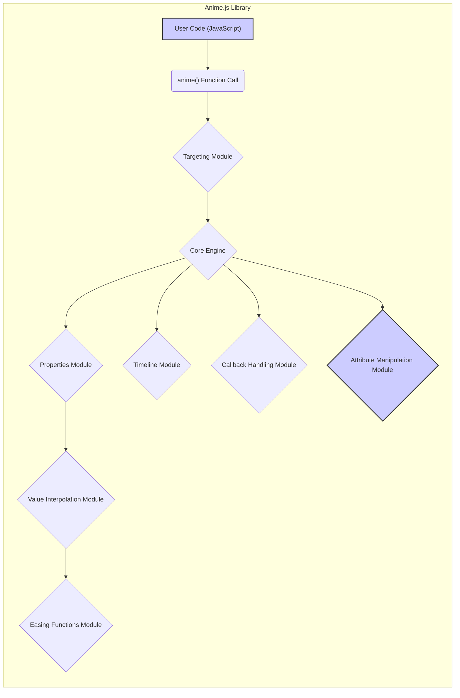

# Project Design Document: Anime.js Library

**Version:** 1.1
**Date:** October 26, 2023
**Author:** AI Software Architect

## 1. Introduction

This document provides an enhanced and more detailed design overview of the Anime.js library, a lightweight JavaScript animation library. This document is intended to serve as a robust foundation for subsequent threat modeling activities. It outlines the library's architecture, components, data flow, and key considerations relevant to security with greater specificity.

## 2. Project Overview

Anime.js is a versatile JavaScript animation library designed for web browsers. It enables developers to animate a wide range of properties, including CSS properties, SVG attributes, DOM attributes, and even properties of JavaScript Objects. The library is known for its flexible API, allowing for complex animation sequences and timelines with relative ease. Its core strength lies in providing a performant and declarative approach to client-side animation.

## 3. Goals

* Provide a clear, comprehensive, and more granular architectural overview of the Anime.js library.
* Identify key internal modules and their interactions in greater detail.
* Describe the data flow within the library with more precision.
* Highlight potential areas of security concern with specific examples for future threat modeling.

## 4. Target Audience

This document is intended for:

* Security engineers performing in-depth threat modeling and security assessments.
* Developers working on the Anime.js library itself or building extensions.
* Architects requiring a thorough understanding of the library's internal mechanisms for integration and risk assessment.

## 5. Architectural Design

### 5.1. High-Level Architecture

Anime.js operates entirely within the client-side web browser environment. It functions by taking user-defined animation parameters and manipulating the properties of target elements or objects over a specified duration, creating the illusion of motion. The library's core is event-driven, relying on the browser's `requestAnimationFrame` API for smooth and efficient animation updates.

### 5.2. Key Components and Modules

* **Core Engine (`anime.js`):** The central module responsible for managing the animation loop, processing animation parameters, and orchestrating the interactions between other modules.
* **Targeting Module:**  Handles the selection of elements or objects to be animated. This includes parsing CSS selectors, direct element references, and NodeLists.
* **Properties Module:**  Responsible for understanding and processing different types of animatable properties (CSS, SVG, DOM attributes, JavaScript object properties). It contains logic for extracting initial values and applying updated values.
* **Timeline Module:**  Allows for the creation and management of animation timelines, enabling the sequencing and synchronization of multiple animations with precise control over start times and durations.
* **Easing Functions Module:**  Provides a collection of predefined easing functions (e.g., linear, easeInQuad, easeOutCubic) and allows for the creation of custom easing functions to control the animation's acceleration and deceleration.
* **Value Interpolation Module:**  Calculates the intermediate values between the starting and ending values of an animated property based on the current time and the selected easing function.
* **Callback Handling Module:** Manages the execution of user-defined callback functions at various stages of the animation lifecycle (`begin`, `update`, `complete`, `loopBegin`, `loopComplete`).
* **Attribute Manipulation Module:**  Handles the actual modification of the target element's attributes, styles, or object properties based on the calculated animation values.

### 5.3. Data Flow

**Detailed Data Flow:**

* **User Code (JavaScript):** Developers initiate animations by calling the `anime()` function, passing in a configuration object that specifies the targets, properties to animate, duration, easing, and other settings.
* **`anime()` Function Call:** This serves as the entry point, receiving the animation configuration.
* **Targeting Module:**  Parses the target selector (CSS selector, element reference, etc.) and resolves it to a collection of animatable elements or objects.
* **Core Engine:**  Initializes the animation timeline, sets up the animation loop using `requestAnimationFrame`, and manages the overall animation state.
* **Properties Module:**  Analyzes the animation properties specified by the user. It determines the initial and final values for each property and how they should be animated.
* **Value Interpolation Module:**  Calculates the intermediate values for each animated property at each frame of the animation, based on the elapsed time and the selected easing function.
* **Easing Functions Module:** Provides the mathematical functions used by the Value Interpolation Module to determine the rate of change of the animated values.
* **Timeline Module:** If the animation is part of a timeline, this module coordinates its execution relative to other animations in the timeline.
* **Callback Handling Module:**  Manages the execution of user-defined callback functions at the appropriate times during the animation lifecycle.
* **Attribute Manipulation Module:**  Applies the calculated animation values to the target elements or objects by directly manipulating their DOM attributes, CSS styles, or JavaScript object properties.

## 6. Security Considerations

This section expands on potential security concerns, providing more specific examples:

* **Cross-Site Scripting (XSS) via Property Manipulation:**
    * **Threat:** If user-controlled data is used to animate properties like `innerHTML` or `outerHTML` without proper sanitization, it can lead to XSS attacks.
    * **Example:** `anime({ targets: '#myDiv', innerHTML: maliciousCode });` where `maliciousCode` originates from user input.
* **Denial of Service (DoS) through Resource Exhaustion:**
    * **Threat:** Malicious actors could trigger a large number of complex animations on numerous elements simultaneously, potentially overwhelming the client's browser and causing performance degradation or crashes.
    * **Example:** Animating thousands of elements with computationally intensive easing functions and long durations.
* **Logic Flaws Leading to Unexpected Behavior:**
    * **Threat:** Bugs within the Anime.js library's core logic could be exploited to cause unintended side effects or bypass security measures in the application using the library.
    * **Example:** A flaw in the timeline management could allow animations to execute in an unexpected order, leading to a broken user interface or security vulnerabilities.
* **Dependency Vulnerabilities (Indirect):**
    * **Threat:** While Anime.js has no direct dependencies, vulnerabilities in the browser environment or other libraries used in conjunction with Anime.js could indirectly impact its security.
    * **Example:** A vulnerability in a polyfill used for older browsers could be exploited when Anime.js is used in that environment.
* **Input Validation and Error Handling:**
    * **Threat:** The library should robustly handle invalid or unexpected input (e.g., attempting to animate non-existent elements, providing incorrect property types). Failure to do so could lead to errors or unpredictable behavior that could be exploited.
    * **Example:** Providing a string value for a numeric CSS property might cause an error, but a more sophisticated attack might involve crafting specific invalid inputs to trigger a vulnerability.
* **Callback Function Exploitation:**
    * **Threat:** If callback functions are not handled carefully, particularly if they involve manipulating sensitive data or performing actions with elevated privileges (though less common in client-side JavaScript), they could be a point of vulnerability.
    * **Example:** A poorly written `complete` callback might inadvertently expose sensitive information or perform an unintended action.
* **Prototype Pollution:**
    * **Threat:** While less likely in a library like Anime.js, if the library's internal mechanisms for handling animation parameters involve deep merging or object manipulation without proper safeguards, it could potentially be vulnerable to prototype pollution attacks.

## 7. Dependencies

* **None (Core Library):** The core Anime.js library is designed to be lightweight and has no external library dependencies.
* **Browser Environment:**  Anime.js relies on standard web browser APIs, primarily:
    * `requestAnimationFrame`: For efficient and smooth animation timing.
    * DOM APIs: For selecting and manipulating elements.
    * CSSOM APIs: For accessing and modifying CSS properties.

## 8. Deployment

Anime.js is typically deployed in one of the following ways:

* **Direct Inclusion via `<script>` tag:**  The `anime.min.js` file is directly included in the HTML of a web page.
* **Module Bundlers (e.g., Webpack, Parcel, Rollup):**  Imported as a module in JavaScript projects and bundled with other application code.
* **Content Delivery Networks (CDNs):**  Referenced from a CDN, allowing browsers to potentially cache the library.

## 9. Future Considerations

* **WebAssembly (Wasm) for Performance-Critical Sections:**  Exploring the use of WebAssembly for computationally intensive parts of the animation engine to further improve performance. This would introduce new security considerations related to Wasm module security.
* **Formal Security Audits and Penetration Testing:**  Conducting regular security audits and penetration testing by security experts to proactively identify and address potential vulnerabilities.
* **Subresource Integrity (SRI):** Encouraging the use of SRI when including Anime.js from CDNs to ensure the integrity of the loaded file.
* **Stricter Input Validation and Sanitization:** Implementing more rigorous input validation and sanitization within the library to mitigate potential XSS risks when animating certain properties.

## 10. Conclusion

This enhanced design document provides a more detailed and nuanced understanding of the Anime.js library's architecture and potential security considerations. The specific examples of threats and vulnerabilities outlined in this document will be invaluable for conducting thorough threat modeling exercises and ensuring the secure integration of Anime.js into web applications.
