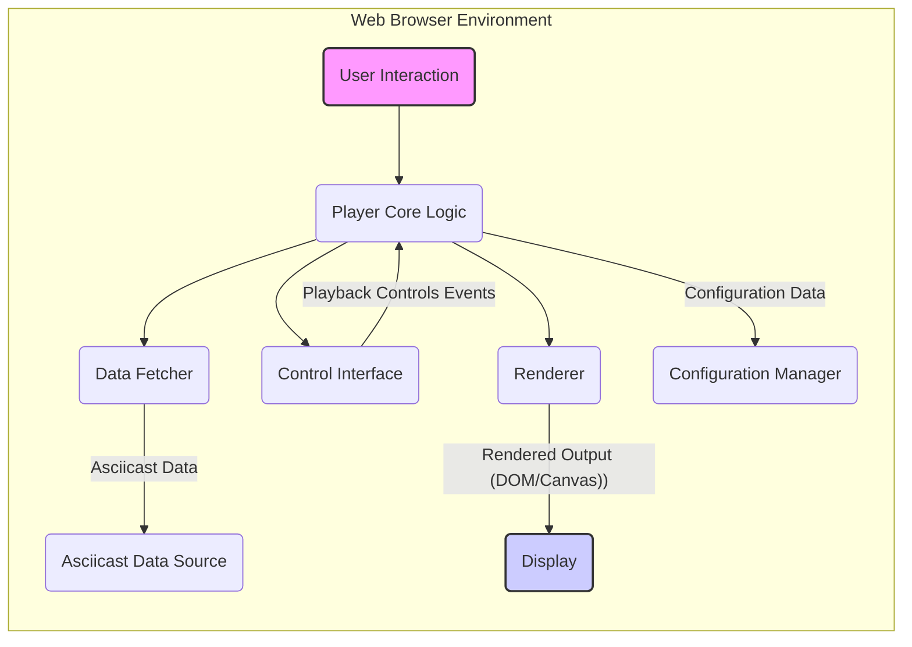
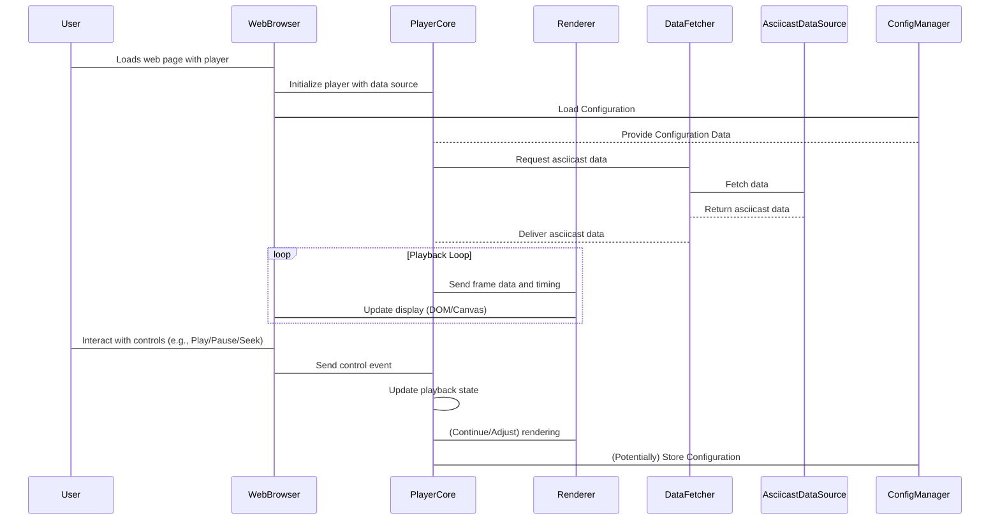

# Project Design Document: asciinema-player

**Version:** 1.1
**Date:** October 26, 2023
**Author:** AI Architecture Expert

## 1. Introduction

This document provides an enhanced and more detailed design overview of the `asciinema-player` project, an open-source JavaScript-based web player for asciicast recordings. This revised document aims to provide a clearer and more comprehensive understanding of the player's architecture, components, data flow, and key considerations, specifically tailored for subsequent threat modeling activities. We have expanded on several areas to provide greater depth.

## 2. Goals and Objectives

The primary goals of the `asciinema-player` are:

*   To provide a seamless and intuitive web interface for playing asciicast recordings.
*   To accurately and efficiently render terminal output from asciicast files, preserving the original formatting and timing.
*   To offer a standard set of playback controls, including play, pause, seek, and potentially speed adjustment.
*   To be easily embeddable on a wide range of websites and platforms with minimal configuration.
*   To be lightweight and performant, ensuring a smooth playback experience even for long recordings.
*   To support various methods of loading asciicast data, accommodating different use cases.
*   To maintain a clean and well-structured codebase for ease of maintenance and contribution.

## 3. Architectural Overview

The `asciinema-player` operates predominantly as a client-side application built with JavaScript. It functions within a web browser, leveraging browser APIs and potentially external resources to fetch and display asciicast data.

Key architectural components with more detail:

*   **User Interaction:** Represents user actions within the browser, such as clicking buttons, using keyboard shortcuts, or resizing the player window. These interactions trigger events handled by the player.
*   **Player Core Logic:** The central JavaScript module, acting as the orchestrator of the player. It manages the playback lifecycle, synchronizes data fetching and rendering, and responds to user input. This component likely includes state management and event handling mechanisms.
*   **Renderer:**  The module responsible for the visual representation of the terminal output. This might involve manipulating the Document Object Model (DOM) by creating and updating HTML elements, or potentially using a `<canvas>` element for more advanced rendering. It handles the interpretation of terminal escape sequences for formatting.
*   **Control Interface:**  Provides the user interface elements for controlling playback. This includes buttons for play/pause, a progress bar for seeking, and potentially controls for adjusting playback speed or volume (if applicable). It translates user actions into commands for the Player Core Logic.
*   **Data Fetcher:**  Handles the retrieval of asciicast data. It supports fetching data from various sources and manages asynchronous operations. It may implement error handling and potentially caching mechanisms.
*   **Asciicast Data Source:**  The location from which the asciicast data is retrieved. This can be a URL pointing to a JSON file hosted on a web server or the data embedded directly within the HTML. The format is typically a JSON structure containing timing information and terminal output.
*   **Display:** The browser's rendering area where the visual representation of the terminal is presented to the user. This is the output of the Renderer.
*   **Configuration Manager:** A module responsible for managing the player's configuration options, such as theme, font, and playback speed. These configurations can be set via JavaScript or potentially through HTML attributes.

## 4. Component Details

### 4.1. Player Core Logic

*   **Responsibilities:**
    *   Manages the overall playback state (idle, loading, playing, paused, finished).
    *   Controls the timing and progression of the playback, often using `requestAnimationFrame` for smooth animation.
    *   Orchestrates data fetching, processing, and rendering.
    *   Handles user interactions from the Control Interface and updates the playback state accordingly.
    *   Manages configuration options received from the Configuration Manager.
    *   Emits events to notify other components or external listeners about playback state changes.
*   **Inputs:**
    *   User interactions (play, pause, seek, speed change).
    *   Asciicast data received from the Data Fetcher.
    *   Configuration parameters from the Configuration Manager.
*   **Outputs:**
    *   Instructions to the Renderer to update the displayed terminal output.
    *   Updates to the playback state, reflected in the Control Interface.
    *   Events signaling playback status changes (e.g., `play`, `pause`, `ended`).
*   **Technology:** Primarily JavaScript, potentially utilizing libraries for state management or event handling.

### 4.2. Renderer

*   **Responsibilities:**
    *   Parses the asciicast data format (typically JSON), extracting timing and output information.
    *   Renders terminal characters and applies formatting based on ANSI escape codes (colors, bold, italics, etc.).
    *   Manages the terminal display buffer, representing the current state of the terminal.
    *   Handles terminal control sequences for cursor movement, clearing the screen, and other terminal-specific actions.
    *   Optimizes rendering performance to ensure smooth playback, potentially using techniques like virtual DOM or canvas rendering.
    *   May support different rendering modes (e.g., DOM-based, Canvas-based).
*   **Inputs:**
    *   Asciicast data frames containing output and timing information.
    *   Configuration parameters affecting rendering (e.g., font family, font size, theme).
*   **Outputs:**
    *   The rendered terminal output displayed in the browser, either as HTML elements or drawn on a canvas.
*   **Technology:** JavaScript, potentially utilizing DOM APIs or Canvas 2D API. May include libraries for terminal emulation or ANSI code parsing.

### 4.3. Control Interface

*   **Responsibilities:**
    *   Provides interactive UI elements for controlling playback (play/pause button, progress bar/slider, potentially speed controls).
    *   Handles user interactions with these elements, translating them into events.
    *   Displays the current playback progress, duration, and potentially other relevant information.
    *   Visually reflects the current playback state (e.g., highlighting the play/pause button).
*   **Inputs:**
    *   User interactions (clicks, drags, key presses).
    *   Playback state updates from the Player Core Logic (e.g., current time, duration).
*   **Outputs:**
    *   Events dispatched to the Player Core Logic indicating user actions (e.g., `playClicked`, `seekedTo`).
*   **Technology:** HTML for structure, CSS for styling, and JavaScript for interactivity and event handling.

### 4.4. Data Fetcher

*   **Responsibilities:**
    *   Retrieves the asciicast data from the specified source URL or embedded data.
    *   Handles asynchronous data fetching using `fetch` API or similar mechanisms.
    *   Implements error handling for network issues or invalid data formats.
    *   May include caching mechanisms to improve performance for frequently accessed asciicasts.
    *   Potentially supports different data fetching strategies or protocols.
*   **Inputs:**
    *   The URL of the asciicast data or the embedded data itself.
*   **Outputs:**
    *   The parsed asciicast data, typically as a JavaScript object or array.
    *   Error notifications if data fetching fails.
*   **Technology:** JavaScript, utilizing the browser's `fetch` API or `XMLHttpRequest`.

### 4.5. Asciicast Data Source

*   **Responsibilities:**
    *   Stores and provides access to the asciicast recording data.
*   **Types:**
    *   **Remote URL (JSON File):** A publicly accessible URL pointing to a JSON file containing the structured asciicast data. This is the most common scenario.
    *   **Embedded JSON (within HTML):** The asciicast data is directly included within a `<script>` tag or as a JavaScript variable in the HTML document.
    *   **Potentially other formats:** While less common, the player might be extended to support other data formats or protocols in the future.
*   **Security Considerations:** The trustworthiness and integrity of this source are paramount. Fetching data over HTTPS is crucial to prevent MITM attacks. The content of the JSON file should be treated as potentially untrusted data.

### 4.6. Configuration Manager

*   **Responsibilities:**
    *   Manages the player's configuration settings.
    *   Provides a way to set and retrieve configuration options (e.g., through JavaScript API, HTML attributes).
    *   Applies configuration changes to the relevant components (e.g., passing theme settings to the Renderer).
    *   May persist configuration settings (e.g., using local storage).
*   **Inputs:**
    *   Configuration values provided by the embedding website or user.
    *   Default configuration settings.
*   **Outputs:**
    *   Configuration data provided to other components.
*   **Technology:** JavaScript.

## 5. Data Flow

The typical data flow for playing an asciicast involves several stages:

1. **Initialization:** The web page containing the `asciinema-player` loads. The player is initialized, and the location of the asciicast data is provided, often through a JavaScript configuration or HTML attribute.
2. **Configuration:** The Configuration Manager loads and applies any specified configuration settings.
3. **Data Fetching:** The Player Core Logic instructs the Data Fetcher to retrieve the asciicast data from the configured source.
4. **Data Retrieval:** The Data Fetcher makes a request to the Asciicast Data Source.
5. **Data Delivery:** The Asciicast Data Source returns the asciicast data (typically in JSON format) to the Data Fetcher.
6. **Data Processing:** The Data Fetcher delivers the raw data to the Player Core Logic.
7. **Rendering Loop Initiation:** The Player Core Logic starts the playback loop, often using `requestAnimationFrame` for smooth animation.
8. **Frame Processing and Rendering:**
    *   The Player Core Logic determines the current frame to be displayed based on the playback time.
    *   The relevant output and timing information for the current frame are passed to the Renderer.
    *   The Renderer interprets the data and updates the Display (DOM or Canvas) to reflect the terminal output.
9. **User Interaction and Control:**
    *   The user interacts with the Control Interface (e.g., clicks the pause button).
    *   The Control Interface sends an event to the Player Core Logic.
    *   The Player Core Logic updates the playback state (e.g., pauses the rendering loop).
    *   The Control Interface reflects the updated state.
10. **Seeking:** If the user interacts with the seek bar, the Control Interface informs the Player Core Logic of the new time. The Player Core Logic then adjusts the playback position and instructs the Renderer to display the appropriate frame.

## 6. Security Considerations

This section details potential security considerations relevant to the `asciinema-player`, providing a more in-depth analysis for threat modeling.

*   **Cross-Site Scripting (XSS):**
    *   **Threat:** If the asciicast data source is compromised or untrusted, malicious JavaScript code could be embedded within the terminal output (e.g., using ANSI escape codes to inject script tags). This code would then be executed in the user's browser when the player renders the asciicast.
    *   **Mitigation:**  Strict input validation and sanitization of the asciicast data are crucial. The Renderer should carefully handle ANSI escape codes and avoid directly interpreting sequences that could lead to script execution. Content Security Policy (CSP) can also help mitigate XSS by restricting the sources from which scripts can be loaded.
*   **Cross-Site Request Forgery (CSRF):**
    *   **Threat:** While less likely for a purely client-side player, if the player interacts with any backend services (e.g., for saving playback progress or user preferences), a malicious site could forge requests on behalf of the user.
    *   **Mitigation:**  Implement standard CSRF protection mechanisms if any server-side interactions exist. This typically involves using anti-CSRF tokens.
*   **Man-in-the-Middle (MITM) Attacks:**
    *   **Threat:** If the asciicast data is fetched over an insecure connection (HTTP), an attacker could intercept the data and potentially inject malicious content or modify the recording.
    *   **Mitigation:**  Ensure that asciicast data is always fetched over HTTPS. Encourage users and embedding websites to host asciicast files on secure servers.
*   **Data Injection:**
    *   **Threat:** Maliciously crafted asciicast data could contain unexpected or malformed sequences that could cause errors, crashes, or unexpected behavior in the Renderer or Player Core Logic.
    *   **Mitigation:** Implement robust error handling and input validation to gracefully handle malformed data. Consider using a well-defined schema for asciicast data and validating against it.
*   **Denial of Service (DoS):**
    *   **Threat:** Extremely large or complex asciicast files with a high volume of output or rapid state changes could potentially overwhelm the browser's resources, leading to performance issues or crashes.
    *   **Mitigation:** Implement mechanisms to limit resource consumption, such as buffering or throttling rendering. Consider providing options to limit the playback speed or quality for resource-constrained environments.
*   **Content Security Policy (CSP) Bypasses:**
    *   **Threat:**  Creative exploitation of terminal control sequences or rendering logic might potentially be used to bypass CSP restrictions on the embedding website.
    *   **Mitigation:**  Thoroughly review and test the Renderer's handling of all terminal control sequences to identify and mitigate potential bypasses.
*   **Dependency Vulnerabilities:**
    *   **Threat:** If the player relies on external JavaScript libraries, vulnerabilities in those libraries could introduce security risks.
    *   **Mitigation:** Regularly update dependencies to their latest secure versions. Conduct security audits of used libraries.
*   **Local Storage Security:**
    *   **Threat:** If configuration settings or other sensitive information are stored in local storage, they could be accessible to other scripts on the same domain.
    *   **Mitigation:** Avoid storing sensitive information in local storage. If necessary, encrypt the data before storing it.

## 7. Future Considerations

*   **Enhanced Rendering Capabilities:**
    *   Support for more advanced terminal features, such as ligatures, different cursor styles, and more sophisticated text rendering.
    *   Explore alternative rendering techniques, such as WebGL, for improved performance.
*   **Accessibility Improvements:**
    *   Provide better support for screen readers and keyboard navigation.
    *   Offer alternative text descriptions for the content of the asciicast.
*   **Performance Optimization:**
    *   Further optimize rendering speed and reduce memory consumption, especially for long recordings.
    *   Implement lazy loading or virtual scrolling for very large asciicasts.
*   **Theming and Customization:**
    *   Provide more extensive options for customizing the player's appearance, including themes, color schemes, and font choices.
    *   Allow users to customize playback controls.
*   **Integration with Backend Services:**
    *   Develop APIs or integration points for storing, managing, and sharing asciicasts through backend services.
    *   Support features like user authentication and access control for private asciicasts.
*   **Improved Error Handling and User Feedback:**
    *   Provide more informative error messages to the user when issues occur.
    *   Implement better mechanisms for handling and recovering from errors during playback.

This enhanced design document provides a more detailed and comprehensive understanding of the `asciinema-player` project. The expanded sections, particularly the security considerations, offer a stronger foundation for effective threat modeling.