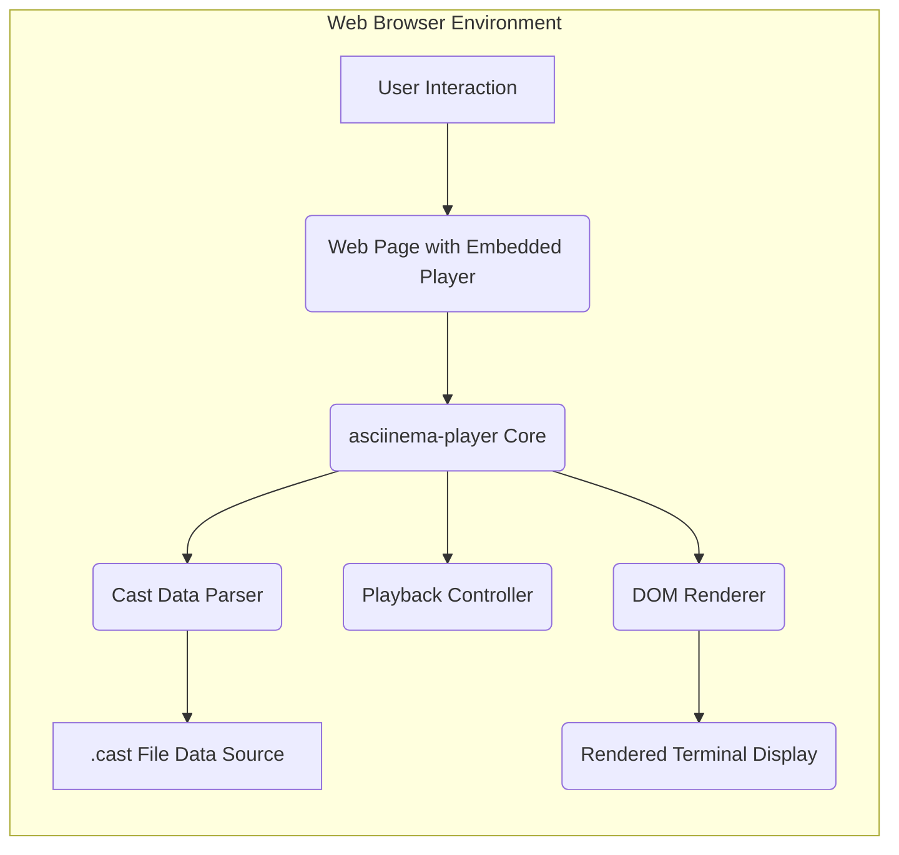

## Project Design Document: asciinema-player

**Version:** 1.1
**Date:** October 26, 2023
**Author:** AI Software Architect

### 1. Introduction

This document provides an enhanced and detailed design overview of the `asciinema-player` project, a client-side JavaScript web player for rendering asciicast (terminal session recordings). Building upon the previous version, this document further clarifies the architecture, component responsibilities, and data flow, providing a robust foundation for subsequent threat modeling activities.

### 2. Project Goals

*   Provide a robust and efficient client-side JavaScript library for rendering asciicast recordings within web browsers.
*   Offer a comprehensive set of playback controls, including play, pause, seek (with precision), variable speed adjustment, and potentially frame-by-frame navigation.
*   Enable flexible customization of the user interface to facilitate seamless embedding within diverse web applications and platforms.
*   Maintain strict compatibility with the established asciicast recording format specifications, ensuring accurate rendering.
*   Offer a well-documented API for developers to interact with the player programmatically.

### 3. Non-Goals

*   Server-side components for rendering or pre-processing asciicast files are explicitly excluded from this project's scope.
*   Built-in mechanisms for uploading, storing, or managing asciicast files are not within the project's objectives.
*   Advanced, non-playback related editing functionalities for asciicast recordings are considered out of scope.
*   Development of native mobile applications is not a goal for this project.

### 4. System Architecture

The `asciinema-player` operates entirely within the client-side environment of a web browser. Its core function is to interpret and visually represent the data contained within an asciicast file by manipulating the browser's Document Object Model (DOM).

#### 4.1. High-Level Architecture Diagram

#### 4.2. Component Descriptions

*   **User Interaction:** Represents the user's actions within the web page, such as clicking playback controls or interacting with the player interface.
*   **Web Page with Embedded Player:** The HTML document that integrates the `asciinema-player` JavaScript library. This page provides the necessary HTML structure and context for the player to operate.
*   **asciinema-player Core:** The central JavaScript module encompassing the primary logic of the player. It orchestrates the interaction between other components, manages the playback state, and handles events.
*   **DOM Renderer:** This component is responsible for translating the parsed asciicast data into a visual representation within the browser. It dynamically creates and updates DOM elements (e.g., `
`, ``) to display the terminal's text, colors, and formatting.
*   **Playback Controller:**  Manages the playback timeline and state. It handles user input from the playback controls, updates the current playback time, and triggers the DOM Renderer to update the display accordingly. This includes logic for play, pause, seek, and speed adjustments.
*   **Cast Data Parser:**  This module is responsible for interpreting the structure and content of the `.cast` file. It deserializes the JSON data, extracting timing information for each frame and the corresponding terminal output. It needs to handle different versions of the `.cast` format.
*   **.cast File Data Source:** Represents the location from which the `.cast` file data is retrieved. This is typically a URL pointing to a file hosted on a web server.
*   **Rendered Terminal Display:** The visual output within the web browser, representing the recorded terminal session. This is the result of the DOM Renderer's actions.

#### 4.3. Data Flow

1. **Initialization and Configuration:** When the web page loads, the `asciinema-player Core` is initialized. It receives configuration details, including the URL of the `.cast` file.
2. **Fetching Cast Data:** The `asciinema-player Core` initiates an HTTP request to the `.cast File Data Source` to retrieve the asciicast data.
3. **Parsing the Data:** Once the `.cast` file data is downloaded, the `Cast Data Parser` processes the JSON content, extracting individual frames with their associated timestamps and terminal output.
4. **Initial Rendering (Optional):**  The `DOM Renderer` might perform an initial rendering of the first frame or a placeholder before playback begins.
5. **Playback Initiation:** Upon user interaction (e.g., clicking the "play" button), the `Playback Controller` starts the playback loop.
6. **Frame Scheduling:** The `Playback Controller` uses the timing information extracted by the `Cast Data Parser` to schedule the rendering of subsequent frames.
7. **DOM Updates:** At each scheduled time, the `Playback Controller` provides the relevant frame data to the `DOM Renderer`. The `DOM Renderer` then updates the `Rendered Terminal Display` by manipulating the DOM to reflect the terminal's state at that point in time. This involves adding, removing, or modifying HTML elements.
8. **User Interaction Handling:**  User interactions with the `Playback Controller` (e.g., pausing, seeking) interrupt the playback loop and trigger corresponding actions, such as pausing the timer or jumping to a specific point in the parsed data.
9. **Continuous Rendering:** During playback, steps 6 and 7 repeat, creating the animation of the terminal session.

### 5. Security Considerations

This section details potential security considerations relevant to the `asciinema-player`, providing a basis for thorough threat modeling.

*   **Cross-Site Scripting (XSS) via Malicious `.cast` Files:**
    *   **Threat:** If the `.cast` file format were to allow embedding of arbitrary HTML or JavaScript, a malicious file could execute scripts within the user's browser context when played.
    *   **Mitigation:** The current `.cast` format is primarily text-based, significantly reducing this risk. However, rigorous input validation and sanitization of any potentially rendered content are crucial. Ensure proper handling of escape sequences and control characters to prevent unintended script execution.
*   **Content Security Policy (CSP) Bypasses:**
    *   **Threat:** Vulnerabilities in the player's rendering logic could potentially be exploited to bypass a website's Content Security Policy, allowing the injection of malicious scripts.
    *   **Mitigation:** Adhere to strict CSP best practices during development. Regularly review and update the player's code to prevent DOM manipulation vulnerabilities that could lead to CSP bypasses.
*   **Denial of Service (DoS) through Resource Exhaustion:**
    *   **Threat:** A deliberately crafted, excessively large `.cast` file could consume significant browser resources (CPU, memory), leading to performance degradation or a complete denial of service for the user.
    *   **Mitigation:** Implement safeguards to limit the resources consumed by the player. This could involve setting maximum file size limits, optimizing rendering performance, and potentially implementing mechanisms to gracefully handle large files.
*   **Data Injection Attacks:**
    *   **Threat:** Although the `.cast` format is primarily for output, vulnerabilities in the `Cast Data Parser` could be exploited if future versions allow for more complex or interactive data structures.
    *   **Mitigation:** Employ secure parsing techniques and rigorously validate the structure and content of the `.cast` file against the expected schema. Sanitize any data before rendering.
*   **Dependency Vulnerabilities:**
    *   **Threat:** The `asciinema-player` likely relies on third-party JavaScript libraries. Known vulnerabilities in these dependencies could introduce security risks.
    *   **Mitigation:** Maintain an up-to-date inventory of all dependencies. Regularly scan dependencies for known vulnerabilities and update them promptly. Consider using tools for automated dependency vulnerability scanning.
*   **Man-in-the-Middle (MITM) Attacks on `.cast` File Delivery:**
    *   **Threat:** If the `.cast` file is fetched over an insecure HTTP connection, an attacker could intercept and potentially modify the file content before it reaches the player.
    *   **Mitigation:** Strongly recommend and ideally enforce the use of HTTPS for serving `.cast` files to ensure data integrity and confidentiality during transmission.
*   **Client-Side Data Storage Vulnerabilities:**
    *   **Threat:** If the player stores any sensitive data locally (e.g., user preferences, API keys – though unlikely in this project), this data could be vulnerable to access or modification by other scripts or malicious actors.
    *   **Mitigation:** Minimize the storage of local data. If local storage is necessary, use appropriate browser storage mechanisms (e.g., `localStorage`, `sessionStorage`) with awareness of their security implications. Avoid storing sensitive information client-side if possible.

### 6. Technologies Used

*   **JavaScript (ECMAScript):** The core programming language for the player's logic and functionality.
*   **HTML5:** Used for structuring the player's user interface and embedding it within web pages.
*   **CSS3:** Used for styling the player's visual appearance and layout.
*   **JSON:** The standard data format for the `.cast` file.
*   **Potentially other JavaScript libraries:**  Likely includes libraries for DOM manipulation, event handling, and potentially utility functions. Specific libraries should be documented within the project's codebase.

### 7. Deployment

The `asciinema-player` is typically deployed by:

*   Including the necessary JavaScript (`.js`) and CSS (`.css`) files within the HTML structure of a web page. This can be done via `<script>` and `<link>` tags, respectively.
*   Configuring the player instance with the URL of the specific `.cast` file to be played. This configuration is usually done through JavaScript when initializing the player.
*   Creating a designated HTML element (e.g., a `
`) where the player's interface will be rendered. The player's JavaScript then targets this element to inject the necessary DOM structure.
*   `.cast` files are generally hosted on standard web servers and made accessible via URLs.

### 8. Future Considerations

*   Exploring support for more advanced terminal features and ANSI escape sequences to enhance rendering fidelity.
*   Optimizing playback performance, particularly for very large or complex asciicasts.
*   Improving accessibility features to make the player usable by individuals with disabilities.
*   Providing more extensive theming and customization options for the player's appearance.
*   Developing integrations with popular web frameworks and libraries to simplify embedding.
*   Potentially adding support for interactive elements or annotations within asciicasts (though this would require changes to the `.cast` format).

This revised document provides a more detailed and comprehensive design overview of the `asciinema-player` project. It serves as an improved resource for understanding the system's intricacies and will be invaluable for conducting thorough and effective threat modeling activities.