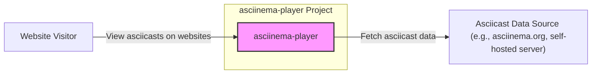
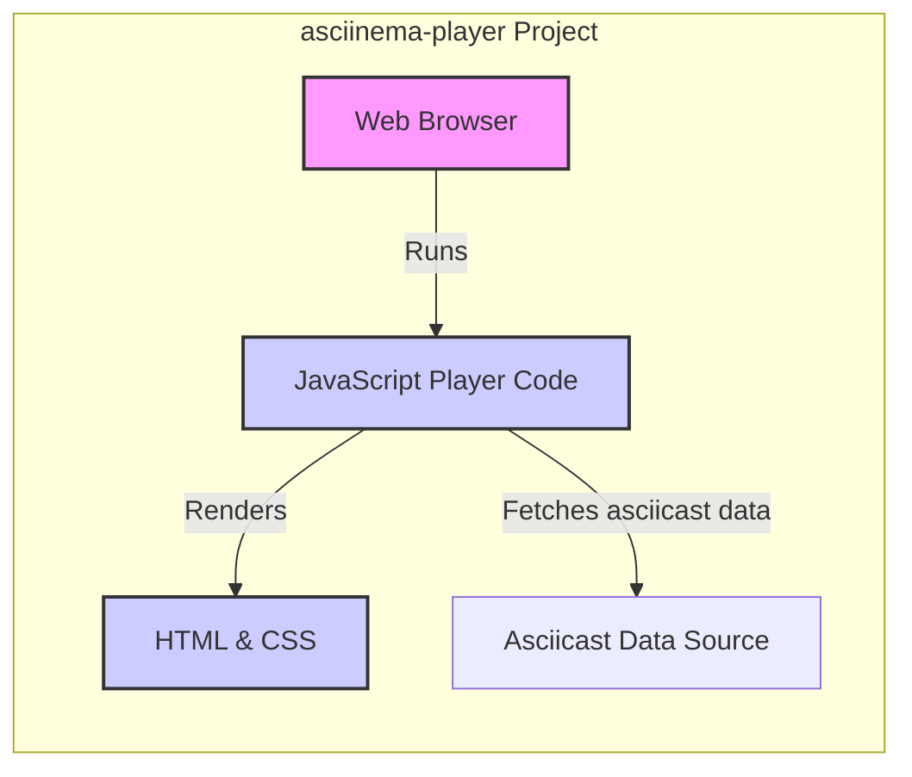
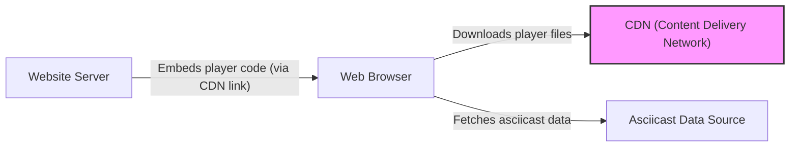
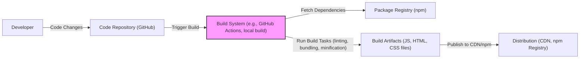

# BUSINESS POSTURE

- Business Priorities and Goals:
 - Goal: To provide a reusable, embeddable web component for playing asciicast recordings.
 - Priority: Ease of integration into websites, cross-browser compatibility, performance for smooth playback, customizable appearance, open-source and community-driven development.
 - Business Value: Enables users to easily showcase terminal sessions on websites, blogs, documentation, and educational platforms, enhancing content with interactive terminal recordings. For asciinema.org, it's a core component for displaying recordings. For others, it's a valuable tool for technical communication and demonstration.

- Business Risks:
 - Availability risk: If the player fails to load or function correctly, websites embedding it might display broken content, impacting user experience.
 - Compatibility risk: Incompatibility with certain browsers or devices could limit accessibility and reach.
 - Performance risk: Poor performance could lead to slow loading times and a negative user experience.
 - Security risk (low): While primarily a frontend component, vulnerabilities could potentially be exploited to inject malicious content or compromise the embedding website (though risk is low as it mainly renders data).
 - Open Source Sustainability risk: Reliance on community contributions for maintenance and updates.

# SECURITY POSTURE

- Existing Security Controls:
 - security control: Open Source Review - The project is open source, allowing for community review and scrutiny of the code. Implemented and described in: Public GitHub repository.
 - security control: Dependency Management - Project uses `npm` for dependency management, which allows for tracking and updating of third-party libraries. Implemented and described in: `package.json` and `package-lock.json`.

- Accepted Risks:
 - accepted risk: Reliance on client-side security - As a frontend component, security largely depends on the security of the embedding website and the user's browser.
 - accepted risk: Limited input validation - Player primarily renders asciicast data, with limited user input, reducing input-based vulnerabilities.
 - accepted risk: Dependency vulnerabilities - Potential vulnerabilities in third-party JavaScript libraries used by the player.

- Recommended Security Controls:
 - security control: Dependency Scanning - Implement automated dependency scanning to identify and address known vulnerabilities in third-party libraries.
 - security control: Software Composition Analysis (SCA) - Regularly perform SCA to identify and manage open source components and their associated risks.
 - security control: Content Security Policy (CSP) - Encourage embedding websites to use CSP to mitigate potential cross-site scripting (XSS) risks, although the player itself is unlikely to introduce XSS.

- Security Requirements:
 - Authentication: Not applicable. The player is a frontend component and does not handle user authentication.
 - Authorization: Not applicable. The player does not control access to resources. Authorization is handled by the website embedding the player and the source of the asciicast data.
 - Input Validation: Limited relevance. The player primarily processes asciicast data, which is expected to be in a specific format. However, basic validation of the asciicast data format can prevent unexpected errors.
 - Cryptography: Not applicable. The player does not handle sensitive data requiring encryption. Data in transit (asciicast data) should be secured by HTTPS of the embedding website.

# DESIGN

## C4 CONTEXT

- Context Diagram Elements:
 - Element:
  - Name: Website Visitor
  - Type: Person
  - Description: Users who visit websites embedding the asciinema-player to view asciicast recordings.
  - Responsibilities: View and interact with asciicast recordings embedded on websites.
  - Security controls: Browser security controls, website security controls (CSP, HTTPS).
 - Element:
  - Name: asciinema-player
  - Type: Software System
  - Description: JavaScript-based web player component for rendering asciicast recordings within web browsers.
  - Responsibilities: Fetch asciicast data, render terminal session recordings in a web browser, provide playback controls.
  - Security controls: Input validation (basic asciicast format validation), dependency scanning, adherence to web security best practices.
 - Element:
  - Name: Asciicast Data Source (e.g., asciinema.org, self-hosted server)
  - Type: Software System
  - Description: System that stores and serves asciicast data files. This could be asciinema.org or any web server hosting asciicast files.
  - Responsibilities: Store asciicast data, serve asciicast data to the player upon request.
  - Security controls: Access controls to asciicast data, secure data storage, HTTPS for data transfer.

## C4 CONTAINER

- Container Diagram Elements:
 - Element:
  - Name: Web Browser
  - Type: Container
  - Description: User's web browser environment where the asciinema-player JavaScript code executes.
  - Responsibilities: Execute JavaScript code, render HTML and CSS, provide user interface for interacting with the player.
  - Security controls: Browser security sandbox, Content Security Policy (CSP) enforced by the embedding website.
 - Element:
  - Name: JavaScript Player Code
  - Type: Container
  - Description: JavaScript code of the asciinema-player, responsible for fetching, parsing, and rendering asciicast data.
  - Responsibilities: Fetch asciicast data from a specified URL, parse asciicast data format, render terminal output in HTML and CSS, handle playback controls.
  - Security controls: Input validation (basic asciicast format validation), dependency scanning, code linting, adherence to JavaScript security best practices.
 - Element:
  - Name: HTML & CSS
  - Type: Container
  - Description: HTML structure and CSS styling used to visually represent the asciicast player and the terminal output.
  - Responsibilities: Define the visual layout and style of the player and the rendered terminal.
  - Security controls: Adherence to web security best practices to prevent XSS vulnerabilities in HTML and CSS.
 - Element:
  - Name: Asciicast Data Source
  - Type: External System
  - Description: System serving asciicast data files (same as in Context Diagram).
  - Responsibilities: Store and serve asciicast data files.
  - Security controls: Access controls, secure storage, HTTPS.

## DEPLOYMENT

- Deployment Options:
 - Option 1: Hosted on CDN - Deploying the player's JavaScript, HTML, and CSS files to a Content Delivery Network (CDN) for efficient distribution and caching.
 - Option 2: Self-hosted - Hosting the player files on the same web server as the embedding website.
 - Option 3: Package Managers (npm) - Distributing the player as an npm package for developers to include in their projects' build processes.

- Detailed Deployment (Option 1: CDN):

- Deployment Diagram Elements (CDN Deployment):
 - Element:
  - Name: Website Server
  - Type: Infrastructure
  - Description: Web server hosting the website that embeds the asciinema-player.
  - Responsibilities: Serve website content, embed the asciinema-player code (typically by including a link to the CDN hosted player files).
  - Security controls: Web server security hardening, HTTPS, Content Security Policy (CSP).
 - Element:
  - Name: Web Browser
  - Type: Infrastructure
  - Description: User's web browser accessing the website.
  - Responsibilities: Download and execute website code, including the asciinema-player code, render the player, and fetch asciicast data.
  - Security controls: Browser security features, user security practices.
 - Element:
  - Name: CDN (Content Delivery Network)
  - Type: Infrastructure
  - Description: Content Delivery Network hosting the asciinema-player's JavaScript, HTML, and CSS files.
  - Responsibilities: Store and serve the player files globally, ensuring fast and reliable delivery to website visitors.
  - Security controls: CDN provider's security controls, secure file storage, HTTPS delivery.
 - Element:
  - Name: Asciicast Data Source
  - Type: Infrastructure
  - Description: System serving asciicast data files (same as in Context and Container Diagrams).
  - Responsibilities: Store and serve asciicast data files.
  - Security controls: Access controls, secure storage, HTTPS.

## BUILD

- Build Process Elements:
 - Element:
  - Name: Developer
  - Type: Person
  - Description: Software developer contributing to the asciinema-player project.
  - Responsibilities: Write code, commit changes to the code repository, potentially trigger builds.
  - Security controls: Secure development environment, code review process, secure coding practices.
 - Element:
  - Name: Code Repository (GitHub)
  - Type: Software System
  - Description: GitHub repository hosting the source code of the asciinema-player.
  - Responsibilities: Version control, store source code, manage code changes, trigger CI/CD pipelines.
  - Security controls: Access controls, branch protection, audit logs, vulnerability scanning (GitHub Dependabot).
 - Element:
  - Name: Build System (e.g., GitHub Actions, local build)
  - Type: Software System
  - Description: Automated system responsible for building, testing, and packaging the asciinema-player. Could be GitHub Actions or a local development environment.
  - Responsibilities: Fetch dependencies, compile/bundle code, run linters and tests, create build artifacts.
  - Security controls: Secure build environment, access controls, build process hardening, integration of security checks (dependency scanning, linters).
 - Element:
  - Name: Package Registry (npm)
  - Type: Software System
  - Description: npm registry for downloading JavaScript dependencies required for building the player.
  - Responsibilities: Host and serve JavaScript packages.
  - Security controls: npm registry security controls, package integrity checks.
 - Element:
  - Name: Build Artifacts (JS, HTML, CSS files)
  - Type: Data
  - Description: Output of the build process, including JavaScript, HTML, and CSS files ready for deployment.
  - Responsibilities: Represent the distributable version of the asciinema-player.
  - Security controls: Integrity checks (e.g., checksums), secure storage during build process.
 - Element:
  - Name: Distribution (CDN, npm Registry)
  - Type: Infrastructure/Software System
  - Description: CDN or npm registry used to distribute the built asciinema-player files.
  - Responsibilities: Host and serve the player files for public consumption.
  - Security controls: CDN/npm registry security controls, secure file storage, HTTPS delivery.

# RISK ASSESSMENT

- Critical Business Processes:
 - Displaying asciicast recordings on websites. If the player is unavailable or malfunctioning, websites embedding it will fail to display intended content.

- Data to Protect and Sensitivity:
 - Asciicast data: Sensitivity depends on the content of the recordings. Some asciicasts might contain sensitive information (e.g., API keys, internal system details if recordings are not properly sanitized). However, for the player itself, it primarily handles rendering publicly available asciicast data. Sensitivity is generally considered low to medium.
 - Player code itself: Protecting the integrity and availability of the player code is important to ensure websites can reliably embed and use it. Tampering with the player code could potentially lead to malicious behavior on embedding websites, although the attack surface is limited.

# QUESTIONS & ASSUMPTIONS

- Questions:
 - What is the intended target audience for websites embedding the player (developers, general public, specific industries)?
 - Are there any specific performance requirements or constraints for the player (e.g., support for very long asciicasts, low-bandwidth environments)?
 - Are there any plans to integrate the player with specific analytics or tracking tools?
 - What is the expected level of customization required by users embedding the player?
 - Are there any specific accessibility requirements for the player?

- Assumptions:
 - The primary use case is embedding the player on public-facing websites to display non-sensitive or sanitized terminal recordings.
 - The player is intended to be lightweight and performant, focusing on core playback functionality.
 - Security concerns are primarily focused on preventing supply chain vulnerabilities and ensuring the player does not introduce vulnerabilities into embedding websites.
 - The player is distributed as open-source software and relies on community contributions for maintenance and updates.
 - Asciicast data is assumed to be served over HTTPS from a separate data source.