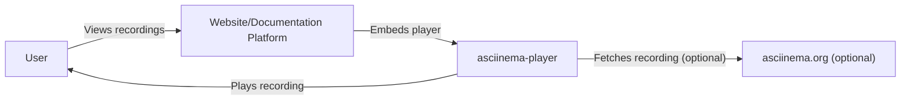
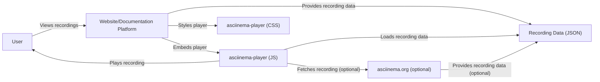
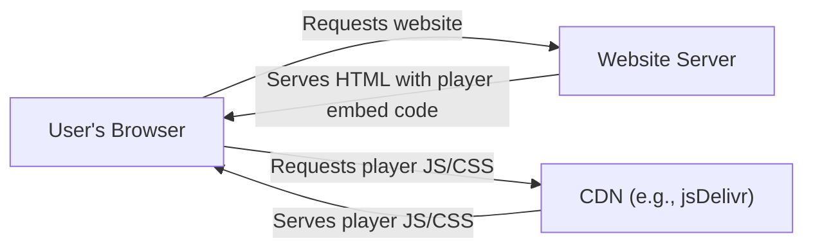
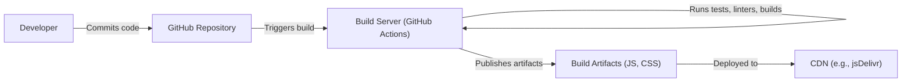

Okay, let's create a design document for the `asciinema-player` project.

# BUSINESS POSTURE

Business Priorities and Goals:

*   Provide a high-quality, reliable, and feature-rich terminal session player for the web.
*   Ensure ease of integration into various websites and documentation platforms.
*   Maintain a lightweight and performant player to minimize impact on page load times.
*   Support a wide range of browsers and devices.
*   Foster an active open-source community around the project.
*   Enable users to easily share and embed terminal recordings.

Business Risks:

*   Malicious recordings could be crafted to exploit vulnerabilities in the player, potentially leading to XSS or other client-side attacks.
*   Poor performance or compatibility issues could deter users and damage the project's reputation.
*   Lack of maintenance or updates could lead to security vulnerabilities and compatibility problems over time.
*   Insufficient documentation or support could hinder adoption and user satisfaction.
*   The player might be misused to display inappropriate or harmful content, leading to reputational damage.

# SECURITY POSTURE

Existing Security Controls:

*   security control: The project is open-source, allowing for community review and contributions to security. (GitHub repository)
*   security control: The project is written in JavaScript/TypeScript, which, when used carefully, can help mitigate some common web vulnerabilities. (GitHub repository)
*   security control: The project appears to have a relatively small codebase, reducing the potential attack surface. (GitHub repository)
*   security control: The player is designed to be embedded, which inherently limits its access to the host system. (Project design)
*   accepted risk: The project does not appear to have formal security audits or penetration testing.
*   accepted risk: The project relies on external libraries, which could introduce supply chain vulnerabilities.

Recommended Security Controls:

*   security control: Implement a robust Content Security Policy (CSP) to mitigate XSS and other injection attacks.
*   security control: Conduct regular security audits and penetration testing, ideally by a third-party.
*   security control: Implement a dependency management system to track and update external libraries, addressing known vulnerabilities.
*   security control: Sanitize input thoroughly to prevent injection of malicious code or escape sequences.
*   security control: Consider using a sandboxed iframe to further isolate the player from the host page.
*   security control: Implement a mechanism to report security vulnerabilities responsibly.

Security Requirements:

*   Authentication: Not directly applicable, as the player itself doesn't handle user authentication. However, if the player is integrated with a system that requires authentication, the integration should follow secure authentication practices.
*   Authorization: Not directly applicable, as the player primarily displays content. However, if the player loads recordings from different sources, authorization mechanisms should be in place to ensure users can only access recordings they are permitted to view.
*   Input Validation: Crucial. The player must thoroughly validate and sanitize all input, including the recording data itself, URL parameters, and any configuration options. This is the primary defense against XSS and other injection attacks.
*   Cryptography: Not directly applicable for the core functionality of the player. However, if the player communicates with a backend server (e.g., to fetch recordings), HTTPS should be used to protect data in transit.

# DESIGN

## C4 CONTEXT

Context Diagram Element List:

*   Element:
    *   Name: User
    *   Type: Person
    *   Description: A person who views terminal recordings using the asciinema player.
    *   Responsibilities: Views and interacts with the player.
    *   Security controls: Browser security settings, operating system security.

*   Element:
    *   Name: asciinema-player
    *   Type: Software System
    *   Description: The JavaScript-based terminal session player.
    *   Responsibilities: Renders and plays terminal recordings in a web browser.
    *   Security controls: Input validation, CSP (recommended), sandboxed iframe (recommended).

*   Element:
    *   Name: Website/Documentation Platform
    *   Type: Software System
    *   Description: The website or platform that embeds the asciinema player.
    *   Responsibilities: Hosts the player and provides the recording data.
    *   Security controls: Website security best practices, HTTPS.

*   Element:
    *   Name: asciinema.org (optional)
    *   Type: Software System
    *   Description: The asciinema server, which hosts recordings. This is optional, as recordings can be hosted elsewhere.
    *   Responsibilities: Stores and serves terminal recordings.
    *   Security controls: Server security best practices, HTTPS, access controls.

## C4 CONTAINER

Container Diagram Element List:

*   Element:
    *   Name: User
    *   Type: Person
    *   Description: A person who views terminal recordings using the asciinema player.
    *   Responsibilities: Views and interacts with the player.
    *   Security controls: Browser security settings, operating system security.

*   Element:
    *   Name: Website/Documentation Platform
    *   Type: Software System
    *   Description: The website or platform that embeds the asciinema player.
    *   Responsibilities: Hosts the player and provides the recording data.
    *   Security controls: Website security best practices, HTTPS.

*   Element:
    *   Name: asciinema-player (JS)
    *   Type: Container: JavaScript
    *   Description: The core JavaScript code for the player.
    *   Responsibilities: Parses recording data, renders the terminal, handles playback controls, and manages user interaction.
    *   Security controls: Input validation, CSP (recommended), sandboxed iframe (recommended).

*   Element:
    *   Name: asciinema-player (CSS)
    *   Type: Container: CSS
    *   Description: The CSS stylesheet for the player.
    *   Responsibilities: Styles the appearance of the terminal and player controls.
    *   Security controls: Should be reviewed to ensure it doesn't introduce any vulnerabilities (e.g., CSS injection).

*   Element:
    *   Name: Recording Data (JSON)
    *   Type: Container: Data
    *   Description: The terminal recording data, typically in JSON format.
    *   Responsibilities: Contains the terminal output and timing information.
    *   Security controls: Input validation (in the player), secure storage and transmission.

*   Element:
    *   Name: asciinema.org (optional)
    *   Type: Software System
    *   Description: The asciinema server.
    *   Responsibilities: Stores and serves terminal recordings.
    *   Security controls: Server security best practices, HTTPS, access controls.

## DEPLOYMENT

Possible Deployment Solutions:

1.  **CDN (Content Delivery Network):** The most common and recommended approach. The player's JavaScript and CSS files are hosted on a CDN, making them readily available for websites to embed.
2.  **Self-hosting:** Websites can download the player's files and host them on their own servers. This provides more control but requires manual updates.
3.  **npm package:** The player can be installed as an npm package and bundled with the website's code.

Chosen Solution (CDN):

Deployment Diagram Element List:

*   Element:
    *   Name: User's Browser
    *   Type: Software System
    *   Description: The user's web browser.
    *   Responsibilities: Renders the website and executes the asciinema player code.
    *   Security controls: Browser security settings, operating system security.

*   Element:
    *   Name: Website Server
    *   Type: Infrastructure Node
    *   Description: The server hosting the website that embeds the asciinema player.
    *   Responsibilities: Serves the website's HTML, CSS, and JavaScript.
    *   Security controls: Server security best practices, HTTPS.

*   Element:
    *   Name: CDN (e.g., jsDelivr)
    *   Type: Infrastructure Node
    *   Description: A content delivery network that hosts the asciinema player's files.
    *   Responsibilities: Serves the player's JavaScript and CSS files quickly and reliably.
    *   Security controls: CDN provider's security measures, HTTPS.

## BUILD

Build Process Description:

1.  **Developer Commits Code:** A developer commits changes to the asciinema-player source code on GitHub.
2.  **GitHub Triggers Build:** GitHub Actions (or a similar CI/CD system) is triggered by the commit.
3.  **Build Server Runs Tasks:** The build server executes a series of tasks:
    *   **Linting:** Code is checked for style and potential errors using a linter (e.g., ESLint).
    *   **Testing:** Unit tests and integration tests are run to ensure code quality and functionality.
    *   **Building:** The TypeScript code is compiled into JavaScript, and CSS is potentially processed (e.g., minified).
    *   **Security Checks:**
        *   security control: Static Application Security Testing (SAST) tools (e.g., SonarQube, Snyk) can be integrated to scan for vulnerabilities.
        *   security control: Dependency analysis tools can be used to identify and update vulnerable dependencies.
4.  **Publish Artifacts:** The resulting JavaScript and CSS files (the build artifacts) are published.
5.  **Deploy to CDN:** The build artifacts are deployed to a CDN (e.g., jsDelivr), making them available for websites to embed.

# RISK ASSESSMENT

Critical Business Processes:

*   Displaying terminal recordings accurately and reliably.
*   Providing a smooth and user-friendly playback experience.
*   Maintaining the security and integrity of the player and the host website.

Data to Protect and Sensitivity:

*   **Recording Data (JSON):** Sensitivity varies. Recordings may contain sensitive information such as passwords, API keys, or confidential data if users are not careful. The player itself should treat all recording data as potentially sensitive.
*   **Website Data:** The player, as an embedded component, could potentially access data on the host website if vulnerabilities exist. This data could range from user information to website content.
*   **User Data:** The player itself doesn't collect user data directly. However, if integrated with a system that does, the integration should handle user data securely.

# QUESTIONS & ASSUMPTIONS

Questions:

*   Are there any specific compliance requirements (e.g., GDPR, CCPA) that the player needs to adhere to?
*   What is the expected traffic volume and user base for the player? This can impact performance and scalability considerations.
*   Are there any plans to integrate the player with other systems or services beyond basic embedding?
*   What is the process for handling user-reported security vulnerabilities?
*   Is there a mechanism for users to report inappropriate or malicious content displayed through the player?

Assumptions:

*   BUSINESS POSTURE: The primary goal is to provide a reliable and secure terminal player, with a focus on ease of use and integration.
*   SECURITY POSTURE: The project maintainers are committed to addressing security vulnerabilities promptly.
*   DESIGN: The player will primarily be used by embedding it in websites and documentation platforms via a CDN. The recording data is assumed to be in a trusted JSON format, but the player will still validate it thoroughly.