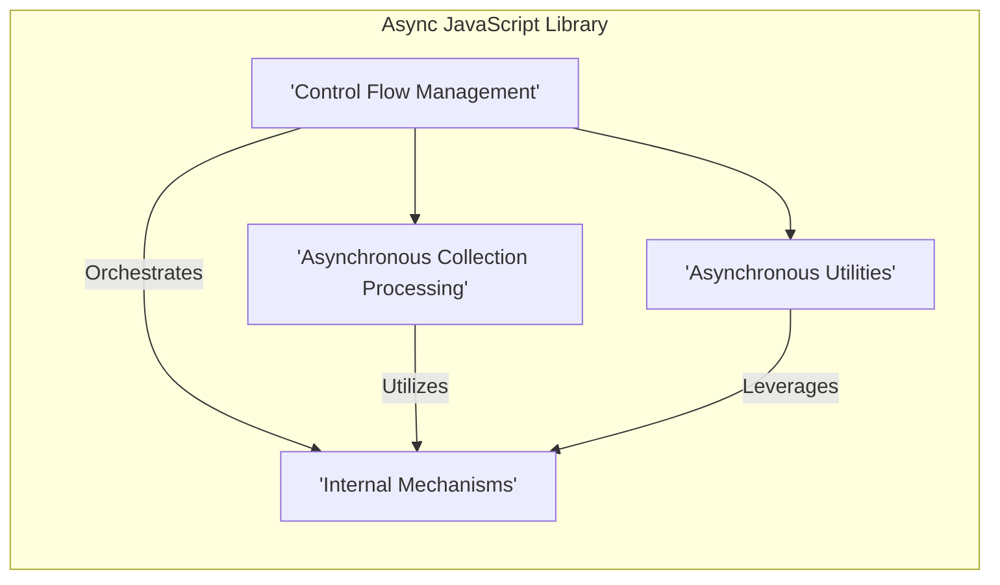

# Project Design Document: Async JavaScript Utility Library

**Document Version:** 2.0
**Date:** October 26, 2023
**Author:** AI Software Architect

## 1. Introduction

This document provides an enhanced architectural design of the `async` JavaScript utility library (available at [https://github.com/caolan/async](https://github.com/caolan/async)). Building upon the previous version, this document offers a more granular understanding of the library's structure, component interactions, and data flow, specifically tailored for effective threat modeling. The focus remains on the logical architecture, avoiding implementation-specific details.

## 2. Project Overview

The `async` library remains a crucial utility for both Node.js and browser environments, designed to simplify asynchronous JavaScript programming. It offers a rich set of functions for managing asynchronous control flow, addressing challenges like callback hell and enhancing code readability. The library's core objective is to provide developers with tools to orchestrate asynchronous tasks efficiently and predictably.

## 3. System Architecture

The `async` library's architecture can be further refined into distinct functional areas, highlighting their core principles and interactions.

*   **Control Flow Management:**  This area focuses on dictating the execution order of asynchronous operations.
    *   **Sequential Execution:** Functions like `series` and `waterfall` ensure tasks are executed one after another, with `waterfall` passing results between them. This relies on callbacks to signal completion and pass data.
    *   **Parallel Execution:** Functions like `parallel` execute tasks concurrently. Completion is signaled via callbacks, and an aggregate result (or error) is provided. Concurrency limits are not inherent in the core `parallel` function but are managed by higher-level constructs like `queue`.
    *   **Conditional Execution & Looping:** Functions like `whilst`, `until`, and their `do...` counterparts provide mechanisms for repeating asynchronous operations based on conditions. These rely on callbacks to determine the next iteration or termination.
    *   **Key Functions:** `series`, `parallel`, `waterfall`, `whilst`, `until`, `doWhilst`, `doUntil`, `forever`.
*   **Asynchronous Collection Processing:** This area provides tools for operating on collections of data asynchronously.
    *   **Iterators:** Functions like `each` and `map` iterate over collections, applying an asynchronous function to each item. `each` focuses on side effects, while `map` transforms the collection.
    *   **Filters & Rejection:** Functions like `filter` and `reject` selectively include or exclude items from a collection based on the result of an asynchronous test.
    *   **Reducers:** Functions like `reduce` combine the items of a collection into a single value by iteratively applying an asynchronous function.
    *   **Sorting:** Functions like `sortBy` arrange collection items based on the result of an asynchronous comparison function.
    *   **Key Functions:** `each`, `eachSeries`, `map`, `mapSeries`, `filter`, `filterSeries`, `reject`, `rejectSeries`, `reduce`, `reduceRight`, `sortBy`.
*   **Asynchronous Utilities:** This category offers helper functions that extend asynchronous control flow capabilities.
    *   **Function Manipulation:** Functions like `apply`, `compose`, and `seq` allow for the creation of new functions with pre-filled arguments or composed asynchronous behavior.
    *   **Task Queues:** `queue`, `priorityQueue`, and `cargo` provide mechanisms for managing the execution of asynchronous tasks with controlled concurrency. This is crucial for resource management.
    *   **Control Flow Helpers:** Functions like `times`, `retry`, and `timeout` offer convenient ways to repeat tasks, handle failures, and manage execution time.
    *   **Memoization:** `memoize` optimizes asynchronous functions by caching their results.
    *   **Key Functions:** `apply`, `nextTick`, `memoize`, `unmemoize`, `ensureAsync`, `constant`, `times`, `timesSeries`, `compose`, `seq`, `applyEach`, `applyEachSeries`, `queue`, `priorityQueue`, `cargo`, `auto`, `retry`, `retryable`, `timeout`, `reflect`.
*   **Internal Mechanisms:** These are underlying patterns and practices within the library.
    *   **Callback Management:** The library heavily relies on callbacks to manage the completion and results of asynchronous operations. This involves careful handling of callback invocation to avoid issues like calling back multiple times or not calling back at all.
    *   **Error Propagation:** Errors occurring within asynchronous tasks are typically propagated to the final callback function. The structure of these callbacks (often the first argument) is a key convention.

## 4. Data Flow

Data flow within `async` involves the movement of data between asynchronous functions and the signaling of completion or errors.

*   **Input Sources:**
    *   **Task Collections:** Arrays or objects defining the asynchronous operations to be performed.
    *   **Asynchronous Functions (Tasks):**  Functions, often accepting a callback, that perform asynchronous work.
    *   **Initial Data:** Data passed as arguments to the initial asynchronous functions in a sequence (e.g., in `waterfall`).
    *   **Configuration Options:** Parameters controlling the behavior of `async` functions (e.g., concurrency for queues).
*   **Data Transformation and Passing:**
    *   **Callback Arguments:**  The primary mechanism for passing data between asynchronous steps. Results from one task are passed as arguments to the callback of the previous task.
    *   **Collection Iteration:**  For collection functions, data items from the input collection are passed as arguments to the iterator function.
    *   **Result Aggregation:** Functions like `map` and `reduce` collect and transform the results of individual asynchronous operations into a final output.
*   **Output Destinations:**
    *   **Final Callback:** The ultimate recipient of the results (or error) of the asynchronous operation.
    *   **Intermediate Callbacks:** Callbacks passed to individual asynchronous tasks, which then pass data to subsequent tasks or the final callback.

**Detailed Data Flow Diagrams:**

*   **Control Flow (e.g., `series`):**
    ```mermaid
    graph LR
        subgraph "Series Control Flow"
            direction LR
            A["'Task 1' (Function)"] -->|Callback with Result| B["'Task 2' (Function)"];
            B -->|Callback with Result| C["'Task 3' (Function)"];
            C -->|Final Result/Error| D["Final Callback"];
        end
    ```
*   **Collection Processing (e.g., `map`):**
    ```mermaid
    graph LR
        subgraph "Map Collection Processing"
            direction TB
            A["Input Collection"] --> B{"'Iterator Function' (Async)"};
            B -- "Item 1" --> C["Process Item 1"];
            B -- "Item 2" --> D["Process Item 2"];
            B -- "Item N" --> E["Process Item N"];
            C --> F["Callback with Result 1"];
            D --> G["Callback with Result 2"];
            E --> H["Callback with Result N"];
            F & G & H --> I["Aggregate Results"];
            I --> J["Final Callback"];
        end
    ```
*   **Utility (e.g., `queue`):**
    ```mermaid
    graph LR
        subgraph "Queue Utility"
            direction TB
            A["Add Task to 'Queue'"] --> B{"'Worker Function' (Async)"};
            B --> C["Process Task"];
            C --> D["Callback (Signal Completion)"];
            D --> E["'Queue' (Ready for Next Task)"];
            E --> F["Final Callback (All Tasks Complete)"];
        end
    ```

## 5. Dependencies

The `async` library has **zero external runtime dependencies**. It relies solely on the built-in capabilities of the JavaScript environment (Node.js or web browsers). This lack of external dependencies simplifies integration and reduces potential dependency conflicts.

## 6. Security Considerations (Pre-Threat Modeling)

Considering the architecture and data flow, several security aspects are relevant for threat modeling:

*   **Improper Callback Handling:**
    *   **Risk:** Asynchronous functions passed to `async` might not always call their callbacks correctly (e.g., calling them multiple times, not calling them at all, or passing incorrect arguments).
    *   **Impact:** This can lead to unexpected behavior, resource leaks, or application crashes.
    *   **Focus Areas:** Review the implementation of asynchronous functions used with `async`, especially error handling within those functions.
*   **Unhandled Errors in Tasks:**
    *   **Risk:** Errors occurring within asynchronous tasks that are not properly caught and passed to the callback can lead to unhandled exceptions and application instability.
    *   **Impact:** Can result in denial of service or expose sensitive information through error messages.
    *   **Focus Areas:** Examine how error conditions are handled within the asynchronous functions provided to `async`.
*   **Resource Exhaustion via Parallelism:**
    *   **Risk:** Using functions like `parallel` or `each` with a very large number of tasks without proper concurrency control can overwhelm system resources (CPU, memory, network connections).
    *   **Impact:** Potential for denial of service.
    *   **Focus Areas:** Analyze the usage of parallel execution and the mechanisms (or lack thereof) to limit concurrency.
*   **Vulnerable Dependencies of Task Functions:**
    *   **Risk:** While `async` has no direct dependencies, the asynchronous functions it orchestrates might rely on other libraries with known vulnerabilities.
    *   **Impact:** Indirectly introduces vulnerabilities into the application.
    *   **Focus Areas:**  Threat model the dependencies of the asynchronous functions being managed by `async`.
*   **Timing Attacks (Context-Specific):**
    *   **Risk:** In specific scenarios, the time taken for certain asynchronous operations managed by `async` might reveal sensitive information.
    *   **Impact:** Information disclosure.
    *   **Focus Areas:** Analyze timing sensitivity in the specific asynchronous tasks being orchestrated.
*   **Input Validation within Tasks:**
    *   **Risk:** If the asynchronous functions passed to `async` process external input without proper validation, they can be susceptible to injection attacks (e.g., SQL injection, command injection).
    *   **Impact:** Data breaches, system compromise.
    *   **Focus Areas:**  Examine input validation practices within the asynchronous functions.
*   **Supply Chain Attacks on `async` (Lower Likelihood but Possible):**
    *   **Risk:** Although less likely for a mature and widely used library, a compromise of the `async` library itself could have significant impact.
    *   **Impact:** Widespread vulnerabilities in applications using the compromised library.
    *   **Focus Areas:** Standard supply chain security practices (e.g., verifying checksums).

## 7. Architectural Diagram

This diagram illustrates the key functional areas of the `async` library and their general relationships.



## 8. Conclusion

This enhanced design document provides a more detailed architectural overview of the `async` library, specifically tailored for threat modeling. By breaking down the library into functional areas and analyzing data flow, we can more effectively identify potential security vulnerabilities. The outlined security considerations serve as a starting point for a comprehensive threat modeling exercise, focusing on how the library is used and the security properties of the asynchronous tasks it manages. This document will be instrumental in guiding the subsequent threat modeling process and ensuring the security of applications utilizing the `async` library.