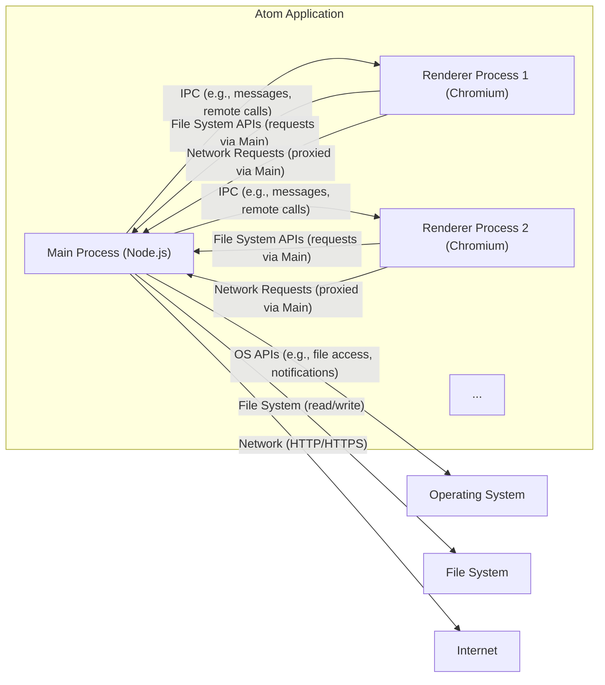
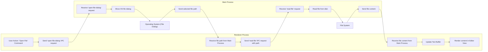
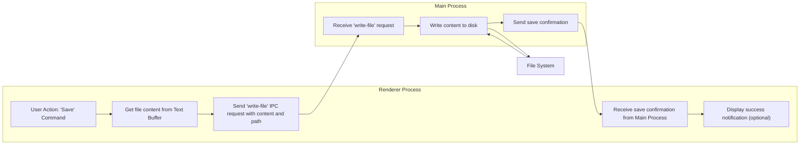
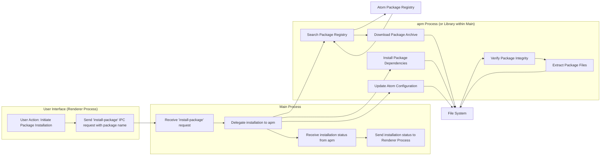

## Project Design Document: Atom Text Editor (Improved)

**1. Introduction**

This document provides an enhanced architectural overview of the Atom text editor, an open-source, cross-platform text and source code editor built upon web technologies. This detailed design is specifically intended to facilitate comprehensive threat modeling activities. It elaborates on the key components, data flows, and interactions within the Atom application, providing a deeper understanding of potential attack surfaces.

**2. Project Overview**

Atom is a sophisticated desktop application leveraging the Electron framework. This framework enables the development of cross-platform desktop applications using web technologies (HTML, CSS, JavaScript). Atom's design emphasizes customizability and extensibility through a vibrant ecosystem of packages. Its core functionalities encompass advanced text editing, intelligent syntax highlighting, context-aware code completion, and robust project management capabilities.

**3. Architectural Overview**

Atom's architecture is fundamentally based on Electron's multi-process model, ensuring stability and responsiveness. It comprises two primary process types:

*   **Main Process:** The application's central control unit, responsible for managing the application lifecycle, creating and overseeing Renderer Processes, and interfacing with the underlying operating system. It benefits from Node.js integration, granting access to native system APIs.
*   **Renderer Processes:** Isolated Chromium browser instances, each dedicated to rendering an editor window or pane. These processes execute the JavaScript code for the core editor and any loaded packages, providing the user interface.

Communication between these processes relies on Electron's Inter-Process Communication (IPC) mechanisms, ensuring secure and structured data exchange.

**Mermaid Diagram: High-Level Architecture**

**4. Key Components**

*   **Core Editor Engine:** The foundational text editing logic, handling input, display, and core editing commands.
    *   **Text Buffer Model:**  Manages the in-memory representation of document content, including text, markers, and metadata.
    *   **Display Layer:**  Responsible for rendering the Text Buffer content in the editor view, handling syntax highlighting and visual presentation.
    *   **Command Registry:**  Maps user actions (keyboard shortcuts, menu items) to specific editor commands.
*   **Renderer Process Environment:** The Chromium instance hosting the editor UI and package code.
    *   **DOM (Document Object Model):** Represents the structure of the editor interface.
    *   **JavaScript Engine (V8):** Executes the JavaScript code for the core editor and packages.
    *   **Browser APIs:** Provides access to web browser functionalities.
*   **Package Manager (apm):** Facilitates the discovery, installation, updating, and removal of Atom packages.
    *   **CLI (Command-Line Interface):**  Provides command-line access to package management functions.
    *   **GUI Integration:**  Offers a user interface within Atom for managing packages.
*   **Settings System:** Manages user preferences and configuration options for Atom and its installed packages.
    *   **Configuration Files:** Stores settings data (e.g., `config.cson`).
    *   **Settings Registry:** Provides an API for accessing and modifying settings.
*   **Keymap System:**  Defines and manages keyboard shortcuts and their associated actions, allowing for customization.
*   **Menu System:** Defines the application's menu structure and the actions triggered by menu items.
*   **Window Management:**  Handles the creation, management, and destruction of editor windows and panes.
*   **File System Access Layer:** Provides controlled mechanisms for reading and writing files, primarily managed by the Main Process.
*   **Inter-Process Communication (IPC) Channels:** The communication pathways between the Main and Renderer processes, utilizing mechanisms like `ipcMain` and `ipcRenderer`.
*   **Package Loading and Management Subsystem:** Responsible for loading, activating, and deactivating Atom packages at runtime.
*   **Notifications System:** Displays informational and error messages to the user.
*   **Auto-Updater Module:**  Handles checking for, downloading, and installing updates to the core Atom application.

**5. Detailed Component Breakdown**

*   **Main Process:**
    *   **Responsibilities:**
        *   **Application Lifecycle:**  Handles startup, shutdown, and event handling (e.g., window close).
        *   **Renderer Process Management:** Creates, monitors, and manages the lifecycle of Renderer Processes.
        *   **Global Event Handling:**  Manages application-wide events (e.g., menu selections, application focus).
        *   **Operating System Integration:**  Interacts with OS APIs for file dialogs, notifications, system menus, etc.
        *   **Auto-Updater Management:**  Initiates update checks and manages the update process.
        *   **IPC Broker:** Facilitates and controls communication between Renderer Processes.
        *   **Resource Management:** Manages global resources and shared data.
    *   **Key Interactions:**
        *   Launches and terminates Renderer Processes.
        *   Receives and processes file system operation requests from Renderer Processes, enforcing security policies.
        *   Initiates and manages network requests on behalf of Renderer Processes, potentially enforcing proxy settings and security policies.
        *   Communicates with the operating system for core application functionalities.
        *   Interacts with the `apm` process (or library) for package management tasks.

*   **Renderer Process:**
    *   **Responsibilities:**
        *   **User Interface Rendering:**  Renders the editor UI using HTML, CSS, and JavaScript within the Chromium environment.
        *   **Package Execution:** Executes the JavaScript code of the core editor and loaded packages.
        *   **User Input Handling:**  Captures and processes user input events (keyboard, mouse).
        *   **Text Display and Editing:**  Renders text content, applies syntax highlighting, and handles editing operations.
        *   **Package UI Rendering:** Renders the user interfaces provided by installed packages.
    *   **Key Interactions:**
        *   Sends asynchronous and synchronous requests to the Main Process for privileged operations (e.g., file system access, network requests).
        *   Communicates with other Renderer Processes indirectly through the Main Process for inter-window communication.
        *   Interacts with the Text Buffer to read and modify document content.
        *   Utilizes APIs exposed by loaded packages to extend functionality.

*   **Package Manager (apm):**
    *   **Responsibilities:**
        *   **Package Discovery:**  Searches the Atom package registry for available packages.
        *   **Package Installation:** Downloads and installs packages and their dependencies.
        *   **Package Updates:**  Updates installed packages to newer versions.
        *   **Package Removal:** Uninstalls packages and their associated files.
        *   **Dependency Management:** Resolves and manages package dependencies.
    *   **Key Interactions:**
        *   Communicates with the Atom package registry over HTTPS, potentially involving authentication.
        *   Downloads package archives (typically `.tar.gz`) from the registry or other sources.
        *   Modifies the Atom application's file system to install and manage package files within specific directories.

*   **Settings System:**
    *   **Responsibilities:**
        *   **Settings Storage:**  Persists user preferences for Atom and its packages.
        *   **Settings Retrieval:**  Provides mechanisms to access and retrieve stored settings.
        *   **Settings UI:**  Offers a user interface for configuring Atom and package settings.
        *   **Settings Application:** Applies settings changes to the running application.
    *   **Key Interactions:**
        *   Reads and writes settings to configuration files (e.g., `config.cson`) in the user's profile directory.
        *   Provides APIs for packages to access and potentially modify their own settings.

**6. Data Flow Diagrams**

*   **Opening a File (Detailed):**

*   **Saving a File (Detailed):**

*   **Installing a Package (Detailed):**

**7. Security Considerations (For Threat Modeling)**

*   **Cross-Site Scripting (XSS) Vulnerabilities:**
    *   **Attack Vector:** Malicious packages could inject script tags or manipulate the DOM within Renderer Processes, potentially stealing credentials or performing unauthorized actions.
    *   **Mitigation:** Content Security Policy (CSP), careful review of package code, and secure coding practices within packages.
*   **Remote Code Execution (RCE) Risks:**
    *   **Attack Vector:**
        *   **Malicious Packages:** Packages have broad access and can execute arbitrary code upon activation.
        *   **Electron Vulnerabilities:** Exploits in the underlying Electron framework could allow RCE.
        *   **Deserialization Flaws:**  Improper handling of serialized data could lead to code execution.
    *   **Mitigation:** Sandboxing of Renderer Processes, regular updates of Electron, input validation, and secure deserialization practices.
*   **Code Injection Vulnerabilities:**
    *   **Attack Vector:** Improper sanitization of user input or data from external sources could allow attackers to inject malicious code (e.g., JavaScript).
    *   **Mitigation:** Strict input validation and sanitization, output encoding.
*   **Supply Chain Attack Potential:**
    *   **Attack Vector:** Compromised dependencies of Atom or its packages could introduce vulnerabilities or malicious code.
    *   **Mitigation:** Dependency scanning, verifying package integrity (e.g., using checksums), and careful selection of packages.
*   **Data Breach Risks:**
    *   **Attack Vector:**  Malicious packages or vulnerabilities could allow access to sensitive data, including the content of open files, configuration data, and potentially credentials.
    *   **Mitigation:**  Principle of least privilege for packages, encryption of sensitive data at rest, and secure storage of credentials.
*   **Privilege Escalation Vulnerabilities:**
    *   **Attack Vector:** Exploiting vulnerabilities to gain elevated privileges within the application or on the operating system.
    *   **Mitigation:**  Regular security audits, following secure coding practices, and minimizing the privileges granted to Renderer Processes.
*   **Denial of Service (DoS) Attacks:**
    *   **Attack Vector:** Malicious packages or crafted input could cause Atom to crash, freeze, or consume excessive resources.
    *   **Mitigation:** Resource limits, input validation, and error handling.
*   **Insecure Inter-Process Communication (IPC):**
    *   **Attack Vector:**  If IPC channels are not properly secured, malicious actors could intercept or manipulate messages between processes.
    *   **Mitigation:**  Using secure IPC mechanisms provided by Electron, validating IPC messages, and restricting access to IPC channels.
*   **Auto-Updater Vulnerabilities:**
    *   **Attack Vector:** A compromised auto-update mechanism could be used to distribute malicious updates.
    *   **Mitigation:**  Using HTTPS for update downloads, verifying update signatures, and secure storage of signing keys.
*   **File System Access Control Issues:**
    *   **Attack Vector:**  Renderer Processes or malicious packages could gain unauthorized access to the file system.
    *   **Mitigation:**  Restricting file system access for Renderer Processes, requiring explicit user consent for certain file system operations, and sandboxing.

**8. Deployment Considerations**

Atom is typically deployed as a standalone desktop application for Windows, macOS, and Linux. The deployment process involves packaging the application and its dependencies into platform-specific installers or archives (e.g., `.exe`, `.dmg`, `.deb`, `.rpm`). Updates are generally delivered through the built-in auto-updater mechanism, providing a seamless update experience for users.

**9. Dependencies**

*   **Electron:** The foundational framework providing the cross-platform application shell and native APIs.
*   **Chromium:** The powerful rendering engine used by Renderer Processes for displaying web content.
*   **Node.js:** The JavaScript runtime environment powering the Main Process and enabling package management.
*   **npm (Node Package Manager):**  Used for managing dependencies of Atom and its packages.
*   **Numerous npm packages:** Atom and its extensive package ecosystem rely on a vast array of community-developed Node.js modules.

**10. Future Considerations**

This design document represents the current architectural state of Atom. Ongoing development and potential future changes should be continuously documented and integrated into threat modeling activities. This includes considerations for evolving the package system, introducing new core features, and adopting updates to underlying dependencies like Electron and Node.js. Particular attention should be paid to security implications of any architectural modifications.
