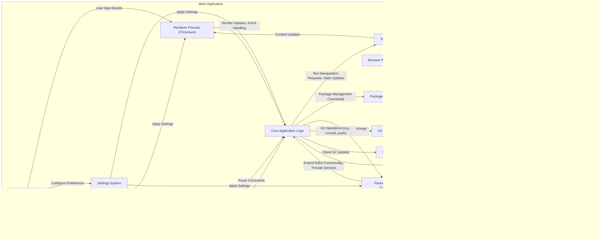

## Project Design Document: Atom Text Editor (Improved)

**1. Introduction**

This document provides an enhanced architectural overview of the Atom text editor project, based on the publicly available repository at [https://github.com/atom/atom](https://github.com/atom/atom). This improved design document aims to offer a more detailed and structured foundation for subsequent threat modeling activities. It elaborates on the key components, their interactions, data flow, and technologies involved in the Atom editor, with a focus on elements relevant to security analysis.

**2. Project Overview**

Atom is a versatile, free, and open-source text and source code editor compatible with macOS, Linux, and Windows. Its core strength lies in its extensibility through packages developed using Node.js, and its seamless integration with Git for version control. Built upon web technologies (HTML, CSS, JavaScript, and Node.js via Electron), Atom provides a highly customizable environment for developers and other users.

**3. System Architecture**

Atom's architecture is composed of several interconnected components, each with specific responsibilities:

*   **Core Application:** This is the central part of Atom, managing the overall application lifecycle, coordinating other components, and providing core editor functionalities.
*   **Text Buffer:** This component is responsible for managing the in-memory representation of the text content of open files. It handles operations like editing, undo/redo, and maintaining markers for various editor features.
*   **Renderer Process (Chromium):** Each editor window runs within its own Renderer Process, powered by the Chromium engine. This process is responsible for rendering the user interface elements using web technologies (HTML, CSS, JavaScript) and handling user interactions within that window.
*   **Browser Process (Electron):** This single process manages the application-level functionalities, including window management, interacting with the operating system's native APIs (e.g., file dialogs, notifications), and managing the lifecycle of the Renderer Processes.
*   **Package Manager (apm):** This command-line tool facilitates the discovery, installation, updating, and publishing of Atom packages. It interacts with the community package registry and manages package dependencies.
*   **Packages:** These are self-contained bundles of code that extend Atom's functionality. They can range from adding support for new programming languages to providing advanced editing features or custom UI themes. Packages can be categorized as:
    *   **Core Packages:** Bundled and maintained directly by the Atom team, providing essential functionalities.
    *   **Community Packages:** Developed and maintained by the Atom community, offering a wide range of extensions.
*   **Settings System:** This component manages user preferences and configuration options for both the core application and installed packages. Settings are typically stored in configuration files.
*   **Keymap System:** This system handles the mapping of keyboard shortcuts to specific editor commands, allowing users to customize their workflow.
*   **Command Palette:** This provides a searchable interface for accessing and executing all available Atom commands, including those provided by packages.
*   **File System Access:** This component handles all interactions with the local file system, including reading, writing, creating, and deleting files and directories.
*   **Git Integration:** Atom provides built-in support for Git, allowing users to perform common version control operations directly within the editor.
*   **Updater:** This component is responsible for checking for new versions of Atom and facilitating the update process.

**4. Key Interactions and Data Flow**

The following diagram illustrates the key interactions between the main components of Atom, highlighting the flow of data and control:

**List of Key Data Flows:**

*   **User Interaction to Text Buffer:** User actions in the UI (typing, deleting, etc.) are captured by the Renderer Process and translated into commands that modify the Text Buffer.
*   **Text Buffer Updates to UI:** Changes in the Text Buffer are communicated to the Renderer Process to update the displayed content in the editor window.
*   **Package Loading and Execution:** The Core Application loads and executes code from installed Packages, allowing them to extend the editor's functionality and interact with its APIs.
*   **Settings Persistence:** User settings are read from configuration files on the File System and written back to these files when changes are made.
*   **Package Installation Process:** The Package Manager communicates with the Community Package Registry over the Internet to retrieve package information and download package files, which are then stored on the File System.
*   **Git Operations Data Flow:** When users perform Git operations, Atom interacts with the local Git repository on the File System, potentially transferring data to remote repositories over the Network.
*   **Update Process Data Flow:** The Updater checks for new versions by communicating over the Network and downloads update files, which are then used to update the application on the File System.

**5. Key Technologies**

*   **Electron:** The core framework that enables building cross-platform desktop applications using web technologies (Chromium and Node.js).
*   **Chromium:** The open-source web browser engine responsible for rendering the user interface of Atom.
*   **Node.js:** The JavaScript runtime environment used for the Browser Process, the Package Manager (apm), and for developing Atom packages.
*   **JavaScript:** The primary programming language used for developing Atom's core functionality and its packages.
*   **HTML:** Used for structuring the user interface elements within the Renderer Process.
*   **CSS:** Used for styling the user interface elements within the Renderer Process.
*   **Git:** The distributed version control system that Atom integrates with.
*   **CSON (CoffeeScript Object Notation):** A human-readable data serialization format often used for Atom's configuration files (though JSON is also supported).

**6. Security Considerations (Detailed)**

This section outlines specific security considerations relevant to Atom's architecture, categorized for clarity:

*   **Package Security:**
    *   **Remote Code Execution (RCE):** Malicious or vulnerable packages can potentially execute arbitrary code on the user's system with the privileges of the Atom process.
    *   **Supply Chain Attacks:** Dependencies of Atom or its packages could contain vulnerabilities that are exploited.
    *   **Package Integrity:** Ensuring the authenticity and integrity of packages downloaded from the registry is crucial.
    *   **Lack of Sandboxing:** Packages generally run with the same privileges as Atom, increasing the impact of vulnerabilities.
*   **Network Security:**
    *   **Man-in-the-Middle (MITM) Attacks (Update Process):**  Compromising the update process could allow attackers to distribute malicious updates.
    *   **Package Download Security:**  Ensuring secure connections (HTTPS) when downloading packages is essential.
    *   **Data Transmission:** Sensitive data transmitted by packages (if any) should be protected.
*   **Local Security:**
    *   **Cross-Site Scripting (XSS) in UI:**  Improper handling of user-provided content or package-generated UI elements could lead to XSS vulnerabilities.
    *   **File System Access Vulnerabilities:** Bugs or vulnerabilities in file system access logic could allow unauthorized read or write access to files.
    *   **Data Exposure in Configuration:** Sensitive information stored in configuration files could be vulnerable if not properly protected.
    *   **Privilege Escalation:** Exploits could potentially allow malicious code to gain elevated privileges.
*   **Process Isolation:**
    *   **Renderer Process Compromise:** A compromised Renderer Process could potentially affect other Renderer Processes or the Browser Process.
    *   **Limited Sandboxing:** While Electron provides some process isolation, it may not be sufficient to prevent all types of attacks.
*   **Git Integration Security:**
    *   **Execution of Malicious Git Hooks:**  Carelessly configured Git repositories with malicious hooks could pose a threat.
    *   **Credential Management:** Securely storing and managing Git credentials is important.

**7. Threat Modeling Focus Areas (Actionable)**

Based on the architecture and security considerations, the following areas are recommended for focused and actionable threat modeling activities:

*   **Package Installation and Update Process:**
    *   How are packages verified for authenticity and integrity before installation?
    *   What mechanisms prevent the installation of malicious or vulnerable packages?
    *   Is the update process for packages and Atom itself secure against MITM attacks?
*   **Package Execution Environment:**
    *   What level of isolation exists between packages and the core application?
    *   What APIs are available to packages, and could they be misused for malicious purposes?
    *   How are permissions managed for package access to system resources?
*   **Inter-Process Communication (IPC) Security:**
    *   How do the Browser Process, Renderer Processes, and Packages communicate?
    *   Are these communication channels secured against eavesdropping or manipulation?
    *   What are the potential attack vectors through IPC mechanisms?
*   **Content Security Policy (CSP) Effectiveness:**
    *   How is CSP implemented within the Renderer Processes?
    *   Is it effective in mitigating XSS vulnerabilities from user content or malicious packages?
    *   Are there any bypasses or weaknesses in the CSP implementation?
*   **File System Access Controls:**
    *   How does Atom manage file system access requests from the core and packages?
    *   Are there any vulnerabilities that could allow unauthorized file read or write operations?
    *   How are temporary files and caches handled securely?
*   **Git Integration Security Analysis:**
    *   What are the potential risks associated with Atom's Git integration, such as the execution of malicious hooks?
    *   How are Git credentials managed within Atom?
*   **Settings and Configuration Security:**
    *   How are user settings stored, and are they protected from unauthorized access or modification?
    *   Could vulnerabilities in settings handling lead to security issues?

**8. Conclusion**

This improved design document provides a more detailed and structured understanding of the Atom text editor's architecture, specifically tailored for threat modeling purposes. By outlining the key components, their interactions, data flow, and relevant technologies, along with a comprehensive list of security considerations and actionable threat modeling focus areas, this document serves as a valuable resource for identifying and mitigating potential security risks within the Atom ecosystem.