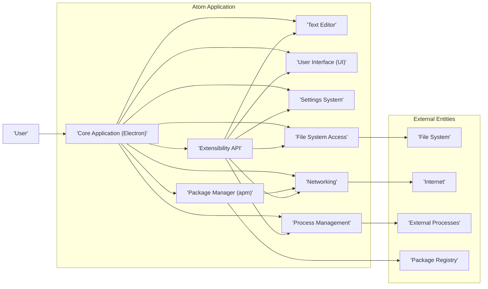
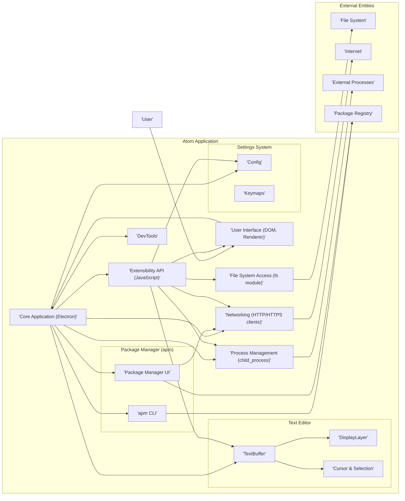
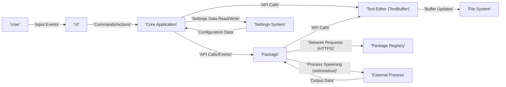

# Project Design Document: Atom Text Editor

**Version:** 1.1
**Date:** October 26, 2023
**Author:** AI Software Architect

## 1. Introduction

This document provides an enhanced and more detailed architectural design of the Atom text editor, an open-source, cross-platform text and source code editor. This revised document is specifically tailored to serve as a robust foundation for subsequent threat modeling activities. It meticulously outlines the key components, data flows, and interactions within the Atom ecosystem, providing a deeper understanding of potential attack surfaces.

## 2. Project Overview

Atom is a sophisticated desktop application leveraging web technologies (Chromium via Electron, Node.js, HTML, CSS, JavaScript). Its design emphasizes high customizability and extensibility through a vibrant package ecosystem. The core application delivers fundamental text editing capabilities, while a vast array of additional features are implemented as community-developed packages.

## 3. Architectural Design

### 3.1. High-Level Architecture

### 3.2. Component Description

*   **Core Application (Electron) ("'Core Application (Electron)'"):**  The central process of Atom, built upon the Electron framework. It manages the application lifecycle, including startup and shutdown, orchestrates the loading and management of packages, and facilitates communication between different components. This component provides the underlying runtime environment.
*   **Text Editor ("'Text Editor'"):**  The core module responsible for all text editing functionalities. Internally, it comprises:
    *   **TextBuffer:**  Represents the in-memory content of the text being edited, handling text storage and manipulation.
    *   **DisplayLayer:**  Manages the visual rendering of the text, including syntax highlighting, code folding, and other visual enhancements.
    *   **Cursor and Selection Management:** Tracks the user's cursor position and selected text ranges.
*   **User Interface (UI) ("'User Interface (UI)'"):**  The visual front-end of Atom, constructed using HTML, CSS, and JavaScript. It renders the main editor window, menus, toolbars, context menus, settings panels, and UI elements contributed by installed packages. It handles user input events and translates them into actions within the application.
*   **Package Manager (apm) ("'Package Manager (apm)'"):**  A dual-interface component for managing Atom packages:
    *   **Command-Line Interface (CLI):**  The `apm` command-line tool allows users to install, uninstall, update, and publish packages from the terminal.
    *   **Integrated UI:**  Provides a graphical interface within Atom for browsing, searching, and managing packages. It interacts with the Package Registry over the network.
*   **Settings System ("'Settings System'"):**  Manages Atom's configuration settings, encompassing both core application settings and package-specific configurations. It provides mechanisms for:
    *   **Configuration Storage:**  Settings are typically stored in CSON (CoffeeScript Object Notation) files.
    *   **Settings Retrieval:**  Allows components and packages to access and retrieve configuration values.
    *   **Keymap Handling:**  Manages keyboard shortcuts and their associated actions.
*   **File System Access ("'File System Access'"):**  Provides controlled access to the local file system. This component utilizes Node.js's `fs` module to perform operations such as:
    *   Opening and saving files.
    *   Creating and deleting files and directories.
    *   Reading file metadata.
    *   Watching for file system changes.
*   **Networking ("'Networking'"):**  Handles all network communication initiated by Atom or its packages. This includes:
    *   Downloading packages and updates from the Package Registry (typically over HTTPS).
    *   Checking for updates to the Atom application itself.
    *   Communication with remote services as required by installed packages (e.g., for remote collaboration or accessing APIs).
*   **Process Management ("'Process Management'"):**  Enables Atom to spawn and interact with external processes. This functionality, often leveraged by packages, relies on Node.js's `child_process` module and is used for tasks like:
    *   Running linters and formatters.
    *   Executing build tools.
    *   Interacting with version control systems.
*   **Extensibility API ("'Extensibility API'"):**  A comprehensive set of JavaScript APIs that empower packages to extend and customize Atom's functionality. Packages can interact with:
    *   The Text Editor (modifying buffers, decorations).
    *   The User Interface (adding menus, views, panels).
    *   The Settings System (defining and accessing settings).
    *   File System Access (within defined permissions).
    *   Networking (making HTTP requests).
    *   Process Management (spawning external processes).

### 3.3. Data Flow

The following details key data flows within the Atom ecosystem, highlighting potential points of interest for threat modeling:

*   **User Input to Editor:** User interactions (keystrokes, mouse events, menu selections) are captured by the UI ("'User Interface (UI)'") and translated into commands or events that are processed by the Core Application ("'Core Application (Electron)'") and subsequently the Text Editor ("'Text Editor'").
*   **Text Buffer Manipulation:**  Changes made to the text editor, either through direct user input or programmatically by packages via the Extensibility API ("'Extensibility API'"), are reflected in the TextBuffer within the Text Editor ("'Text Editor'"). These changes can trigger events that are observed by other components and packages.
*   **File Operations:** When a user initiates file operations (open, save, create), the UI ("'User Interface (UI)'") communicates with the Core Application ("'Core Application (Electron)'"), which in turn utilizes the File System Access component ("'File System Access'") to interact with the local File System ("'File System'"). Data is read from or written to disk.
*   **Package Management:** When installing a package, the Package Manager ("'Package Manager (apm)'") (either through the CLI or UI) sends requests over the Networking component ("'Networking'") to the Package Registry ("'Package Registry'") to download package files. These files are then written to the local file system within Atom's package directory.
*   **Settings Management:** User-configured settings are stored in configuration files (e.g., `config.cson`) managed by the Settings System ("'Settings System'"). The Settings System reads these files at startup and provides an API for components and packages to access and modify settings.
*   **Package Communication:** Packages can communicate with each other and the Core Application ("'Core Application (Electron)'") through events and API calls provided by the Extensibility API ("'Extensibility API'"). This inter-package communication is crucial for extending Atom's functionality but also represents a potential attack vector.
*   **External Process Interaction:** When a package spawns an external process using the Process Management component ("'Process Management'"), data can be passed to the process via command-line arguments or standard input. The process's output (standard output and standard error) can be captured by Atom and processed by the initiating package.
*   **Updates:** Atom periodically checks for updates by communicating with a remote server over the network using the Networking component ("'Networking'"). If an update is available, it can be downloaded and installed, potentially involving file system operations.

### 3.4. Key Interactions

*   **User interacts with UI, triggering commands:** The User ("'User'") interacts with the UI ("'User Interface (UI)'"), which translates these actions into commands that are dispatched to the Core Application ("'Core Application (Electron)'") for processing.
*   **Core Application orchestrates package loading:** At startup, the Core Application ("'Core Application (Electron)'") loads installed packages, invoking their activation hooks and initializing their functionality based on the Extensibility API ("'Extensibility API'").
*   **Packages extend editor functionality via APIs:** Packages leverage the Extensibility API ("'Extensibility API'") to register new commands, add UI elements, modify editor behavior, and interact with other Atom components.
*   **Package Manager interacts with Package Registry over network:** The Package Manager ("'Package Manager (apm)'") uses the Networking component ("'Networking'") to send requests to the Package Registry ("'Package Registry'") for package information and downloads.
*   **Settings System provides configuration to components:** Components and packages access the Settings System ("'Settings System'") to retrieve and apply configuration values, influencing their behavior.
*   **File System Access mediates file I/O requests:** The Text Editor ("'Text Editor'") and packages rely on the File System Access component ("'File System Access'") to perform read and write operations on the File System ("'File System'").

## 4. Technology Stack

*   **Desktop Framework:** Electron (Chromium + Node.js)
*   **Core Programming Languages:** JavaScript
*   **UI Technologies:** HTML, CSS
*   **Legacy Language:** CoffeeScript (primarily for older packages and core components)
*   **Package Management:** npm (for internal dependencies), apm (Atom Package Manager)
*   **Configuration Format:** CSON (CoffeeScript Object Notation)
*   **Version Control:** Git (for the Atom project itself and commonly used for user projects within Atom)

## 5. Deployment Model

Atom is deployed as a desktop application that users install directly on their operating systems (Windows, macOS, Linux). There is no central server-side component for the core editor functionality. The Atom Package Registry serves as a centralized repository for community-developed packages.

## 6. Threat Landscape

This section outlines potential threats based on the architectural design, providing a more concrete basis for threat modeling:

*   **Package-Related Threats:**
    *   **Malicious Packages:** Packages containing malicious code designed to steal data, execute arbitrary commands, or compromise the user's system.
    *   **Supply Chain Attacks:** Compromise of package maintainer accounts or the Package Registry infrastructure leading to the distribution of malicious package versions.
    *   **Vulnerable Packages:** Packages with security vulnerabilities that could be exploited by other packages or external attackers.
    *   **Dependency Confusion:**  Exploiting the package resolution mechanism to install malicious packages with names similar to legitimate dependencies.
*   **Code Injection Vulnerabilities:**
    *   **Cross-Site Scripting (XSS) in Package Views:** Packages rendering untrusted content within Atom's UI could be vulnerable to XSS attacks.
    *   **Remote Code Execution (RCE) through Package Exploits:** Vulnerabilities in package code or the Extensibility API could allow attackers to execute arbitrary code.
*   **File System Access Control Issues:**
    *   **Unauthorized File Access:** Malicious packages could bypass intended file access restrictions to read or modify sensitive files.
    *   **Path Traversal Vulnerabilities:** Exploiting vulnerabilities in file path handling to access files outside of intended directories.
*   **Network-Related Threats:**
    *   **Man-in-the-Middle (MITM) Attacks on Package Downloads:** Attackers intercepting communication with the Package Registry to serve malicious packages.
    *   **Insecure Communication by Packages:** Packages communicating with remote services over unencrypted channels, exposing sensitive data.
*   **Process Management Security Risks:**
    *   **Command Injection:** Vulnerabilities allowing attackers to inject malicious commands into processes spawned by Atom or its packages.
    *   **Privilege Escalation:** Exploiting vulnerabilities in external processes to gain elevated privileges.
*   **Settings and Configuration Vulnerabilities:**
    *   **Settings Injection:** Malicious packages modifying Atom's settings to compromise security or functionality.
    *   **Exposure of Sensitive Information in Configuration:** Storing sensitive data in configuration files without proper protection.
*   **Extensibility API Abuse:**
    *   **API Misuse for Malicious Purposes:** Packages exploiting the Extensibility API in unintended ways to perform malicious actions.
    *   **Lack of Sufficient API Security Controls:**  Missing or inadequate security checks within the Extensibility API.

## 7. Diagrams

### 7.1. Component Diagram (Detailed)

### 7.2. Data Flow Diagram (Detailed)

## 8. Future Considerations

*   Detailed security analysis of the Extensibility API, including potential vulnerabilities and mitigation strategies.
*   Evaluation of the security measures implemented by the Atom Package Registry to prevent the distribution of malicious packages.
*   Analysis of the update mechanism's security to ensure the integrity and authenticity of updates.
*   Further investigation into the process isolation mechanisms between Atom and external processes.
*   Development of secure coding guidelines for Atom package developers.

This enhanced design document provides a more granular and security-focused view of the Atom text editor's architecture. The detailed descriptions of components, data flows, and the identified threat landscape will be invaluable for conducting comprehensive threat modeling and developing effective security strategies.