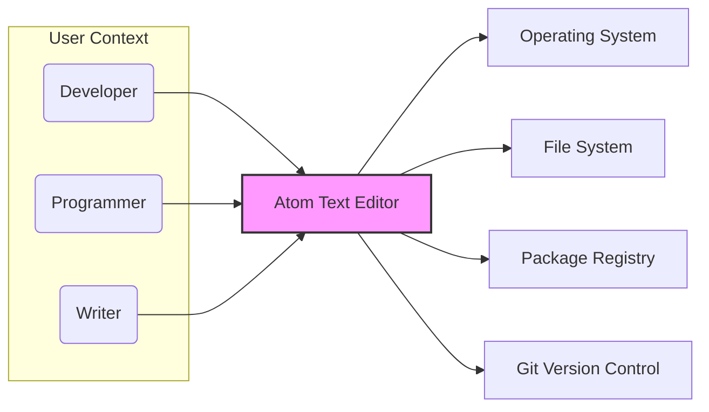
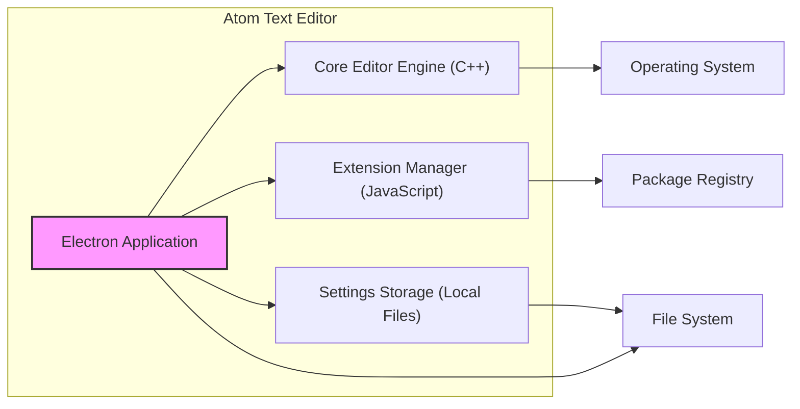
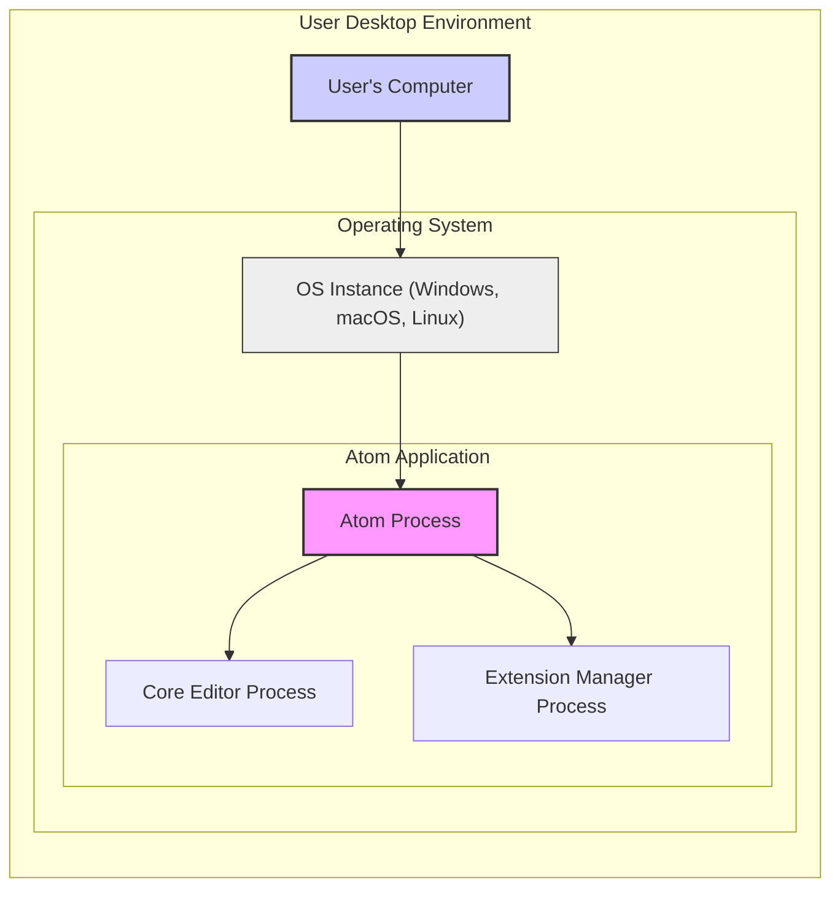
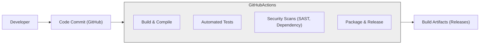

# BUSINESS POSTURE

This project, Atom Text Editor, aims to provide a free, open-source, and extensible text editor for developers and programmers. It prioritizes user adoption and community contribution by offering a customizable and feature-rich editing experience. The project goals are to empower users with a versatile tool for code creation and manipulation, fostering a collaborative environment through its open-source nature.

Key business priorities include:
- User Experience: Providing a smooth, efficient, and enjoyable text editing experience.
- Extensibility: Allowing users to customize and extend functionality through packages and themes.
- Community Growth: Encouraging contributions and engagement from the open-source community.
- Stability and Reliability: Ensuring the editor is stable, performs well, and is dependable for daily use.

Most important business risks to address:
- Competition: The text editor market is competitive, with established players and new entrants. Atom needs to maintain relevance and user appeal.
- Security Vulnerabilities: Security flaws in the editor could compromise user data or systems, damaging reputation and user trust.
- Maintainability: As a large open-source project, ensuring long-term maintainability and addressing technical debt is crucial.
- Community Dependency: Reliance on community contributions for development and security fixes can be a risk if community engagement declines.

# SECURITY POSTURE

Existing security controls:
- security control: Open Source Codebase - The entire codebase is publicly available on GitHub, allowing for community review and scrutiny, which can help identify potential security vulnerabilities. Implemented: GitHub Repository.
- security control: Community Contributions - Security patches and vulnerability reports can be submitted by the community. Implemented: GitHub Contribution Model.
- security control: Standard Development Practices - Assumed usage of standard software development practices like code reviews and testing, although specific details are not provided in the input. Implemented: Assumed within project development workflow.

Accepted risks:
- accepted risk: Vulnerabilities inherent in complex software - Any complex software, including Atom, may contain security vulnerabilities that are discovered over time.
- accepted risk: Reliance on Community for Security - The project relies on the open-source community to identify and report security issues, which may lead to delays in vulnerability discovery and patching.

Recommended security controls:
- recommended security control: Automated Security Scanning - Implement automated Static Application Security Testing (SAST) and Dynamic Application Security Testing (DAST) tools in the CI/CD pipeline to detect potential vulnerabilities early in the development process.
- recommended security control: Dependency Scanning - Utilize dependency scanning tools to identify and manage vulnerabilities in third-party libraries and dependencies used by Atom.
- recommended security control: Security Awareness Training - Provide security awareness training for core contributors and maintainers to promote secure coding practices and vulnerability handling.
- recommended security control: Vulnerability Disclosure Program - Establish a clear vulnerability disclosure program to provide a channel for security researchers and users to report vulnerabilities responsibly.

Security requirements:
- Authentication:
    - Requirement: If Atom offers features like settings synchronization or package management accounts, strong authentication mechanisms (e.g., password hashing, multi-factor authentication) should be implemented to protect user accounts.
    - Requirement: Securely manage API keys or tokens if Atom integrates with external services requiring authentication.
- Authorization:
    - Requirement: Implement appropriate authorization controls to ensure users can only access and modify resources they are permitted to, especially within settings and configuration files.
    - Requirement: If extensions have access to system resources, ensure a robust permission model to limit potential damage from malicious extensions.
- Input Validation:
    - Requirement: Thoroughly validate all user inputs, including file content, settings, and package configurations, to prevent injection attacks (e.g., command injection, cross-site scripting).
    - Requirement: Sanitize data retrieved from external sources (e.g., package registries) before use to prevent data integrity issues and security vulnerabilities.
- Cryptography:
    - Requirement: Use strong cryptography for sensitive data at rest and in transit, such as storing user credentials (if applicable) or securing communication channels for updates and package downloads.
    - Requirement: Implement secure key management practices for any cryptographic keys used within the application.

# DESIGN

## C4 CONTEXT

Context Diagram Elements:

- Element:
    - Name: Developer
    - Type: User
    - Description: Software developers and engineers who use Atom to write, edit, and manage code.
    - Responsibilities: Uses Atom to create, modify, and manage source code files. Interacts with Atom's features for code editing, debugging, and version control.
    - Security controls: Responsible for secure coding practices within their projects, managing access to their development environments.

- Element:
    - Name: Programmer
    - Type: User
    - Description: Individuals who write programs and scripts, potentially for various purposes beyond software development, using Atom as their primary editor.
    - Responsibilities: Uses Atom for scripting, automation, and general programming tasks. May use Atom for configuration file editing and system administration tasks.
    - Security controls: Responsible for the security of their scripts and programs, and for managing access to systems they interact with.

- Element:
    - Name: Writer
    - Type: User
    - Description: Users who utilize Atom for writing documents, notes, or other text-based content, leveraging its features for text manipulation and organization.
    - Responsibilities: Uses Atom for general text editing, note-taking, and document creation. May use Atom's markdown support and other text-related features.
    - Security controls: Responsible for the security of their documents and notes, and for managing access to their writing environment.

- Element:
    - Name: Atom Text Editor
    - Type: System
    - Description: A free and open-source text and source code editor based on web technologies.
    - Responsibilities: Provides a platform for users to create, edit, and manage text and code files. Offers extensibility through packages and themes. Integrates with operating system functionalities and external systems.
    - Security controls: Input validation, authorization (within editor settings and features), secure updates, extension management, protection of user settings and data.

- Element:
    - Name: Operating System
    - Type: External System
    - Description: The underlying operating system (Windows, macOS, Linux) on which Atom runs.
    - Responsibilities: Provides system resources, file system access, and process management for Atom. Enforces operating system level security policies.
    - Security controls: Operating system access controls, process isolation, file system permissions, security updates.

- Element:
    - Name: File System
    - Type: External System
    - Description: The local file system where users store their files and projects that are edited with Atom.
    - Responsibilities: Stores and retrieves files for Atom. Manages file permissions and access control.
    - Security controls: File system permissions, access control lists, encryption at rest (OS level).

- Element:
    - Name: Package Registry
    - Type: External System
    - Description: Online repository (e.g., atom.io package registry) where Atom packages and themes are hosted and distributed.
    - Responsibilities: Provides a source for Atom extensions. Manages package metadata and distribution.
    - Security controls: Package signing, malware scanning (on registry side), HTTPS for package downloads, reputation system for packages.

- Element:
    - Name: Git Version Control
    - Type: External System
    - Description: A version control system commonly used by developers, often integrated with Atom for code management.
    - Responsibilities: Tracks changes to code files. Manages version history and collaboration.
    - Security controls: Git repository access controls (e.g., SSH keys, HTTPS authentication), commit signing, branch protection.

## C4 CONTAINER

Container Diagram Elements:

- Element:
    - Name: Electron Application
    - Type: Application
    - Description: The main Electron application container that provides the user interface and hosts the core editor and extensions.
    - Responsibilities: User interface rendering, application lifecycle management, communication between components, interaction with the operating system.
    - Security controls: Input validation at UI level, process isolation (Electron's process model), secure communication channels between renderer and main processes.

- Element:
    - Name: Core Editor Engine (C++)
    - Type: Application Component
    - Description: The core text editing engine, likely implemented in C++ for performance, responsible for text manipulation, syntax highlighting, and core editor functionalities.
    - Responsibilities: Text editing operations, buffer management, syntax highlighting, code completion, core editor features.
    - Security controls: Input validation for file parsing and text processing, memory safety (C++ specific security considerations), protection against buffer overflows.

- Element:
    - Name: Extension Manager (JavaScript)
    - Type: Application Component
    - Description: A JavaScript component responsible for managing Atom extensions, including installation, updates, and loading extensions at runtime.
    - Responsibilities: Package management, extension loading and unloading, API exposure to extensions, communication with package registry.
    - Security controls: Package verification (signatures, checksums), sandboxing of extensions (if possible within Electron), API security to limit extension capabilities, input validation for package metadata.

- Element:
    - Name: Settings Storage (Local Files)
    - Type: Data Store
    - Description: Local file storage used to persist user settings, preferences, and potentially extension configurations.
    - Responsibilities: Persistent storage of user settings, configuration data, and application state.
    - Security controls: File system permissions to restrict access to settings files, encryption of sensitive settings (if applicable), secure parsing and writing of settings files.

- Element:
    - Name: Operating System
    - Type: Infrastructure
    - Description: The host operating system providing runtime environment for Atom containers.
    - Responsibilities: Process execution, resource allocation, system calls, security enforcement at OS level.
    - Security controls: OS level security features (firewall, process isolation, access control).

- Element:
    - Name: File System
    - Type: Infrastructure
    - Description: Local file system providing persistent storage for settings and user files.
    - Responsibilities: File storage and retrieval, access control, data persistence.
    - Security controls: File system permissions, encryption at rest (OS level).

- Element:
    - Name: Package Registry
    - Type: External System
    - Description: Online service providing Atom packages and themes.
    - Responsibilities: Package hosting, distribution, metadata management.
    - Security controls: HTTPS, package signing, malware scanning.

## DEPLOYMENT

Deployment Architecture: Desktop Application Deployment

Deployment Diagram Elements:

- Element:
    - Name: User's Computer
    - Type: Infrastructure
    - Description: The physical or virtual computer owned and operated by the user where Atom is installed and run.
    - Responsibilities: Provides the hardware resources to run the operating system and Atom application.
    - Security controls: Physical security of the device, user account security, endpoint security software (antivirus, firewall).

- Element:
    - Name: OS Instance (Windows, macOS, Linux)
    - Type: Infrastructure
    - Description: An instance of the operating system installed on the user's computer, providing the runtime environment for Atom.
    - Responsibilities: Operating system functionalities, resource management, security features, and API access for applications.
    - Security controls: Operating system security updates, access controls, firewall, process isolation, kernel-level security features.

- Element:
    - Name: Atom Process
    - Type: Software Process
    - Description: The main process of the Atom application running within the operating system.
    - Responsibilities: Application lifecycle management, process management for child processes (core editor, extensions), resource management within the application.
    - Security controls: Process isolation provided by the OS, application-level security features, memory management.

- Element:
    - Name: Core Editor Process
    - Type: Software Process
    - Description: A separate process (or threads within the main process, depending on implementation) dedicated to the core text editing engine.
    - Responsibilities: Text editing operations, syntax highlighting, core editor functionalities, potentially resource intensive tasks.
    - Security controls: Process isolation, memory safety, input validation for text processing.

- Element:
    - Name: Extension Manager Process
    - Type: Software Process
    - Description: A process (or threads) responsible for managing Atom extensions.
    - Responsibilities: Extension loading, unloading, API management for extensions, communication with package registry.
    - Security controls: Extension sandboxing (if implemented), API security, package verification, input validation for package metadata.

## BUILD

Build Process: GitHub Actions CI/CD

Build Process Description:

The Atom project likely utilizes a CI/CD pipeline, potentially based on GitHub Actions, to automate the build, test, and release process.

Build Process Steps:

1. Code Commit: Developers commit code changes to the GitHub repository.
2. GitHub Actions CI/CD: A GitHub Actions workflow is triggered upon code commits (e.g., push, pull request).
3. Build & Compile: The workflow compiles the source code for different target platforms (Windows, macOS, Linux).
4. Automated Tests: Automated unit tests and integration tests are executed to ensure code quality and functionality.
5. Security Scans: Security scans are performed, including:
    - Static Application Security Testing (SAST): Analyzes the source code for potential security vulnerabilities.
    - Dependency Scanning: Checks for known vulnerabilities in third-party dependencies.
6. Package & Release: If tests and security scans pass, the workflow packages the compiled application into distributable formats (e.g., installers, archives). Release artifacts are created and published.
7. Build Artifacts (Releases): The final build artifacts (installers, binaries) are made available for download, typically through GitHub Releases or the Atom website.

Security Controls in Build Process:

- security control: Automated Build Pipeline - Using GitHub Actions ensures a consistent and repeatable build process, reducing manual errors and potential tampering. Implemented: GitHub Actions.
- security control: Source Code Management - GitHub provides version control and audit trails for code changes, enhancing traceability and accountability. Implemented: GitHub.
- security control: Automated Testing - Automated tests help identify functional defects and regressions, indirectly contributing to security by ensuring code stability. Implemented: GitHub Actions workflows (assumed).
- security control: Static Application Security Testing (SAST) - SAST tools analyze code for potential vulnerabilities (e.g., code injection, insecure configurations) before deployment. Implemented: GitHub Actions workflows (recommended).
- security control: Dependency Scanning - Dependency scanning tools identify vulnerabilities in third-party libraries and dependencies, enabling timely updates and mitigation. Implemented: GitHub Actions workflows (recommended).
- security control: Code Signing - Signing build artifacts (executables, installers) with a digital signature verifies the integrity and authenticity of the software, protecting against tampering. Implemented: Release process (recommended).
- security control: Access Control for Build System - Restricting access to the CI/CD pipeline and build infrastructure to authorized personnel reduces the risk of unauthorized modifications or malicious builds. Implemented: GitHub Actions permissions, GitHub repository access controls.

# RISK ASSESSMENT

Critical business processes to protect:
- Core Text Editing Functionality: The primary function of Atom is text editing. Its availability and integrity are crucial for user productivity.
- Extension Management: The extensibility of Atom is a key feature. The integrity and security of the extension ecosystem are important to maintain user trust and prevent malicious extensions.
- User Settings and Preferences: User customizations and settings should be protected to ensure a consistent and personalized user experience.

Data to protect and sensitivity:
- User Code and Text Files: User-created code and text files are the most critical data. Sensitivity: Confidentiality (potentially contains proprietary code or sensitive information), Integrity (must not be modified without user consent), Availability (users need access to their files).
- User Settings and Preferences: User settings customize the editor experience. Sensitivity: Integrity (settings should not be corrupted), Availability (settings should be accessible).
- Extension Configurations: Configurations for installed extensions. Sensitivity: Integrity (misconfigured extensions can cause issues), Availability.
- Potentially Credentials (if any): If Atom stores credentials for services (e.g., settings sync, package registry accounts), these are highly sensitive. Sensitivity: Confidentiality, Integrity, Availability.

# QUESTIONS & ASSUMPTIONS

Questions:
- Are there any cloud-based features planned or currently implemented in Atom (e.g., settings synchronization, collaborative editing)?
- How are extensions vetted for security before being listed in the package registry? Is there a formal security review process for extensions?
- What mechanisms are in place to ensure the security of the package registry itself?
- Are there any plans to implement sandboxing or stronger isolation for extensions to limit their potential impact on the system?
- Is there a formal vulnerability disclosure program in place for Atom?

Assumptions:
- BUSINESS POSTURE: Atom's primary business goal is to provide a free, open-source text editor driven by community contributions. User adoption and community growth are key priorities.
- SECURITY POSTURE: Atom relies on open-source principles for security, with community review and contributions playing a significant role. Standard software development practices are assumed. Security is a concern, but the project may have accepted certain risks inherent in open-source and complex software.
- DESIGN: Atom is a desktop application built using Electron. It has a core editor engine (likely C++) and an extension manager (JavaScript). User settings are stored locally in files. The build process is automated using CI/CD, likely GitHub Actions. Deployment is primarily desktop-based.