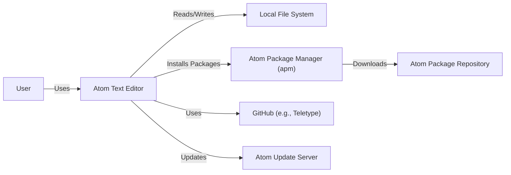
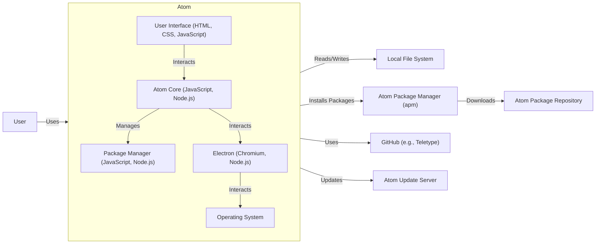
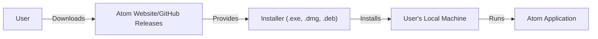
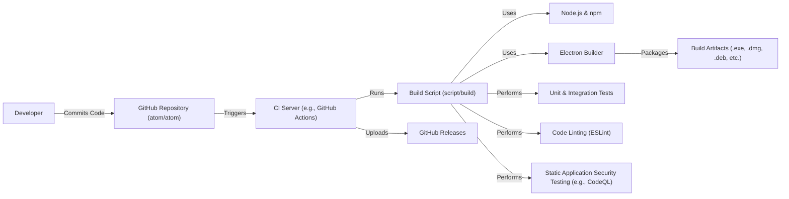

Okay, let's create a design document for the Atom text editor, based on the provided GitHub repository.

# BUSINESS POSTURE

Atom is a free and open-source text and source code editor. Its main goal is to provide a highly customizable and extensible platform for developers to write and manage code. The project prioritizes user experience, extensibility, and community contribution.

Business Priorities:

- Maintain a large and active user base.
- Foster a vibrant community of package developers.
- Ensure the editor remains performant and stable.
- Provide a platform that can be adapted to various development workflows.
- Keep the core editor relatively lightweight, with features added via packages.

Business Goals:

- Be a leading choice for text and source code editing.
- Attract and retain both users and contributors.
- Support a wide range of programming languages and development tools.

Most Important Business Risks:

- Loss of user base due to performance issues, lack of features, or security vulnerabilities.
- Decline in community contributions, leading to stagnation.
- Inability to keep up with evolving developer needs and new technologies.
- Reputational damage due to security breaches or data leaks.
- Competition from other popular editors (e.g., VS Code, Sublime Text).

# SECURITY POSTURE

Atom, being a desktop application, has a different security profile than a web application. It executes locally and interacts with the local file system.

Existing Security Controls:

- security control: Code signing: Atom releases are digitally signed to ensure authenticity and prevent tampering. (Implemented in release process).
- security control: Safe mode: Atom provides a "safe mode" that disables all third-party packages, mitigating risks from malicious or buggy extensions. (Implemented in Atom's core).
- security control: Regular updates: The Atom team releases updates to address security vulnerabilities and bugs. (Implemented in release process).
- security control: Package verification: While not strictly enforced, Atom's package manager (apm) encourages package signing and verification. (Implemented in apm).
- security control: Chromium security model: Atom is built on Electron, which uses Chromium. It benefits from Chromium's security features and sandboxing. (Inherited from Electron/Chromium).
- security control: Open-source code: The codebase is open for public scrutiny, allowing security researchers to identify and report vulnerabilities. (By design).

Accepted Risks:

- accepted risk: Third-party package vulnerabilities: Atom's extensibility relies on third-party packages, which may contain vulnerabilities. Users are responsible for managing the risk associated with installed packages.
- accepted risk: Local file system access: Atom has broad access to the user's file system, which could be exploited if a vulnerability is present.
- accepted risk: Dependence on Electron: Security vulnerabilities in Electron could impact Atom.

Recommended Security Controls:

- security control: Enhanced package vetting: Implement a more rigorous vetting process for packages published to the Atom package repository, including static analysis and reputation scoring.
- security control: Permission system for packages: Introduce a permission system that allows users to control the resources (e.g., file system, network) that packages can access.
- security control: Content Security Policy (CSP): Implement CSP to mitigate the risk of cross-site scripting (XSS) vulnerabilities, even though Atom is a desktop application.
- security control: Regular security audits: Conduct regular independent security audits of the Atom codebase and its core dependencies.

Security Requirements:

- Authentication: Not directly applicable, as Atom is a local application. However, integration with online services (e.g., GitHub for Teletype) requires authentication through those services.
- Authorization: Not directly applicable in the traditional sense. However, file system access is controlled by the operating system's permissions. Package permissions (recommended above) would introduce a new layer of authorization.
- Input Validation: Atom must properly handle various input sources, including user input, file contents, and data from external processes. This is crucial to prevent vulnerabilities like command injection or buffer overflows.  Specifically, input from third-party packages should be treated with suspicion.
- Cryptography: Atom uses cryptography for secure communication with external services (e.g., HTTPS for package downloads).  It should also use secure storage for sensitive data, such as API keys or passwords, if stored.

# DESIGN

## C4 CONTEXT

Element Descriptions:

-   Name: User
    -   Type: Person
    -   Description: A developer or user who uses Atom to edit text and code.
    -   Responsibilities: Interacts with Atom's UI, installs packages, configures settings.
    -   Security controls: Manages own credentials for external services.

-   Name: Atom Text Editor
    -   Type: Software System
    -   Description: The core Atom application.
    -   Responsibilities: Provides text editing features, manages packages, interacts with the file system.
    -   Security controls: Code signing, safe mode, regular updates, Chromium security model.

-   Name: Local File System
    -   Type: System
    -   Description: The user's local file system.
    -   Responsibilities: Stores files and directories.
    -   Security controls: Operating system file permissions.

-   Name: Atom Package Manager (apm)
    -   Type: Software System
    -   Description: Command-line tool for managing Atom packages.
    -   Responsibilities: Installs, updates, and removes packages.
    -   Security controls: Package verification (encouraged).

-   Name: GitHub (e.g., Teletype)
    -   Type: External System
    -   Description: Online platform for code hosting and collaboration. Used by Atom for features like Teletype.
    -   Responsibilities: Provides collaboration features.
    -   Security controls: GitHub's own security measures.

-   Name: Atom Package Repository
    -   Type: External System
    -   Description: Online repository for Atom packages.
    -   Responsibilities: Hosts packages for download.
    -   Security controls: Basic checks, community reporting.

-   Name: Atom Update Server
    -   Type: External System
    -   Description: Server that provides updates for Atom.
    -   Responsibilities: Delivers updates to Atom instances.
    -   Security controls: Secure communication (HTTPS).

## C4 CONTAINER

Element Descriptions:

-   Name: User Interface (HTML, CSS, JavaScript)
    -   Type: Container
    -   Description: The front-end of the Atom editor, rendered using web technologies.
    -   Responsibilities: Displays the editor interface, handles user input.
    -   Security controls: Input sanitization, CSP (recommended).

-   Name: Atom Core (JavaScript, Node.js)
    -   Type: Container
    -   Description: The core logic of the Atom editor.
    -   Responsibilities: Manages text buffers, commands, keybindings, and overall editor state.
    -   Security controls: Safe mode, input validation.

-   Name: Package Manager (JavaScript, Node.js)
    -   Type: Container
    -   Description: Handles the loading and management of Atom packages.
    -   Responsibilities: Loads packages, manages dependencies, provides APIs for packages.
    -   Security controls: Package verification (encouraged), permission system (recommended).

-   Name: Electron (Chromium, Node.js)
    -   Type: Container
    -   Description: The framework that allows Atom to run as a desktop application.
    -   Responsibilities: Provides the runtime environment, handles window management, interacts with the operating system.
    -   Security controls: Chromium security model, sandboxing.

- Name: Operating System
    - Type: Container
    - Description: OS that Atom is running on.
    - Responsibilities: Provides access to resources.
    - Security controls: OS security controls.

- All other elements are the same as in the C4 Context diagram.

## DEPLOYMENT

Possible Deployment Solutions:

1.  Manual Installation: Users download a pre-built package (e.g., .exe, .dmg, .deb) from the Atom website or GitHub releases and install it manually.
2.  Package Manager Installation: Users install Atom via their operating system's package manager (e.g., apt, yum, brew).
3.  Build from Source: Users clone the GitHub repository and build Atom from source.

Chosen Solution (Detailed Description): Manual Installation

Element Descriptions:

-   Name: User
    -   Type: Person
    -   Description: The user who wants to install Atom.
    -   Responsibilities: Downloads the installer, runs the installer.
    -   Security controls: Verifies the downloaded installer's digital signature (if applicable).

-   Name: Atom Website/GitHub Releases
    -   Type: System
    -   Description: The official source for Atom downloads.
    -   Responsibilities: Hosts the installer files.
    -   Security controls: HTTPS, code signing of installers.

-   Name: Installer (.exe, .dmg, .deb)
    -   Type: Software
    -   Description: The platform-specific installer package.
    -   Responsibilities: Installs Atom on the user's machine.
    -   Security controls: Code signing.

-   Name: User's Local Machine
    -   Type: System
    -   Description: The user's computer.
    -   Responsibilities: Runs the installer, hosts the installed Atom application.
    -   Security controls: Operating system security features.

-   Name: Atom Application
    -   Type: Software System
    -   Description: The installed Atom application.
    -   Responsibilities: Provides text editing functionality.
    -   Security controls: See previous sections.

## BUILD

Build Process Description:

1.  Developers commit code to the atom/atom repository on GitHub.
2.  This triggers a build process on a CI server (e.g., GitHub Actions).
3.  The build script (script/build in the repository) is executed.
4.  The build script uses Node.js and npm to manage dependencies and run build tasks.
5.  Electron Builder is used to package the application for different platforms.
6.  Unit and integration tests are run to ensure code quality.
7.  Code linting (using ESLint) is performed to enforce coding standards.
8.  Static Application Security Testing (SAST) is performed, potentially using tools like CodeQL, to identify security vulnerabilities.
9.  Build artifacts (installers for various platforms) are created.
10. The CI server uploads the build artifacts to GitHub Releases.

Security Controls in Build Process:

- security control: Dependency management: npm is used to manage dependencies, and package-lock.json or yarn.lock ensures consistent builds.
- security control: Code linting: ESLint helps identify potential code quality and security issues.
- security control: SAST: Static analysis tools scan the codebase for vulnerabilities.
- security control: Automated testing: Unit and integration tests help catch bugs that could lead to security issues.
- security control: CI/CD: Using a CI/CD system like GitHub Actions ensures that builds are consistent and reproducible, and that security checks are run automatically.
- security control: Supply chain security: While not explicitly shown in the diagram, efforts should be made to secure the supply chain, such as verifying the integrity of dependencies and using trusted sources.

# RISK ASSESSMENT

Critical Business Processes:

- Code editing and development workflow: Atom's primary function is to facilitate efficient and customizable code editing.
- Package management: The ability to extend Atom's functionality through packages is a core part of its value proposition.
- Community engagement: A thriving community of users and contributors is essential for Atom's long-term success.

Data to Protect and Sensitivity:

- Source code (High sensitivity): Users store their source code within Atom, which may contain intellectual property, trade secrets, or sensitive algorithms.
- Configuration files (Medium sensitivity): Atom's configuration files may contain API keys, passwords, or other sensitive information.
- User data (Low to Medium sensitivity): Atom may collect some user data, such as usage statistics or crash reports. The sensitivity depends on the specific data collected.
- Package metadata (Low sensitivity): Information about installed packages is generally not sensitive, but could be used in targeted attacks.

# QUESTIONS & ASSUMPTIONS

Questions:

- What specific SAST tools are used in the Atom build process?
- Are there any specific security reviews or audits conducted on Atom or its core dependencies?
- What is the process for handling security vulnerabilities reported by external researchers?
- What is the exact mechanism for package signing and verification in apm?
- Are there any plans to implement a more robust package permission system?
- What telemetry data is collected by Atom, and how is it protected?

Assumptions:

- BUSINESS POSTURE: Atom's primary goal is to remain a competitive and widely used text editor.
- SECURITY POSTURE: The Atom team prioritizes security but acknowledges the inherent risks of a highly extensible desktop application.
- DESIGN: The design accurately reflects the high-level architecture of Atom and its build/deployment process. The diagrams are simplified representations and may not capture every detail. The build process uses GitHub Actions (or a similar CI/CD system). Electron Builder is the primary tool for packaging Atom.