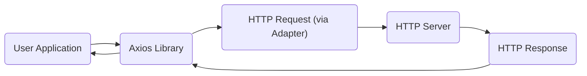
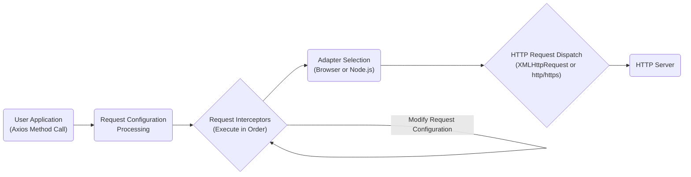
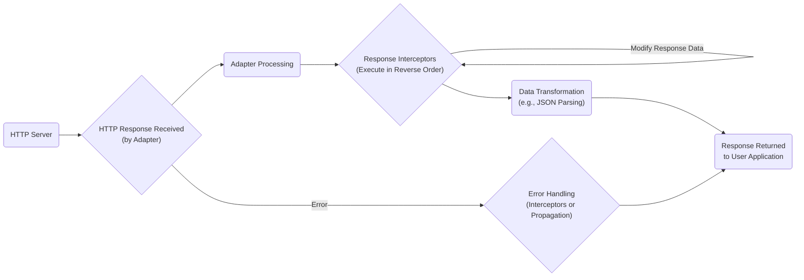

# Project Design Document: Axios HTTP Client

**Version:** 1.1
**Date:** October 26, 2023
**Author:** AI Software Architect

## 1. Introduction

### 1.1. Purpose

This document provides an enhanced and detailed design overview of the Axios HTTP client library. It elaborates on the key architectural components, data flow, and functionalities, offering a more comprehensive understanding of the system's behavior for effective threat modeling. This document serves as a robust foundation for in-depth security analysis and risk assessment.

### 1.2. Scope

This document focuses on the intricate internal architecture and functionality of the Axios library itself. It provides a deeper dive into the core components involved in the creation, transmission, and processing of HTTP requests and responses. It explicitly excludes the applications that integrate and utilize Axios, as well as the specific server-side implementations that Axios interacts with. The focus remains solely on the Axios library's internal workings.

### 1.3. Target Audience

This document is primarily intended for security architects, security engineers, penetration testers, developers, and any stakeholders involved in the threat modeling, security auditing, and comprehensive security analysis of systems that incorporate the Axios library.

## 2. System Architecture

### 2.1. High-Level Architecture

The Axios library functions as a crucial intermediary, situated between a JavaScript application (executing within a browser or a Node.js environment) and an HTTP server. It abstracts the complexities of making HTTP requests, offering a streamlined and consistent API for initiating requests and managing responses across different environments.



### 2.2. Component Breakdown

The Axios library can be dissected into the following essential components, each with a specific role in the request lifecycle:

*   **Core:** This is the central orchestrator of the library. It manages the entire request lifecycle, handles global and request-specific configurations, and is responsible for dispatching requests through the appropriate adapter.
*   **Interceptors:** These are powerful middleware functions that provide hooks into the request and response processing pipelines. They enable the modification of request configurations before they are sent and the transformation of response data after it is received.
    *   **Request Interceptors:** Functions executed before a request is dispatched. They can modify headers, request bodies, or even cancel the request.
    *   **Response Interceptors:** Functions executed after a response is received but before it's passed back to the application. They can transform response data, handle errors, or add custom logic.
*   **Request Configuration:** This component is responsible for managing and processing the various configuration options provided by the user. These options include, but are not limited to:
    *   Headers
    *   Query parameters
    *   Request body data
    *   Timeout settings
    *   Authentication details
    *   Proxy configurations
    *   Custom request/response transformers
*   **Dispatchers/Adapters:** These are environment-specific modules that handle the actual transmission of the HTTP request. They abstract the underlying platform's HTTP capabilities.
    *   `XMLHttpRequest` adapter (for browser environments): Leverages the browser's built-in `XMLHttpRequest` object.
    *   `http` and `https` module adapter (for Node.js environments): Utilizes Node.js's core `http` and `https` modules.
*   **Response Handling:** This component takes the raw HTTP response received from the adapter and processes it. This includes parsing headers, extracting the response body, and determining the HTTP status code. It also handles automatic data transformation based on the `Content-Type` header.
*   **Error Handling:** This component manages errors that can occur at various stages of the request lifecycle. This includes network connectivity issues, request timeouts, server-side errors (non-2xx status codes), and errors during request or response processing.
*   **Utils:** A collection of utility functions used internally by various components of the library. These functions perform common tasks such as:
    *   Header manipulation
    *   URL construction and parsing
    *   Data serialization and deserialization
    *   Type checking

## 3. Data Flow

### 3.1. Request Flow

The following detailed steps illustrate the typical flow of an HTTP request initiated using the Axios library:

1. **User Application Initiates Request:** The application invokes an Axios method (e.g., `axios.get()`, `axios.post()`) providing the target URL and any optional configuration parameters.
2. **Request Configuration Processing:** Axios's configuration component processes the provided options, merging them with any globally defined default configurations. This ensures all necessary request parameters are set.
3. **Request Interceptor Execution:** Registered request interceptors are executed sequentially in the order they were registered. Each interceptor has the opportunity to inspect and potentially modify the request configuration before it's dispatched.
4. **Adapter Selection:** Based on the runtime environment (browser or Node.js), the appropriate adapter is selected to handle the underlying HTTP transport.
5. **HTTP Request Dispatch:** The chosen adapter utilizes the platform's native HTTP capabilities (either `XMLHttpRequest` in browsers or the `http`/`https` modules in Node.js) to transmit the constructed HTTP request to the designated server.
6. **Server Processing:** The remote HTTP server receives the request and processes it according to its defined logic.



### 3.2. Response Flow

The following detailed steps illustrate the typical flow of an HTTP response as it is processed by the Axios library:

1. **HTTP Response Received:** The designated adapter receives the HTTP response from the server, including headers, status code, and the response body.
2. **Adapter Processing:** The adapter performs any necessary platform-specific processing of the raw response data. This might involve handling streaming responses or other platform-specific nuances.
3. **Response Interceptor Execution:** Registered response interceptors are executed in the *reverse* order of their registration. Each interceptor can inspect and potentially modify the response data or handle any errors that might have occurred.
4. **Data Transformation:** Axios attempts to automatically transform the response data based on the `Content-Type` header. For instance, if the `Content-Type` is `application/json`, Axios will attempt to parse the response body as JSON.
5. **Response Returned to Application:** The processed response object, containing the data, status code, headers, and the original request configuration, is returned to the calling application.
6. **Error Handling (if applicable):** If an error occurred during any stage of the request or response processing (e.g., network error, timeout, non-2xx status code), the error is caught and potentially handled by response interceptors or propagated back to the application as a rejected Promise.



## 4. Key Features Relevant to Security

*   **Request and Response Interceptors:** These offer significant flexibility for modifying requests and responses. However, they also represent a potential attack surface. Malicious or poorly written interceptors could:
    *   Inject arbitrary headers, potentially leading to HTTP smuggling or other vulnerabilities.
    *   Modify request bodies to inject malicious payloads.
    *   Leak sensitive information by logging or transmitting request/response data insecurely.
    *   Manipulate response data, leading to application logic errors or security bypasses.
*   **Request Cancellation:** While useful for managing resources, improper implementation of request cancellation logic in user applications could lead to race conditions or unexpected application states. In some scenarios, it might be possible to exploit cancellation mechanisms to cause denial-of-service by repeatedly initiating and canceling requests.
*   **Automatic Data Transformation:** The automatic parsing of responses based on `Content-Type` can introduce vulnerabilities if the server returns unexpected or maliciously crafted content. For example, a server could return a seemingly valid JSON response that exploits vulnerabilities in the JSON parsing library or the application's handling of the parsed data.
*   **Client-Side Request Forgery (CSRF/XSRF) Protection:** Axios provides features to help mitigate CSRF attacks, such as automatically including CSRF tokens in requests. However, the effectiveness of this protection depends on the correct implementation and configuration by the user application. Misconfigurations or vulnerabilities in the application's CSRF handling can negate Axios's built-in protections.
*   **Proxy Support:**  Configuring Axios to use proxy servers can introduce security risks if not done carefully.
    *   **Exposure of Sensitive Data:**  If the proxy server is compromised or malicious, it could intercept and log sensitive request and response data.
    *   **Man-in-the-Middle Attacks:**  Using untrusted or poorly secured proxies can make the application vulnerable to MITM attacks.
*   **Authentication:** Axios supports various authentication methods. The security of these methods depends on:
    *   **Secure Storage of Credentials:**  How the user application stores and manages authentication credentials.
    *   **Secure Transmission:** Ensuring credentials are transmitted over HTTPS to prevent eavesdropping.
    *   **Proper Implementation:**  Correctly configuring Axios to use the chosen authentication scheme.
*   **TLS/SSL:** Axios relies on the underlying platform's TLS/SSL implementation for secure communication over HTTPS. Potential vulnerabilities include:
    *   **Insecure TLS Configuration:**  Using outdated TLS versions or weak cipher suites.
    *   **Certificate Validation Issues:**  Failing to properly validate server certificates, which could allow MITM attacks.

## 5. Dependencies

Axios has a minimal set of direct dependencies, primarily relying on the capabilities of the environment in which it runs:

*   **Browsers:** Fundamentally depends on the browser's built-in `XMLHttpRequest` API for making HTTP requests.
*   **Node.js:** Relies on the core `http` and `https` modules provided by Node.js for handling HTTP communication.
*   **`follow-redirects` (optional):** This dependency is used in Node.js environments to handle HTTP redirects automatically. It's important to be aware of any potential vulnerabilities in this dependency.

## 6. Deployment Considerations

Axios is primarily a client-side library, meaning its code is executed within the context of a user's web browser or a Node.js environment. Security considerations are therefore heavily influenced by the deployment context:

*   **Browsers:** Security is paramount and relies heavily on the security features implemented by the browser and the security practices of the website hosting the application.
    *   **Cross-Site Scripting (XSS):**  XSS vulnerabilities in the application can be exploited to manipulate Axios requests, potentially sending malicious requests to unintended targets.
    *   **Content Security Policy (CSP):**  Properly configured CSP can help mitigate the risk of XSS attacks that could interact with Axios.
*   **Node.js:** Security depends on the overall security of the Node.js environment, including the security of other installed packages and the server's configuration.
    *   **Environment Variables:**  Care must be taken to securely manage and protect API keys and other sensitive information that might be used in Axios requests, often stored in environment variables.
    *   **Dependency Management:** Regularly auditing and updating dependencies is crucial to address known vulnerabilities.

## 7. Security Considerations (Detailed)

Building upon the initial considerations, here's a more detailed breakdown of potential security concerns for threat modeling:

*   **Injection Attacks:**
    *   **Header Injection:** Can attackers inject malicious headers through interceptors or configuration, potentially exploiting vulnerabilities in intermediary servers or the target application?
    *   **Payload Injection:** Can request interceptors be abused to inject malicious code or data into the request body?
    *   **URL Manipulation:** Can attackers manipulate the request URL through interceptors or configuration to target unintended endpoints?
*   **Man-in-the-Middle (MITM) Attacks:**
    *   **Insecure Connections:** Is Axios configured to enforce HTTPS and properly validate server certificates? Are there scenarios where connections might fall back to HTTP?
    *   **Proxy Vulnerabilities:** Are there vulnerabilities associated with the configuration or use of proxy servers?
*   **Cross-Site Scripting (XSS):**
    *   **Response Handling:** Can malicious scripts be injected into responses and executed due to improper handling of response data in the application?
    *   **DOM-based XSS:** Could manipulated URLs or request parameters lead to DOM-based XSS vulnerabilities that interact with Axios?
*   **Cross-Site Request Forgery (CSRF):**
    *   **Token Implementation Flaws:** Are there weaknesses in the application's implementation of CSRF token generation, validation, or transmission when using Axios?
    *   **Bypass Mechanisms:** Are there ways for attackers to bypass Axios's CSRF protection mechanisms?
*   **Denial of Service (DoS):**
    *   **Resource Exhaustion:** Can an attacker send a large number of requests to overwhelm the server or the client's resources?
    *   **Cancellation Abuse:** Can the request cancellation feature be exploited to cause unexpected behavior or resource leaks?
*   **Data Exposure:**
    *   **Insecure Logging:** Is sensitive request or response data being logged insecurely?
    *   **Accidental Exposure:** Could errors or misconfigurations lead to the accidental exposure of sensitive data in error messages or logs?
*   **Dependency Vulnerabilities:**
    *   **`follow-redirects`:** Are there any known vulnerabilities in the `follow-redirects` dependency that could be exploited?
*   **Authentication and Authorization:**
    *   **Credential Theft:** Are authentication credentials being transmitted or stored insecurely?
    *   **Authorization Bypass:** Could vulnerabilities in the application's authorization logic, combined with Axios's capabilities, lead to authorization bypass?

## 8. Diagrams

The Mermaid diagrams used throughout this document are summarized below for easy reference:

**High-Level Architecture:**


**Request Flow:**


**Response Flow:**

```mermaid
graph LR
    A("HTTP Server") --> B{"HTTP Response Received\n(by Adapter)"};
    B --> C("Adapter Processing");
    C --> D{"Response Interceptors\n(Execute in Reverse Order)"};
    D -- "Modify Response Data" --> D;
    D --> E("Data Transformation\n(e.g., JSON Parsing)");
    E --> F("Response Returned\nto User Application");
    B -- "Error" --> G{"Error Handling\n(Interceptors or Propagation)"};
    G --> F;
