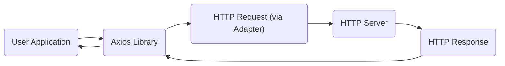
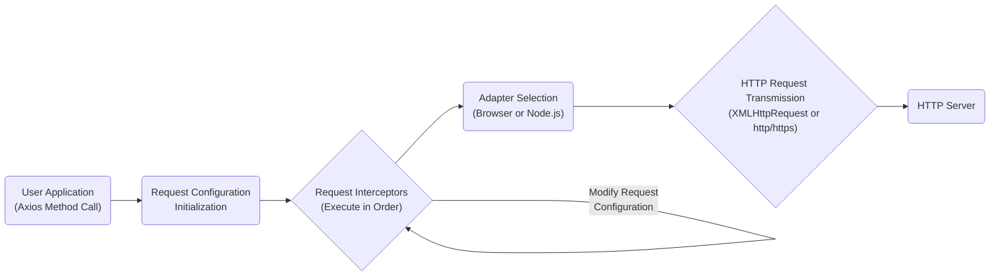
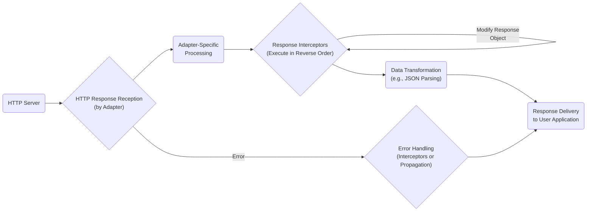

# Project Design Document: Axios HTTP Client

**Version:** 1.1
**Date:** October 26, 2023
**Author:** AI Software Architect

## 1. Introduction

### 1.1. Purpose

This document provides an enhanced and detailed design overview of the Axios HTTP client library. It elaborates on the key architectural components, data flow, and functionalities, with a specific focus on aspects relevant for identifying potential security vulnerabilities during threat modeling. This document serves as a comprehensive foundation for subsequent security analysis, risk assessment, and the development of mitigation strategies.

### 1.2. Scope

This document focuses on the internal architecture and functionality of the core Axios library. It provides a deeper dive into the components involved in constructing, sending, and processing HTTP requests and responses. The scope remains within the library's boundaries and does not extend to the applications utilizing Axios or the specific server-side implementations it interacts with.

### 1.3. Target Audience

This document is primarily intended for security architects, security engineers, penetration testers, and developers responsible for the security of applications utilizing the Axios library. It also serves as a valuable resource for anyone involved in threat modeling and security analysis of systems incorporating Axios.

## 2. System Architecture

### 2.1. High-Level Architecture

Axios acts as a crucial intermediary, providing a streamlined and consistent interface for JavaScript applications (in both browser and Node.js environments) to communicate with HTTP servers. It abstracts away the complexities of underlying HTTP mechanisms.

### 2.2. Component Breakdown

The Axios library is composed of several interconnected modules, each with a specific responsibility:

*   **Core Engine:** The central module responsible for managing the entire request lifecycle. This includes:
    *   Orchestrating the execution of interceptors.
    *   Managing request and response configuration.
    *   Delegating request dispatching to the appropriate adapter.
    *   Handling response processing and error management.
*   **Interceptors:**  Functions that provide a mechanism to intercept and modify requests before they are sent and responses after they are received. This allows for cross-cutting concerns like:
    *   **Request Interceptors:** Modifying request headers, adding authentication tokens, logging requests, and transforming request data.
    *   **Response Interceptors:** Transforming response data, handling errors globally, caching responses, and logging responses.
*   **Request Configuration Manager:** This component is responsible for:
    *   Parsing and validating user-provided configuration options (e.g., `headers`, `params`, `timeout`, `auth`, `proxy`).
    *   Merging user-defined configurations with global defaults.
    *   Preparing the final request configuration object.
*   **Dispatchers/Adapters:** Platform-specific modules that handle the actual transmission of HTTP requests. They abstract away the differences between browser and Node.js environments:
    *   **`XMLHttpRequest` Adapter (Browsers):** Utilizes the browser's built-in `XMLHttpRequest` object to make HTTP requests.
    *   **`http` and `https` Module Adapter (Node.js):** Leverages Node.js's core `http` and `https` modules for making HTTP requests. This adapter may optionally use the `follow-redirects` library.
*   **Response Handler:** This component processes the raw HTTP response received from the adapter, including:
    *   Parsing status codes and headers.
    *   Extracting the response body.
    *   Performing automatic data transformation based on the `Content-Type` header (e.g., JSON parsing).
*   **Error Handler:**  Manages errors that occur during the request lifecycle. This includes:
    *   Network errors (e.g., connection refused, DNS resolution failures).
    *   Timeout errors.
    *   HTTP error responses (status codes outside the 2xx range).
    *   Errors thrown by interceptors or adapters.
*   **Utilities (`utils`):** A collection of helper functions used throughout the library for common tasks such as:
    *   URL construction and manipulation.
    *   Header parsing and manipulation.
    *   Data serialization and deserialization.
    *   Type checking and validation.

## 3. Data Flow

### 3.1. Request Flow

The journey of an HTTP request initiated by Axios involves several distinct stages:

1. **User Application Invocation:** The application initiates an HTTP request by calling one of Axios's methods (e.g., `axios.get()`, `axios.post()`), providing the target URL and any necessary configuration options.
2. **Request Configuration Initialization:** Axios's configuration manager processes the provided options, merging them with any globally defined defaults to create a comprehensive request configuration object.
3. **Request Interceptor Chain Execution:** Registered request interceptors are executed sequentially in the order they were defined. Each interceptor has the opportunity to inspect and modify the request configuration before it's dispatched. This can include adding headers, modifying the request body, or even canceling the request.
4. **Adapter Selection and Invocation:** Based on the execution environment (browser or Node.js), the appropriate adapter is selected. The core engine then invokes the selected adapter, passing the final request configuration.
5. **HTTP Request Transmission:** The chosen adapter utilizes the platform's native HTTP capabilities (`XMLHttpRequest` in browsers or `http`/`https` modules in Node.js) to transmit the HTTP request to the target server.
6. **Server-Side Processing:** The HTTP server receives the request and processes it according to its logic.

### 3.2. Response Flow

Once the server responds, Axios processes the response through the following steps:

1. **HTTP Response Reception:** The adapter receives the raw HTTP response from the server, including the status code, headers, and body.
2. **Adapter-Specific Processing:** The adapter performs any necessary platform-specific processing of the raw response data.
3. **Response Interceptor Chain Execution:** Registered response interceptors are executed in the *reverse* order of their definition. Each interceptor can inspect and modify the response object or handle errors. This allows for tasks like transforming response data, logging, or implementing custom error handling.
4. **Data Transformation:** Axios's response handler attempts to automatically transform the response data based on the `Content-Type` header. For example, if the `Content-Type` is `application/json`, Axios will attempt to parse the response body as JSON.
5. **Response Delivery to Application:** The processed response object, containing the data, status code, headers, and the original request configuration, is returned to the calling application.
6. **Error Handling (If Applicable):** If an error occurred during any stage of the request or response processing (e.g., network error, server error, or an error thrown by an interceptor), the error is caught and potentially handled by error interceptors or propagated back to the application's error handling mechanisms.

## 4. Key Features Relevant to Security

*   **Request and Response Interceptors:** While providing flexibility, interceptors introduce potential security concerns. Malicious or poorly written interceptors could:
    *   Inject malicious headers, leading to vulnerabilities on the server-side.
    *   Modify request data in unintended ways.
    *   Leak sensitive information through logging or third-party services.
    *   Manipulate response data, potentially leading to client-side vulnerabilities.
*   **Request Cancellation:** Improperly implemented request cancellation logic in the user application could lead to race conditions or denial-of-service scenarios if not handled carefully.
*   **Automatic Data Transformation:** The automatic parsing of response data (e.g., JSON) can be a security risk if the server returns unexpected or malicious payloads that exploit vulnerabilities in the parsing logic.
*   **Client-Side Request Forgery (CSRF/XSRF) Protection:** Axios provides configuration options for setting and handling CSRF tokens, which is crucial for preventing CSRF attacks. However, the effectiveness depends on the correct implementation and server-side validation.
*   **Proxy Support:**  While useful, misconfigured proxy settings can expose sensitive data or create opportunities for man-in-the-middle attacks if the proxy itself is compromised or untrusted.
*   **Authentication Handling:** Axios supports various authentication methods. Securely storing and handling authentication credentials within the application and during transmission is paramount. Improper handling can lead to credential leakage.
*   **TLS/SSL Configuration:** Axios relies on the underlying platform's TLS/SSL implementation for secure communication over HTTPS. Ensuring proper TLS configuration, including certificate validation and cipher suite selection, is critical to prevent eavesdropping and tampering.
*   **Configuration Options:**  Various configuration options, if not understood and used correctly, can introduce security vulnerabilities. For example, disabling SSL verification or allowing insecure protocols can weaken security.

## 5. Dependencies

Axios has a minimal set of direct dependencies, primarily relying on the capabilities of the execution environment:

*   **Browsers:**  Fundamentally depends on the browser's `XMLHttpRequest` API.
*   **Node.js:**  Relies on the built-in `http` and `https` modules for making HTTP requests.
*   **`follow-redirects` (Optional):**  Used in Node.js environments to handle HTTP redirects automatically. This dependency needs to be considered for its own potential vulnerabilities.

## 6. Deployment Considerations

The security implications of using Axios are influenced by its deployment environment:

*   **Browsers:** Security is heavily dependent on the security posture of the user's browser and the website hosting the application. Cross-site scripting (XSS) vulnerabilities in the application can be leveraged to manipulate Axios requests and potentially exfiltrate data or perform actions on behalf of the user. Content Security Policy (CSP) can play a role in mitigating some risks.
*   **Node.js:** Security relies on the security of the Node.js runtime environment, any other libraries used in the application, and the server infrastructure. Securely managing API keys, secrets, and other sensitive information used in Axios requests is crucial.

## 7. Security Considerations (Detailed)

This section expands on the initial security considerations, providing more specific areas for threat modeling:

*   **Injection Attacks:**
    *   **Header Injection:** Can attackers inject malicious headers through interceptors or configuration options, potentially exploiting vulnerabilities in the target server or intermediary proxies?
    *   **URL Manipulation:** Can attackers manipulate the request URL through interceptors or configuration, leading to unintended access or actions?
    *   **Data Injection:** Can malicious data be injected into the request body through interceptors, potentially exploiting vulnerabilities in the server-side application?
*   **Man-in-the-Middle (MITM) Attacks:**
    *   **Insufficient TLS/SSL Configuration:** Is Axios configured to enforce strong TLS/SSL settings? Are there options to disable certificate validation that could be exploited?
    *   **Proxy Vulnerabilities:** If a proxy is used, is it secure? Could an attacker compromise the proxy and intercept or modify traffic?
*   **Cross-Site Scripting (XSS):**
    *   **Response Manipulation:** Could a compromised server or a MITM attacker manipulate responses in a way that, when processed by Axios and the application, leads to XSS vulnerabilities?
    *   **Interceptor Exploitation:** Could an XSS vulnerability be used to register malicious interceptors that exfiltrate data or perform unauthorized actions?
*   **Cross-Site Request Forgery (CSRF):**
    *   **Missing or Improper CSRF Token Handling:** Is the application correctly implementing and validating CSRF tokens when using Axios? Are there any bypasses in the implementation?
*   **Denial of Service (DoS):**
    *   **Resource Exhaustion:** Could an attacker send a large number of requests through Axios to overwhelm the server?
    *   **Request Cancellation Abuse:** Could vulnerabilities in the application's request cancellation logic be exploited to cause unexpected behavior or resource leaks?
*   **Data Exposure:**
    *   **Sensitive Data in Transit:** Is sensitive data being transmitted over HTTPS? Are there any configurations that could lead to unencrypted transmission?
    *   **Credential Leakage:** How are authentication credentials handled and stored within the application and during Axios requests? Could they be exposed through logging or insecure storage?
*   **Dependency Vulnerabilities:**
    *   Are there any known security vulnerabilities in Axios's direct or indirect dependencies (e.g., `follow-redirects`)?
*   **Authentication and Authorization Bypass:**
    *   Can attackers manipulate request headers or bodies through interceptors to bypass authentication or authorization checks on the server?
*   **Configuration Vulnerabilities:**
    *   Are there insecure default configurations or options that, if not properly configured, could introduce vulnerabilities?

## 8. Threat Model Inputs

This design document provides crucial information for threat modeling the Axios library and applications that utilize it. Specifically, the following aspects are key inputs for the threat modeling process:

*   **Architectural Overview:** Understanding the components and their interactions helps identify potential attack surfaces.
*   **Data Flow Diagrams:**  Visualizing the flow of requests and responses highlights where data is processed and potentially vulnerable.
*   **Component Breakdown:**  Detailed knowledge of each component's function allows for focused analysis of potential weaknesses.
*   **Key Features Relevant to Security:** This section explicitly points out features that require careful security consideration.
*   **Dependencies:** Identifying dependencies allows for assessing the overall attack surface, including third-party libraries.
*   **Deployment Considerations:** Understanding the different deployment environments helps tailor threat models to specific contexts.
*   **Security Considerations (Detailed):** This section provides a starting point for identifying potential threats and vulnerabilities.

## 9. Diagrams

The Mermaid diagrams used throughout this document are summarized below for easy reference:

**High-Level Architecture:**

**Request Flow:**

**Response Flow:**

