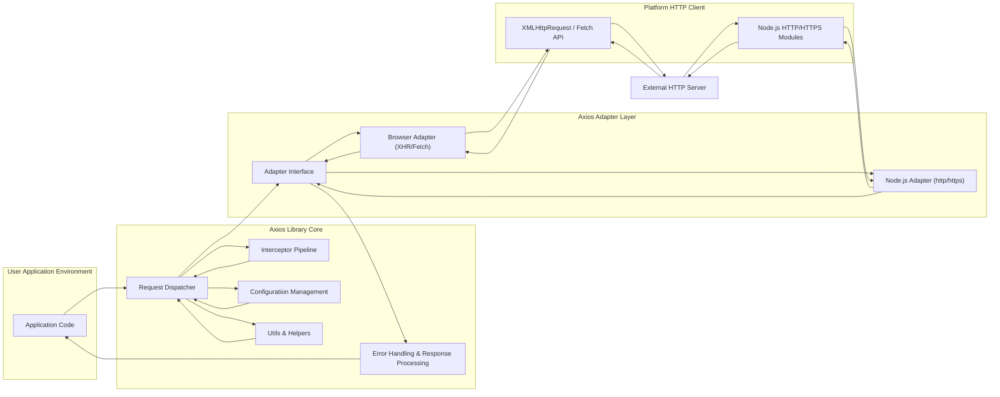
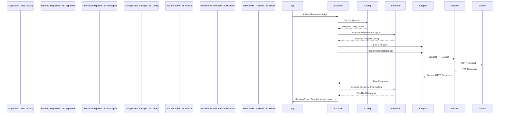

# Project Design Document: Axios HTTP Client - Enhanced

**Version:** 1.1
**Date:** October 26, 2023
**Author:** AI Software Architect

## 1. Introduction

This document provides an enhanced and more detailed design overview of the Axios HTTP client library, building upon the previous version. It further elaborates on the key architectural components, data flow, and security considerations, providing a more robust foundation for threat modeling activities.

## 2. Goals and Objectives

* Provide an even clearer and more comprehensive understanding of the Axios library's architecture and functionality.
* Detail the interactions between internal modules within the Axios Core.
* Provide a more granular description of the data flow during request and response cycles, including data transformations.
* Deepen the analysis of potential security considerations and associated risks, offering concrete examples.
* Serve as a more detailed and actionable basis for effective threat modeling and security analysis.

## 3. Architectural Overview

Axios facilitates promise-based HTTP communication for both browser and Node.js environments. Its architecture is designed for flexibility and extensibility through interceptors and custom adapters. The architecture can be visualized as a layered structure with distinct responsibilities:

* **User Application Layer:** Where developers utilize the Axios API to initiate and manage HTTP requests.
* **Axios Core Logic:** The heart of the library, managing request lifecycle, configuration, and interceptor execution. This can be further broken down internally.
* **Adapter Abstraction Layer:** Provides an interface for platform-specific HTTP request implementations.
* **Platform-Specific HTTP Client:** The underlying technology for making HTTP requests (e.g., `XMLHttpRequest`, Node.js `http` module).
* **External Network/HTTP Server:** The target server for the HTTP requests.

## 4. Component Breakdown (Detailed)

* **Application Code:**
    *  Initiates HTTP requests using Axios API methods (e.g., `axios.get()`, `axios.post()`, `axios.request(config)`).
    *  Provides request-specific configurations (URL, method, headers, data, etc.).
    *  Handles successful responses and potential errors returned by Axios.

* **Axios Core Logic:**
    * **Request Dispatcher:**
        *  Receives the initial request configuration.
        *  Orchestrates the request lifecycle.
        *  Delegates to the Interceptor Pipeline and Adapter Layer.
    * **Interceptor Pipeline:**
        *  Manages the execution of request and response interceptors.
        *  Executes request interceptors before sending the request.
        *  Executes response interceptors after receiving the response.
        *  Allows for asynchronous modification of request and response data and configuration.
    * **Configuration Management:**
        *  Stores and manages default Axios configurations.
        *  Merges request-specific configurations with defaults.
        *  Handles configuration options like `baseURL`, `headers`, `timeout`, `proxy`, authentication details, and more.
    * **Error Handling & Response Processing:**
        *  Handles errors occurring during the request process (e.g., network errors, timeouts).
        *  Provides a consistent error object structure.
        *  Processes successful responses and extracts relevant data.
        *  Allows for custom status code validation via `validateStatus`.
    * **Utils & Helpers:**
        *  Contains utility functions for tasks like header normalization, URL construction, and data transformation.

* **Axios Adapter Layer:**
    * **Adapter Interface:** Defines a common interface for different HTTP request implementations.
    * **Browser Adapter (XHR/Fetch):**
        *  Utilizes the browser's `XMLHttpRequest` API for older browsers.
        *  Can be configured to use the `Fetch` API for modern browsers.
        *  Handles browser-specific request and response handling.
    * **Node.js Adapter (http/https):**
        *  Uses Node.js's built-in `http` and `https` modules for making HTTP requests.
        *  Handles Node.js specific request and response handling, including stream management.

* **Platform HTTP Client:**
    * **XMLHttpRequest / Fetch API:** Browser APIs for making asynchronous HTTP requests. `Fetch` provides a more modern and promise-based approach.
    * **Node.js HTTP/HTTPS Modules:** Core Node.js modules providing low-level control over HTTP and HTTPS communication.

## 5. Data Flow (Detailed)

The data flow for an Axios request involves several stages and transformations:

1. **Request Configuration:** The application code provides request details (URL, method, headers, data) to an Axios API method.
2. **Configuration Merging:** Axios Core merges the provided configuration with its default settings.
3. **Request Interceptor Chain:**
    *  Request configuration passes through the registered request interceptors.
    *  Each interceptor can synchronously or asynchronously modify the configuration (e.g., adding authentication headers, transforming request data).
4. **Adapter Selection:** The Request Dispatcher selects the appropriate adapter (browser or Node.js) based on the execution environment.
5. **Platform Request Preparation:** The selected adapter prepares the request for the underlying platform HTTP client. This might involve serializing data, setting headers, etc.
6. **HTTP Request Transmission:** The platform's HTTP client sends the request over the network to the external server.
7. **Server-Side Processing:** The external server receives and processes the HTTP request.
8. **HTTP Response Generation:** The server generates an HTTP response containing a status code, headers, and a body.
9. **Platform Response Reception:** The platform's HTTP client receives the raw HTTP response.
10. **Adapter Response Handling:** The adapter receives the raw response and performs any necessary platform-specific processing.
11. **Response Interceptor Chain:**
    *  The response passes through the registered response interceptors in reverse order of registration.
    *  Each interceptor can synchronously or asynchronously modify the response data or handle errors based on the response.
12. **Error Handling or Success:**
    *  If an error occurred during the request, the promise is rejected with an error object.
    *  If the request was successful (based on status code and `validateStatus`), the promise is resolved with the response data.
13. **Application Response Handling:** The application code receives the resolved response data or handles the rejected error.

## 6. Security Considerations (Enhanced)

This section provides a more detailed examination of potential security vulnerabilities associated with Axios and applications utilizing it.

* **Client-Side Security (Browser Environment):**
    * **Cross-Site Scripting (XSS):**
        * **Risk:** If Axios is used to fetch and render untrusted HTML content without proper sanitization, malicious scripts can be injected and executed in the user's browser.
        * **Mitigation:** Sanitize data received from external sources before rendering it in the DOM. Utilize browser security features like Content Security Policy (CSP).
    * **Sensitive Data Exposure:**
        * **Risk:**  Accidental inclusion of sensitive information (API keys, tokens) in request headers or URL parameters, which could be logged or intercepted. Storing sensitive data in local storage or cookies accessible to JavaScript.
        * **Mitigation:** Avoid including sensitive data directly in URLs. Use secure storage mechanisms. Implement proper access controls on the server-side. Use HTTPS to encrypt communication.
    * **Man-in-the-Middle (MitM) Attacks:**
        * **Risk:** If HTTPS is not enforced or certificate validation is disabled, attackers can intercept and potentially modify communication between the client and server.
        * **Mitigation:** Always use HTTPS. Ensure proper SSL/TLS certificate validation is enabled (default behavior of Axios). Consider using HTTP Strict Transport Security (HSTS).
    * **Open Redirects:**
        * **Risk:** If Axios is used to construct redirect URLs based on user-controlled input without validation, attackers can redirect users to malicious sites.
        * **Mitigation:** Avoid constructing redirect URLs from user input. If necessary, implement strict validation and use a whitelist of allowed domains.
    * **DNS Rebinding:**
        * **Risk:**  Malicious websites can manipulate DNS records to make requests to internal network resources.
        * **Mitigation:** Implement mitigations on the server-side, such as checking the `Host` header or using anti-CSRF tokens. Be aware of this risk when making requests to user-provided URLs.

* **Server-Side Security (Node.js Environment):**
    * **Server-Side Request Forgery (SSRF):**
        * **Risk:** If the target URL for an Axios request is derived from untrusted user input without validation, attackers can force the server to make requests to internal services or external resources, potentially exposing sensitive information or performing unauthorized actions.
        * **Mitigation:**  Strictly validate and sanitize URLs derived from user input. Use a whitelist of allowed destination hosts or IP addresses. Avoid directly using user input to construct URLs.
    * **Denial of Service (DoS):**
        * **Risk:**  Making a large number of requests or requests with excessively large payloads can overwhelm the target server.
        * **Mitigation:** Implement rate limiting and request size limits on the server-side. Be mindful of the potential for abuse when allowing user-controlled request parameters.
    * **Injection Attacks (e.g., Header Injection):**
        * **Risk:** If request headers are constructed using untrusted input without proper sanitization, attackers might be able to inject malicious headers, potentially leading to vulnerabilities on the target server.
        * **Mitigation:** Avoid constructing headers directly from user input. If necessary, implement strict validation and sanitization.
    * **Dependency Vulnerabilities:**
        * **Risk:** Vulnerabilities in Axios itself or its dependencies could introduce security risks.
        * **Mitigation:** Regularly update Axios and its dependencies to the latest versions. Use tools to scan for known vulnerabilities.

* **Interceptor Security:**
    * **Malicious Interceptors:**
        * **Risk:** If an attacker can inject malicious interceptors (e.g., through a compromised dependency or supply chain attack), they can intercept and modify requests and responses, potentially stealing credentials, manipulating data, or redirecting users.
        * **Mitigation:**  Thoroughly vet all dependencies. Implement security checks to ensure the integrity of the application's code and dependencies. Use subresource integrity (SRI) for client-side dependencies.
    * **Accidental Data Leakage:**
        * **Risk:**  Improperly implemented interceptors might inadvertently log sensitive request or response data, exposing it in logs or monitoring systems.
        * **Mitigation:**  Carefully review interceptor implementations. Avoid logging sensitive information. Implement secure logging practices.

* **Configuration Security:**
    * **Insecure Default Configurations:**
        * **Risk:**  While Axios defaults are generally secure, applications might inadvertently override them with insecure settings.
        * **Mitigation:**  Review and understand all configuration options. Ensure secure defaults are maintained. Enforce HTTPS usage.
    * **Exposure of Configuration:**
        * **Risk:**  Storing sensitive configuration details (e.g., API keys) directly in client-side code or configuration files that are accessible.
        * **Mitigation:**  Store sensitive configuration securely using environment variables or dedicated secrets management solutions. Avoid hardcoding secrets.

* **Cookie Handling:**
    * **Risk:** Improper handling of cookies can lead to vulnerabilities like cross-site scripting (XSS) and cross-site request forgery (CSRF).
    * **Mitigation:** Ensure proper `HttpOnly`, `Secure`, and `SameSite` attributes are set for cookies. Implement CSRF protection mechanisms.

## 7. Deployment Considerations (Expanded)

The security considerations for Axios can vary depending on the deployment environment:

* **Browsers:** Client-side vulnerabilities like XSS and MitM attacks are primary concerns. CSP and HSTS are relevant mitigation strategies.
* **Node.js Applications:** SSRF, dependency vulnerabilities, and injection attacks become more prominent risks. Proper input validation and dependency management are crucial.
* **Mobile Applications (React Native):**  Similar to browser environments, but considerations for secure storage of API keys and tokens within the mobile app are important. Network security on mobile devices also needs consideration.
* **Electron Applications:**  A hybrid environment where both client-side and server-side security considerations apply, as the application bundles a Node.js environment.

## 8. Future Considerations

* **Fetch API as Default:** Transitioning to the Fetch API as the default adapter in browser environments for improved performance and alignment with web standards.
* **Enhanced Security Features:** Exploring built-in mechanisms for common security tasks like automatic header sanitization or CSRF token handling.
* **Improved Documentation for Security Best Practices:** Providing more comprehensive guidance on secure usage of Axios.
* **Regular Security Audits and Penetration Testing:**  Proactively identifying and addressing potential vulnerabilities.

## 9. Conclusion

This enhanced design document provides a more granular and detailed understanding of the Axios HTTP client library. By elaborating on the internal components, data flow, and security considerations, it serves as a more robust foundation for threat modeling. A thorough understanding of these aspects is crucial for building secure and reliable applications that utilize Axios for network communication. Continuous attention to security best practices and regular review of potential vulnerabilities are essential for maintaining the security posture of applications using this library.