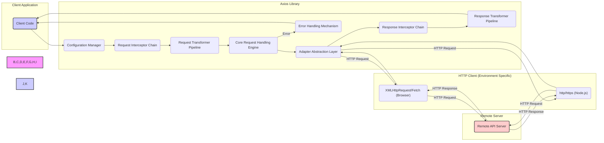

# Project Design Document: Axios HTTP Client

**Version:** 1.1
**Date:** October 26, 2023
**Author:** AI Software Architect

## 1. Introduction

This document provides an enhanced architectural design of the Axios HTTP client library. It elaborates on the key components, data flow, and security considerations to provide a more comprehensive understanding of the library's functionality and potential threat vectors. This refined document will serve as a stronger foundation for subsequent threat modeling activities.

## 2. Goals and Objectives

The primary goals of Axios are to:

* Provide a simple and intuitive API for making HTTP requests.
* Offer isomorphic capabilities, functioning seamlessly in both browser and Node.js environments.
* Implement robust features such as request and response interception, request cancellation, and automatic data transformation.
* Maintain extensibility and configurability to accommodate diverse application requirements and customization.

The objective of this design document is to provide a more granular and insightful articulation of Axios's internal workings, specifically tailored to facilitate thorough security analysis and threat identification.

## 3. Architectural Overview

Axios employs a modular and layered architecture, promoting separation of concerns and enhancing maintainability. The core functionality centers around the management of HTTP requests and responses, with well-defined extension points for customization and adaptation to different environments.

## 4. Key Components

* **Core Request Handling Engine:** The central orchestrator responsible for initiating, processing, and managing the lifecycle of HTTP requests. It coordinates the interaction between various internal components.
* **Request Interceptor Chain:** An ordered sequence of functions applied to the request configuration *before* the request is dispatched. Interceptors can modify request headers, the request body, authentication details, or even cancel the request. The order of execution is crucial.
* **Response Interceptor Chain:** An ordered sequence of functions applied to the response object *after* it's received from the server but before it's returned to the calling code. Interceptors can transform response data, handle errors globally, implement retry logic, or refresh authentication tokens. The order of execution is crucial.
* **Request Transformer Pipeline:** A series of functions that transform the request data into the appropriate format for sending to the server, based on the `Content-Type` header. Common transformations include serializing JavaScript objects to JSON or URL-encoded strings.
* **Response Transformer Pipeline:** A series of functions that transform the response data received from the server into a usable format, based on the `Content-Type` header of the response. Common transformations include parsing JSON or XML.
* **Configuration Management System:**  Manages both global default configurations and request-specific configuration options. This includes settings for base URLs, timeouts, custom headers, proxy configurations, authentication strategies, and adapter selection.
* **Error Handling Mechanism:**  Standardizes and manages error responses originating from the underlying HTTP clients (browser's `XMLHttpRequest` or `fetch` API, or Node.js's `http` and `https` modules) and Axios's internal logic.
* **Adapter Abstraction Layer:** A crucial interface that allows Axios to operate with different HTTP client implementations depending on the execution environment. This promotes environment independence.
    * **`xhr` Adapter (Browser Environment):** Leverages the browser's built-in `XMLHttpRequest` object or the more modern `fetch` API for making HTTP requests.
    * **`http` Adapter (Node.js Environment):** Utilizes Node.js's core `http` and `https` modules for handling HTTP communication.
* **Cancellation Token Mechanism:** Provides a standardized way to cancel pending HTTP requests, often used to prevent unnecessary network activity or handle component unmounting in frontend frameworks.

## 5. Data Flow

**Detailed Data Flow:**

1. **Request Initiation:** The client application (`Client Code`) initiates an HTTP request by invoking an Axios method (e.g., `axios.get()`, `axios.post()`), passing the request configuration.
2. **Configuration Retrieval and Application:** The `Configuration Manager` (`B`) retrieves and applies relevant configurations, merging global defaults with request-specific options.
3. **Request Interception:** The `Request Interceptor Chain` (`C`) processes the request configuration. Each interceptor in the chain is executed sequentially, allowing for modifications or early termination of the request.
4. **Request Transformation:** The `Request Transformer Pipeline` (`D`) transforms the request data based on the determined `Content-Type`. This typically involves serializing data into a format suitable for transmission.
5. **Core Request Handling:** The `Core Request Handling Engine` (`E`) selects the appropriate adapter based on the execution environment (browser or Node.js).
6. **Adapter Invocation:** The `Adapter Abstraction Layer` (`F`) invokes the environment-specific HTTP client (`XMLHttpRequest/Fetch` in the browser (`J`), or `http/https` in Node.js (`K`)) to dispatch the HTTP request to the `Remote API Server` (`L`).
7. **Response Reception:** The environment-specific HTTP client receives the response from the `Remote API Server` (`L`).
8. **Adapter Response Handling:** The adapter passes the raw HTTP response back to the `Adapter Abstraction Layer` (`F`).
9. **Response Interception:** The `Response Interceptor Chain` (`G`) processes the received response. Each interceptor in the chain is executed sequentially, enabling modifications or error handling.
10. **Response Transformation:** The `Response Transformer Pipeline` (`H`) transforms the response data based on the `Content-Type` header of the response. This commonly involves parsing data formats like JSON.
11. **Response Delivery:** The transformed response is returned to the originating client application (`A`).
12. **Error Handling:** If an error occurs at any stage of the process (e.g., network issues, server errors, interceptor errors), the `Error Handling Mechanism` (`I`) intercepts and processes the error, providing a standardized error object to the client application (`A`).

## 6. Security Considerations

This section provides a more detailed examination of potential security considerations relevant to Axios, forming a stronger basis for threat modeling.

* **Client-Side Cross-Site Scripting (XSS) Vulnerabilities:** If Axios is used to display untrusted data received from an API without proper encoding or sanitization, it can create XSS vulnerabilities within the client application.
* **Cross-Site Request Forgery (CSRF) Risks:** Axios, as an HTTP client, does not inherently prevent CSRF. Applications using Axios must implement CSRF mitigation strategies, such as using anti-CSRF tokens synchronized with the server.
* **Server-Side Request Forgery (SSRF) Potential:** If user-controlled input is used to construct request URLs within the application using Axios, it can be exploited to perform SSRF attacks, potentially accessing internal resources.
* **Man-in-the-Middle (MITM) Attack Surface:** Axios relies on the underlying HTTP client for secure communication over HTTPS. Misconfigurations or vulnerabilities in the environment's TLS/SSL implementation can expose data to MITM attacks. Ensure proper certificate validation and secure connection protocols are enforced.
* **Dependency Chain Vulnerabilities:** Security vulnerabilities in Axios's dependencies (even if indirect) can potentially impact the security of applications using Axios. Regular dependency scanning and updates are crucial.
* **Malicious or Insecure Request/Response Interceptors:**  Poorly written or malicious interceptors can introduce significant security risks, including:
    * **Data Leakage:** Interceptors could inadvertently log or transmit sensitive information.
    * **Request Tampering:** Interceptors could modify requests in unauthorized ways, leading to unintended actions on the server.
    * **Bypass Security Measures:** Interceptors could remove security headers or authentication tokens.
* **Configuration Security Weaknesses:** Insecure default configurations or allowing users to override critical security settings without proper validation can introduce vulnerabilities. Examples include:
    * **Insecure Default Headers:**  Default headers might expose unnecessary information.
    * **Permissive Proxy Settings:**  Misconfigured proxies could be exploited.
    * **Disabled Certificate Validation:**  Disabling certificate validation makes the application vulnerable to MITM attacks.
* **Denial of Service (DoS) Considerations:** While Axios itself might not directly introduce DoS vulnerabilities, improper handling of timeouts, large responses, or excessive request retries can contribute to DoS at the application level. Implement appropriate rate limiting and resource management.
* **Data Injection through Request Transformers:** If request transformers are not carefully implemented and validated, they could be exploited to inject malicious data into the request payload, potentially leading to server-side vulnerabilities.
* **Response Data Manipulation Risks:**  Vulnerabilities in response transformers could lead to misinterpretation or manipulation of response data, potentially causing application logic errors or security breaches. Ensure robust validation and error handling in response transformers.
* **Exposure of Sensitive Information in Error Handling:**  Detailed error messages, especially in development environments, might inadvertently expose sensitive information about the application's internal workings or server configurations. Implement appropriate error handling and logging practices for production environments.

## 7. Dependencies

Axios has minimal direct dependencies, primarily relying on the environment's native HTTP capabilities. However, understanding the security implications of these underlying components is crucial.

* **Browsers:**  Directly depends on the security and implementation of the browser's `XMLHttpRequest` or `fetch` API. Vulnerabilities in these browser APIs could indirectly affect Axios.
* **Node.js:**  Relies on the security and implementation of Node.js's built-in `http` and `https` modules, which are part of the Node.js core.

While not listed as explicit package dependencies, the security posture of the JavaScript environment itself (Node.js runtime or browser environment) is a critical consideration.

## 8. Deployment Considerations

Axios is a versatile library used in both client-side and server-side JavaScript environments. Deployment security considerations vary depending on the context.

* **Browser Environments:**
    * **Subresource Integrity (SRI):**  Use SRI tags when including Axios via `<script>` tags to ensure the integrity of the loaded library and prevent tampering.
    * **Content Security Policy (CSP):** Configure CSP headers to mitigate XSS attacks and control the resources the browser is allowed to load.
    * **Secure Delivery (HTTPS):** Ensure Axios and the application are served over HTTPS to protect against MITM attacks.
* **Node.js Environments:**
    * **Dependency Management:** Employ tools and practices for secure dependency management, including vulnerability scanning and regular updates.
    * **Environment Security:** Secure the Node.js runtime environment and the server infrastructure where the application is deployed.
    * **Secrets Management:**  Avoid hardcoding sensitive information (like API keys) in the code. Use secure environment variables or dedicated secrets management solutions.

## 9. Future Considerations

* **Enhanced Security Audits:**  Regular security audits and penetration testing can help identify and address potential vulnerabilities proactively.
* **Improved Input Validation:**  Consider adding more robust input validation mechanisms within Axios itself to prevent certain types of attacks.
* **Stricter Default Security Settings:** Evaluate the possibility of implementing stricter default security settings to encourage secure usage patterns.
* **Further Isolation of Adapters:** Explore ways to further isolate adapters to limit the impact of potential vulnerabilities within specific HTTP client implementations.

This enhanced design document provides a more detailed and security-focused understanding of the Axios HTTP client library. This comprehensive information is essential for conducting thorough threat modeling and ensuring the secure and responsible use of Axios in diverse application contexts.