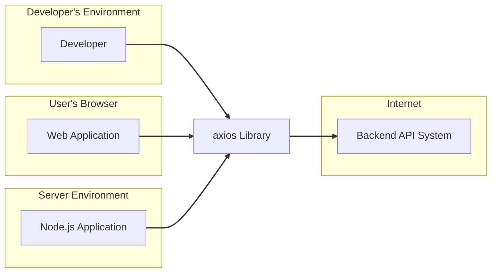
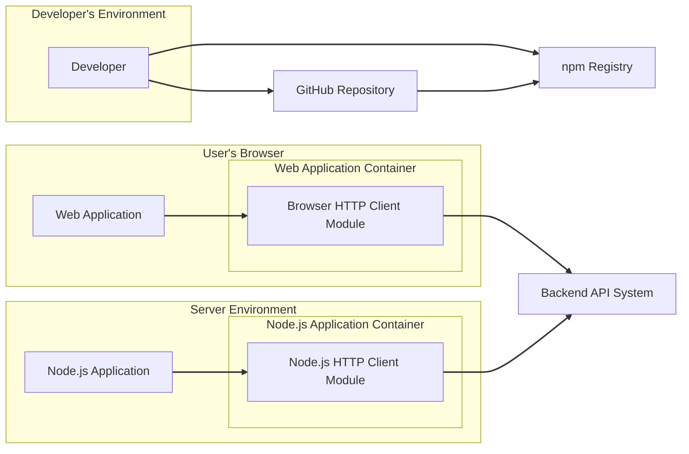
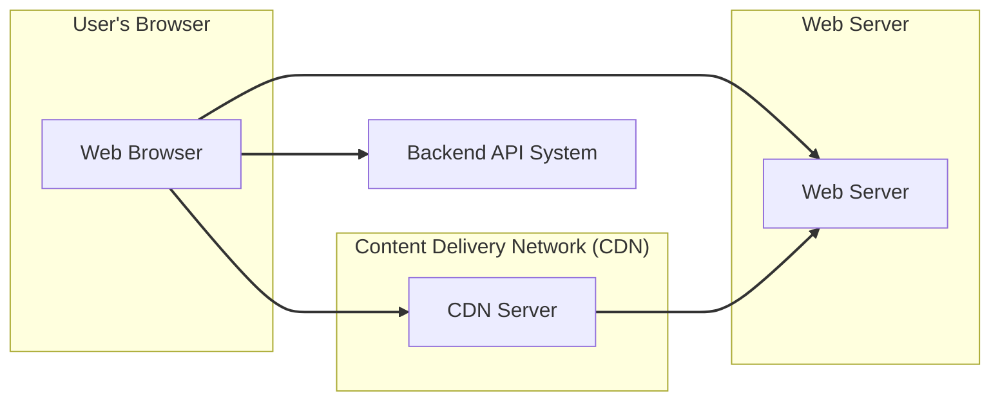

# BUSINESS POSTURE

- Business priorities and goals:
 - Provide a reliable and easy-to-use HTTP client for browsers and Node.js environments.
 - Enable developers to easily integrate HTTP communication into their applications.
 - Maintain a widely adopted and actively supported library.
 - Ensure compatibility across different JavaScript environments.
- Most important business risks:
 - Security vulnerabilities in the library could be exploited by attackers, leading to data breaches or other security incidents in applications using axios.
 - Performance issues or instability in axios could negatively impact the performance and reliability of applications using it.
 - Lack of maintenance or community support could lead to the library becoming outdated and insecure over time.
 - Compatibility issues with new JavaScript environments or browser versions could limit the usability of axios.

# SECURITY POSTURE

- Existing security controls:
 - security control: Open source code, publicly available on GitHub for community review. Implemented: GitHub repository.
 - security control: Regular updates and bug fixes contributed by maintainers and community. Implemented: GitHub repository, npm registry.
 - security control: Vulnerability reporting process via GitHub issues or security channels. Implemented: GitHub repository.
 - accepted risk: Reliance on community contributions for security vulnerability discovery and patching.
 - accepted risk: Potential for delays in security patch releases due to open-source development model.
- Recommended security controls:
 - security control: Implement automated security scanning (SAST, DAST, dependency scanning) in the CI/CD pipeline.
 - security control: Conduct regular security audits and penetration testing of the library.
 - security control: Establish a clear security policy and incident response plan.
 - security control: Promote and enforce secure coding practices among contributors.
- Security requirements:
 - Authentication: Not directly applicable to axios library itself, as it's a client. Authentication is handled by the applications using axios and the backend services they communicate with. Axios should support various authentication methods (e.g., Basic Auth, Bearer tokens) provided by backend services.
 - Authorization: Not directly applicable to axios library itself. Authorization is handled by the applications using axios and the backend services. Axios should correctly transmit authorization tokens or credentials provided by the application.
 - Input validation: Axios needs to perform input validation on configuration options and request parameters to prevent unexpected behavior or vulnerabilities. This is especially important when accepting user-provided data to configure requests.
 - Cryptography: Axios relies on underlying TLS/SSL implementations in browsers and Node.js for secure communication (HTTPS). Axios itself does not implement cryptographic algorithms but should ensure proper handling of HTTPS connections and potentially support features like certificate pinning if needed (though not a common requirement for a general HTTP client).

# DESIGN

## C4 CONTEXT



- Context Diagram Elements:
 - Element:
  - Name: Developer
  - Type: Person
  - Description: Software developers who use the axios library to make HTTP requests in their applications.
  - Responsibilities: Integrate axios into their projects, configure axios for specific HTTP requests, handle responses and errors.
  - Security controls: Secure development practices, secure coding guidelines when using axios.
 - Element:
  - Name: Web Application
  - Type: Software System
  - Description: Web applications running in users' browsers that utilize axios to communicate with backend APIs.
  - Responsibilities: Use axios to fetch data from and send data to backend services, handle user interactions and data presentation.
  - Security controls: Browser security features (CORS, CSP, Same-Origin Policy), application-level security controls (authentication, authorization, input validation).
 - Element:
  - Name: Node.js Application
  - Type: Software System
  - Description: Server-side applications built with Node.js that use axios to interact with external APIs or other services.
  - Responsibilities: Server-side logic, data processing, communication with other systems, potentially acting as a backend for web applications.
  - Security controls: Server-side security controls (authentication, authorization, input validation), network security controls, operating system security.
 - Element:
  - Name: Backend API System
  - Type: Software System
  - Description: External backend services that provide data and functionality to web and Node.js applications via HTTP APIs.
  - Responsibilities: Provide data and services, handle requests from client applications, enforce authentication and authorization, manage data storage and processing.
  - Security controls: API security controls (authentication, authorization, rate limiting, input validation), server-side security controls, database security.
 - Element:
  - Name: axios Library
  - Type: Software System
  - Description: The axios HTTP client library itself, providing functionalities to make HTTP requests.
  - Responsibilities:  Abstraction of HTTP request complexities, handling request and response lifecycle, providing a consistent API for different environments (browser and Node.js).
  - Security controls: Input validation of configurations, secure handling of HTTP requests and responses, protection against common HTTP vulnerabilities (though mostly reliant on the user's application configuration and usage).

## C4 CONTAINER



- Container Diagram Elements:
 - Element:
  - Name: Browser HTTP Client Module
  - Type: Container
  - Description: The browser-specific module within the axios library, responsible for making HTTP requests in browser environments using browser APIs like XMLHttpRequest or Fetch API.
  - Responsibilities:  Handling HTTP requests in browsers, managing browser-specific configurations and limitations (CORS), providing a consistent API to the Web Application.
  - Security controls:  Relies on browser security features, input validation of configurations, secure handling of HTTP requests and responses within the browser environment.
 - Element:
  - Name: Node.js HTTP Client Module
  - Type: Container
  - Description: The Node.js-specific module within the axios library, responsible for making HTTP requests in Node.js environments using Node.js 'http' or 'https' modules.
  - Responsibilities: Handling HTTP requests in Node.js, managing Node.js specific configurations, providing a consistent API to the Node.js Application.
  - Security controls: Relies on Node.js security features, input validation of configurations, secure handling of HTTP requests and responses within the Node.js environment.
 - Element:
  - Name: Web Application
  - Type: Container
  - Description:  The container representing the user's web application that includes and uses the Browser HTTP Client Module (axios).
  - Responsibilities: Application logic, user interface, using axios to communicate with backend APIs.
  - Security controls: Application-level security controls, browser security features.
 - Element:
  - Name: Node.js Application
  - Type: Container
  - Description: The container representing the server-side Node.js application that includes and uses the Node.js HTTP Client Module (axios).
  - Responsibilities: Server-side logic, backend processing, using axios to communicate with external services.
  - Security controls: Server-side security controls, operating system security, network security.
 - Element:
  - Name: npm Registry
  - Type: Container
  - Description: The npm package registry where the axios library is published and distributed.
  - Responsibilities: Hosting and distributing the axios package, managing versions and dependencies.
  - Security controls: npm registry security controls, package signing (if implemented).
 - Element:
  - Name: GitHub Repository
  - Type: Container
  - Description: The GitHub repository hosting the axios source code, issue tracking, and collaboration platform.
  - Responsibilities: Source code management, version control, issue tracking, community contributions, development workflow.
  - Security controls: GitHub security features (access control, branch protection), code review processes.
 - Element:
  - Name: Backend API System
  - Type: Container
  - Description: External backend services that the axios library interacts with.
  - Responsibilities: Providing API endpoints, handling requests, data storage and processing.
  - Security controls: API security controls, server-side security controls, database security.

## DEPLOYMENT

- Deployment Architectures:
 - axios library itself is not deployed as a standalone application. It is included as a dependency within other applications.
 - Deployment of applications using axios varies widely depending on the type of application (web application, Node.js server, etc.).
 - For web applications, deployment typically involves serving static files (including JavaScript bundles containing axios) from web servers or CDNs, and execution in users' browsers.
 - For Node.js applications, deployment can be on cloud platforms (AWS, Azure, GCP), virtual machines, or on-premise servers.

- Detailed Deployment (Example: Web Application Deployment using CDN):



- Deployment Diagram Elements (Web Application Deployment using CDN):
 - Element:
  - Name: Web Browser
  - Type: Deployment Environment
  - Description: User's web browser where the web application and axios library are executed.
  - Responsibilities: Rendering web application, executing JavaScript code including axios, handling user interactions.
  - Security controls: Browser security features (sandboxing, same-origin policy, etc.), user-side security practices (browser extensions, safe browsing habits).
 - Element:
  - Name: CDN Server
  - Type: Infrastructure
  - Description: Content Delivery Network server hosting static assets of the web application, including JavaScript bundles containing axios.
  - Responsibilities:  Delivering static content with high availability and performance, caching content to reduce latency.
  - Security controls: CDN security features (DDoS protection, access controls), secure configuration of CDN servers.
 - Element:
  - Name: Web Server
  - Type: Infrastructure
  - Description: Web server hosting the web application's HTML and potentially some static assets, and serving as the origin for the CDN.
  - Responsibilities: Serving web application files, handling initial requests before CDN caching, potentially serving dynamic content.
  - Security controls: Web server security hardening, access controls, TLS/SSL configuration, web application firewall (WAF).
 - Element:
  - Name: Backend API System
  - Type: Deployment Environment
  - Description: Backend API servers that the web application communicates with using axios.
  - Responsibilities: Processing API requests, managing data, enforcing business logic, providing data to the web application.
  - Security controls: API security controls, server-side security controls, database security, network security.

## BUILD

```mermaid
flowchart LR
    A[Developer] --> B{Code Changes};
    B --> C[GitHub Repository];
    C --> D[GitHub Actions CI];
    D --> E{Build & Test};
    E -- Success --> F{Security Scans (SAST, Dependency)};
    F -- Success --> G{Publish to npm Registry};
    E -- Failure --> H[Notify Developers];
    F -- Failure --> H;
    G --> I[npm Registry];

    subgraph "CI/CD Pipeline"
        D
        E
        F
        H
    end

    linkStyle 0,1,2,3,4,5,6,7,8 stroke:#333,stroke-width:2px;
```

- Build Process Description:
 - Developer makes code changes and commits them to the GitHub Repository.
 - GitHub Actions CI pipeline is triggered on code changes (e.g., push, pull request).
 - Build & Test step compiles the code, runs unit tests and integration tests to ensure code quality and functionality.
 - Security Scans step performs static application security testing (SAST) to identify potential code vulnerabilities and dependency scanning to check for vulnerable dependencies.
 - If build, tests, and security scans are successful, the library is published to the npm Registry.
 - If any step fails, developers are notified to investigate and fix the issues.

- Build Process Security Controls:
 - security control: Automated CI/CD pipeline using GitHub Actions to ensure consistent and repeatable builds. Implemented: GitHub Actions.
 - security control: Source code hosted in GitHub Repository with access controls and branch protection. Implemented: GitHub Repository.
 - security control: Automated testing (unit tests, integration tests) to ensure code quality and prevent regressions. Implemented: GitHub Actions, testing frameworks.
 - security control: Static Application Security Testing (SAST) to identify potential code vulnerabilities. Implemented: GitHub Actions, SAST tools (e.g., linters, static analysis scanners).
 - security control: Dependency scanning to identify vulnerable dependencies. Implemented: GitHub Actions, dependency scanning tools (e.g., npm audit, dependency-check).
 - security control: Publishing to npm Registry, which has its own security measures. Implemented: npm Registry.
 - security control: Code review process for pull requests to ensure code quality and security before merging. Implemented: GitHub Repository, development workflow.

# RISK ASSESSMENT

- Critical business processes we are trying to protect:
 - Secure and reliable HTTP communication for applications using axios.
 - Maintaining the integrity and availability of the axios library for the developer community.
 - Preventing vulnerabilities in axios that could be exploited in downstream applications.
- Data we are trying to protect and their sensitivity:
 - Data transmitted via HTTP requests made using axios. This data can be highly sensitive depending on the application and the API being accessed (e.g., user credentials, personal information, financial data).
 - Integrity of the axios library code itself to prevent supply chain attacks and ensure users are using a safe and trustworthy library.
 - Confidentiality of potential vulnerability information before patches are released to prevent exploitation.

# QUESTIONS & ASSUMPTIONS

- BUSINESS POSTURE:
 - Assumption: The primary business goal is to provide a widely used and trusted open-source HTTP client library.
 - Question: Are there specific business requirements or compliance standards that axios needs to adhere to (e.g., FedRAMP, HIPAA)?
 - Question: What is the acceptable level of risk for security vulnerabilities in axios? Is there a defined SLA for vulnerability patching?
- SECURITY POSTURE:
 - Assumption: Security is a high priority for the axios project, given its widespread use.
 - Question: Are there any existing security policies or guidelines for axios development?
 - Question: Is there a dedicated security team or individual responsible for security aspects of axios?
 - Question: What is the process for handling and disclosing security vulnerabilities?
- DESIGN:
 - Assumption: The design is modular, separating browser and Node.js specific functionalities.
 - Question: Are there any specific design decisions made with security in mind (e.g., input validation strategies, secure defaults)?
 - Question: Is there documentation of the internal architecture and design principles of axios?
 - Assumption: Deployment context is primarily as a library dependency, not a standalone service.
 - Question: Are there any specific deployment scenarios or environments that axios needs to explicitly support or optimize for (e.g., serverless environments)?
 - Question: What are the performance and scalability requirements for axios? Are there any design considerations related to performance and scalability?