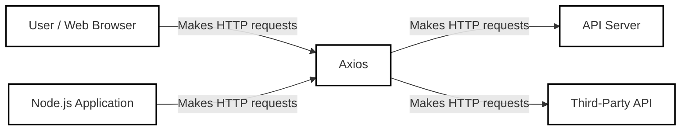
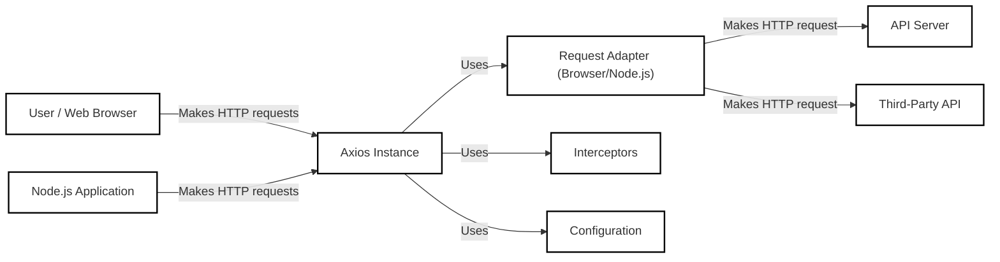
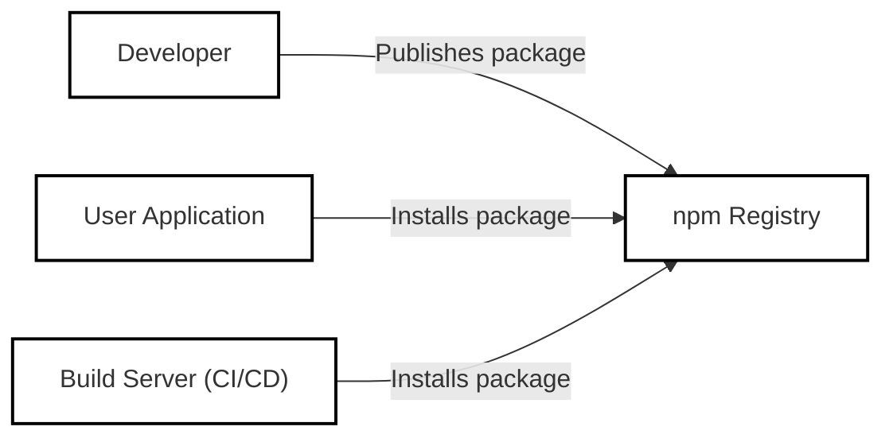
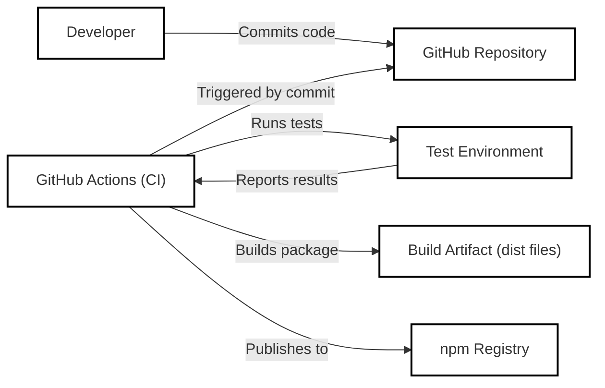

Okay, let's create a design document for the Axios project, focusing on aspects relevant for threat modeling.

# BUSINESS POSTURE

Axios is a popular, open-source, promise-based HTTP client for the browser and Node.js.  It simplifies making HTTP requests and handling responses.  Given its widespread use, the business priorities and goals can be inferred as follows:

Priorities:

*   Maintainability:  Ensure the codebase is easy to understand, modify, and extend.  This is crucial for long-term viability and community contributions.
*   Reliability:  Provide a stable and dependable HTTP client that works consistently across different environments (browsers, Node.js versions).
*   Usability:  Offer a clean and intuitive API that is easy for developers to learn and use.
*   Performance:  Minimize overhead and ensure efficient handling of HTTP requests and responses.
*   Compatibility:  Support a wide range of browsers and Node.js versions, including older ones where feasible.
*   Community Engagement: Foster a healthy and active community of users and contributors.

Goals:

*   Be the preferred HTTP client library for JavaScript developers.
*   Provide a robust and feature-rich solution for making HTTP requests.
*   Maintain a high level of quality and reliability.
*   Encourage community contributions and feedback.

Business Risks:

*   Security Vulnerabilities:  Vulnerabilities in Axios could be exploited to compromise applications that use it, potentially leading to data breaches, denial-of-service attacks, or other security incidents. This is the most significant risk, given Axios's role in handling potentially sensitive data transmitted over the network.
*   Loss of Community Trust:  Major bugs, unaddressed security issues, or a decline in maintainability could lead to a loss of trust in the project, causing developers to switch to alternative libraries.
*   Compatibility Issues:  Failure to maintain compatibility with a wide range of browsers and Node.js versions could limit the project's adoption and usefulness.
*   Performance Degradation:  Performance bottlenecks could negatively impact the performance of applications that rely on Axios.
*   Supply Chain Attacks: Compromise of the build or distribution process could lead to malicious code being injected into the Axios library.

# SECURITY POSTURE

Existing Security Controls:

*   security control: Code Reviews: Pull requests are reviewed by maintainers and contributors before being merged. (Visible on GitHub).
*   security control: Testing: Axios has a comprehensive test suite that covers various aspects of its functionality. (Visible in the `/test` directory on GitHub).
*   security control: Static Analysis: Likely use of linters (e.g., ESLint) and potentially static analysis tools to identify potential code quality and security issues. (Configuration files like `.eslintrc.js` suggest this).
*   security control: Dependency Management: Use of package managers (like npm or yarn) to manage dependencies and keep them up-to-date. (Visible in `package.json`).
*   security control: Security Policy: Axios has a `SECURITY.md` file that outlines how to report security vulnerabilities.

Accepted Risks:

*   accepted risk: Browser Compatibility Limitations: Axios may not be fully compatible with very old or obscure browsers due to limitations in those browsers' support for modern JavaScript features.
*   accepted risk: Node.js Version Support: Axios likely has a minimum supported Node.js version, and older versions may not be fully supported.
*   accepted risk: Third-Party Dependency Vulnerabilities: While Axios strives to keep its dependencies up-to-date, there's always a risk of vulnerabilities in third-party libraries.

Recommended Security Controls:

*   security control: Regular Security Audits: Conduct periodic security audits, both manual and automated, to identify potential vulnerabilities.
*   security control: Fuzz Testing: Implement fuzz testing to discover unexpected behavior and potential vulnerabilities by providing invalid or random inputs.
*   security control: Content Security Policy (CSP) Guidance: Provide clear guidance to users on how to configure CSP headers to mitigate the risk of cross-site scripting (XSS) attacks when using Axios.
*   security control: Subresource Integrity (SRI) Guidance: If distributing via CDN, provide guidance on using SRI to ensure that fetched files haven't been tampered with.
*   security control: Supply Chain Security Measures: Implement robust measures to secure the build and distribution process, such as code signing, software bill of materials (SBOM) generation, and provenance verification.

Security Requirements:

*   Authentication:
    *   Axios itself does not handle authentication directly. It provides mechanisms (like setting headers) to facilitate authentication, but the responsibility for implementing authentication protocols (e.g., OAuth, API keys, Basic Auth) lies with the application using Axios.
    *   Requirement: Provide clear documentation and examples for securely handling authentication credentials.
*   Authorization:
    *   Similar to authentication, Axios is not directly responsible for authorization. Authorization is typically handled by the server-side application.
    *   Requirement: Ensure that Axios does not inadvertently expose sensitive authorization tokens or data.
*   Input Validation:
    *   Axios should validate its own configuration options to prevent unexpected behavior or errors.
    *   Requirement: Validate user-provided configuration options (e.g., URLs, headers, data) to ensure they are well-formed and do not contain malicious content.  Specifically, guard against common web vulnerabilities like SSRF (Server-Side Request Forgery) by validating URLs.
    *   Requirement: Provide mechanisms for users to sanitize data before sending it in requests (e.g., escaping special characters).
*   Cryptography:
    *   Axios relies on the underlying platform (browser or Node.js) for HTTPS (TLS/SSL) encryption.
    *   Requirement: Ensure that Axios uses secure default settings for HTTPS connections (e.g., preferring TLS 1.2 or higher).
    *   Requirement: Provide options for users to configure TLS/SSL settings (e.g., specifying custom certificates).
*   Output Encoding:
    *   Axios should handle different response encodings (e.g., UTF-8, JSON) correctly.
    *   Requirement: Ensure that Axios properly decodes response data according to the specified encoding.
    *   Requirement: Provide options for users to specify the expected response encoding.

# DESIGN

## C4 CONTEXT

Element List:

*   Element:
    *   Name: User / Web Browser
    *   Type: User
    *   Description: A user interacting with a web application that uses Axios to make HTTP requests.
    *   Responsibilities: Initiates HTTP requests through the web application.
    *   Security controls: Browser security features (e.g., same-origin policy, CSP), user authentication.

*   Element:
    *   Name: Node.js Application
    *   Type: User
    *   Description: A server-side application using Node.js that uses Axios to make HTTP requests.
    *   Responsibilities: Initiates HTTP requests.
    *   Security controls: Server-side security controls, input validation, authentication, authorization.

*   Element:
    *   Name: Axios
    *   Type: System
    *   Description: The Axios library itself.
    *   Responsibilities: Provides an API for making HTTP requests, handling responses, and managing configurations.
    *   Security controls: Input validation, secure default settings, error handling.

*   Element:
    *   Name: API Server
    *   Type: System
    *   Description: A server-side application that provides an API for the client application to interact with.
    *   Responsibilities: Handles incoming HTTP requests, processes data, and returns responses.
    *   Security controls: Authentication, authorization, input validation, rate limiting, output encoding.

*   Element:
    *   Name: Third-Party API
    *   Type: System
    *   Description: An external API provided by a third-party service.
    *   Responsibilities: Handles incoming HTTP requests, processes data, and returns responses.
    *   Security controls: Depends on the third-party service's security measures.

## C4 CONTAINER

Element List:

*   Element:
    *   Name: User / Web Browser
    *   Type: User
    *   Description: A user interacting with a web application.
    *   Responsibilities: Initiates HTTP requests.
    *   Security controls: Browser security features.

*   Element:
    *   Name: Node.js Application
    *   Type: User
    *   Description: A server-side application using Node.js.
    *   Responsibilities: Initiates HTTP requests.
    *   Security controls: Server-side security controls.

*   Element:
    *   Name: Axios Instance
    *   Type: Container
    *   Description: A specific instance of the Axios client, created with a particular configuration.
    *   Responsibilities: Manages requests, responses, and interceptors.
    *   Security controls: Input validation, configuration validation.

*   Element:
    *   Name: Request Adapter (Browser/Node.js)
    *   Type: Container
    *   Description: Adapters that handle the actual HTTP request based on the environment (XMLHttpRequest for browsers, http/https modules for Node.js).
    *   Responsibilities: Executes the HTTP request using the appropriate underlying technology.
    *   Security controls: Relies on the security of the underlying platform (browser or Node.js).

*   Element:
    *   Name: API Server
    *   Type: System
    *   Description: A server-side application providing an API.
    *   Responsibilities: Handles requests and returns responses.
    *   Security controls: Server-side security controls.

*   Element:
    *   Name: Third-Party API
    *   Type: System
    *   Description: An external API.
    *   Responsibilities: Handles requests and returns responses.
    *   Security controls: Depends on the third-party service.

*   Element:
    *   Name: Interceptors
    *   Type: Container
    *   Description: Functions that can intercept requests and responses, allowing for modification or additional logic.
    *   Responsibilities: Modifies requests/responses, handles authentication, logging, etc.
    *   Security controls: Input validation (if modifying requests), secure handling of sensitive data.

*   Element:
    *   Name: Configuration
    *   Type: Container
    *   Description: The configuration object for the Axios instance, including base URL, headers, timeouts, etc.
    *   Responsibilities: Stores configuration settings.
    *   Security controls: Validation of configuration values.

## DEPLOYMENT

Axios is a library, not a standalone application, so it doesn't have its own deployment in the traditional sense.  It's *included* as part of other applications' deployments. However, we can describe how it's typically *distributed* and how that distribution could be secured.

Possible Distribution Solutions:

1.  npm (Node Package Manager): The most common method.  Developers install Axios via `npm install axios`.
2.  CDN (Content Delivery Network):  Axios is available on various CDNs (e.g., jsDelivr, unpkg).  This is often used for browser-based applications.
3.  Direct Download:  Developers can download the source code or pre-built files from the GitHub repository.

Chosen Solution (for detailed description): npm

Element List:

*   Element:
    *   Name: Developer
    *   Type: User
    *   Description: The Axios maintainers or contributors.
    *   Responsibilities: Develops, tests, and publishes the Axios package.
    *   Security controls: Code reviews, secure coding practices, multi-factor authentication for npm accounts.

*   Element:
    *   Name: npm Registry
    *   Type: System
    *   Description: The central repository for npm packages.
    *   Responsibilities: Stores and distributes Axios package versions.
    *   Security controls: npm's security measures (e.g., package signing, vulnerability scanning).

*   Element:
    *   Name: User Application
    *   Type: System
    *   Description: An application that uses Axios as a dependency.
    *   Responsibilities: Installs and uses Axios.
    *   Security controls: Dependency management, vulnerability scanning.

*   Element:
    *   Name: Build Server (CI/CD)
    *   Type: System
    *   Description: A server that automates the build and deployment process of the user application.
    *   Responsibilities: Installs dependencies, builds the application, and deploys it.
    *   Security controls: Secure configuration, access control, vulnerability scanning.

## BUILD

Security Controls in Build Process:

*   Code Reviews: All code changes are reviewed before being merged into the main branch.
*   Automated Testing: A comprehensive test suite is run automatically on every commit.
*   Static Analysis: Linters and potentially other static analysis tools are used to identify code quality and potential security issues.
*   Dependency Management: Dependencies are managed using npm, and their versions are tracked in `package.json` and `package-lock.json`.
*   GitHub Actions: The CI/CD pipeline is managed using GitHub Actions, which provides a secure and auditable environment for building and publishing the package.
*   npm Publish: The package is published to the npm registry, which provides additional security measures like package signing and vulnerability scanning.
*   Two-Factor Authentication (2FA): Maintainers should use 2FA for their npm accounts to prevent unauthorized access.

# RISK ASSESSMENT

Critical Business Processes:

*   Making HTTP requests: This is the core functionality of Axios. Any disruption to this process would significantly impact applications that rely on it.
*   Handling responses: Correctly processing responses from servers is crucial for data integrity and application functionality.
*   Maintaining the library: Keeping the codebase maintainable, secure, and up-to-date is essential for the long-term viability of the project.

Data Sensitivity:

*   Request Data: Axios handles data sent in HTTP requests, which may include sensitive information like API keys, authentication tokens, user data, or proprietary business data. The sensitivity depends on the specific application using Axios.  This is generally considered **HIGH** sensitivity.
*   Response Data: Axios handles data received in HTTP responses, which may also contain sensitive information. The sensitivity depends on the specific application. This is also generally considered **HIGH** sensitivity.
*   Configuration Data: Axios configuration options (e.g., base URL, headers) may contain sensitive information like API endpoints or credentials. This is **MEDIUM** to **HIGH** sensitivity.
*   Axios Source Code: The source code itself is not inherently sensitive, but vulnerabilities in the code could be exploited to compromise applications. This is **LOW** sensitivity from a data perspective, but **HIGH** from a vulnerability perspective.

# QUESTIONS & ASSUMPTIONS

Questions:

*   Are there any specific compliance requirements (e.g., GDPR, HIPAA) that applications using Axios commonly need to adhere to? This would influence guidance on data handling.
*   What is the current process for handling security vulnerability reports? Is there a bug bounty program?
*   What specific static analysis tools are currently used, beyond linters?
*   Are there any plans to implement more advanced security features, such as built-in support for request signing or mutual TLS?
*   What is the minimum supported version of Node.js and which browsers versions are officially supported?

Assumptions:

*   BUSINESS POSTURE: The Axios project prioritizes security and maintainability.
*   BUSINESS POSTURE: The Axios maintainers are responsive to security reports and address vulnerabilities promptly.
*   SECURITY POSTURE: Developers using Axios are responsible for implementing appropriate security measures in their own applications.
*   SECURITY POSTURE: Axios relies on the underlying platform (browser or Node.js) for secure communication (HTTPS).
*   DESIGN: The provided diagrams are a simplified representation of the Axios architecture and deployment process.
*   DESIGN: The build process uses GitHub Actions.
*   DESIGN: Axios is primarily distributed via npm.