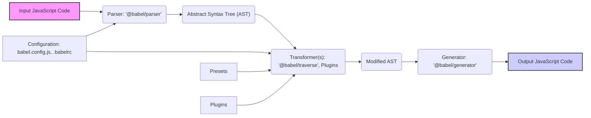

# Project Design Document: Babel

**Version:** 1.1
**Date:** October 26, 2023
**Author:** AI Software Architect

## 1. Project Overview

This document details the design of the Babel project, a crucial JavaScript compiler (or transpiler). Babel empowers developers to utilize the latest JavaScript features by converting modern JavaScript code into a backward-compatible version that can run in older browsers and environments. This transformation process is essential for ensuring broad compatibility of web applications. This document serves as a foundational resource for understanding Babel's architecture and will be the primary input for subsequent threat modeling activities.

## 2. Goals

*   Provide a precise and thorough description of Babel's architecture and its constituent components.
*   Clearly illustrate the flow of data throughout the Babel compilation pipeline.
*   Pinpoint the key interfaces and interactions within the Babel system.
*   Establish a solid foundation for identifying potential security vulnerabilities during the threat modeling process.

## 3. Target Audience

This document is intended for individuals and teams involved in the security and development lifecycle of projects utilizing Babel:

*   Security engineers responsible for threat modeling and security assessments of systems incorporating Babel.
*   Developers actively contributing to the development and maintenance of the Babel project itself.
*   Software architects designing systems that integrate with or have dependencies on Babel.

## 4. Scope

This document focuses on the core mechanics of Babel's compilation process, specifically:

*   The various sources of input code that Babel can process.
*   The central transformation pipeline, encompassing parsing, transforming, and code generation.
*   The mechanisms for configuring and customizing Babel's behavior.
*   The architecture of plugins and presets and their role in extending Babel's functionality.
*   The destinations where Babel's output code is produced.

This document explicitly excludes:

*   In-depth technical details of individual Babel plugins or presets.
*   The low-level implementation specifics of Babel's core modules.
*   The build, testing, and release procedures for the Babel project.
*   The broader ecosystem of tools and libraries that are built around and interact with Babel.

## 5. Architecture Overview

Babel's architecture is structured around a sequential pipeline that processes JavaScript code. The fundamental stages are parsing, transforming, and generating, with configuration acting as a crucial element for customizing this pipeline's behavior.

### 5.1. Key Components

*   **Input JavaScript Code:** The initial JavaScript source code that Babel is tasked with transforming. This code can originate from various locations and formats.
*   **Parser (`@babel/parser`):** The component responsible for analyzing the input JavaScript code and converting it into an Abstract Syntax Tree (AST). The AST is a hierarchical representation of the code's structure.
*   **Abstract Syntax Tree (AST):** An intermediate, tree-like data structure representing the syntactic structure of the JavaScript code. This structured format facilitates analysis and manipulation by subsequent stages.
*   **Transformer(s) (`@babel/traverse`, Plugins):** This stage involves navigating the AST and applying transformations based on the plugins and presets configured for the project. `@babel/traverse` provides the mechanism for efficiently walking through the AST, while plugins define the specific transformations to be applied to the AST nodes.
*   **Presets:** Bundles of pre-configured plugins that offer a convenient way to apply common sets of transformations, such as those required for targeting specific ECMAScript versions or runtime environments.
*   **Plugins:** Individual, modular units of code that define specific transformations to be applied to the AST. They contain the core logic for modifying the code's structure and syntax.
*   **Generator (`@babel/generator`):** The component that takes the transformed AST and converts it back into valid JavaScript code. This is the final output of the Babel compilation process.
*   **Configuration (`babel.config.js`, `.babelrc`):** Files that dictate how Babel should operate, including specifying which presets and plugins to utilize, along with other customization options. These configuration files can be located at different levels within a project's directory structure, influencing Babel's behavior at different scopes.

## 6. Detailed Component Descriptions

### 6.1. Input JavaScript Code

*   **Description:** The raw JavaScript code that Babel will process and transform.
*   **Sources:**
    *   Files residing on the local file system.
    *   JavaScript code provided as strings through Babel's programmatic API.
    *   Code received as streams from other processes or external sources.
*   **Security Considerations:**
    *   The potential for malicious input code to exploit vulnerabilities within the parser or subsequent transformation stages. For example, crafted input could trigger excessive resource consumption or unexpected behavior.

### 6.2. Parser (`@babel/parser`)

*   **Description:**  Analyzes the input JavaScript code and constructs an Abstract Syntax Tree (AST) representing its structure.
*   **Functionality:**
    *   Performs lexical analysis, breaking down the code into tokens.
    *   Conducts syntactic analysis, building the AST based on the grammar of JavaScript.
    *   Provides error reporting for instances of invalid JavaScript syntax.
*   **Security Considerations:**
    *   Vulnerabilities within the parser could lead to denial-of-service (DoS) attacks if it's possible to provide input that causes the parser to crash or consume excessive resources.
    *   In more severe cases, parser vulnerabilities could potentially be exploited for remote code execution (RCE) if processing untrusted input.
    *   Bugs in the parser's logic might result in the generation of an incorrect or malformed AST, which could be subsequently exploited by malicious plugins during the transformation phase.

### 6.3. Abstract Syntax Tree (AST)

*   **Description:** A tree-structured representation of the JavaScript code's syntax. Each node in the tree corresponds to a specific construct in the code, such as variables, functions, or expressions.
*   **Usage:** The AST serves as the central data structure that the transformer stage operates on, allowing for programmatic analysis and manipulation of the code's structure.
*   **Security Considerations:**
    *   While the AST itself doesn't execute code, a deliberately malformed or unexpected AST could potentially cause issues or unexpected behavior in the transformer or generator stages, especially in custom or less robust plugins.

### 6.4. Transformer(s) (`@babel/traverse`, Plugins)

*   **Description:** This stage modifies the AST based on the configuration specified by plugins and presets. `@babel/traverse` provides the mechanism for efficiently visiting and manipulating nodes within the AST.
*   **Functionality:**
    *   Provides the ability to traverse the AST in a structured manner.
    *   Allows plugins to identify specific nodes that require transformation based on their defined logic.
    *   Enables plugins to modify, add, or remove nodes within the AST, effectively altering the code's structure.
*   **Security Considerations:**
    *   **Malicious Plugins:** Plugins, being essentially arbitrary JavaScript code executed within the Babel process, represent a significant potential attack vector. A malicious or compromised plugin could perform a wide range of harmful actions during the build process, including:
        *   Injecting malicious code directly into the output JavaScript, leading to cross-site scripting (XSS) vulnerabilities in web applications.
        *   Reading sensitive data from the environment variables or the file system.
        *   Modifying or deleting files on the file system, potentially disrupting the build process or compromising the system.
        *   Exfiltrating sensitive data to external locations.
    *   **Plugin Vulnerabilities:** Even well-intentioned plugins might contain bugs or vulnerabilities that could be exploited. For instance, a plugin might incorrectly handle certain AST structures, leading to unexpected code generation or security flaws.

### 6.5. Presets

*   **Description:** Collections of plugins bundled together to provide a convenient way to apply common sets of transformations.
*   **Functionality:** Simplify Babel configuration by grouping related plugins, making it easier to target specific JavaScript versions or environments.
*   **Security Considerations:** Similar to individual plugins, compromised or malicious presets can introduce significant security risks, as they can include malicious plugins within their bundle. The widespread use of popular presets means that a compromise could have a broad impact.

### 6.6. Plugins

*   **Description:** Individual modules that define specific code transformations to be applied during the Babel compilation process.
*   **Functionality:** Implement the core logic for transforming the AST, enabling features like syntax down-leveling, code optimization, and custom language extensions.
*   **Security Considerations:** As previously emphasized, plugins are a critical area for security consideration due to their ability to execute arbitrary code during the build process. The security of the entire build process heavily relies on the trustworthiness and security of the plugins used.

### 6.7. Generator (`@babel/generator`)

*   **Description:** Takes the transformed AST and converts it back into readable JavaScript code.
*   **Functionality:**
    *   Traverses the modified AST.
    *   Generates the corresponding JavaScript syntax based on the AST nodes.
    *   Handles code formatting (e.g., indentation, spacing) and the generation of source maps for debugging.
*   **Security Considerations:**
    *   Bugs or vulnerabilities in the generator could lead to the generation of incorrect or insecure JavaScript code, even if the transformation stage was intended to improve security.
    *   If the AST has been maliciously manipulated by a compromised plugin, the generator will faithfully output the compromised code, effectively propagating the attack.

### 6.8. Configuration (`babel.config.js`, `.babelrc`)

*   **Description:** Files that specify how Babel should operate, including the selection of presets and plugins, and various other options that customize the compilation process.
*   **Functionality:**
    *   Loading and parsing configuration files to determine Babel's behavior.
    *   Resolving and loading the specified plugins and presets.
    *   Providing options to fine-tune the compilation process, such as specifying target environments or enabling specific transformations.
*   **Security Considerations:**
    *   **Configuration Injection:** If an attacker can gain control over the contents of the Babel configuration files (e.g., through a compromised development environment or a vulnerability in the deployment process), they can force Babel to load malicious plugins or modify compilation settings to introduce vulnerabilities into the generated code.
    *   **Dependency Confusion:** If the plugin or preset names in the configuration can be manipulated, it might be possible to trick Babel into loading malicious packages from public repositories that have similar names to legitimate ones (a supply chain attack). This highlights the importance of verifying the integrity and source of dependencies.

## 7. Data Flow

The typical flow of data through the Babel compilation process can be broken down into the following steps:

1. **Input:** JavaScript code is provided to Babel, either as files, strings, or streams.
2. **Parsing:** The `@babel/parser` component analyzes the input code and constructs an Abstract Syntax Tree (AST) representing its structure.
3. **Transformation:**
    *   Babel loads the configured plugins and presets based on the settings in the `babel.config.js` or `.babelrc` files.
    *   The `@babel/traverse` module systematically walks through the nodes of the AST.
    *   Each loaded plugin has the opportunity to inspect the current node and apply transformations based on its defined logic.
    *   Transformations are applied to the AST, modifying its structure and content according to the active plugins.
4. **Generation:** The `@babel/generator` component takes the modified AST and converts it back into valid, formatted JavaScript code.
5. **Output:** The transformed JavaScript code is produced as the final output of the Babel compilation process.

## 8. Key Technologies

*   **JavaScript:** The primary programming language used for developing Babel itself, its plugins, and the code it processes.
*   **Node.js:** The runtime environment in which Babel typically operates, leveraging its package management and execution capabilities.
*   **npm/Yarn/pnpm:** Popular package managers used to install, manage, and distribute Babel and its associated dependencies (plugins, presets).

## 9. Deployment Model

Babel is predominantly utilized as a development-time tool integrated into various build pipelines. Common deployment models include:

*   **Command-line interface (CLI):** Direct execution of Babel from the terminal for on-demand compilation.
*   **Build tools (Webpack, Rollup, Parcel):** Integration as a loader or plugin within module bundlers to process JavaScript files during the build process.
*   **Task runners (Gulp, Grunt):**  Incorporation as a task within automation tools to streamline the compilation workflow.
*   **Direct API usage:** Embedding Babel directly into other Node.js applications for programmatic code transformation.

## 10. Security Considerations (For Threat Modeling)

Based on the architectural overview and component descriptions, the following security considerations are crucial for subsequent threat modeling activities:

*   **Supply Chain Security Risks:** The heavy reliance on external plugins and presets introduces significant supply chain vulnerabilities. Compromised or intentionally malicious packages hosted on public repositories could be inadvertently included in a project's dependencies, leading to potential compromise during the build process.
*   **Threat of Malicious Plugins:** As repeatedly highlighted, malicious plugins represent a substantial security risk due to their ability to execute arbitrary code within the Babel process. This could lead to code injection, data exfiltration, or system compromise.
*   **Vulnerabilities in Configuration:** The Babel configuration files (`babel.config.js`, `.babelrc`) are potential targets for attackers. If an attacker can manipulate these files, they can force the inclusion of malicious plugins or alter compilation settings to introduce vulnerabilities.
*   **Parser Vulnerabilities:** Bugs or weaknesses in the `@babel/parser` component could be exploited by providing specially crafted malicious input code, potentially leading to denial-of-service or, in more severe cases, remote code execution.
*   **Importance of Input Validation:** While Babel primarily processes JavaScript code, ensuring robust handling of potentially malicious or unexpected input is crucial to prevent exploitation of vulnerabilities in the parser or transformation stages.
*   **Permissions and Access Control:** The Babel process often requires access to the file system (to read source code and write output) and environment variables. Malicious plugins could potentially abuse these permissions to compromise the system if not properly managed.
*   **Dependency Management Practices:**  Poor dependency management practices, such as not pinning dependency versions or failing to regularly audit dependencies for known vulnerabilities, can increase the risk of incorporating vulnerable or malicious plugins.

This document provides a comprehensive design overview of the Babel project, serving as a critical foundation for conducting a thorough and effective threat modeling exercise to identify and mitigate potential security vulnerabilities. The identified security considerations will be further explored and analyzed during the threat modeling process.
