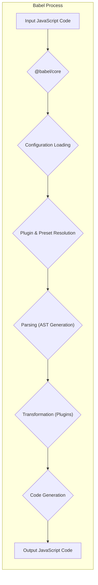
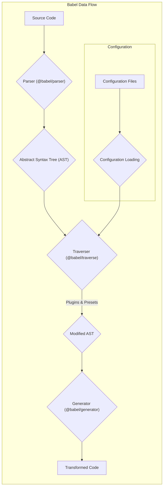

# Project Design Document: Babel

**Version:** 1.1
**Date:** October 26, 2023
**Author:** AI Software Architect

## 1. Introduction

This document provides an enhanced design overview of the Babel project, a widely adopted JavaScript compiler. It elaborates on the system's architecture, key components, data flow, and security considerations, providing a robust foundation for subsequent threat modeling activities.

Babel is a versatile toolchain primarily employed to transpile ECMAScript 2015+ code into a backward-compatible form of JavaScript, ensuring execution across older JavaScript engines. Furthermore, it offers extensive code transformation capabilities through a plugin-based system, enabling features like JSX support, TypeScript compilation, and custom code modifications.

## 2. Goals and Objectives

The fundamental goals driving the development and maintenance of Babel are:

*   **Robust JavaScript Transpilation:** Accurately and reliably convert modern JavaScript syntax to older, broadly supported versions, ensuring consistent behavior across environments.
*   **Flexible Extensibility:** Provide a well-defined and accessible plugin system that empowers developers to create custom code transformations tailored to specific needs.
*   **Comprehensive Configuration:** Offer a rich set of configuration options, allowing users to precisely control the compilation process and adapt Babel to diverse project requirements.
*   **Optimized Performance:**  Maintain efficient and performant code transformation to minimize build times and resource consumption.
*   **Codebase Maintainability:**  Uphold a well-structured, modular, and thoroughly documented codebase to facilitate ongoing development, debugging, and community contributions.

## 3. Target Audience

This document is primarily intended for:

*   Security engineers tasked with performing threat modeling and security assessments of systems utilizing Babel.
*   Developers actively contributing to the Babel project, requiring a deep understanding of its architecture and components.
*   Software architects designing systems that integrate with or depend on Babel's functionality.
*   Technical stakeholders seeking a comprehensive understanding of Babel's internal workings and design principles.

## 4. High-Level Architecture

Babel's architecture is centered around a core compiler engine that ingests JavaScript code and applies a series of transformations based on user-defined configurations, plugins, and presets.

**Detailed Explanation:**

*   **Input JavaScript Code:** The initial source code file or string that Babel will process. This can be modern JavaScript syntax, TypeScript, or code containing JSX.
*   **`@babel/core`:** This is the central package and the heart of Babel. It orchestrates the entire compilation process, including parsing, transformation, and code generation.
*   **Configuration Loading:** Babel reads and interprets configuration settings from various sources, including dedicated configuration files (e.g., `.babelrc`, `babel.config.js`), and the `package.json` file. These configurations dictate which plugins and presets to apply and how.
*   **Plugin & Preset Resolution:** Based on the loaded configuration, Babel identifies and loads the specified plugins and presets. Presets are essentially collections of plugins, offering a convenient way to apply common sets of transformations.
*   **Parsing (AST Generation):** The input JavaScript code is fed into the parser (`@babel/parser`), which analyzes the code's syntax and structure, generating an Abstract Syntax Tree (AST). The AST is a hierarchical representation of the code, making it easier for transformations to operate on.
*   **Transformation (Plugins):** This is where the core logic of Babel's extensibility comes into play. Loaded plugins traverse the AST, identifying specific patterns and applying transformations according to their defined logic. Each plugin focuses on a particular type of transformation (e.g., converting arrow functions, handling JSX).
*   **Code Generation:** After all specified transformations have been applied, the transformed AST is passed to the code generator (`@babel/generator`). This component takes the modified AST and converts it back into valid JavaScript code.
*   **Output JavaScript Code:** The final output of the Babel process, which is the transpiled or transformed JavaScript code, ready to be executed in the target environment.

## 5. Key Components

Babel's functionality is distributed across several key packages and concepts:

*   **`@babel/core`:** The fundamental package providing the core compilation engine, including the parser, transformer, and generator functionalities.
*   **`@babel/cli`:** A powerful command-line interface enabling developers to execute Babel directly from the terminal for individual file compilation or batch processing.
*   **`@babel/preset-env`:** An intelligent preset that dynamically determines the necessary transformations based on the target environment (browsers or Node.js versions) specified in the configuration, simplifying the process of supporting different JavaScript environments.
*   **`@babel/preset-react`:** A pre-configured preset containing all the plugins required to correctly process React's JSX syntax, making it easier to use React with Babel.
*   **`@babel/preset-typescript`:**  A preset designed for seamless compilation of TypeScript code, leveraging Babel's transformation pipeline to convert TypeScript syntax into standard JavaScript.
*   **Individual Plugins (e.g., `@babel/plugin-transform-arrow-functions`, `@babel/plugin-proposal-class-properties`):**  Discrete modules responsible for performing specific, targeted code transformations. Each plugin focuses on a particular language feature or syntax modification.
*   **Presets (e.g., `@babel/preset-es2015`, `@babel/preset-flow`):** Collections of related plugins bundled together for convenience, allowing users to apply groups of transformations with a single configuration entry.
*   **Configuration Files (`.babelrc`, `babel.config.js`, within `package.json`):** Files that dictate Babel's behavior. They specify which presets and plugins to use, along with other options that customize the compilation process. `babel.config.js` offers more programmatic configuration capabilities.
*   **Parser (`@babel/parser`, formerly known as `Babylon`):** The component responsible for the initial step of the compilation process – taking the raw JavaScript code and converting it into a structured Abstract Syntax Tree (AST).
*   **Traverser (`@babel/traverse`):** Provides utilities and methods for efficiently navigating and manipulating the nodes within the AST. Plugins utilize the traverser to inspect and modify the code's structure.
*   **Generator (`@babel/generator`):** Takes the transformed AST as input and converts it back into readable and executable JavaScript code. It handles formatting and ensures the output code is syntactically correct.

## 6. Data Flow

The movement and transformation of data within the Babel system follow a well-defined path:

**Step-by-Step Breakdown:**

*   **Source Code:** The initial JavaScript, TypeScript, or JSX code that needs to be processed by Babel.
*   **Parser (`@babel/parser`):** This component receives the source code as input and performs lexical analysis and syntactic analysis to construct the Abstract Syntax Tree (AST). The AST represents the code's structure in a tree-like format.
*   **Abstract Syntax Tree (AST):** A tree-like representation of the source code's structure. Each node in the tree represents a construct in the code, such as variables, functions, expressions, etc. This structured representation allows for programmatic manipulation of the code.
*   **Traverser (`@babel/traverse`):** The traverser is used to walk through the AST, visiting each node in a specific order. This allows plugins to inspect and modify the AST nodes.
*   **Plugins & Presets:** Based on the loaded configuration, the specified plugins and presets are applied during the traversal process. Plugins contain the logic for specific code transformations. They examine AST nodes and make modifications as needed (e.g., changing syntax, adding or removing nodes).
*   **Modified AST:** The AST after all the configured plugins have performed their transformations. The structure of the AST may have been significantly altered depending on the applied plugins.
*   **Generator (`@babel/generator`):** This component takes the modified AST and converts it back into a string of JavaScript code. It handles tasks like adding semicolons, managing whitespace, and ensuring the output code is syntactically valid.
*   **Transformed Code:** The final output, which is the transpiled or transformed JavaScript code that can be executed in the target environment.
*   **Configuration Files:** These files (`.babelrc`, `babel.config.js`, `package.json`) contain the settings that control the entire process, specifying which parser to use (if alternatives exist), which plugins and presets to load, and other transformation options.
*   **Configuration Loading:** The initial step where Babel reads and interprets the configuration files to determine how the compilation process should proceed. The loaded configuration guides the plugin and preset resolution.

## 7. Security Considerations

Security is a crucial aspect to consider when utilizing Babel, particularly due to its plugin-based architecture and integration into build processes.

*   **Dependency Vulnerabilities (Supply Chain Attacks):** Babel relies on a vast ecosystem of plugins and presets distributed through package managers like npm. Malicious actors could potentially introduce vulnerabilities by compromising these dependencies.
    *   **Risk:** Introduction of malicious code into the build process, potentially leading to compromised applications or developer environments.
    *   **Mitigation Strategies:**
        *   Regularly audit project dependencies using security scanning tools (e.g., `npm audit`, `yarn audit`, Snyk).
        *   Pin dependency versions in `package.json` to prevent unexpected updates that might introduce vulnerabilities.
        *   Carefully vet and choose well-maintained and reputable plugins and presets.
        *   Consider using a private registry for internal plugins to control their distribution.
*   **Malicious Plugins:** Plugins have direct access to the AST and can perform arbitrary code transformations. A malicious plugin could inject harmful code, alter program logic, or exfiltrate sensitive information during the build process.
    *   **Risk:** Code injection, arbitrary code execution during build time, information disclosure.
    *   **Mitigation Strategies:**
        *   Exercise extreme caution when adding third-party plugins. Thoroughly research and understand the plugin's functionality and maintainer.
        *   Review the source code of plugins, especially those with broad permissions or those performing complex transformations.
        *   Implement mechanisms to restrict plugin capabilities or sandbox their execution (though this is currently challenging with Babel's architecture).
        *   Consider code signing for internally developed plugins to ensure their integrity.
*   **Configuration Exploitation:** Incorrectly configured Babel settings or the presence of malicious configuration files could lead to unintended code transformations, potentially introducing vulnerabilities or exposing sensitive data.
    *   **Risk:** Unexpected behavior leading to security flaws, information disclosure through unintended transformations.
    *   **Mitigation Strategies:**
        *   Implement strict access controls for Babel configuration files.
        *   Regularly review and audit Babel configurations to ensure they align with security best practices.
        *   Avoid overly permissive configurations that might enable unintended transformations.
        *   Consider using environment variables or secure vaults for sensitive configuration parameters.
*   **Input Validation Weaknesses:** While Babel primarily processes JavaScript code, vulnerabilities could arise if the parser or transformers are susceptible to specially crafted or malicious input that could cause crashes, infinite loops, or other unexpected behavior.
    *   **Risk:** Denial of service, potential for more serious vulnerabilities if parsing errors can be exploited.
    *   **Mitigation Strategies:**
        *   Employ robust parsing logic and thorough error handling within the `@babel/parser`.
        *   Conduct fuzz testing on the parser with a wide range of valid and invalid JavaScript code to identify potential vulnerabilities.
        *   Stay updated with the latest versions of Babel and its dependencies, as security patches often address parsing vulnerabilities.
*   **Compromised Build Environment:** If the environment where Babel is executed (e.g., developer machines, CI/CD pipelines) is compromised, attackers could potentially tamper with the build process, inject malicious code through plugins or configurations, or modify the output artifacts.
    *   **Risk:** Introduction of malicious code into the final application, compromising the integrity of the software supply chain.
    *   **Mitigation Strategies:**
        *   Secure development machines and CI/CD pipelines with strong authentication, authorization, and regular security updates.
        *   Implement integrity checks for build artifacts to detect any unauthorized modifications.
        *   Use isolated and ephemeral build environments to minimize the impact of potential compromises.
        *   Employ code signing for build outputs to verify their authenticity and integrity.
*   **Source Code Manipulation:**  If the source code being processed by Babel is tampered with before or during the compilation process, vulnerabilities can be introduced.
    *   **Risk:** Introduction of malicious code, bypassing security controls.
    *   **Mitigation Strategies:**
        *   Implement secure source code management practices with version control and access controls.
        *   Use code review processes to identify potentially malicious changes.
        *   Consider static analysis tools to detect security vulnerabilities in the source code before compilation.

## 8. Deployment

Babel is typically integrated into the development workflow of JavaScript projects. Common deployment methods include:

*   **Local Project Dependency:** The most common approach, where Babel and its related packages are installed as `devDependencies` within a project's `package.json`. This ensures that the correct versions of Babel are used for that specific project.
*   **Global Installation (for `@babel/cli`):** The `@babel/cli` can be installed globally on a developer's machine to provide command-line access to Babel's compilation functionalities for quick testing or individual file processing. However, for project-specific builds, local installation is generally preferred for version control and consistency.
*   **Integration with Build Tools:** Babel is frequently integrated into build processes using popular JavaScript build tools like Webpack, Parcel, Rollup, and others. These tools orchestrate the build process, invoking Babel programmatically to transpile and transform code as part of the build pipeline.

## 9. Technologies Used

*   **JavaScript:** The primary programming language that Babel processes and is also the language in which Babel itself is primarily written.
*   **Node.js:** The runtime environment required to execute Babel and its command-line interface.
*   **npm, Yarn, pnpm:** Package managers used for installing and managing Babel and its dependencies within JavaScript projects.

## 10. Future Considerations

*   **Enhanced Plugin Isolation and Sandboxing:** Investigating and implementing mechanisms to provide better isolation and sandboxing for plugin execution. This could involve running plugins in separate processes or using virtualized environments to limit their access and potential impact.
*   **Improved Security Auditing Tools and Integrations:** Developing or integrating with tools that can automatically analyze Babel configurations, plugin usage, and dependency trees for potential security vulnerabilities and misconfigurations.
*   **Formal Security Reviews and Penetration Testing:** Conducting regular, in-depth security reviews and penetration testing of the Babel codebase to proactively identify and address potential security weaknesses.
*   **Standardized Plugin Security Best Practices and Guidelines:** Establishing clear guidelines and best practices for plugin developers to promote the creation of secure and trustworthy plugins. This could include recommendations for input validation, secure coding practices, and vulnerability disclosure processes.
*   **Consideration of a Security Policy:**  Publishing a clear security policy outlining how vulnerabilities should be reported and addressed within the Babel project.

This improved document provides a more detailed and comprehensive overview of the Babel project's design, with a stronger emphasis on security considerations. It aims to equip security engineers and other stakeholders with the necessary information for effective threat modeling and risk assessment.