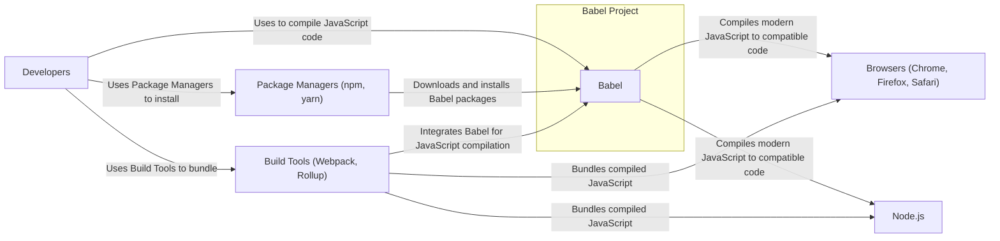
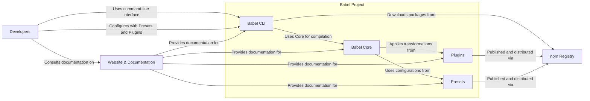
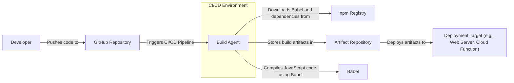

# BUSINESS POSTURE

- Business Priorities and Goals:
  - Enable developers to use the latest JavaScript language features across different environments (browsers, Node.js, etc.).
  - Maintain compatibility and stability for existing JavaScript codebases.
  - Provide a flexible and extensible platform for JavaScript transformation through plugins and presets.
  - Foster a strong and active open-source community around Babel.
- Business Risks:
  - Risk of introducing vulnerabilities in the Babel compiler that could affect a vast number of JavaScript projects relying on it.
  - Risk of supply chain attacks through compromised dependencies or build processes.
  - Risk of performance regressions impacting developer productivity and application performance.
  - Risk of compatibility issues leading to broken applications and developer frustration.
  - Risk of reputational damage if Babel is perceived as unreliable or insecure.

# SECURITY POSTURE

- Existing Security Controls:
  - security control: Open source code review by a large community. Implemented on GitHub through pull requests and issue tracking.
  - security control: Dependency scanning using automated tools. Implemented through GitHub dependency graph and potentially integrated into CI.
  - security control: Regular updates to dependencies. Implemented through automated dependency update tools and manual updates by maintainers.
  - security control: Code linters and static analysis tools used during development. Implemented in developer environments and potentially in CI pipelines.
- Accepted Risks:
  - accepted risk: Vulnerabilities might be discovered and publicly disclosed before a patch is available due to the open-source nature of the project.
  - accepted risk: Reliance on community contributions may introduce potential security flaws if contributions are not thoroughly reviewed.
  - accepted risk: Complexity of JavaScript language and transformations increases the attack surface and potential for subtle vulnerabilities.
- Recommended Security Controls:
  - security control: Implement a formal security vulnerability disclosure and response process.
  - security control: Conduct regular security audits and penetration testing, especially for core compiler components.
  - security control: Integrate fuzzing into CI pipelines to automatically detect parsing and transformation vulnerabilities.
  - security control: Implement Software Bill of Materials (SBOM) generation as part of the build process to improve supply chain transparency.
  - security control: Enforce stricter code review processes with a focus on security considerations.
- Security Requirements:
  - Authentication: Not directly applicable to the core Babel compiler functionality. Authentication might be relevant for any associated web services or infrastructure (e.g., website, documentation).
  - Authorization: Not directly applicable to the core Babel compiler functionality. Authorization might be relevant for access control to any associated web services or infrastructure.
  - Input Validation: Critical for Babel compiler. Babel must robustly validate and sanitize input JavaScript code to prevent code injection, denial-of-service, or other vulnerabilities during parsing and transformation. Input validation should be implemented at various stages of the compilation process, especially when handling user-provided code or configuration.
  - Cryptography: Not directly applicable to the core Babel compiler functionality. Cryptography might be relevant for secure communication if Babel project involves web services or secure storage of sensitive data (e.g., API keys for integrations, though unlikely in this project).

# DESIGN

## C4 CONTEXT

- Context Diagram Elements:
  - - Name: Babel
    - Type: Software System
    - Description: JavaScript compiler that transforms modern JavaScript code into backward-compatible versions of JavaScript that can run in older JavaScript environments.
    - Responsibilities:
      - Parse JavaScript code.
      - Transform JavaScript code based on configured presets and plugins.
      - Generate compatible JavaScript code.
    - Security controls:
      - security control: Input validation of JavaScript code.
      - security control: Static analysis and fuzzing during development.
      - security control: Secure coding practices.
  - - Name: Developers
    - Type: Person
    - Description: Software developers who use Babel to compile their JavaScript code.
    - Responsibilities:
      - Write modern JavaScript code.
      - Configure Babel for their projects.
      - Integrate Babel into their development workflows.
    - Security controls:
      - security control: Secure development practices on their local machines.
      - security control: Following secure configuration guidelines for Babel.
  - - Name: Package Managers (npm, yarn)
    - Type: Software System
    - Description: Package managers used by developers to download and install Babel packages and its dependencies.
    - Responsibilities:
      - Provide a repository for Babel packages.
      - Manage package dependencies.
      - Install and update Babel packages.
    - Security controls:
      - security control: Package integrity checks (checksums).
      - security control: Vulnerability scanning of packages in repositories.
  - - Name: Browsers (Chrome, Firefox, Safari)
    - Type: Software System
    - Description: Web browsers that execute JavaScript code compiled by Babel.
    - Responsibilities:
      - Execute JavaScript code.
      - Provide a runtime environment for web applications.
    - Security controls:
      - security control: Browser security features (sandboxing, Content Security Policy).
      - security control: Regular browser updates to patch vulnerabilities.
  - - Name: Node.js
    - Type: Software System
    - Description: JavaScript runtime environment that executes JavaScript code compiled by Babel on the server-side.
    - Responsibilities:
      - Execute JavaScript code.
      - Provide a server-side runtime environment.
    - Security controls:
      - security control: Operating system level security controls.
      - security control: Node.js security features and best practices.
  - - Name: Build Tools (Webpack, Rollup)
    - Type: Software System
    - Description: Build tools that integrate Babel into their build pipelines to compile JavaScript code as part of the bundling process.
    - Responsibilities:
      - Bundle JavaScript code and assets.
      - Integrate with Babel for JavaScript compilation.
      - Optimize and prepare code for deployment.
    - Security controls:
      - security control: Secure configuration of build tools and plugins.
      - security control: Dependency scanning of build tool dependencies.

## C4 CONTAINER

- Container Diagram Elements:
  - - Name: Babel CLI
    - Type: Container - Command-Line Application
    - Description: Command-line interface for using Babel to compile JavaScript code. Provides a way for developers to interact with Babel directly from their terminal.
    - Responsibilities:
      - Accept command-line arguments and configuration.
      - Load and configure Babel Core, Presets, and Plugins.
      - Invoke Babel Core to compile JavaScript files.
      - Output compiled JavaScript code.
    - Security controls:
      - security control: Input validation of command-line arguments and configuration files.
      - security control: Secure handling of file system operations.
  - - Name: Babel Core
    - Type: Container - Library
    - Description: Core compilation engine of Babel. Provides the fundamental parsing, transformation, and code generation functionalities.
    - Responsibilities:
      - Parse JavaScript code into an Abstract Syntax Tree (AST).
      - Traverse and manipulate the AST based on configured transformations.
      - Generate JavaScript code from the transformed AST.
    - Security controls:
      - security control: Robust input validation during parsing.
      - security control: Memory safety and protection against buffer overflows.
      - security control: Implementation of secure transformation logic.
  - - Name: Plugins
    - Type: Container - Library
    - Description: Individual transformation modules that extend Babel's functionality. Plugins implement specific code transformations, like transforming arrow functions or JSX syntax.
    - Responsibilities:
      - Define specific JavaScript code transformations.
      - Integrate with Babel Core to apply transformations during compilation.
    - Security controls:
      - security control: Code review of plugin implementations.
      - security control: Sandboxing or isolation of plugin execution (if feasible).
  - - Name: Presets
    - Type: Container - Configuration
    - Description: Collections of Plugins and configuration options that provide pre-defined sets of transformations for common use cases (e.g., targeting specific browser versions or JavaScript standards).
    - Responsibilities:
      - Group related Plugins and configurations.
      - Simplify Babel configuration for developers.
    - Security controls:
      - security control: Review and curation of included Plugins in Presets.
      - security control: Clear documentation of Preset contents and security implications.
  - - Name: Website & Documentation
    - Type: Container - Web Application
    - Description: Website providing documentation, guides, and community information for Babel users.
    - Responsibilities:
      - Host documentation for Babel Core, CLI, Plugins, and Presets.
      - Provide tutorials and examples.
      - Facilitate community interaction and support.
    - Security controls:
      - security control: Standard web application security controls (authentication, authorization, input validation, output encoding, protection against common web vulnerabilities like XSS, CSRF).
      - security control: Regular security updates and patching of website infrastructure.
  - - Name: npm Registry
    - Type: External System
    - Description: Public registry for Node.js packages, used to distribute and manage Babel packages, plugins, and presets.
    - Responsibilities:
      - Host Babel packages.
      - Provide package download and installation services.
    - Security controls:
      - security control: Package integrity checks (checksums).
      - security control: Malware scanning of published packages.
      - security control: Account security for package publishers.

## DEPLOYMENT

- Deployment Options:
  - Developer's Local Machine: Babel CLI is typically used directly on developer's machines for local development and testing.
  - CI/CD Pipelines: Babel is integrated into CI/CD pipelines to compile code as part of the automated build and deployment process.
  - Serverless Functions: Babel might be used in serverless environments to compile code on-demand.
  - CDN for Website: Website and documentation are likely deployed to a CDN for performance and availability.

- Detailed Deployment Scenario: CI/CD Pipeline

- Deployment Diagram Elements:
  - - Name: CI/CD Environment
    - Type: Environment
    - Description: Automated environment for building, testing, and deploying software. Examples include GitHub Actions, Jenkins, GitLab CI.
    - Responsibilities:
      - Automate the build and deployment process.
      - Provide build agents and infrastructure.
      - Manage CI/CD pipelines.
    - Security controls:
      - security control: Access control to CI/CD pipelines and configurations.
      - security control: Secure configuration of CI/CD agents.
      - security control: Secrets management for credentials and API keys.
  - - Name: Build Agent
    - Type: Infrastructure - Virtual Machine/Container
    - Description: Computing instance within the CI/CD environment that executes build jobs.
    - Responsibilities:
      - Execute build scripts and commands.
      - Download dependencies.
      - Run Babel compiler.
      - Package build artifacts.
    - Security controls:
      - security control: Hardened operating system and minimal software installation.
      - security control: Regular patching and updates.
      - security control: Isolation from other build agents (if applicable).
  - - Name: GitHub Repository
    - Type: External System - Version Control System
    - Description: GitHub repository hosting the Babel project source code.
    - Responsibilities:
      - Store source code and version history.
      - Trigger CI/CD pipelines on code changes.
      - Manage access control to the codebase.
    - Security controls:
      - security control: Access control and permissions management.
      - security control: Branch protection rules.
      - security control: Audit logging of repository activities.
  - - Name: npm Registry
    - Type: External System - Package Registry
    - Description: Public npm registry used to download Babel packages and dependencies during the build process.
    - Responsibilities:
      - Host Babel packages.
      - Provide package download services.
    - Security controls:
      - security control: Package integrity checks (checksums).
      - security control: Malware scanning of packages.
  - - Name: Artifact Repository
    - Type: System - Storage
    - Description: Repository for storing build artifacts (compiled JavaScript code, bundles) produced by the CI/CD pipeline.
    - Responsibilities:
      - Store build artifacts securely.
      - Provide access to artifacts for deployment.
      - Versioning of artifacts.
    - Security controls:
      - security control: Access control to artifact repository.
      - security control: Encryption at rest and in transit (if required).
  - - Name: Deployment Target (e.g., Web Server, Cloud Function)
    - Type: Environment - Infrastructure
    - Description: Target environment where the compiled JavaScript code is deployed and executed.
    - Responsibilities:
      - Host and execute the compiled JavaScript application.
      - Serve the application to users.
    - Security controls:
      - security control: Security controls specific to the deployment target environment (e.g., web server hardening, cloud function security configurations).

## BUILD

```mermaid
flowchart LR
    Developer["Developer"] --> CommitCode["Commit Code to GitHub"]
    CommitCode --> GitHubActions["GitHub Actions CI"]
    GitHubActions --> CheckoutCode["Checkout Code & Dependencies"]
    CheckoutCode --> RunTests["Run Tests & Linters"]
    RunTests --> SecurityScans["Security Scans (SAST, Dependency Scan)"]
    SecurityScans --> BuildArtifacts["Build Babel Packages"]
    BuildArtifacts --> PublishPackages["Publish Packages to npm Registry"]
    PublishPackages --> ArtifactsAvailable["Babel Packages Available on npm"]
```

- Build Process Elements:
  - - Name: Developer
    - Type: Person
    - Description: Software developer contributing to the Babel project.
    - Responsibilities:
      - Write code and tests.
      - Commit code changes to the GitHub repository.
    - Security controls:
      - security control: Secure development practices on local machine.
      - security control: Code review process for contributions.
  - - Name: Commit Code to GitHub
    - Type: Process
    - Description: Developer commits and pushes code changes to the central GitHub repository.
    - Responsibilities:
      - Version control of source code.
      - Triggering CI/CD pipeline.
    - Security controls:
      - security control: Branch protection rules.
      - security control: Code review enforcement.
  - - Name: GitHub Actions CI
    - Type: System - CI/CD Platform
    - Description: GitHub Actions workflows configured to automate the build, test, and publish process for Babel.
    - Responsibilities:
      - Orchestrate the build pipeline.
      - Execute build steps defined in workflows.
      - Report build status and failures.
    - Security controls:
      - security control: Secure workflow definitions and configurations.
      - security control: Secrets management for API keys and credentials.
      - security control: Access control to GitHub Actions workflows.
  - - Name: Checkout Code & Dependencies
    - Type: Build Step
    - Description: Step in the CI/CD pipeline that checks out the source code from GitHub and downloads project dependencies from npm registry.
    - Responsibilities:
      - Retrieve source code.
      - Download required npm packages.
    - Security controls:
      - security control: Integrity checks of downloaded dependencies (package lock files, checksums).
      - security control: Using trusted package registries.
  - - Name: Run Tests & Linters
    - Type: Build Step
    - Description: Step in the CI/CD pipeline that executes unit tests, integration tests, and code linters to ensure code quality and functionality.
    - Responsibilities:
      - Verify code correctness.
      - Enforce code style and quality standards.
      - Detect potential bugs and issues.
    - Security controls:
      - security control: Comprehensive test suite covering security-relevant functionalities.
      - security control: Static analysis tools and linters to identify potential security vulnerabilities.
  - - Name: Security Scans (SAST, Dependency Scan)
    - Type: Build Step
    - Description: Step in the CI/CD pipeline that performs security scans, including Static Application Security Testing (SAST) to find vulnerabilities in the code and dependency scanning to identify vulnerable dependencies.
    - Responsibilities:
      - Identify potential security vulnerabilities in the codebase.
      - Detect vulnerable dependencies.
    - Security controls:
      - security control: Integration of SAST tools into the build pipeline.
      - security control: Dependency vulnerability scanning tools and reporting.
  - - Name: Build Babel Packages
    - Type: Build Step
    - Description: Step in the CI/CD pipeline that compiles and packages the Babel source code into distributable npm packages.
    - Responsibilities:
      - Compile Babel code.
      - Package code into npm packages.
      - Generate build artifacts.
    - Security controls:
      - security control: Secure build scripts and configurations.
      - security control: Verification of build process integrity.
  - - Name: Publish Packages to npm Registry
    - Type: Build Step
    - Description: Step in the CI/CD pipeline that publishes the built Babel packages to the npm registry, making them available for developers to download and use.
    - Responsibilities:
      - Upload packages to npm registry.
      - Update package metadata on npm registry.
    - Security controls:
      - security control: Secure credentials for publishing to npm registry.
      - security control: Package signing (if supported by npm).
      - security control: Two-factor authentication for npm publisher accounts.
  - - Name: Artifacts Available on npm
    - Type: State
    - Description: Final state where Babel packages are successfully published and available for consumption on the npm registry.
    - Responsibilities:
      - Provide access to Babel packages for developers worldwide.
    - Security controls:
      - security control: npm registry security controls (package integrity, malware scanning).

# RISK ASSESSMENT

- Critical Business Processes:
  - Compiling JavaScript code accurately and reliably.
  - Distributing Babel packages securely through npm registry.
  - Maintaining the integrity and availability of the Babel website and documentation.
- Data Sensitivity:
  - JavaScript Code: Medium to High sensitivity. While Babel is open source, the JavaScript code it processes can be proprietary and contain sensitive logic. Vulnerabilities in Babel could lead to exposure or manipulation of this code.
  - Babel Source Code: Publicly available, but integrity is crucial. Tampering with the source code could introduce vulnerabilities affecting millions of users.
  - Website Content: Low to Medium sensitivity. Website content is mostly public documentation, but compromise could damage reputation and potentially be used for phishing or malware distribution.

# QUESTIONS & ASSUMPTIONS

- Questions:
  - What is the process for handling security vulnerability reports? Is there a dedicated security team or contact?
  - Are there any specific security compliance requirements that Babel needs to adhere to?
  - What is the frequency of security audits and penetration testing for Babel?
  - Are there any plans to implement SBOM generation for Babel packages?
- Assumptions:
  - Babel project prioritizes developer experience and compatibility.
  - Security is a significant concern for the Babel project due to its widespread use.
  - Babel relies heavily on the open-source community for contributions and security reviews.
  - npm registry is the primary distribution channel for Babel packages.
  - The Babel website is primarily for documentation and community information and does not handle sensitive user data.