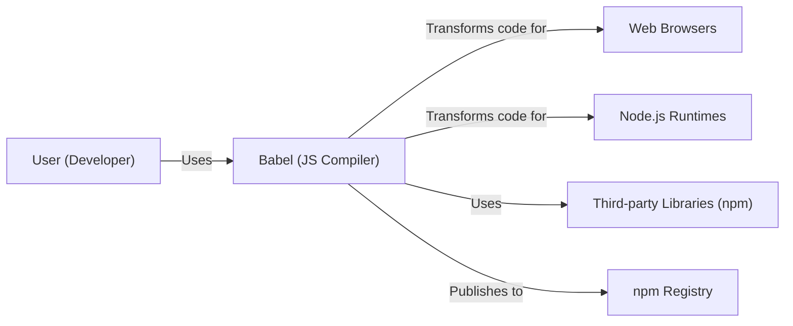
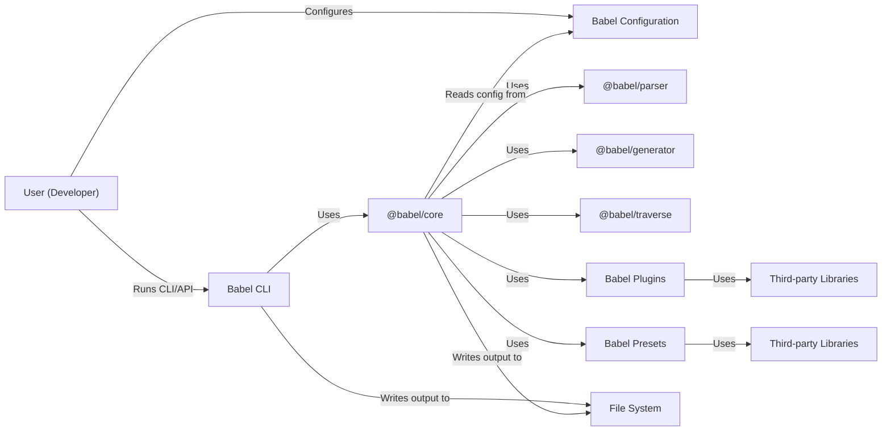
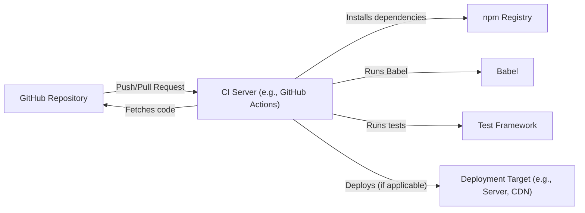
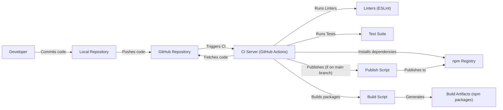

Okay, let's create a design document for the Babel project, focusing on aspects relevant for threat modeling.

# BUSINESS POSTURE

Babel is a crucial component of the JavaScript ecosystem.  It allows developers to use the latest JavaScript features and syntax, even if those features aren't yet supported by all target environments (browsers, Node.js versions, etc.).  Its primary goal is to facilitate the adoption of new language standards and improve developer productivity.

Business Priorities:

*   Maintainability:  Babel's codebase must be maintainable and extensible to accommodate the constantly evolving JavaScript landscape.
*   Correctness:  The transformations Babel performs must be accurate and reliable.  Incorrect transformations can lead to subtle and hard-to-debug errors in applications.
*   Performance:  Babel's compilation process should be as fast as possible to minimize build times and developer wait times.
*   Community Trust:  As a widely used tool, Babel must maintain the trust of the JavaScript community.  Security vulnerabilities or malicious code introduced through Babel could have widespread consequences.
*   Compatibility: Babel should support a wide range of JavaScript versions and environments.

Most Important Business Risks:

*   Supply Chain Attacks:  A compromised dependency of Babel, or a compromised release of Babel itself, could inject malicious code into countless applications.
*   Incorrect Transformation Bugs:  Subtle bugs in Babel's transformations could lead to application-level vulnerabilities or incorrect behavior that is difficult to detect.
*   Denial of Service:  Vulnerabilities in Babel could be exploited to cause excessive resource consumption during compilation, effectively causing a denial-of-service attack on build systems.
*   Reputational Damage:  A major security incident involving Babel could severely damage its reputation and erode community trust.

# SECURITY POSTURE

Existing Security Controls (based on the repository and common practices):

*   security control: Code Reviews: Pull requests on GitHub are subject to code review by other maintainers. (Described in contributing guidelines and visible in the pull request history).
*   security control: Automated Testing: Babel has an extensive test suite to ensure the correctness of its transformations. (Visible in the `packages/*/test` directories).
*   security control: Dependency Management: Babel uses package managers (like npm or yarn) to manage its dependencies. (Visible in `package.json` files).
*   security control: Linting:  Linters (like ESLint) are used to enforce code style and identify potential errors. (Visible in configuration files like `.eslintrc.js`).
*   security control: Continuous Integration: Babel likely uses CI services (e.g., GitHub Actions, CircleCI) to automate testing and building. (Visible in configuration files in `.github/workflows` or similar).
*   security control: Security Policy: Babel has a security policy describing how to report vulnerabilities. (Visible in `SECURITY.md`).

Accepted Risks:

*   accepted risk: Complexity of JavaScript: The sheer complexity of the JavaScript language and its evolving features makes it challenging to guarantee the complete absence of transformation bugs.
*   accepted risk: Dependency Vulnerabilities:  Despite dependency management, there's always a risk of vulnerabilities in third-party libraries.
*   accepted risk: Zero-Day Exploits:  There's always a risk of unknown vulnerabilities (zero-days) being exploited before they can be patched.

Recommended Security Controls:

*   security control: Static Application Security Testing (SAST): Integrate SAST tools into the CI pipeline to automatically scan for potential vulnerabilities in Babel's codebase.
*   security control: Software Composition Analysis (SCA): Use SCA tools to identify known vulnerabilities in Babel's dependencies and track their updates.
*   security control: Fuzz Testing: Implement fuzz testing to automatically generate a wide range of inputs to Babel's transformation functions and identify potential crashes or unexpected behavior.
*   security control: Regular Security Audits: Conduct periodic security audits by external experts to identify potential vulnerabilities that might be missed by internal reviews.

Security Requirements:

*   Authentication: Not directly applicable to Babel itself, as it's a command-line tool and library. However, authentication is relevant for accessing the npm registry when publishing Babel packages.
*   Authorization: Not directly applicable to Babel's core functionality. However, authorization is relevant for managing access to the GitHub repository and npm publishing rights.
*   Input Validation: Babel must rigorously validate its input (JavaScript code) to ensure it's well-formed and doesn't contain any malicious constructs that could exploit vulnerabilities in the parser or transformation logic. This is crucial for preventing code injection attacks.
*   Cryptography: Babel itself doesn't directly handle sensitive data requiring cryptography. However, if Babel were to implement features like code signing or integrity checks, cryptography would be necessary.
*   Output Encoding: Babel's output is JavaScript code. While not strictly "output encoding" in the traditional sense, Babel must ensure that the generated code is syntactically correct and doesn't introduce any new vulnerabilities.

# DESIGN

## C4 CONTEXT

C4 Context Element Descriptions:

*   Element:
    *   Name: User (Developer)
    *   Type: Person
    *   Description: A software developer who uses Babel to transpile JavaScript code.
    *   Responsibilities: Writes JavaScript code, configures Babel, runs Babel as part of their build process.
    *   Security controls: Uses strong passwords, enables 2FA for npm and GitHub accounts.

*   Element:
    *   Name: Babel (JS Compiler)
    *   Type: Software System
    *   Description: The JavaScript compiler that transforms modern JavaScript code into older, compatible versions.
    *   Responsibilities: Parses JavaScript code, applies transformations, generates output code.
    *   Security controls: Input validation, code reviews, automated testing, linting, CI.

*   Element:
    *   Name: Web Browsers
    *   Type: Software System
    *   Description: Various web browsers (Chrome, Firefox, Safari, etc.) that execute the JavaScript code generated by Babel.
    *   Responsibilities: Executes JavaScript code, renders web pages.
    *   Security controls: Browser security features (sandboxing, same-origin policy, etc.).

*   Element:
    *   Name: Node.js Runtimes
    *   Type: Software System
    *   Description: Different versions of the Node.js runtime environment that execute the JavaScript code generated by Babel.
    *   Responsibilities: Executes JavaScript code, provides server-side APIs.
    *   Security controls: Node.js security best practices, regular updates.

*   Element:
    *   Name: Third-party Libraries (npm)
    *   Type: Software System
    *   Description: External libraries and modules that Babel depends on, fetched from the npm registry.
    *   Responsibilities: Provide specific functionalities used by Babel.
    *   Security controls: Dependency management, SCA (recommended).

*   Element:
    *   Name: npm Registry
    *   Type: Software System
    *   Description: The public registry for JavaScript packages, where Babel is published.
    *   Responsibilities: Stores and distributes JavaScript packages.
    *   Security controls: npm security features (2FA, access tokens, etc.).

## C4 CONTAINER

C4 Container Element Descriptions:

*   Element:
    *   Name: User (Developer)
    *   Type: Person
    *   Description: A software developer.
    *   Responsibilities: Writes code, configures Babel, runs build processes.
    *   Security controls: Uses strong passwords, enables 2FA.

*   Element:
    *   Name: Babel CLI
    *   Type: Container (Command-line Interface)
    *   Description: The command-line interface for interacting with Babel.
    *   Responsibilities: Parses command-line arguments, invokes `@babel/core`.
    *   Security controls: Input validation of command-line arguments.

*   Element:
    *   Name: Babel Configuration
    *   Type: Container (Configuration File)
    *   Description: Configuration files (e.g., `babel.config.js`, `.babelrc`) that specify Babel's options.
    *   Responsibilities: Defines plugins, presets, and other transformation settings.
    *   Security controls: Careful configuration to avoid enabling potentially unsafe transformations.

*   Element:
    *   Name: @babel/core
    *   Type: Container (JavaScript Library)
    *   Description: The core Babel library that orchestrates the compilation process.
    *   Responsibilities: Manages the transformation pipeline, loads plugins and presets.
    *   Security controls: Code reviews, automated testing, linting.

*   Element:
    *   Name: @babel/parser
    *   Type: Container (JavaScript Library)
    *   Description: The parser that converts JavaScript code into an Abstract Syntax Tree (AST).
    *   Responsibilities: Parses JavaScript code, handles syntax errors.
    *   Security controls: Robust parsing logic, fuzz testing (recommended).

*   Element:
    *   Name: @babel/generator
    *   Type: Container (JavaScript Library)
    *   Description: The code generator that converts the AST back into JavaScript code.
    *   Responsibilities: Generates JavaScript code from the AST.
    *   Security controls: Code reviews, automated testing.

*   Element:
    *   Name: @babel/traverse
    *   Type: Container (JavaScript Library)
    *   Description: The module that allows traversing and manipulating the AST.
    *   Responsibilities: Provides APIs for navigating and modifying the AST.
    *   Security controls: Code reviews, automated testing.

*   Element:
    *   Name: Babel Plugins
    *   Type: Container (JavaScript Libraries)
    *   Description: Individual plugins that perform specific code transformations.
    *   Responsibilities: Implement specific transformation logic.
    *   Security controls: Code reviews, automated testing, careful selection of plugins.

*   Element:
    *   Name: Babel Presets
    *   Type: Container (JavaScript Libraries)
    *   Description: Collections of plugins that enable specific sets of transformations (e.g., `@babel/preset-env`).
    *   Responsibilities: Group together commonly used plugins.
    *   Security controls: Code reviews, automated testing, careful selection of presets.

*   Element:
    *   Name: Third-party Libraries
    *   Type: Container (JavaScript Libraries)
    *   Description: External libraries used by Babel plugins and presets.
    *   Responsibilities: Provide functionalities used by plugins/presets.
    *   Security controls: Dependency management, SCA (recommended).

*   Element:
    *   Name: File System
    *   Type: Container (File System)
    *   Description: The file system where Babel reads input files and writes output files.
    *   Responsibilities: Stores input and output files.
    *   Security controls: File system permissions.

*   Element:
    *   Name: Dependencies2
    *   Type: Container (JavaScript Libraries)
    *   Description: External libraries used by Babel plugins and presets.
    *   Responsibilities: Provide functionalities used by plugins/presets.
    *   Security controls: Dependency management, SCA (recommended).

## DEPLOYMENT

Babel is primarily deployed as an npm package.  Developers install it as a development dependency in their projects.  There are several deployment scenarios:

1.  **Local Development:** Babel is installed locally within a project and executed via npm scripts or a build tool (e.g., Webpack, Parcel).
2.  **Continuous Integration (CI):** Babel is installed and executed as part of a CI pipeline (e.g., GitHub Actions, CircleCI, Jenkins) to build and test code.
3.  **Serverless Functions:** Babel might be used to transpile code deployed to serverless platforms (e.g., AWS Lambda, Azure Functions, Google Cloud Functions).
4.  **Build Servers:** Babel can be part of build servers infrastructure.

We'll focus on the CI deployment scenario, as it's a common and security-sensitive environment.

Deployment Element Descriptions:

*   Element:
    *   Name: GitHub Repository
    *   Type: Infrastructure Node (Version Control System)
    *   Description: The source code repository hosted on GitHub.
    *   Responsibilities: Stores the project's code, tracks changes.
    *   Security controls: Access controls, branch protection rules, code review policies.

*   Element:
    *   Name: CI Server (e.g., GitHub Actions)
    *   Type: Infrastructure Node (CI/CD Platform)
    *   Description: The CI server that automates the build and test process.
    *   Responsibilities: Executes build scripts, runs tests, deploys code.
    *   Security controls: Secure configuration, limited access, secrets management.

*   Element:
    *   Name: npm Registry
    *   Type: Infrastructure Node (Package Registry)
    *   Description: The public registry for JavaScript packages.
    *   Responsibilities: Provides access to Babel and its dependencies.
    *   Security controls: npm security features (2FA, access tokens).

*   Element:
    *   Name: Babel
    *   Type: Software System
    *   Description: The Babel compiler.
    *   Responsibilities: Transpiles JavaScript code.
    *   Security controls: As described in previous sections.

*   Element:
    *   Name: Test Framework
    *   Type: Software System
    *   Description: The testing framework used to run tests (e.g., Jest, Mocha).
    *   Responsibilities: Executes tests, reports results.
    *   Security controls: Test coverage, reliable test cases.

*   Element:
    *   Name: Deployment Target (e.g., Server, CDN)
    *   Type: Infrastructure Node (Deployment Environment)
    *   Description: The environment where the compiled code is deployed.
    *   Responsibilities: Hosts and serves the application.
    *   Security controls: Server security, network security, CDN security.

## BUILD

Babel's build process is crucial for ensuring the integrity and security of the released packages.

Build Process Description:

1.  **Development:** Developers write code and commit it to their local repositories.
2.  **Push to GitHub:** Code is pushed to the central GitHub repository.
3.  **CI Trigger:** A push or pull request triggers the CI pipeline (e.g., GitHub Actions).
4.  **Fetch Code:** The CI server fetches the latest code from GitHub.
5.  **Install Dependencies:** The CI server installs project dependencies from the npm registry.
6.  **Linting:** Linters (e.g., ESLint) are run to check code style and identify potential errors.
7.  **Testing:** The test suite is executed to verify the correctness of the code.
8.  **Build:** Build scripts (likely defined in `package.json` and using tools like `rollup` or Babel itself) are executed to create the distributable packages.
9.  **Publish (Conditional):** If the CI build is running on the main branch (or a release branch), a publish script is executed to publish the new version of Babel to the npm registry. This typically involves authentication with npm using access tokens.
10. **Artifacts:** Build process generates build artifacts, that are Babel npm packages.

Security Controls in Build Process:

*   security control: Code Reviews: All code changes are reviewed before being merged.
*   security control: Automated Testing: Extensive test suite ensures code quality.
*   security control: Linting: Enforces code style and identifies potential errors.
*   security control: CI/CD: Automates the build and test process, reducing manual errors.
*   security control: Dependency Management: Uses package managers to manage dependencies.
*   security control: Secure npm Publishing: Uses access tokens for publishing to npm, likely with 2FA enabled.
*   security control: (Recommended) SAST: Integrate SAST tools into the CI pipeline.
*   security control: (Recommended) SCA: Use SCA tools to track dependency vulnerabilities.

# RISK ASSESSMENT

Critical Business Processes to Protect:

*   The Babel compilation process itself: Ensuring that the transformations are correct and don't introduce vulnerabilities.
*   The release process: Preventing malicious code from being published to the npm registry under the Babel name.
*   The integrity of the codebase: Preventing unauthorized modifications to the source code.

Data to Protect and Sensitivity:

*   Source Code (Medium Sensitivity): The source code itself isn't highly sensitive, but unauthorized modifications could lead to significant problems.
*   npm Access Tokens (High Sensitivity): These tokens grant publishing rights to the npm registry and must be protected with utmost care.
*   CI/CD Secrets (High Sensitivity): Any secrets used in the CI/CD pipeline (e.g., API keys, deployment credentials) must be securely managed.
*   Test Data (Low Sensitivity): Test data is generally not sensitive.
*   User Data: Babel itself does not process any user data.

# QUESTIONS & ASSUMPTIONS

Questions:

*   What specific SAST and SCA tools are being considered or are already in use (if any)?
*   What is the exact process for managing npm access tokens and other secrets used in the CI/CD pipeline?
*   Are there any specific performance benchmarks or targets that Babel aims to meet?
*   What is the process for handling security vulnerabilities reported by external researchers?
*   Are there any plans to implement code signing for Babel releases?

Assumptions:

*   BUSINESS POSTURE: The Babel maintainers prioritize security and are willing to invest in improving it.
*   SECURITY POSTURE: The existing security controls (code reviews, testing, linting) are effectively implemented and maintained.
*   SECURITY POSTURE: Developers use secure practices (strong passwords, 2FA) for their GitHub and npm accounts.
*   DESIGN: The CI/CD pipeline is configured securely and uses appropriate secrets management.
*   DESIGN: The npm access tokens are stored securely and have limited permissions.
*   DESIGN: The Babel project follows semantic versioning, and releases are carefully managed.
*   DESIGN: Babel team is using GitHub.